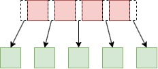

# 零距离接地气的解析B树
B树对大多数计算机从业的同学都不陌生，也大体能知道对应的思路与原理，但是如果真要徒手撸一个还是有很多细节需要考虑的，本文就尝试零距离地分析一下，然后使用简单的方式对其进行描述和解释。

## 1. 啥是B树
### 1.1 两种节点成员
* 内部节点: 存储了数据以及指向其子节点的指针
* 叶子节点: 只存储数据
### 1.2 特点
假设是一个`M`阶的B树, `M`表示这个树的每一个节点最多可以拥有的子节点个数。该树具备以下性质:
* 每个节点最多有`M`个子节点
* 每个非叶子节点最少有M/2(向上取整)，比如9阶最少有个5个子节点
* 如果根结点有子节点，则最少是2个，否则就是叶子节点
* 在一个节点内的若干元素，需要保证有序，且元素与所对应的左右子节点也需要保持有序
* 所有的叶子节点都在同一层
### 1.3 直观分析
* 节点和子节点之间呈现如下的关系 ，如果拥有`N`个元素，则会有`N+1`个子节点
* `所有的叶子节点都在同一层`直接就决定了B树一定是平衡树
* M值越大，树越矮胖；M值越小，树越瘦高，实际应用的B树都比较胖
* 数据的有序呈现如下的关系 ，数据是有序的，元素`N`的左侧节点的所有数据小于等于`N`，右侧的节点所有数据大于等于`N`
* 列出了B树阶数限制的对比表，这些数据在数的分裂与合并中会不停地被用到。
  
| B树阶数 (m) | 节点中最多子节点数 | 节点中最少子节点数（非根） | 节点中最多数据个数 | 节点中最少数据个数（非根） | 根节点最少子节点数（非叶） |
|-------------|----------------------|------------------------------|----------------------|------------------------------|----------------------------|
| 3           | 3                    | 2                            | 2                    | 1                            | 2                          |
| 4           | 4                    | 2                            | 3                    | 1                            | 2                          |
| 5           | 5                    | 3                            | 4                    | 2                            | 2                          |
| 6           | 6                    | 3                            | 5                    | 2                            | 2                          |
| 7           | 7                    | 4                            | 6                    | 3                            | 2                          |
| 8           | 8                    | 4                            | 7                    | 3                            | 2                          |
| 9           | 9                    | 5                            | 8                    | 4                            | 2                          |

## 2. 种树
我们以M为6的B树为例子，相对比较简单，容易理解，插入的数据序列为[5, 10，30，35，3, 8, 15, 110，20，102，46，91，80，18, 25, 36, 48, 69, 73, 78]
### 2.1 先插入几个节点
* 依次插入5、10、30、35、3，过程如下 ，数据保持为一个有序的数列
* 插入5个值后，此时已达到6阶B树的最大数据个数5，怎么办呢
### 2.2 不过了，分家
#### 叶子节点分家
* 谁当爹呢？ 如果是奇数个数据，中间值是爹，如果是偶数个数据，中间两个任选一个都可以。于是上面形成的满节点变为如下形状，数值`10`喜当爹<br> ，右节点的值都比10大，左节点的值都比10小
#### 叶子结点再分
* 我们再依次插入一些值，直到右节点满5个数据，这个时候再次发生分裂，这次分裂将选出的父节点30放入10的后面，保持有序<br> 
#### 把老巢也拱了
* 向上继续分: 我们再依次插入一些值，直到父节点满5个数据，这个时候父节点需要发生分裂，如下<br> 
#### 2.3 一点心得
* 所有新插入的值都是在叶子节点发生的
* 分家都是从叶子节点开始，有可能需要递归到根结点，逆流而上满了就分家。

## 3. 查找、遍历
* 查找比较简单，因为是有序树，基本原则就是按照顺序找就行了，当然如果节点中元素个数比较多，可以考虑使用二分查找加速，提供一个简单的暴力查找
```
 public int? Search(int Key)
 {
     var element = Elements.FirstOrDefault(x => x.Key == Key);
     if (element != null)
     {
         return element.Value;
     }
     else
     {
         for (var i = 0; i < Children.Count; i++)
         {
             var value = Children[i].Search(Key);
             if (value != null)
             {
                 return value;
             }
         }
         return null;
     }
 }
```
* 遍历，因为是树，还是可以按照深度有序和广度优先的方式进行遍历，提供一个简单的递归遍历
```
public void Visit()
{
    //访问元素

    //访问子节点
    for (var i = 0; i < Children.Count(); i++)
    {
        Children[i].Visit(level + 1);
    }
}
```

## 4. 删除
删除逻辑在B树的实现中略显复杂，我画了一个流程图在这里，红色标注的局部流程是一个循环，稍微复杂的逻辑在这个循环中。<br>，我们按照这个图的思路依次展开。
### 4.1 直接干掉
* 如果要删除的节点在叶子节点中，且叶子节点的`数据个数`大于`最少数据个数(本例中为2）`的时候，直接删除即可，比如下图中删除25，<br>，如果删除后继续20则还是直接删除。

### 4.2 老大没了，谁来坐这个位置
* 如果删除非叶子节点，则需要`转为删除叶子节点的值`，如何处理呢？ 就是找到和该值最近的值，本文中使用`小于等于该值的最大值`的原则。
* 下图删除10，则找到8，将8覆盖10的位置，然后触发8的删除<br> 。
* 这样就回到了4.1描述的情形，直接删除即可

### 4.3 兄弟，借我一个数据
* 下图如果删除了46，则会找到36来覆盖46的位置，然后触发将36的删除 <br> 。
* 36当老大后，只剩下35一个数据，数量不够格了，该节点就要想点子了，我得让自己保持健壮啊，于是左看看，又看看，看啥呢，看兄弟节点有没有多的，需要借一个
* 这个时候它发现它的左兄弟节点刚好有3个，比最少2多了一个，得想办法搞过来，怎么要呢，并不是直接要，而是通过老大处理，`为了保持数据的有序`，实施`乾坤大挪移`,30到了原36的位置，20到30的位置，这样就重新够格了，并且保持了数据有序，噢耶<br> 
* 假设此时左兄弟节点没有多余的数据，则就会看看右兄弟节点有没有空余的数据，看官们可以想想下图，如果删除3、5、或者8会发生什么呢<br>
* 如果反复发生借数据的事情，左邻右舍都被它搞惨了，它还要被删数据，这咋搞呢？请继续向下

### 4.4 太穷了，搭伙过日子吧
* 先看下图中的`[41,42]`所在的节点<br> <br>,他们之中任意一个数据删除，都没法兄弟之间帮忙，只能重新合并搭伙过日子，下面以删除41为例来说
* 41被删除之后，只剩下42一个数据，太少了，于是左右看看发现都帮不上忙，于是把40拽了下来一块形成一个数目为4的序列，满足5阶的B树最大4个元素的约束,执行过程如下所示<br>

### 4.5 地主家没有余量，我也得去借啊
* 比如下图所示，如果删了80,则91成了孤家寡人了<br>
* 咋办呢，它发现它的左节点有富裕啊，赶紧也借吧，此处的借数据稍微不同的是，需要将借的数据的子节点也需要借过来。<br> 

### 4.6 地主家也借不动了，也搭伙过日子吧
* 比如下图所示，如果删了80,则91成了孤家寡人了<br> 
* 咋办呢，它发现隔壁老哥们也帮不上忙啊，也只能合并了 <br>  

### 4.5 一不小心惊动了根结点,天塌陷了，树降低了一层
* 如果在向上回溯的时候，发现一直无法借数据，就会一直合并到根结点,如下图所示，删除了69之后触发了合并<br> 
* 此时46所在的节点找不到兄弟节点帮忙，只能和根结点合并，我们来看下如何处理<br> 
* 这个时候需要更新B树的根结点为合并后的节点
* 整个树变低了一层

### 4.6 心得
* 在删除的时候，情况多少有点复杂，但是总体来看难点就是在`借节点和合并节点`上
* `优先删除数据，删无可删则去借；借无可借则合并，合无可合就没数据了。`
* 借数据和合并数据需要向上递归，一直追溯到根节点

## 5. 总结
* B树维护着一个有序的数列，不管是何种情形，都要有这根弦，所有的借数据、移动数据、合并数据都需要依照这个顺序进行的
* 这个玩意理解了实现起来还是不难的，如果需要写好的例子可以在评论区留言。
* 如果对文中的描述和插图有疑问或者错误的地方，也欢迎指出和评论。

```
微信公众号为"吹风的坚果"，欢迎关注，定期更新优质的计算机文章。
```

## 引用
* [visualization](https://www.cs.usfca.edu/~galles/visualization/BTree.html)
* [wiki](https://zh.wikipedia.org/wiki/B%E6%A0%91)