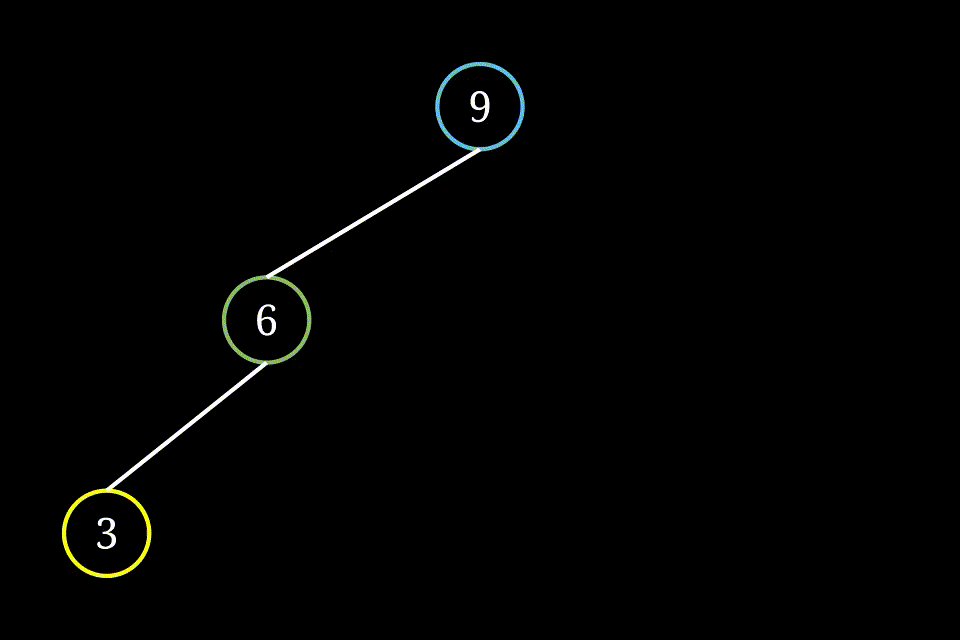
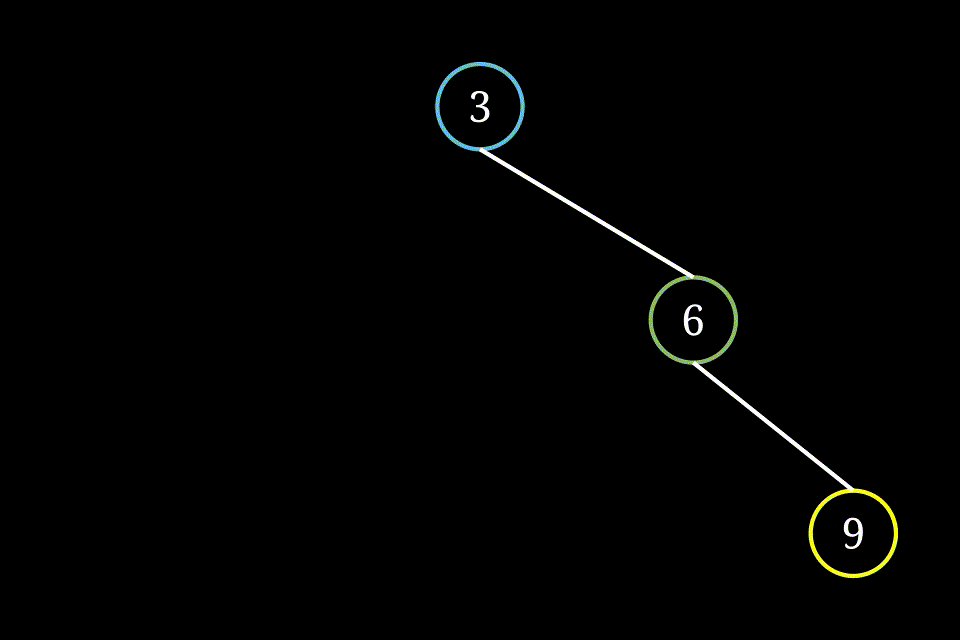
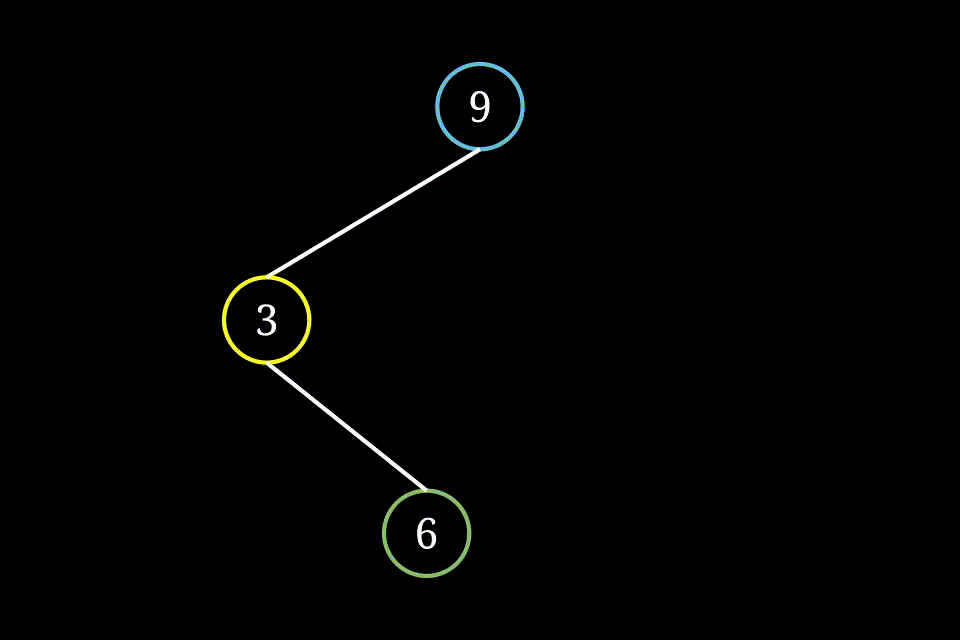

# 1. BST (Binary Search Tree)
* 二叉搜索树，顾名思义，它是一种二叉树，并且可以用来进行搜索
## 1.1 特征
1. 对于根节点，左子树中所有节点的值 < 根节点的值 < 右子树中所有节点的值
2. 任意节点的左、右子树也是二叉搜索树，即同样满足条件**1**
## 1.2 举例
* 
## 1.3 查找
* 
## 1.4 插入
* 
## 1.5 删除

## 2. 平衡二叉树、AVL
* AVL是平衡二叉树的一种，是一种高度平衡的二叉树，是最早被发明的平衡二叉树
* 还有Splay Tree、Treap等
* 大学教授 G.M. Adelson-Velsky 和 E.M. Landis 名称的缩写，他们提出的平衡二叉树的概念，为了纪念他们，将平衡二叉树称为 AVL树。
## 2.1 特点
* 要么是空树
* 要么左右子树的高度之差的绝对值不超过1
## 2.2 平衡因子
* 左子树的高度减去右子树的高度，空节点的平衡因子为0
* 1、0、-1都认为是平衡的

## 2.3 旋转
为了维持树的平衡，最重要的操作是对树进行**旋转**操作，旋转后保持有序和平衡。根据树的形状的不同分为左旋、右旋、先左旋再右旋、先右旋再左旋，下面我们依次进行讨论
## 2.3.1 LL型

## 2.3.2 RR型

## 2.3.3 LR型

## 2.3.4 RL型

## 2.4 分析
* 旋转的核心就是将**中间值**放在合适的父节点上，上述的例子就是将6放在父节点上。
* LR型是先转为LL型，将数字6放在中间位置
* RL型是先转为RR型，将数字6放在中间位置
* RR型和LL型的可视化顺序和大小顺序是一致的，可以直接进行旋转

## 3. 红黑树
* 继承于二叉搜索树
* 红黑树是一种不大严格的平衡树(AVL树为了平衡做了太多的旋转)
## 3.1 特点
1. 每个节点非红即黑
2. 根节点是黑的
3. NIL节点(空叶子节点)为黑色
4. 红色节点的子节点为黑色
5. 对于任意节点而言,其到叶子点树NIL指针的每条路径都包含相同数目的黑节点.
## 3.1.1 理解
* 红红不能相邻，黑黑可以相邻
* 有一个不可见的虚拟空节点，颜色为黑，在统计`特点5`的时候需要考虑在内
* 新节点默认是红色，如果是黑色，就会影响到`特点5`
* 最短路径一定是：全部都是黑色；最长路径为红黑相间
## 3.1.2 术语
* 黑黑：两个相邻的黑色节点
* 红红：两个相邻的红色节点(实际上不会出现)
* 黑高：节点到叶子节点路途中黑色节点的个数

  添加节点相对比较简单，我们先说添加节点，再说删除节点。

## 3.3 添加节点
* 如果是根结点，则为黑色，其他节点默认为红色
* 如果父节点为黑色，则直接插入即可
* 如果父节点为红色，则分为以下两种情况
## 3.3.1 父节点为红，叔节点为红色
* 因为红色节点的子节点为黑，所以祖先节点一定是黑色节点
* 因为插入的新节点为红色，出现了非法的红红，这个时候将祖先节点标记为红，父节点和叔节点标记为黑
* 结果就是**增加了一个黑高**，导致黑高不一致，将祖先节点作为当前节点**沿路径向上进行递归调整**
* 
## 3.3.2 父节点为红，叔节点为黑
* 按照LL、LR、RR、RL等四种类型进行旋转，LR转换为LL，RL转换为RR，最终的形状为LL或者RR
* 父节点变黑，父节点的父节点变红，然后对LL右旋或者对RR左旋后
* 最终结果是：将相邻的两个红色节点拆开到另一侧，**两侧都维持黑高不变，不需要递归**
* LL  
* RR  
* LR  
* RL  
## 3.2 删除节点
* 删除节点的时候如果是叶子节点就执行删除操作，否则需要寻找临近节点替换后再进行删除操作
* 删除过程中涉及到向上追溯，需要使用栈来记录最终删除节点的路径
## 3.2.1 目标节点为红色
* 直接删除即可
* 因为红色节点一定是空节点
  * 首先它不可能是有红色子节点，红红不能相邻
  * 因为最多有一边有子节点（否则就要继续查找），所以它一定没有黑色子节点，否则两侧的黑高不相同
## 3.2.2 目标节点为黑色且有孩子节点
* 子节点一定是红色，否则两侧的黑高不相同
* 将目标节点删除后，将子节点向上移动，然后改颜色为黑，保持黑高稳定
## 3.2.3 目标节点为黑色且有无孩子节点(这个最麻烦)
* 这种情况下，一定有兄弟节点，否则父节点的两侧两侧黑高不相同
* 之所以考虑兄弟节点，是为了最低成本的保持两侧黑高相同，减少递归次数
## 3.2.3.1 兄弟节点为黑色
1. 目标节点是其父节点的右节点，兄弟节点的左节点为红色
   * 属于LL型, 执行右旋，最后直接删除节点
   * 兄弟节点的左节点变黑，维持兄弟节点的黑高
   * 兄弟节点成为父节点，颜色设置为原父亲节点的颜色
   * 原父节点设置为黑色，保持右侧的黑高不变
   * 

2. 目标节点是其父节点的右节点，兄弟节点的右节点为红色
   * 属于LR型，需要调整为LL型，然后右旋,最后直接删除节点
   * 兄弟节点的右节点颜色转为父节点的颜色(因为最终它会变为父节点)
   * 父节点的颜色变为黑色，因为它会被旋转到右侧，来维持右侧的黑高不变
   * 

3. 目标节点是其父节点的右节点,兄弟节点无子节点(兄弟节点一定为黑)
   * 将兄弟节点设置为红色，即两侧都同时减去一个黑色节点
   * 如果其父节点刚好为红色，可以立即变黑，保持黑高不变，就可以返回
   * 但是如果父节点刚好黑色，将目标节点删除后**向上递归**，将**父节点转为目标节点**进行调整符合红黑树规则

4. 目标节点是其父节点的左节点,兄弟节点的右节点为红色
   * 属于RR型，执行左旋，最后直接删除目标节点
   * 兄弟节点的右节点变黑，维持兄弟节点的黑高
   * 兄弟节点成为父节点，颜色设置为原父亲节点的颜色
   * 原父节点设置为黑色，保持右侧的黑高不变
   * 

5. 目标节点是其父节点的左节点,兄弟节点的左节点为红色
   * 属于RL型，调整为RR型，然后左旋,最后直接删除节点
   * 兄弟节点的左节点颜色转为父节点的颜色(因为最终它会变为父节点)
   * 父节点的颜色变为黑色，因为它会被旋转到右侧，来维持右侧的黑高不变
   * 

6. 目标节点是其父节点的左节点,兄弟节点无子节点(兄弟节点一定为黑)
   * 将兄弟节点设置为红色，即两侧都同时减去一个黑色节点
   * 如果其父节点刚好为红色，可以立即变黑，保持黑高不变，就可以返回
   * 但是如果父节点刚好黑色，将目标节点删除后**向上递归**，将**父节点转为目标节点**进行调整符合红黑树规则

## 3.2.3.2 兄弟节点为红色
   * 这种情形不能直接进行处理，需要转换形态
1. 目标节点是其父节点的左节点
   * 兄弟节点与父节点互换颜色，即兄弟变为黑色，父亲变为红色
   * 执行左旋
   * 如图所示，旋转后黑高保持不变，继续对**D**执行删除操作
   * 
2.  目标节点是其父节点的右节点
    * 兄弟节点与父节点互换颜色，即兄弟变为黑色，父亲变为红色
    * 执行右旋
    * 如图所示，旋转后黑高保持不变，继续对**D**执行删除操作
    * 

## 引用
* [oi-wiki](https://oi-wiki.org/)
* [rb-animation](https://www.cs.usfca.edu/~galles/visualization/RedBlack.html)