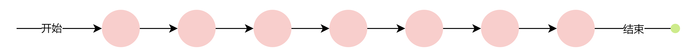
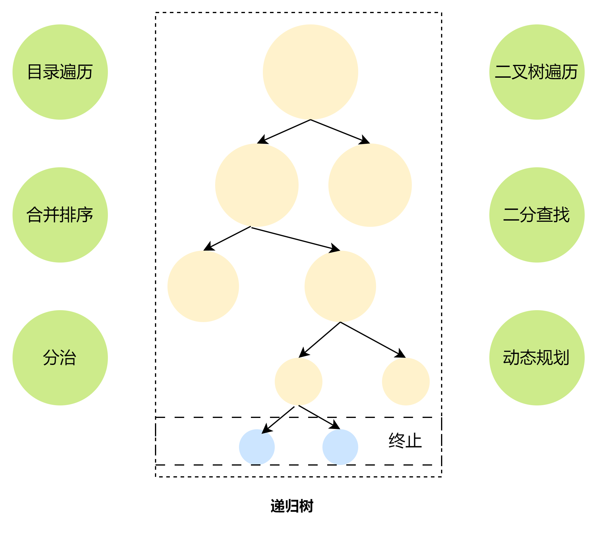

# 聊一下递归
递归对很多程序员同学来说，可能是一个`熟悉而又陌生`的概念，因为上学的时候都会讲一个斐波那契数列，这是一个很好的递归的例子，可是毕业后大多数时候用的是循环迭代，递归用的场景比较少。笔者就是想擦拭一下递归这个概念，让它清晰起来。

## 递归是个啥
* Wiki上的定义是,`在数学与计算机科学中，是指在函数的定义中使用函数自身的方法`
* 这个定义比较干燥，我们把它展开说

## 白话说一下
1. 你站在两个镜子中间，你在每个镜子中能看到几个自己呢
2. 俄罗斯套娃
3. 最近听樊登读书，经常说的一个词 `自我引用`，今天的表現都是前一天的結果
这些都可以认为是递归的例子，抽象的说，就是`一个模式引用了同样的模式`。

## 在计算机领域它是怎样的呢
1. 给它祛魅，实现上就是`一个函数调用自己`，底层汇编使用CALL指令，CPU才不管调用的是啥，只管往前跑。
2. 计算机中并没有一个`递归`的关键字，`递归只是一种思想`，一种解决问题的`方法论`，但是几乎所有的语言都支持函数自己调用自己，也就是了说提供递归实现的基础。
3. 计算机中需要递归的场景都可以转为迭代，也就是说在资源允许的情况下(栈不溢出)，迭代和递归是可以相互转换的，但是如果想让编译器自动实现转化，就需要实现`尾递归`
  * N个1相加(什么玩意，使用循环不好么)
```
int f(int n) => n > 0 ? f(n - 1) + 1 : 0;
```
  * 整数数组的数字之和(什么玩意，使用循环不好么+1)
```
int Sum(int[] array, int length) => (length > 1 ? Sum(array, length - 1) : array[0]) + array[length - 1];
```

## 它为什么重要
它能够解决一下较为复杂的问题
### 二叉树遍历，对比一下
* 使用迭代的方式，大概会写成下面的样子
```
public void TraverseNode()
{
  var stack = new MyStack<BinaryTreeNode>();
    void pushLeft(BinaryTreeNode node)
    {
        var current = node;
        stack.Push(current);

        while (current.Left != null)
        {
            stack.Push(current.Left);
            current = current.Left;
        }
    }

    if (Root != null)
    {
        pushLeft(Root);
    }

    while (!stack.IsEmtpy())
    {
        var current = stack.Pop();
        Console.WriteLine(current.Value);
        if (current.Right != null)
        {
            pushLeft(current.Right);
        }
    }
}
```
* 使用递归的方式
```
void TraverseNode(BinaryTreeNode parent)
{
    if (parent.Left != null)
    {
        TraverseNode(parent.Left);
    }
    Console.WriteLine(parent.Value);
    if (parent.Right != null)
    {
        TraverseNode(parent.Right);
    }
}
```
wtf, 太清爽了吧，其实说白了，这种遍历需要一个`栈`来存储路径，只不过是第一种方式是`程序员自己维护`，第二种是通过`递归的方式让系统去维护`。

### 二分查找看一下
```
int search(int[] orderedArray, int start, int end, int value)
{
    if (start == end)
    {
        if (orderedArray[start] == value)
        {
            return start;
        }
        else
        {
            return -1;
        }
    }

    var middle = (end + start) / 2;
    if (orderedArray[middle] > value)
    {
        return search(orderedArray, start, middle - 1, value);
    }
    else if (orderedArray[middle] < value)
    {
        return search(orderedArray, middle + 1, end, value);
    }
    else
    {
        return middle;
    }
}
```
上面的二分换成迭代试试，呵呵。

## 什么场景下需要用到呢？
* 其实计算机中使用迭代把递归能干活的抢走了，或者说能用循环的场景就用循环了。循环是一种`线性处理模式`，
，这种模式能解决大多数的问题，因为迭代或者说循环更容易理解一下，想想一下，如果向一年级小朋友介绍循环，估计三四句话小朋友就明白了，ok，我们讲递归，全体小朋友瞪大了眼睛。
* 我的理解是，`树形`的问题可以考虑使用递归处理，怎么说呢，如下图，我称它为递归树,很多复杂问题可以分解为相似的问题，分解若干次后，`在终止条件处有明确的解`。

* 有了递归，那什么时候用递归，什么时候用迭代呢？我个人觉得就是，能用迭代就用迭代，用迭代明显变的复杂的场景就用递归，关键在于问题的复杂度，我猜没人愿意计算N个1之和写成`int f(int n) => n > 0 ? f(n - 1) + 1 : 0;`这个样子吧，也没人愿意使用一个栈来处理二叉树的遍历问题。
* 切记，递归一定有一个出口，也就是终止条件，不然递归会`进入无尽的黑渊`
* 使用递归重要的是什么，找到递归模式，一个是找到`子问题`，一个是找到`出口`。

## 总结
递归是一种解决问题的思想，计算机中就是函数调用自己，但是需要有个出口，不然就闷死了。递归什么时候用呢，在合适的复杂度的时候使用。
```
微信公众号为“吹风的坚果”，欢迎关注，定期更新优质的计算机文章。
```