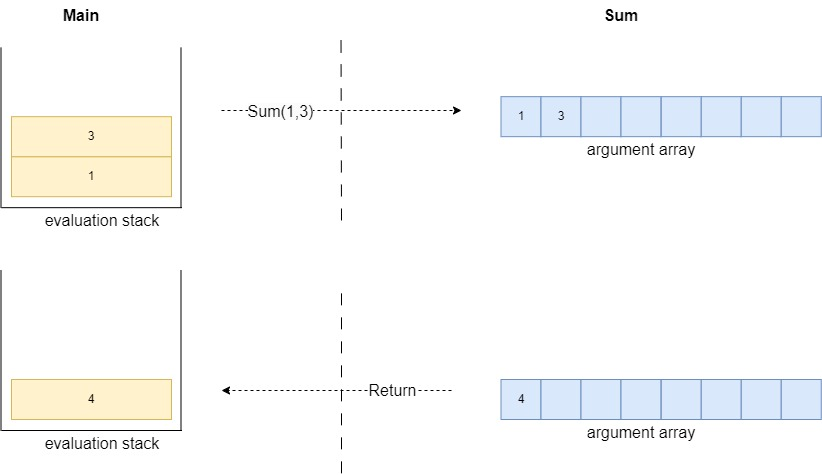

# 栈的几个应用场景

对于栈，相信很多人都不陌生，本文尝试分析了栈的由来，总结了几种计算机中使用栈的场景，包括真实的调用栈，虚拟机的求值栈等， 加深对栈的理解与使用。

## 1. stack的由来
* stack是伴随着模块化编程而出现的，栈天生是与函数调用配合的，如下图所示方法`A` 调用`B`，`B`调用`C`
 
* 我们可以将CPU想象为视野只有一个指令的会飞的蜗牛，它不停的根据`IP(Instruction Pointer)`指向的位置执行指令，所以想象该蜗牛的行动轨迹类似下图

* 我们观察其中的P1和P2两个点，都是调用返回的位置，此处有两种使用方式（1）全局保存到某个位置（2）每个函数分配一块区域存放数据。如果全局保存的话，因为调用层级的不可预知，全局保存用到的空间无法预知，更合理的方式就是每个函数分配一块区域。如下图所示 
* 我们观察P1和P2的进入与出来的顺序就是 
  * P1进入
  * P2进入
  * P2出来
  * P1出来
* 上述只有P1和P2两个点，实际中可能是P1-Pn，这些点形成了一层一层的数据，并且是按照P1->Pn的顺序依次压入，按照Pn->P1的顺序依次弹出，这就是妥妥的栈。
## 2. 汇编语言中的调用栈
* 先看代码
```
int sum(int a, int b)
{
    return a + b;
}
int main()
{
   return sum(1,3);
}
```
* 然后查看汇编代码
```
...
0000000000401106 <sum>:
  401106:       55                      push   %rbp
  401107:       48 89 e5                mov    %rsp,%rbp
  40110a:       89 7d fc                mov    %edi,-0x4(%rbp)
  40110d:       89 75 f8                mov    %esi,-0x8(%rbp)
  401110:       8b 55 fc                mov    -0x4(%rbp),%edx
  401113:       8b 45 f8                mov    -0x8(%rbp),%eax
  401116:       01 d0                   add    %edx,%eax
  401118:       5d                      pop    %rbp
  401119:       c3                      ret
000000000040111a <main>:
  40111a:       55                      push   %rbp
  40111b:       48 89 e5                mov    %rsp,%rbp
  40111e:       be 03 00 00 00          mov    $0x3,%esi
  401123:       bf 01 00 00 00          mov    $0x1,%edi
  401128:       e8 d9 ff ff ff          call   401106 <sum>
  40112d:       5d                      pop    %rbp
  40112e:       c3                      ret
  ...
```
* 通过gdb调试，使用si、x/32b、info r、b *main等逐步调试和查看寄存器和相关值，形成如下图，左侧为当前寄存器的值，右侧为栈的地址和值。

* call、ret是成对出现的, call执行push下一条指令然后JUMP到目标为止，ret是Pop调用者压入位置的然后JUMP到该位置，所以跳转地址的push和pop是被集成到call和ret指令中的。Push逻辑上等于SUB RSP和MOV,Pop逻辑上等于MOV和ADD RSP，但是由于他们都是独立指令，所以硬件上能进行优化，减少流水线停顿。为了便于理解，画图如下

* RSP是随着Push和Pop指令自动变化的，RBP的变更需要维护，需要追赶RSP或者恢复到原来的位置
## 3. C#虚拟机中的求值栈
* C#也是使用同样的逻辑代码
```
int Sum(int a, int b)
{
    return a + b;
}

int Main()
{
    return Sum(1,3);
}
```
* 查看IL的指令
```
Main函数
.maxstack 2
.locals init (
    [0] int32
)
IL_0000: nop
IL_0001: ldc.i4.1
IL_0002: ldc.i4.3
IL_0003: call int32 Program::'<<Main>$>g__sum|0_0'(int32, int32)
IL_0008: stloc.0
IL_0009: br.s IL_000b
IL_000b: ldloc.0
IL_000c: ret
```
```
Sum函数
.maxstack 2
.locals init (
    [0] int32
)

IL_0000: nop
IL_0001: ldarg.0
IL_0002: ldarg.1
IL_0003: add
IL_0004: stloc.0
IL_0005: br.s IL_0007

IL_0007: ldloc.0
IL_0008: ret
```
* 要想看懂上面的IL指令，我们从C#的`Method State`稍微做一下分析 
* 每个方法都有一个Mothod State，都有`evaluation stack`、`local variable array`、`argument array`、`IP`和其他的一些信息，`.locals init`就是局部变量数组
* IL中的栈是求值栈，和调用栈不同，求值栈在每个方法中都有一个，而调用栈一般就只有一个
* stack和两个array都可以存放任意类型的数据
* ld开头的指令是load，st开头的指令是store，向stack搬运数据是load，从stack搬出数据是store
* `Most CLI instructions retrieve their arguments from the evaluation stack and place their return values on the stack. Arguments to other methods and their return values are also placed on the evaluation stack.`  大多数的CLI指令都是从stack中取数据，计算后重新放入stack。 比如Add指令，就是从stack中pop两个数，计算后push结果。
* 对于函数调用，调用call的时候也是按照参数的个数将数据从stack中pop出来，然后隐式调用`starg`指令将数据存储到另一个method的argument array中; 计算结束后将返回值重新放入到调用者的栈中 
* 下面我们对上述过程进行逐句的解析
```
.maxstack 2
//初始化了最大长度为2的int32的局部变量数组
.locals init (
    [0] int32
)
//填充，没有执行意义
IL_0000: nop
//加载常数1到stack中，执行后栈中元素为[1]
IL_0001: ldc.i4.1
//加载常数3到stack中，执行后栈中元素为[1,3]
IL_0002: ldc.i4.3
//调用函数sum，将数字1和3取出，传入到sum的参数列表中，执行后栈中元素为[4]
IL_0003: call int32 Program::'<<Main>$>g__sum|0_0'(int32, int32)
//将栈顶元素4取出放入局部变量数组中的第0个位置，执行后栈为空
IL_0008: stloc.0
//直接跳转到IL_000b执行
IL_0009: br.s IL_000b
//将局部变量数组中的第0个位置的数字放入栈顶，执行后栈中的元素为[4]
IL_000b: ldloc.0
//返回，此时栈中只有一个元素，作为返回值
IL_000c: ret

////////////////////////////////////////
.maxstack 2
.locals init (
    [0] int32
)

IL_0000: nop
//将argument array的第一个参数加载栈中，执行后栈中元素为[1]
IL_0001: ldarg.0
//将argument array的第二个参数加载栈中，执行后栈中元素为[1,3]
IL_0002: ldarg.1
//add是二元操作指令，取出栈顶的2个元素1和3，相加后放入栈顶，执行后栈中元素为[4]
IL_0003: add
//将栈顶元素弹出放入本地变量数组的第0个位置，执行后栈为空
IL_0004: stloc.0
//直接跳到IL_0007执行
IL_0005: br.s IL_0007

//将本地变量数组的第0个位置放入栈顶，此处栈中元素为[4]
IL_0007: ldloc.0
//返回，栈中只有一个元素4，即将4返回给Main方法
IL_0008: ret
```
## 4. 树的遍历中使用栈
* 此处使用C#写了一个排序树，循环访问所有的数据，按照前序遍历顺序输出
```
public void Traverse(Action<BinaryTreeNode> visitor)
{
  var mystack = new MyStack<BinaryTreeNode>();
  if (Root != null)
  {
      circlePushNode(Root);
  }

  while (!mystack.IsEmpty())
  {
      var top = mystack.Pop();
      visitor(top);

      if (top.Right != null)
      {
          circlePushNode(top.Right);
      }
  }

  void circlePushNode(BinaryTreeNode node)
  {
      mystack.Push(node);
      while (node.Left != null)
      {
          mystack.Push(node.Left);
          node = node.Left;
      }
  }
}
```
## 5. 图的DFS深度遍历中使用栈
```
public void DFSWithStack()
{
    var stack = new MyStack<int>();
    var visisted = new HashSet<int>();

    stack.Push(Nodes.First().Vertex);
    visisted.Add(Nodes.First().Vertex);

    while (!stack.IsEmpty())
    {
        visitNode(stack, GetNode(stack.Pop()), visisted);
    }

    void visitNode(MyStack<int> stack, GraphNode<int> node, HashSet<int> visisted)
    {
        Console.WriteLine(node.Vertex);
        for (var i = 0; i < node.Neighbors.Length; i++)
        {
            if (!visisted.Contains(node.Neighbors[i]))
            {
                stack.Push(node.Neighbors[i]);
                visisted.Add(node.Neighbors[i]);
            }
        }
    }
}
```
## 6. 拓扑排序中使用栈(其实也是图的DFS)
* 拓扑排序就是对DAG(有向无环图)求得一个顶点的线性顺序
* 深度遍历能够拓扑排序的理解：
  1. 深度路径的后一个节点决定于前一个节点，第一个节点决定了某个深度路径上的所有后续节点, 比如A->B->C->D->E, E要想被排序则ABCD都要先排序。
  2. 让出度为0(或者邻居节点都已经进入最终结果栈)的节点依次进入最终结果栈`S`，`S`依次Pop得到有序结果；也就是说只有节点的所有邻居都已入栈节点才能入栈，也意味着它的邻居一定在它的后面被排序。
* 
```
public class TopologicalSortWithDoubleStack
{
    public Dictionary<int, List<int>> Graph = new Dictionary<int, List<int>>()
    {
       { 0, new List<int>() {7,9} },
       { 1, new List<int>() {4,9} },
       { 2, new List<int>() {0,1,3}},
       { 3, new List<int>() {9}},
       { 4, new List<int>() {}},
       { 5, new List<int>() {0}},
       { 6, new List<int>() {4}},
       { 7, new List<int>() {6}},
       { 8, new List<int>() {2}},
       { 9, new List<int>() {6}},
    };
    
    public int[] Indegree = new int[10];
    private void InitializeIndegree()
    {
        for (int i = 0; i < 10; i++)
        {
            Indegree[i] = Graph.Count(x => x.Value.Contains(i));
        }
    }

    public bool[] Visisted = new bool[10];
    private MyStack<int> visitPath = new();
    public MyStack<int> Result = new();

    public MyStack<int> VisitPath { get => visitPath; set => visitPath = value; }

    public void Sort()
    {
        InitializeIndegree();
        
        for (int i = 0;i < Indegree.Length;i++)
        {
            if (Indegree[i] == 0)
            {
                VisitHeader(i);
            }
        }

        while(!Result.IsEmpty())
        {
            Console.WriteLine(Result.Pop());
        }
    }

    public void VisitHeader(int header)
    {
        visitVertex(header);

        while (!visitPath.IsEmpty()) 
        {
            var top = visitPath.Top();
            if (Graph[top].All(x => Visisted[x]))
            {
                Result.Push(top);
                visitPath.Pop();
            }
            else
            {
                for (int i = 0; i < Graph[top].Count(); i++)
                {
                    var neightbor = Graph[top][i];
                    if (!Visisted[neightbor])
                    {
                        visitVertex(neightbor);
                    }
                }
            }
        }

        void visitVertex(int vertex)
        {
            var current = vertex;

            visitPath.Push(vertex);
            Visisted[vertex] = true;

            while (Graph[current].Any(x => !Visisted[x]))
            {
                var firstUnvisited = Graph[current].First(x => !Visisted[x]);
                visitPath.Push(firstUnvisited);
                Visisted[firstUnvisited] = true;
                current = firstUnvisited;
            }
        }
    }
}
```
## 总结
从代码上看，算法中只要能用栈实现的地方都可以使用递归来做，对于上面的树、图的遍历，其实使用递归代码更简单，此处只是使用栈来实现。但是调用栈和求值栈是两种专用的场景，比如可以不用栈全用寄存器，也有基于寄存器的虚拟机比如Lua的虚拟机，但是一般来说指令会变得复杂一些。
```
微信公众号为"吹风的坚果"，欢迎关注，定期更新优质的计算机文章。
```

## 引用
* [C#-OpCode](https://learn.microsoft.com/en-us/dotnet/api/system.reflection.emit.opcodes?view=net-9.0)
* [ECMA-335 CLI Standard](https://www.ecma-international.org/wp-content/uploads/ECMA-335_6th_edition_june_2012.pdf)