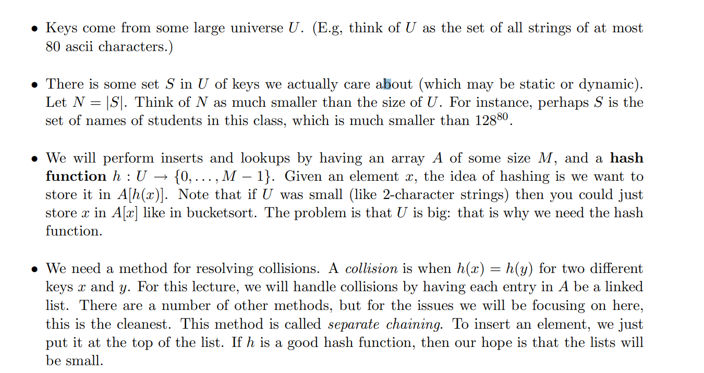
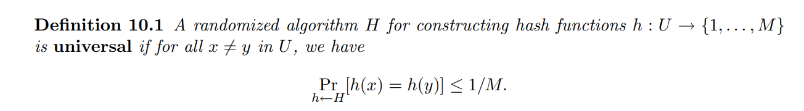

# 哈希算法
* hash翻译
    
    n. 剁碎的食物；混杂，拼凑；重新表述
    vt. 搞糟，把…弄乱；切细；推敲
* A hash algorithm is a function that converts a data string into a numeric string output of fixed length. 
* 是将某种无限的关系映射到有限的算法，即认为每个人只会用到有限的字符串集合，所以映射到有限空间是有可能的
* 所有能满足上面的函数都可以成为哈希算法

## basics
* 基础要求

* 在使用哈希的时候，总是需要考虑冲突的情形

## Universal Hashing
* 定义

## Perfect Hashing
* We say a hash function is perfect for S if all lookups involve O(1) work

## properties
* it always returns a number for an object.
* two equal objects will always have the same number
* two unequal objects not always have different numbers

## hash table 
* Create an array of size M. Choose a hash function h, that is a mapping from objects into integers 0, 1, ..., M-1. Put these objects into an array at indexes computed via the hash function index = h(object). Such array is called a hash table.

## md5 
*  Message-Digest algorithm 5

## sha family
* Secure Hash Algorithm
* The SHA-1 is called secure because it is **computationally infeasible** to find a message which corresponds to a given message digest, or to find two different messages which produce the same message digest.
* When a message of any length < 2^64 bits is input, the SHA-1 produces a 160-bit output called a message digest.  The message digest can then, for example, be input to a signature algorithm which generates or verifies the signature for the message. 
* sha是用作字符串校验的

## CRC32 
* A cyclic redundancy check (CRC) is an error-detecting code often used for detection of accidental changes to data. 

## 哈希冲突
* 由于哈希算法被计算的数据是无限的，而计算后的结果范围有限，因此总会存在不同的数据经过计算后得到的值相同，这就是哈希冲突。
* 开放定址法(麻烦邻居),  拉链法（排队）, 再哈希法（重来）、建立公共溢出区(广场)
* 常用的链地址法 (separate chain)

## 应用场景
* 签名 
* 信息加密
* 搜索，可以定位某个位置，这个位置有极大的几率找到目标值，是一种利用数学的力量逼近, HashMap
* git的commit id，sha1的生成指作为了唯一id来使用
* 负载均衡
* 讲道理，所有带有查找属性的场景都可以使用

## 抽屉原理
* “如果每个抽屉代表一个集合，每一个苹果就可以代表一个元素，假如有n+1个元素放到n个集合中去，其中必定有一个集合里至少有两个元素。” 抽屉原理有时也被称为鸽巢原理。 它是组合数学中一个重要的原理。

## 未解决的问题
* 总是可能碰撞怎么办
* 哈希算法的结果肯定是整数么

## reference 
* [sha1-rfc](https://tools.ietf.org/html/rfc3174)
* [hash lecture](https://www.cs.cmu.edu/~avrim/451f11/lectures/lect1004.pdf)