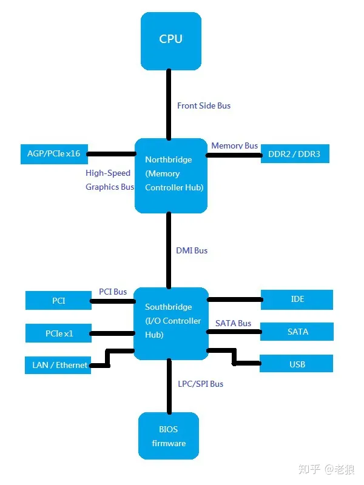

## arch

### PCH
* 平台路径控制器（英语：Platform Controller Hub，PCH）
* PCH架构取代了英特尔之前的Hub架构（Hub Architecture），其设计解决了处理器与主板之间最终存在的性能瓶颈问题
* 随着时间的推移，CPU的速度不断提高，但前端总线（FSB）（CPU与主板之间的连接）的带宽却没有提高，从而导致性能瓶颈的出现
* 不能将南桥芯片吞掉，因为引脚和复杂度的原因

### (Front Side Bus)FSB 
* 就是北桥和CPU之间的通道
* 

### 芯片组
* 目前只剩下Intel和AMD了，前提厂商都已经退场了

### glossary 
* Instruction Set Architecture: “Instruction Set Architecture is the structure of a computer that a machine language programmer (or a compiler) must understand to write a correct (timing independent) program for that machine.”
* RISC: Reduced Instruction Set Computer，精简指令集计算机
* CISC: Complex Instruction Set Computer,复杂指令集计算机

### 总线
* 电信号进行传播
* 总线事务来管理，有的可能会并行多个事务