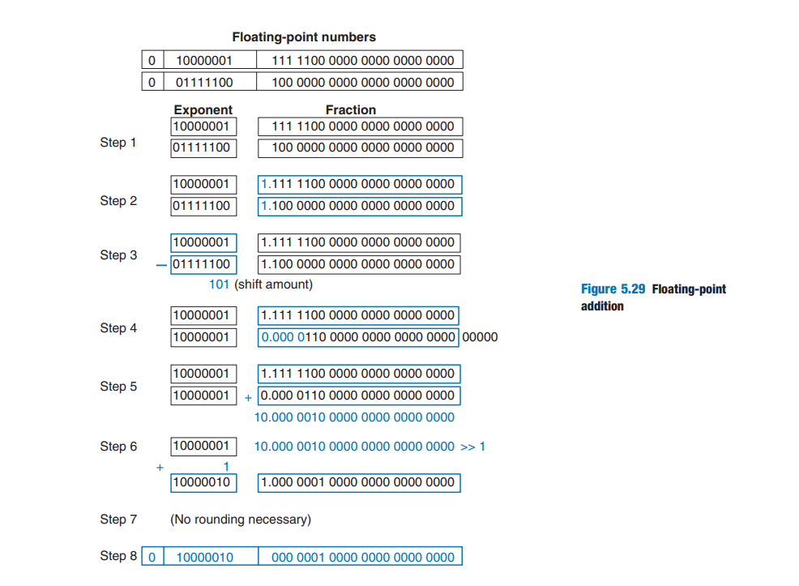

## float
* 以下的例子都以32bit为例子
* 没有连续的区间，只能分为两段进行表示

### 规则
* 依据IEEE 754标准
#### 规范化
* exponent占用8位，所以范围是[0,255]，需要左移127，即-127，所以能表示的范围是[-127,128]，因为**最大值和最小值被预留他用**，所以范围是[-126,127]
* fraction值的范围是1-2，并且最左侧的1因为必然存在所以存储中被省略
* 10101100110111100....00110:表示的值为 -1.**1**0111100....00110x2^(01011001-127)
* 最大值：1.111111111....111x2^127  转为十进制为(2^24-1)x2^(127-23) = (2^24-1)x2^104 = 3.4028235E+38，最小负数-3.4028235E+38
* 最小整数: 1x2^(-126) = 1.1754943E-38

### 非规范化
* **当exponent全为0的时候**，表示非规范化数据，此时**fraction的默认1**也不存在了
* 最小正数: 2^(-23)x2^(-126)=2^(-149) = 1.401298E-45，即最大负数为-1.401298E-45

### 例子
* 
  * 加法
    1. Extract exponent and fraction bits.
    2. Prepend leading 1 to form the mantissa.
    3. Compare exponents.
    4. Shift smaller mantissa if necessary.
    5. Add mantissas.
    6. Normalize mantissa and adjust exponent if necessary.
    7. Round result.
    8. Assemble exponent and fraction back into floating-point number
    * 

### 理解
* exponent就是fraction的小数点需要移动的位数


### 表示小数的方式
* 定点数，这块其实没有类似IEEE754这样的规范
  ```
    (a) 01101100
    (b) 0110.1100
    (c) 22 + 21 + 2–1 + 2–2 = 6.75
  ```
* 浮点数
  * 单精度
  * 双精度
  

### 精度丢失的原因
* 核心原因： 计算机中使用二进制来表示浮点数，而十进制的一些分数无法准确地用有限的二进制位表示。例如，十进制的 0.1 无法精确表示为有限位数的二进制。


### 计算单元
* floating-point unit(FPU)