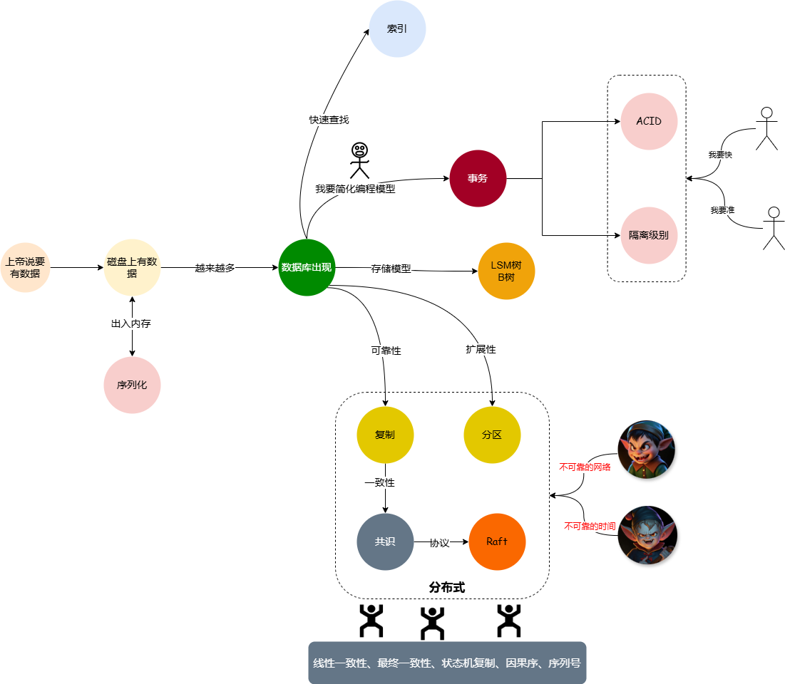

# 9.7分必读计算机书籍《数据密集型应用系统设计》总结
 最近又将DDIA重新读了一遍，结合原来的心得写了一些总结，从数据的角度分析了数据内存模型、序列化、存储模型、检索、存储、分布式、批处理、流处理，可以说涉及到了数据的方方面面，看完该书，结合Redis、MySQL、kafka、Tidb数据库等会有更深的理解。

 ## 我理解的结构
 * ，顺着这个结构，我列出以下的一些重点部分。

## 两个数据转换组件
* ORM(object-relational mapping)是解决内存对象模型和数据对象模型的不匹配问题
* 序列化是为了内存中结构化数据与字节序数据的转换

## 两个抽象
* 事务是对数据读写的各种复杂度的抽象，使用事务将大大简化应用编程模型。
* 共识是数据副本复制中各种复杂度的抽象。
* 对比tcp/ip协议来看，tcp/ip能在不稳定的网络中建立起来可靠的连接；事务能在不可靠的环境中得到可靠的结果；共识能在不可靠的网络中得到可靠的一致性。

## 两种存储引擎
* 日志结构(log-structured)的存储引擎
  * LSM树，充分利用顺序写的优势，将空间局部性发挥到极致。
* 面向页面(page-oriented)的存储引擎
  * B树，充分利用磁盘和内存数据传输是以Page为最小单位的特性。

## 分布式数据的两个维度
* 复制，为了数据的可靠性
  * 使用达成共识的协议，Raft等
* 分区，为了存储的可扩展性
  * 分区的两种方式
    * Hash，不同的分区数据比较均匀
    * Range，便于区间查询

## 分布式的两个不可靠
* 不可靠的网络
* 不可靠的时钟，所以需要单调钟
  * 地球自转变慢导致的闰秒
  * 石英钟因为温度的关系导致的偏移

## 分布式数据的一致性责任的达成
* 用户关注因果关系,而因果关系通常使用顺序来表达，而计算机表达顺序需要一个全序(total order)的排列。
* 引入序列号顺序来保证全序关系
* 使用全序广播(使用状态机复制)将数据库写入按照顺序广播到别的节点，这个也就就是Raft的LogIndex存在的原因。

## 并发的普适性
* 现实中的并发
  * 两个人夹菜筷子碰到
  * 两个抢一辆共享单车
* Git的并发
  * 两个同学修改同一块代码
  * 写冲突人工处理
* CPU指令并发
  * 使用MESI协议控制
* 线程并发
  * 使用线程锁控制
* 数据库读写并发
  * 读已提交隔离级别使用使用一条历史数据并发
  * 使用快照隔离的话使用多版本进行并发
  * 写数据加锁

## 从事务的隔离级别理解数据库
* 从目前的理论来看，隔离级别越高，数据库的吞吐量和响应速度都会降低，所以数据系统都要在性能与正确性之间做平衡。
* 数据库为了并发煞费苦心，引入多版本机制，可以形成多个快照并行多个事务的处理；如果只是读已提交的话其实只要一个版本就行了。
* 全局锁、表锁、行锁，也是为了增加并发，但是如果引入字段锁的话，仅仅是锁的管理就回消耗大量的系统资源，所以目前行锁就是粒度最小的锁了。
* 即使做到了可重复读，也无法解决写冲突问题，写冲突问题还需要用户自己使用两种并不存在的锁悲观锁或者乐观锁来处理。

## 总结
* 数据有序可以理解为一个大型状态迁移现场
* 通过抽象来降低理解成本和使用难度，在不可靠的环境中建立可靠的使用上下文
* 并发是计算机无法绕开的问题