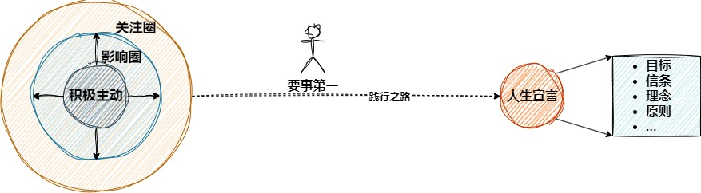

# 高7 

提前5分钟去公司，避免`重要不紧急`事件转为`重要紧急`事件

将事情明确话，目标话，这样才能心无旁骛，更加专注，让生活更加聚焦。

本书是比较高屋建瓴的方式提出你应该如何做，至于很多的细节，还需要阅读其他书籍进行补充，比如如何控制情绪。

本书是一个面向改变自己的书籍，而不是介绍某个知识的书籍，你看每章的后面都有`付诸行动`的问题和实践方式，如果看完之后，你不按照里面的原则改变自己，那等于没看。本书适合于想改变自己而又找不到方式和方法的人来读，它指导你从内向外逐渐的改变自己。

所谓的不自信，其实是没有理论支撑自己的行为，不确定自己的行为的对错，这是一个认知问题，只要建立起来自己的认知框架，人就会变得自信而又从容。

产能与产量

当你有自己的目标和任务的时候，自然就不会为很多琐事而烦心了，因为三个字`不值当`，有烦心的时间又做了很多事情了。

什么是习惯????

什么是三观

实践之书

## 总体结构
* 该书是按照自我习惯，沟通习惯，合作习惯依次递进的关系来安排内容。
  

## 个人领域
* 这个模块分为3个部分，首先是建立`积极主动`的个人基点，然后建立自己的`人生宣言`的愿景点，然后使用`要事第一`的原则将两个点连接起来。

#### 积极主动
  * 人类能够积极主动的原因是因为人类拥有`自我意识`，我们自己可以对自己进行审视，人会后悔、自豪、总结等，这些都是对自我的审视。
  * 消极被动的人总是将理由归结为别人或环境，自己的行为是外部决定，不是自己决定的。人总不会一帆风顺，总会遇到困境，这个时候积极就能发出巨大的力量，我的偶像苏东坡先生三起三落依然能够乐观面对生活，一蓑烟雨任平生。逆境更能激发人的斗志和处理问题的能力。
  * 消极被动的人大多数使用感性来解决问题，不太擅长使用理性解决问题。拿起来`理性`的武器，将事情与结果之间建立越来越强的关联，那么在归因的时候就不会总是归因到别人或者外部，可以使用理性来分析和综合，找到原因进行处理，所以提高认知就很重要，提高认知能够`拨开感性的迷雾`，看到事情的真相。
  * 影响圈与关注圈：影响圈是生活息息相关的部分，关注圈是看到的部分。消极的人可能会逃避影响圈的问题，转而直面关注圈，然后被打的个灰头土脸，心理上为了自洽将失败归结为外因，这就闭环了。应该放眼关注圈，耕耘影响圈，如果每天只影响一个人，自己的家人，自己的同时，也是一种成功。随着时间的推移，你的影响圈就会慢慢变大，关注圈也慢慢变大，这是一个渐进的过程，徐徐而行，步步生辉。
  * 作为个人，应该扩展视野，提高认知，从各个角度去看问题，这样更能够建立积极的态度，不要将自己困在态度的角落中不可自拔，当消极情绪侵扰你的时候，理性思维马上启动，迅速转为积极模式，别被消极笼罩。多多练习之后，增加前额叶皮脂的厚度，降低杏仁核对不良事情的反应程度，人会更加积极和坦然。像古人一样`不以物喜，不以己悲`，当你想抛弃消极的时候就直面消极，当你想抛弃恐惧的时候，就直面恐惧，和它对视，和它凝视。
##### 个人心得
  * 我想到了人生的几种困境，如下所示
    * 情绪困境：有很多人因为某些事情而被困在各种负面的情绪中，有一点点事情就可以把这些情绪从内心中释放出来。
    * 方向困境：没有方向，没有目标，找不到人生的意义
    * 方法困境：捡了芝麻丢了西瓜，找不到重点，没有方法论
  
  * 要想主动积极，就得付出能量，因为被动消极其实是一种消耗能量较小的方式，如果个体本身能量就不足，就别提什么积极了。所以很多人并不是不积极，而是能量被别的事情用完了。所以要积极锻炼身体，放弃不良行为和过渡娱乐导致的能量消耗，将更多的能量聚焦到应该使用能量的事情。
#### 以终为始
  * 做事的方向：建立目标，小目标，大目标，近期目标，长远目标，以目标领导自己，把握方向，向着目标努力，将事情进行第二次创造。
  * 做人的方向: 建立个人原则，愿景,价值观，自己想成为一个什么样的人，自己生命的意义是什么，知书达理，身体健康，家庭和睦亦或是小富即安，当迷茫的时候，彷徨的时候，多看看自己曾经立过的誓言，将自己与愿景`重新锚定`，让自己重新稳定
  * 如何做出正确的选择，或者建立正确的目标呢？
##### 个人心得
  * 目标和个人愿景是人生之锚，将自己的人生之舟稳定行驶，虽经历风浪但是依然能稳定航行在人生的航线上。锚定后，人生的安全感会得到提升
  * 安全感的另一个来源扩展认知，认知到事情的关联，将世界、将自己看得更清楚一些，做到小事看清晰，大事不糊涂。
  * ????? 引出三观：人生观=观内、世界观(观外)、价值观(选择)
#### 要事第一