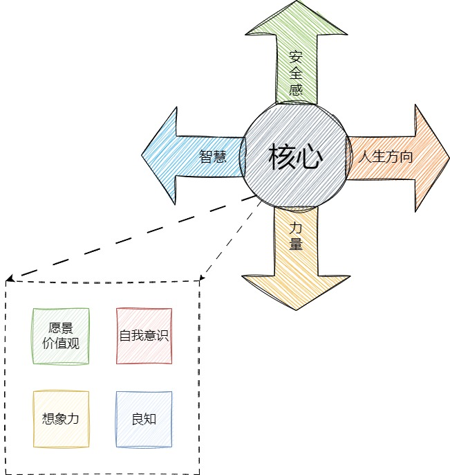
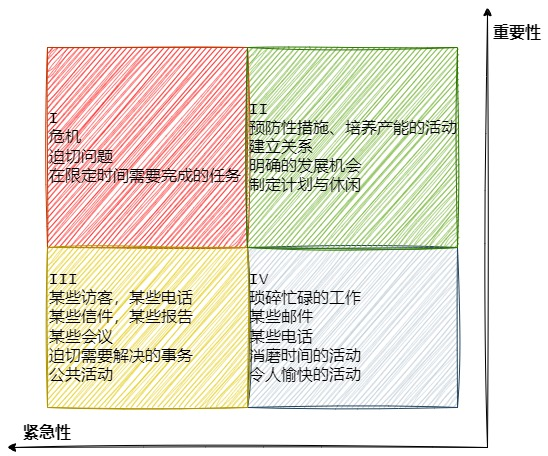
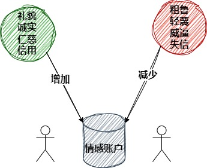
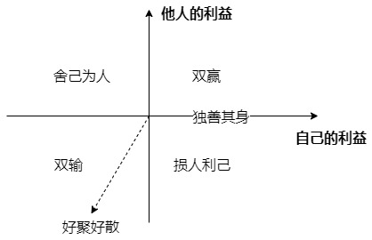

## 高效能人士的七个习惯
本书是一个实践指导类的书籍，从习惯出发，不是介绍某个知识的书籍，没有介绍复杂的理论, 每章的后面都有`付诸行动`部分，看完之后，需要尽可能的按照里面的原则改变自己。如果你处在人生的困境，如果你想要更加优秀的自己，如果你想要更加多彩的人生，它都可以一步一步指引你从内向外逐渐的改变自己，优化自己。

## 个人领域
* 这个模块分为3个部分，首先是建立`积极主动`的个人基点，然后建立自己的`人生宣言`的愿景点，然后使用`要事第一`的原则将两个点连接起来。

#### 习惯一 积极主动
  * 人类能够积极主动的原因是因为人类拥有`自我意识`，我们自己可以对自己进行审视，人会后悔、自豪、总结等，这些都是对自我的审视。
  * 消极被动的人总是将理由归结为别人或环境，自己的行为是外部决定，不是自己决定的。人总不会一帆风顺，总会遇到困境，这个时候积极就能发出巨大的力量，我的偶像苏东坡先生三起三落依然能够乐观面对生活，一蓑烟雨任平生。逆境更能激发人的斗志和处理问题的能力。
  * 消极被动的人大多数使用感性来解决问题，不太擅长使用理性解决问题。拿起来`理性`的武器，将事情与结果之间建立越来越强的关联，那么在归因的时候就不会总是归因到别人或者外部，可以使用理性来分析和综合，找到原因进行处理，所以提高认知就很重要，提高认知能够`拨开感性的迷雾`，看到事情的真相。
  * 影响圈与关注圈：影响圈是生活息息相关的部分，关注圈是看到的部分。消极的人可能会逃避影响圈的问题，转而直面关注圈，然后被打的个灰头土脸，心理上为了自洽将失败归结为外因，这就闭环了。应该放眼关注圈，耕耘影响圈，如果每天只影响一个人，自己的家人，自己的同时，也是一种成功。随着时间的推移，你的影响圈就会慢慢变大，关注圈也慢慢变大，这是一个渐进的过程，徐徐而行，步步生辉。
  * 作为个人，应该扩展视野，提高认知，从各个角度去看问题，这样更能够建立积极的态度，不要将自己困在态度的角落中不可自拔，当消极情绪侵扰你的时候，理性思维马上启动，迅速转为积极模式，别被消极笼罩。多多练习之后，增加前额叶皮脂的厚度，降低杏仁核对不良事情的反应程度，人会更加积极和坦然。像古人一样`不以物喜，不以己悲`，当你想抛弃消极的时候就直面消极，当你想抛弃恐惧的时候，就直面恐惧，和它对视，和它凝视。
  * 本章小结：本章主要是解决一个心态、情绪、视野等问题
##### 个人心得
  * 我想到了人生的几种困境，如下所示
    * 情绪困境：有很多人因为某些事情而被困在各种负面的情绪中，有一点点事情就可以把这些情绪从内心中释放出来。
    * 方向困境：没有方向，没有目标，找不到人生的意义
    * 方法困境：捡了芝麻丢了西瓜，找不到重点，没有方法论
  
  * 要想主动积极，就得付出能量，因为被动消极其实是一种消耗能量较小的方式，如果个体本身能量就不足，就别提什么积极了。所以很多人并不是不积极，而是能量被别的事情用完了。所以要积极锻炼身体，放弃不良行为和过渡娱乐导致的能量消耗，将更多的能量聚焦到应该使用能量的事情。
  * 所谓的不自信，其实是没有理论支撑自己的行为，不确定自己的行为的对错，这是一个认知问题，只要建立起来自己的认知框架，人就会变得自信而又从容。
#### 习惯二 以终为始
  * 做事的方向：建立目标，小目标，大目标，近期目标，长远目标，以目标领导自己，把握方向，向着目标努力，将事情进行第二次创造。
  * 做人的方向: 建立个人原则，愿景,价值观，自己想成为一个什么样的人，自己生命的意义是什么，知书达理，身体健康，家庭和睦亦或是小富即安，当迷茫的时候，彷徨的时候，多看看自己曾经立过的誓言，将自己与愿景`重新锚定`，让自己重新稳定
  * 如何做出正确的选择，或者建立正确的目标呢？ 
  
  * 基于自己的核心圈，通过自我意识、良知进行审视和矫正，使用价值观、愿景、想象力建立方向，从而建立安全感、力量、智慧和人生方向
  * 再具体一点就是，作为一个社会个体，需要平衡各种角色的责任和义务，需要兼顾各个不同的角色和中心，不是建立以某种角色为中心的模式，而是兼顾各种不同角色的`原则`模式
  * 总之通过本章: 对比第三章的`积极主动`, 本章主要是说明如何自顶向下的说明做事原则、做事目标、做事方向，如何基于社会角色而建立原则性的做事方式。
##### 个人心得
  * 目标和个人愿景是人生之锚，将自己的人生之舟稳定行驶，虽经历风浪但是依然能稳定航行在人生的航线上。锚定后，人生的安全感会得到提升
  * 安全感的另一个来源扩展认知，认知到事情的关联，将世界、将自己看得更清楚一些，做到小事看清晰，大事不糊涂。
  * 世界观: 如何观察和认知这个世界，世界怎么来的，世界怎么运行的
  * 人生观: 如何选择人生道路，人生的意义是什么
  * 价值观: 如何对比，如何找到价值更好的事情
#### 习惯三 要事第一
  * 本章主要是描述一下一种基于象限的分割任务的方式
  
  * 主要是要发挥独立意志，在积极主动的态度下，在以始为终的直到下，指定具体的实施计划，将目标一个一个的实现。
  * 要建立以第二象限为中心的思维模式，以提高产能为目标，而不是一味的追求产量
##### 个人心得
* 提前5分钟去公司，避免`重要不紧急`事件转为`重要紧急`事件
* `未经审视的生活是不值得过的`,是古希腊哲学家苏格拉底的一句名言, 此处的审视就是要对事情做分类，使用自我意识与独立意志进行校正与实现。
* 在稳定的时候求变革，思考第二象限的重要事情；在不稳定的时候求稳定，找到目标之锚，让自己的安全感加深
* 如果发现一只处于第四象限，请积极跳脱出来，努力完成第二象限的事情。
* 产能与产量: 产量是当前，产能则代表未来，本书强调应该更着眼于未来
* 将事情明确化，目标化，这样才能心无旁骛，更加专注，让生活更加聚焦。当你有自己的目标和任务的时候，自然就不会为很多琐事而烦心了，因为三个字`不值当`，有烦心的时间又做了很多事情了。

## 公共领域
独立是互赖的基础，修身是公众领域成功的基础。所以前部分的个人领域的实践与成功是公共领域的前提与基础。
 
### 人际关系的本质
* 本章中的所有观点都是围绕一个情感账户的概念展开的 
* 投资情感账户的7种方式
  1. 理解他人: 这个是培养一切感情的基础。 理解他人就像认识自己一样，理解他们就是对他人认知，有认知才能有下一步，否则就只是误打误撞，或者按照经验进行处理，但是这难免会出现偏差和误会。
  2. 注意小节: 这个看起来是个技巧，如何更好的理解呢？那不拘小节又怎么说呢？细节决定成败是真的么？这里面可能存在信息偏差，我个人认为是一个价值观或者视角问题，可能某个事情或者细节对A不重要，但是对B就非常重要，所谓注意小节可以转化为`注意可能的大事`。
  3. 信守承诺: 这个的重要性就不言而喻了，只有一次一次的完成承诺，才能建立越来越坚固的信任关系。承诺就是两个社会对象交互的接口，不断的交互过程中产生友谊与信任。
  4. 明确期望: 这个就是建立明确的目标，这是一个量的问题，`完成承诺是一个方向问题，而明确期望与目标则是量的问题`.
  5. 正值诚信: 我的理解是，`心、言、行三者要一致`，言不由衷不可取，言行不一也不可取。言因为某些场景或者人而偏离了心，行为因为利益、兴趣等偏离了自己说过的话，这也不可取。像青松，不管春夏秋冬，我自在挺直，不屈不折，不傲不骄。但是如果心有问题，则需要先修心，否则啥都没有用，心是一切的出发点。
  6. 勇于致歉: 在情感账户需要提款的时候，使用道歉进行软化处理，则可以有将提款转为存款的神奇效果。道歉是一种反馈，可以让对方对你产生一种期望，这个期望是`下次我不再这么处理了`，这其实是`变相做出来一种承诺`。但是一直犯错不改，道歉也不会再转为存款了。
  7. 无条件的爱: 无条件的爱可以给人安全感和自信心，培养价值感，这一点在孩子培养上尤为重要，但是这个并不说拒绝有条件的爱，`有条件的爱`是建立在`无条件的爱`的基础上的一种激励机制。(为什么需要无条件的爱，这是孩子安全感的来源，是他能量的来源，充满能量则会养成自信。如果一个孩子没有安全感，则自身能量用于去防卫，去守护，哪还有能量去改变自己，改变世界)。其实这个世界所有人都希望得到无条件的爱，可是现实却是，大多人都`缺爱`，如果有人在世能给出无条件的爱，则一定是`圣人`一样的存在，备受尊敬的存在。

### 习惯四 双赢思维——人际领导的原则
* 六种模式 。最小的己方利益模式为好聚好散，即坐标系的原点位置；没有自己利益为负值的模式。
* 在相互依赖的环境中，双赢才是唯一可行的方案。否则就执行对方无损失方案好聚好散，不要执行让对方有损失的任何方案。但是这里面的前提还是互相依赖的环境，如果是存心欺诈或者一次性的合作模式下，相比双赢模式就不成立了吧，就像旅游景区一样，大多人一生只会去一个景区一次，哪有什么互相依赖，就是坑你一次是一次。
* 作者列出了5个要领，分别体现在不同的领域或者层面，从点、面、体分析了双赢的适用方式。
#### 五个要领
1. 双赢品德(为人要追求双赢)
  * 诚信
  * 成熟： 成熟就是在表达自己的情感和信念的同时又能体谅他人的想法和感受的能力。一种均衡自己感受和对方需求的能力。
  * 知足： 相信资源充足，人人有份。见不得别人好，甚至对至亲好友的成就也会眼红，这都是"匮乏心态"（Scarcity Mentality）作祟。富足的心态（Abundance Mentality）源自厚实的个人价值观与安全感。富足的心态（Abundance Mentality）源自厚实的个人价值观与安全感。我个人觉得富足的一个重要表现是愿意与别人分享，不光是个人的财富，还有个人的信心与信息。富足才能溢出，溢出即是一种分享，分享才能使别人收益，这样本身就形成了一种赢的吸引力和条件。
2. 双赢关系(相处关系追求双赢)：建立一种双赢关系，一旦建立了足够的信任账户，相当于建立了稳定的基础，这样才能在沟通过程或者解决问题的过程中更聚焦于问题。
3. 双赢协议(合作关系追求双赢)：协议是将抽象概念具象化的过程，将空悬的概念转化为可实施的行动与细节。
  * 双赢的管理培训
  * 双赢绩效协议
4. 双赢体系(组织架构追求双赢)
  * 双赢只能存在于体系健全的组织机构中。双赢必须有相应体系支撑，包括培训、规划、交流、预算、信息、薪酬等，而且所有体系都要建立在双赢原则的基础上。
5. 双赢过程(执行过程追求双赢)
  * 即在过程中使用双赢的思维
  ```
  1. 首先，从对方的角度看问题。真正理解对方的想法、需要和顾虑，有时甚至比对方理解得更透彻。
  2. 其次，认清主要问题和顾虑（而非立场）。
  3. 再次，确定大家都能接受的结果。
  4. 最后，找到实现这种结果的各种可能路
  ```
  
### 习惯五 知彼解己——移情沟通的原则
* 说了一个`心理空气`的概念。人类最大的生存需求源自心理，即被人理解、肯定、认可和欣赏，这些也就是心理的空气。
* 移情聆听是指以理解为目的的聆听，要求听者站在说话者的角度理解他们的思维方式和感受。移情（Empathy）不是同情（Sympathy）。后者是一种认同和判断形式，更适合用来表达感情和做出回应，却容易养成对方的依赖性。移情聆听的本质不是要你赞同对方，而是要在情感和理智上充分而深入地理解对方。
* 移情聆听是有风险的。只有当你做好了被对方影响的准备，才能深入到移情聆听的阶段，而这是需要足够的安全感的，因为这时候的你会变得很脆弱。这一点很重要啊，哈哈，如果同情心泛滥，或者别人的一点好处就把自己的心理防线就击穿了，那岂不是被骗子骗了还在数钱呢，所以做到这一点还是挺难的，必须有坚强的内核防线才行。
* 本章就是为了说明一点，什么是有效的沟通，怎么才能有效沟通
* 四种常见的回应模式
```
价值判断: 对旁人的意见只有接受或不接受。
追根究底: 依自己的价值观探查别人的隐私。
好为人师: 以自己的经验提供忠告。
自以为是: 根据自己的行为与动机衡量别人的行为与动机。
```
* 古希腊人有一种很经典的哲学观点，即品德第一，感情第二，理性第三。我认为这三个词集中体现了让他人理解自己以及有效表达自己的精髓。品德指的是你个人的可信度，是人们对你的诚信和能力的认可，是人们对你的信任，是你的情感账户。感情指的是你的移情能力，是感性的，说明你能通过交流迅速理解他人的情感。理性是你的逻辑能力，即合理表达自己的能力。首先是你本身的品德，然后是你同他人的关系，最后是你表达自己的能力，
* 如何加强关系，一对一沟通。如果你把精力放在自己的影响圈内，就能真正地、深入地了解对方。你会获得准确的信息，能迅速抓住事件的核心，建立自己的情感账户，还能给对方提供有效合作所必需的"心理空气"。你越深入了解别人，就会越欣赏和尊敬他们。`触及对方的灵魂是一件很神圣的事情`。
#### 个人心得
* 为什么需要沟通？因为需要了解对方的需求，因为每个人都会不同，如果我们面临是一个洗衣机，则我们直接按照使用说明书沟通就行了，可是如果是个鲜活的个体，我们需要投入时间、精力、情绪去了解，去感受，才能发现个体的差异，在沟通的时候才能根据双方的不同的需要来达到双赢的效果。如果不了解对方，就无法施加作用力或者影响力，那就无法建立信任的关系。
* 为什么作者会觉得`知彼解己`是关键，是最重要的原则呢？尝试类比一下，如果你想理解运动，不了解牛顿三大定理可以么？这么类比有一点不太恰当，对于普通人来说，大家更倾向于发现规律，而不是发现一个一个的不同。发现规律一劳永逸永久套用，可是发现一个一个的差异确实一件重复性的工作，为了减轻这个过程，更多的人则通过`打标签`的方式对人的认识`点到为止`，不愿意投入精力和时间。因为这个过程需要投入很多，需要时间并且需要耐心。
* 认识自己往往从内向外更容易一些，但是我们认识别人需要从外向内，我们需要从语言入手，从做事入手，来分析对方的性格，分析对方的爱好，对方的需要，对方的有趣，最终触及灵魂。什么是`触及灵魂`呢？比如对方做某件事情的背后原因，可能是儿时的一个不经意的事情让自己开始喜欢上某件事情，那么如果聊天聊到到儿时这件事情就是触及灵魂吧。抽象的说，就是`内心深处的事情`，比如人生规划，职业理想等。
* 美国心理学家亚伯拉罕·马斯洛（Maslow.A.H.）从人类动机的角度提出需求层次理论，该理论强调人的动机是由人的需求决定的。而且人在每一个时期，都会有一种需求占主导地位，而其他需求处于从属地位。人的需求分成生理需求、安全需求、归属与爱、尊重需求和自我实现五个层次。需求是由低到高逐级形成并得到满足的。我们可以从沟通中发现对方的动机与需求，并根据需求进行灵活处理。
* 让我想起来阿米尔汗的《我的个神啊》里面说的，在他们的星球中，没有谎言，沟通都是有心灵沟通，不像人类社会那么复杂，一句话都可以有很多种意思。如果是使用心灵沟通，世界的运行效率得提高多少倍吧
* 什么是尊重：尊重是一种认可，对品质的认可，对规则的认可。如果需要被认可，首先是被觉察与看到，看到社会契约，社会规则，看到优秀的品质，发出欣赏与赞赏的情绪。
* 什么是礼貌：礼貌可以任务是尊重的表现，是行为化的尊重
### 习惯六 统合综效-创造性合作的原则
* 
* 统合综效是人类所有活动中最高级的一种，是对所有其他习惯的真实考验和集中体现。统合综效是人类最了不起的能耐，也是前五个习惯的整体表现与真正考验
* 统合综效的精髓就是判断和尊重差异，取长补短
* 沟通三层次
  1. 互相提防: 人与人之间互相提防，步步为营，经常借助法律说话，为情况恶化作打算
  2. 彼此尊重: 唯有相当成熟的人才办得到，为了避免冲突，双方都保持礼貌，但却不一定为对方设想。
  3. 统合综效
* 要实现人际关系中的统合综效，关键是首先实现个人的统合综效，个人的统合综效在前三个习惯的原则中都有体现，这些原则赋予人们足够的安全感，让他们变得开放、坦率，不惧风险
* 所谓统合综效的沟通，是指敞开胸怀，接纳一切奇怪的想法，同时也贡献自己的见底
* 与人合作最重要的是，重视不同个体的不同心理、情绪与智能，以及个人眼中所见到的不同世界。
* 动力通常是积极、合理、自觉、符合经济效益的力量；相反地，阻力多半消极、负面、不合逻辑、情绪化、不自觉，具社会性与心理性因素。这两组作用力都是真实存在的，在应变时都要考虑周全。在一个组织或者团队中，通常会为了共同的目标而努力，有人提供动力，有人提供阻力，都会影响到最终目标的达成。
#### 个人心得
* 如何接纳和尊重别人，需要建立在安全观和自信的基础之上，否则接纳的过程中自己都迷路了，不知所措了，容易被别人的思路干扰和侵蚀，需要需要坚硬的自我内核
* 为什么需要统合综效，因为每个人的需求不同想法不同，而我们又想达到某种目的，如何完成呢？利用权势压制推进是一种办法，如果是平等的关系呢？如何达成一致呢
* 展开胸怀接受不同，有的时候需要将自己的脆弱暴露出去、将自己的秘密暴露出去，可能引起别人的嘲笑，别人的无视，这对于没有自信或者没有安全感的人来说是很难接受的。人总是会本能的防卫和保护内心的脆弱和秘密，不愿意分享与公开。

## 自我提升与完善
### 习惯七 不断更新——平衡的自我提升原则
* 人生最值得的投资就是磨炼自己，因为生活与服务人群都得靠自己，这是最珍贵的工具。
* 工作本身并不能带来经济上的安全感，具备良好的思考、学习、创造与适应能力，才能立于不败之地。拥有财富，并不代表经济独立，拥有创造财富的能力才真正可靠。
* 需要从四个方面进行着手
  1. 身体
  2. 精神
       * 精神层面是人的本质、核心和对价值体系的坚持，是生活中非常私人而又至关重要的领域。它能够调动人体内具有激励和鼓舞作用的资源，把你同所有人类的永恒真理紧紧联系在一起
       * 精神层面的增进，我觉得更多的是对价值观、信仰的坚持和修正，不断擦拭落灰的内心，保持纯粹和内心的平和。
       * 现代人出去旅游，就想去一个安静的小山村或者海滨城市待几天，这些都属于精神的范畴
  3. 智力
  4. 社会/情感
* 总之，这个习惯就是一个要旨，不断地发展自己，让自己不断地从上述4个方面进行增进，相互影响，螺旋上升，获得一个多彩的人生。

## 总结
作者根据自己人生的经验与经历,将如何培养优秀个人的方式分割为7个不同的习惯，从个人出发延伸到社会再到个人，他们之间的关系应该密切关联的，需要长期的对这些习惯进行践行和使用，才能发现他们之间较深次的关系。
```
微信公众号为"吹风的坚果"，欢迎关注，获取更多优质精彩的内容。
```