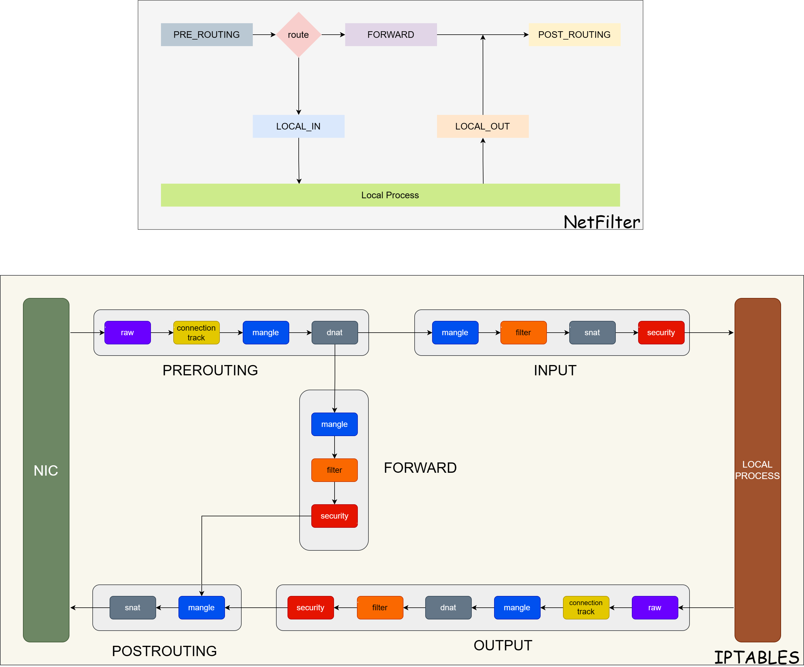

# 容器上下文中网络的通信分析


阅读本文的读者需要有一定的容器的基础，比如镜像、容器、Pod等概念有一些了解，最好使用过docker和k8s，如果想对网络部分有更深入的了解，本文将适合你。

## Namespace(命名空间)
在 Linux 容器化技术中，namespace（命名空间）是实现进程隔离的核心技术之一，容器化需要使用 namespace 来提供不同容器之间的隔离和资源独立。[wiki](https://en.wikipedia.org/wiki/Linux_namespaces)。Linux支持多种命名空间，本文重点关注网络部分，关于网络命名空间有以下描述
```
Network namespaces virtualize the network stack. On creation, a network namespace contains only a loopback interface. Each network interface (physical or virtual) is present in exactly 1 namespace and can be moved between namespaces.
Each namespace will have a private set of IP addresses, its own routing table, socket listing, connection tracking table, firewall, and other network-related resources.
```
每个网络命名空间，都有单独的IP地址，路由表，socket列表，防火墙等。

### 网络命名空间使用命令
```
NS_NAME=MyNS
ip netns add $NS_NAME        //添加一个网络命名空间
ip netns list                //查看命名空间
ip netns delete $NS_NAME    //删除命名空间
```

有了命名空间之后，他们是隔离了，如果他们之间需要通信怎么办呢？好办，拉根线呗，接在一起。

### vnet
#### 使用vnet直接连通两个命名空间

* 添加一个veth，一头名字是veth0，一头是veth1
```
> ip link add veth0 type veth peer name veth1 

> ip link list 查看
...
141: veth1@veth0: <BROADCAST,MULTICAST,M-DOWN> mtu 1500 qdisc noop state DOWN mode DEFAULT group default qlen 1000
    link/ether 2a:49:05:d5:83:0c brd ff:ff:ff:ff:ff:ff
142: veth0@veth1: <BROADCAST,MULTICAST,M-DOWN> mtu 1500 qdisc noop state DOWN mode DEFAULT group default qlen 1000
    link/ether 9e:c1:82:e5:e3:10 brd ff:ff:ff:ff:ff:ff
```
请注意此时会多了两个网口，一个名为veth1@veth0，一个名为veth0@veth1，状态都为DOWN
* 创建两个namespace
```
ip netns add my-ns
ip netns add my-ns-peer
```
* 分别将veth的两头放置到不同的namespace下
```
ip link set veth0 netns my-ns
ip link set veth1 netns my-ns-peer
```
查看一下：
```
> ip netns exec my-ns ip link list 
142: veth0@if141: <BROADCAST,MULTICAST> mtu 1500 qdisc noop state DOWN mode DEFAULT group default qlen 1000
    link/ether 9e:c1:82:e5:e3:10 brd ff:ff:ff:ff:ff:ff link-netnsid 1

> ip netns exec my-ns-peer ip link list 
141: veth1@if142: <BROADCAST,MULTICAST> mtu 1500 qdisc noop state DOWN mode DEFAULT group default qlen 1000
    link/ether 2a:49:05:d5:83:0c brd ff:ff:ff:ff:ff:ff link-netnsid 0
```
这个时候两个网卡的状态还是为DOWN
* 设置IP地址并激活网卡
```
设置veth0
ip netns exec my-ns  ip addr add 10.10.1.1/24 dev veth0
ip netns exec my-ns ip link set dev veth0 up

设置veth1
ip netns exec my-ns-peer  ip addr add 10.10.1.2/24 dev veth1
ip netns exec my-ns-peer ip link set dev veth1 up
```
查看一下：
```
 > ip netns exec my-ns ifconfig
veth0: flags=4163<UP,BROADCAST,RUNNING,MULTICAST>  mtu 1500
        inet 10.10.1.1  netmask 255.255.255.0  broadcast 0.0.0.0
        inet6 fe80::9cc1:82ff:fee5:e310  prefixlen 64  scopeid 0x20<link>
        ether 9e:c1:82:e5:e3:10  txqueuelen 1000  (Ethernet)
        RX packets 8  bytes 648 (648.0 B)
        RX errors 0  dropped 0  overruns 0  frame 0
        TX packets 8  bytes 648 (648.0 B)
        TX errors 0  dropped 0 overruns 0  carrier 0  collisions 0

> ip netns exec my-ns-peer ifconfig
veth1: flags=4163<UP,BROADCAST,RUNNING,MULTICAST>  mtu 1500
        inet 10.10.1.2  netmask 255.255.255.0  broadcast 0.0.0.0
        inet6 fe80::2849:5ff:fed5:830c  prefixlen 64  scopeid 0x20<link>
        ether 2a:49:05:d5:83:0c  txqueuelen 1000  (Ethernet)
        RX packets 8  bytes 648 (648.0 B)
        RX errors 0  dropped 0  overruns 0  frame 0
        TX packets 8  bytes 648 (648.0 B)
        TX errors 0  dropped 0 overruns 0  carrier 0  collisions 0
```
两张网卡都已激活并正确的分配了IP地址
* 测试一下连通性
```
从my-ns空间ping my-ns-peer
> ip netns exec my-ns ping 10.10.1.2
64 bytes from 10.10.1.2: icmp_seq=1 ttl=64 time=0.050 ms

从my-ns-peer空间ping my-ns
> ip netns exec my-ns-peer ping 10.10.1.1
64 bytes from 10.10.1.1: icmp_seq=1 ttl=64 time=0.034 ms
```
这个时候我们就使用一根线将两个namespace连通了。

但是这个时候外部是无法访问10.10.1.1和10.10.1.2的
```
> ping 10.10.1.1
2 packets transmitted, 0 received, 100% packet loss, time 1000ms
```
* 如果你已经完全操作结束了，可以使用如下命令清理现场
```
ip netns exec my-ns ip link list
ip netns delete my-ns
ip netns delete my-ns-peer
```

#### 多个namespace以及与宿主机通信
使用veth直连的方式只能解决两个namespace之间通信的问题，但是如果有多个namespace相互通信，veth就力不从心了。我们需要使用新的虚拟设备，虚拟网桥，下面我们做一下连通的实验
* 创建一个虚拟网桥
```
ip link add br0 type bridge
ip link set br0 up
```
* 创建3个命名空间
```
ip netns add my-ns-0
ip netns add my-ns-1
ip netns add my-ns-2
```
* 创建三个veth
```
ip link add veth0 type veth peer name br-veth0
ip link add veth1 type veth peer name br-veth1
ip link add veth2 type veth peer name br-veth2
```
* 将三个虚拟设备的一端放入分别的命名空间
```
ip link set veth0 netns my-ns-0
ip link set veth1 netns my-ns-1
ip link set veth2 netns my-ns-2
```
* 将三个虚拟设备另一端连接到虚拟网桥并启动
```
ip link set br-veth0 master br0
ip link set br-veth0 up

ip link set br-veth1 master br0
ip link set br-veth1 up

ip link set br-veth2 master br0
ip link set br-veth2 up
```
* 设置不同命名空间中设备的ip地址
```
ip netns exec my-ns-0 ip addr add 10.1.1.2/24 dev veth0
ip netns exec my-ns-0 ip link set veth0 up

ip netns exec my-ns-1 ip addr add 10.1.1.3/24 dev veth1
ip netns exec my-ns-1 ip link set veth1 up

ip netns exec my-ns-2 ip addr add 10.1.1.4/24 dev veth2
ip netns exec my-ns-2 ip link set veth2 up
```
* 测试连通性，如果没有错误的话，这三个命名空间就连接到一起了，但是宿主机无法与三个命名空间通信，因为网桥目前没有IP地址
```
ip netns exec my-ns-0 ping 10.1.1.3
ip netns exec my-ns-1 ping 10.1.1.4
ip netns exec my-ns-2 ping 10.1.1.2
> ping 10.1.1.3 
2 packets transmitted, 0 received, 100% packet loss, time 1000ms
```
* 给网桥设置IP地址
```
ip addr add ip 10.1.1.1/24 dev br0
> ifconfig 
br0: flags=4163<UP,BROADCAST,RUNNING,MULTICAST>  mtu 1500
        inet 10.1.1.1  netmask 255.255.255.0  broadcast 0.0.0.0
```
* 测试联通性，如果没有错误的话，现在宿主机就和三个命名空间连通了
```
从my-ns-0测试到网桥的连通性
> ip netns exec my-ns-0 ping 10.1.1.1 
  PING 10.1.1.1 (10.1.1.1) 56(84) bytes of data.
  64 bytes from 10.1.1.1: icmp_seq=1 ttl=64 time=0.060 ms

从宿主机测试到my-ns-0的连通性
> ping 10.1.1.2
  PING 10.1.1.2 (10.1.1.2) 56(84) bytes of data.
  64 bytes from 10.1.1.2: icmp_seq=1 ttl=64 time=0.057 ms

```
* 这个时候虽然之间连通了，但是还是无法访问外网，继续搞，添加网关
```
ip netns exec my-ns-0 route add default gw 10.1.1.1
ip netns exec my-ns-1 route add default gw 10.1.1.1
ip netns exec my-ns-2 route add default gw 10.1.1.1
```
* 还是不通，因为我的宿主机的ip是10.10.30.71，这个时候数据包能够出去，但是无法回来(可以在br0和eth0抓包观察)，因为10.1.1.0是个私有网段，不在上层网络的路由规则中，这个需要加一条,这里有个iptables的插图，理解POSTROUTING的位置 
* 
```
iptables -t nat -A POSTROUTING -s 10.1.1.0/24 -d 0.0.0.0/0 -j MASQUERADE
```
这个时候我在my-ns-0中执行`ip netns exec my-ns-0 ping 8.8.8.8`
```
宿主机网卡eth0的源ip变为了10.10.30.71
> tcpdump -n -nn -i eth0 dst host 8.8.8.8
tcpdump: verbose output suppressed, use -v or -vv for full protocol decode
listening on eth0, link-type EN10MB (Ethernet), capture size 262144 bytes
20:12:32.956569 IP 10.10.30.71 > 8.8.8.8: ICMP echo request, id 23016, seq 10, length 64
20:12:33.956712 IP 10.10.30.71 > 8.8.8.8: ICMP echo request, id 23016, seq 11, length 64

br0的ip地址变为了10.1.1.2
> tcpdump -n -nn -i br0 dst host 8.8.8.8    
tcpdump: verbose output suppressed, use -v or -vv for full protocol decode
listening on br0, link-type EN10MB (Ethernet), capture size 262144 bytes
20:13:00.965858 IP 10.1.1.2 > 8.8.8.8: ICMP echo request, id 23016, seq 38, length 64
20:13:01.966316 IP 10.1.1.2 > 8.8.8.8: ICMP echo request, id 23016, seq 39, length 64

> tcpdump -n -nn -i br-veth0 dst host 8.8.8.8    
tcpdump: verbose output suppressed, use -v or -vv for full protocol decode
listening on br0, link-type EN10MB (Ethernet), capture size 262144 bytes
20:13:00.965858 IP 10.1.1.2 > 8.8.8.8: ICMP echo request, id 23016, seq 38, length 64
20:13:01.966316 IP 10.1.1.2 > 8.8.8.8: ICMP echo request, id 23016, seq 39, length 64
```
将所有数据都伪装为从10.10.30.71出去的
* 最后一步，在my-ns-0空间启动一个端口8000的http服务
```
> ip netns exec my-ns-0   python3 -m http.server 8000
> netstat  -an | grep 8000 在宿主机上无法看到
```
因为网络是独立的，需要添加转发规则
```
iptables -t nat -A PREROUTING -p tcp --dport 9090 -j DNAT --to-destination 10.1.1.2:8000
iptables -t nat -nvL | grep 9090 查看规则是否添加成功
将宿主机上对9090端口的请求改为对10.1.1.2:8000请求，这个时候访问宿主机的http://10.10.30.71:9090(我的机器为10.10.30.71)就可以正常访问python启动的http服务了
```
* 至此为止，我们就将多个namespace与宿主机连通了，能够互相访问，能够外网访问，能够启动端口对外提供服务。docker的网络的默认网桥模式基于以上原理实现的。

## 在Docker中验证上述模式
* 以我的机器为例子，我有一个`docker0`的网桥，ip地址为172.17.0.1
```
> ifconfig
docker0: flags=4163<UP,BROADCAST,RUNNING,MULTICAST>  mtu 1500
        inet 172.17.0.1  netmask 255.255.0.0  broadcast 172.17.255.255
> brctl show
  bridge name     bridge id               STP enabled     interfaces
  docker0         8000.0242b38b3dee       no              vetha0fa6b7

```
* 我有一个containerId为9f740ba587fe的容器，执行`docker exec -it 9f740ba587fe /bin/sh`
```
> ifconfig
eth0      Link encap:Ethernet  HWaddr 02:42:AC:11:00:03  
          inet addr:172.17.0.3  Bcast:172.17.255.255  Mask:255.255.0.0
> route -n
/ # route -n
  Kernel IP routing table
  Destination     Gateway         Genmask         Flags Metric Ref    Use Iface
  0.0.0.0         172.17.0.1      0.0.0.0         UG    0      0        0 eth0
```
ip地址为172.17.0.3，网关为172.17.0.1就是上面的docker0网桥的地址
* 查看容器的命名空间
```
lsns | grep `docker inspect -f {{.State.Pid}} 9f740ba587fe`
```
* 查看地址伪装
```
> iptables -t nat -nvL  | grep 172.17
0     0 MASQUERADE  all  --  *      *       172.17.0.0/16        0.0.0.0/0   
```
* 查看端口映射，该容器将8080端口映射到了容器中的80端口
```
> docker ps 
9f740ba587fe   tranglolab/kafka-connector-board   "nginx -g 'daemon of…"   7 weeks ago   Up 7 weeks   0.0.0.0:8080->80/tcp, :::8080->80/tcp   hopeful_brattain
> iptables -t nat -nvL  | grep 8080
4   208 DNAT       tcp  --  !docker0 *       0.0.0.0/0            0.0.0.0/0            tcp dpt:8080 to:172.17.0.3:80
```
172.17.0.3就是上面看到的容器的ip地址，将8080端口映射到了172.17.0.3:80端口
## Kubernets的网络
Docker的网络相对比较简单，但是这个是理解k8s网络的基础。K8S的网络可以说涉及到了计算机网络的各个方面，IP分配、节点连通、网关、DNS，路由等等
### 提出问题
[K8S的官网](https://kubernetes.io/zh-cn/docs/concepts/cluster-administration/networking/)上提出了集群网络系统的四个问题
* 高度耦合的容器间通信：这个已经被 Pod 和 localhost 通信解决了。
* Pod 间通信：这是本文档讲述的重点。
* Pod 与 Service 间通信：涵盖在 Service 中。
* 外部与 Service 间通信：也涵盖在 Service 中。
也给出了[网络模型](https://kubernetes.io/zh-cn/docs/concepts/services-networking/)
### K0S为例

yum install bridge-utils -y

* 我自己部署了一个内网的K0S，用的版本是k0s-v1.32.1+k0s.0-amd64，部署了3个机器，一个controller，两个worker，结构和IP如下


### 我们先看看单个Pod网络连接和设备对应情况
* 我在内部启动一个BusyBox，运行在192.168.40.35上面
```
apiVersion: v1
kind: Pod
metadata:
  name: busybox-pod
  labels:
    app: busybox-app
spec:
  containers:
  - name: busybox-container
    image: capnexus-registry.capstonedev.cn/library/busybox:latest
    command: ["sh", "-c", "while true; do echo 'Busybox is running'; sleep 10; done"]
```
运行得到以下信息的Pod
```
Name: busybox-pod
Namespace: default
Running Node: 192-168-40-35
Pod IP: 10.244.0.28
```
所以busybox-podd的宿主机为192.168.40.35
* 在宿主机执行： `kubectrl exec -n default busybox-pod -i -t -- ip link show`
```
  1: lo: <LOOPBACK,UP,LOWER_UP> mtu 65536 qdisc noqueue qlen 1000
      link/loopback 00:00:00:00:00:00 brd 00:00:00:00:00:00
  2: eth0@if8: <BROADCAST,MULTICAST,UP,LOWER_UP,M-DOWN> mtu 1500 qdisc noqueue 
      link/ether 76:7e:4c:45:05:77 brd ff:ff:ff:ff:ff:ff
```
这里看到eth0@if8
* 在宿主机中执行`ip link `
```
  1: lo: <LOOPBACK,UP,LOWER_UP> mtu 65536 qdisc noqueue state UNKNOWN mode DEFAULT group default qlen 1000
    link/loopback 00:00:00:00:00:00 brd 00:00:00:00:00:00
  2: eth0: <BROADCAST,MULTICAST,UP,LOWER_UP> mtu 1500 qdisc pfifo_fast state UP mode DEFAULT group default qlen 1000
      link/ether 42:09:b3:eb:61:ec brd ff:ff:ff:ff:ff:ff
  3: kube-bridge: <BROADCAST,MULTICAST,UP,LOWER_UP> mtu 1500 qdisc noqueue state UP mode DEFAULT group default qlen 1000
      link/ether ca:c3:3c:b5:84:42 brd ff:ff:ff:ff:ff:ff
  4: vetha2ac3686@if2: <BROADCAST,MULTICAST,UP,LOWER_UP> mtu 1500 qdisc noqueue master kube-bridge state UP mode DEFAULT group default 
      link/ether 86:ad:81:65:81:f2 brd ff:ff:ff:ff:ff:ff link-netnsid 0
  6: veth70c81cf8@if2: <BROADCAST,MULTICAST,UP,LOWER_UP> mtu 1500 qdisc noqueue master kube-bridge state UP mode DEFAULT group default 
      link/ether 0a:13:03:cf:9c:12 brd ff:ff:ff:ff:ff:ff link-netnsid 2
  7: veth01e0bb28@if2: <BROADCAST,MULTICAST,UP,LOWER_UP> mtu 1500 qdisc noqueue master kube-bridge state UP mode DEFAULT group default 
      link/ether 4e:7b:6f:22:a4:66 brd ff:ff:ff:ff:ff:ff link-netnsid 1
  8: veth9750d64d@if2: <BROADCAST,MULTICAST,UP,LOWER_UP> mtu 1500 qdisc noqueue master kube-bridge state UP mode DEFAULT group default 
      link/ether 86:bc:22:8a:3d:83 brd ff:ff:ff:ff:ff:ff link-netnsid 3
```
我们看到序号为8的设备是在`link-netnsid 3`中
* 在宿主机上执行`ip netns`
```
  cni-9932435c-22c0-31fc-f51b-ee38cee99b01 (id: 3)
  cni-62099dba-a8a9-3628-d605-1ed794d5b220 (id: 1)
  cni-8fffbde1-4bf4-d317-fea0-16b91a20d73d (id: 2)
  cni-a0edeb62-71d7-f5e2-230b-2fea58467baa (id: 0)
```
找到id：3的网络命名空间
* 在宿主机上执行
```
ip netns exec cni-9932435c-22c0-31fc-f51b-ee38cee99b01 ip address
```
这个时候我们应该能够看到和`kubectrl exec -n default busybox-pod -i -t -- ip link show`一样的结果
* 在宿主机上执行`brctl show`，此处需要安装brctrl工具`yum install bridge-utils`
```
kube-bridge             8000.cac33cb58442       no              veth01e0bb28
                                                        veth70c81cf8
                                                        veth9750d64d
                                                        vetha2ac3686
```
* 我们可以看到有4个设备连接到了kube-bridge，然后从`ip link `中都可以看到kube-bridge和连接到四个interface的设备
* 总结：busybox-pod通过veth veth9750d64d连接到kube-bridge上，在 cni-9932435c-22c0-31fc-f51b-ee38cee99b01这个网络命名空间中，使用的是IP是`10.244.0.28`

### <a id="same_host_same_pod"></a> Pod内部的容器通信
* 配置文件如下
```
apiVersion: v1
kind: Pod
metadata:
  name: multi-container-pod
  labels:
    app: multi-container-example
spec:
  containers:
  - name: busybox-container
    image: busybox:latest
    command: ["sh", "-c", "while true; do echo 'Busybox is running'; sleep 10; done"]
  - name: node-container
    image: node:latest
    command: ["node", "-e", "require('http').createServer((req, res) => { res.end('Hello from Docker!'); }).listen(3000, '0.0.0.0', () => { conso
le.log('Server running at http://0.0.0.0:3000'); });"]
    ports:
    - containerPort: 3000
```
使用busybox和node，其中Node启动了一个3000的HTTP端口
* 使用这个命令`kubectrl exec -n default  multi-container-pod -c busybox-container -- telnet 127.0.0.1 3000`，从`busybox-container`连接3000d端口提示
```
Connected to 127.0.0.1
```
说明在容器内部使用127.0.0.1即可通信

### 相同机器上不同Pod的容器通信
* 部署一个新的busybox，名字为`busybox-pod2`
```
apiVersion: v1
kind: Pod
metadata:
  name: busybox-pod2
  labels:
    app: busybox-app
spec:
  containers:
  - name: busybox-container
    image: capnexus-registry.capstonedev.cn/library/busybox:latest
    command: ["sh", "-c", "while true; do echo 'Busybox is running'; sleep 10; done"]
```
和上节中的`busybox-pod`一样都运行在宿主机`192.168.40.35`下，IP地址为`10.244.0.29`
* 两个Pod的IP分别为`10.244.0.28`和`10.244.0.29`，他们在同一个网络，如果`10.244.0.28` ping `10.244.0.29`，且`10.244.0.28`的容器ARP缓存中没有查到的`10.244.0.29`的记录，它会进行ARP广播，所有连接到`kube-bridge`的Pod都会收到该广播，这个时候busybox-pod2就会回应该ARP广播，这样`10.244.0.28`就知道`10.244.0.29`的ARP就可以构建消息进行通信了，ARP记录记录中会增加一条`10.244.0.29`的缓存项，使用`kubectrl exec -n default busybox-pod -i -t -- arp -an`查看会发现
```
? (10.244.0.29) at 82:bf:18:88:ca:89 [ether]  on eth0
```
这个条目。
* 我们运行`kubectrl exec -n default busybox-pod -i -t -- ping 10.244.0.29`的同时启动`tcpdump -i kube-bridge -ent arp`可以看到不定时的
```
tcpdump: verbose output suppressed, use -v or -vv for full protocol decode
listening on kube-bridge, link-type EN10MB (Ethernet), capture size 262144 bytes
76:7e:4c:45:05:77 > 82:bf:18:88:ca:89, ethertype ARP (0x0806), length 42: Request who-has 10.244.0.29 tell 10.244.0.28, length 28
82:bf:18:88:ca:89 > 76:7e:4c:45:05:77, ethertype ARP (0x0806), length 42: Request who-has 10.244.0.28 tell 10.244.0.29, length 28
82:bf:18:88:ca:89 > 76:7e:4c:45:05:77, ethertype ARP (0x0806), length 42: Reply 10.244.0.29 is-at 82:bf:18:88:ca:89, length 28
76:7e:4c:45:05:77 > 82:bf:18:88:ca:89, ethertype ARP (0x0806), length 42: Reply 10.244.0.28 is-at 76:7e:4c:45:05:77, length 28
82:bf:18:88:ca:89 > 76:7e:4c:45:05:77, ethertype ARP (0x0806), length 42: Request who-has 10.244.0.28 tell 10.244.0.29, length 28
76:7e:4c:45:05:77 > 82:bf:18:88:ca:89, ethertype ARP (0x0806), length 42: Reply 10.244.0.28 is-at 76:7e:4c:45:05:77, length 28
```
而使用`tcpdump -i eth0 -ent arp`是看不到，也就是说ARP协议包都是通过kube-bridge进行的。

### 不同机器的Pod的容器通信
在[这个部分](#same_host_same_pod)我们创建了一个名为`multi-container-pod`的Pod，它运行在192.168.40.36，我们尝试连通`multi-container-pod`和`busybox-pod`(运行在192.168.40.35)，`multi-container-pod`的IP为`10.244.1.4`，`busybox-pod`的IP为`10.244.0.28`。
* 执行`kubectrl exec -n default busybox-pod -i -t -- ip address `
```
...
    inet 10.244.0.28/24 brd 10.244.0.255 scope global eth0
...
```
可以看到它`10.244.0.28`是24位的地址，和`10.244.1.4`不在同一个网段,这个时候我们就用到了以下信息`kubectrl exec -n default busybox-pod -i -t -- route -n`
```
Kernel IP routing table
Destination     Gateway         Genmask         Flags Metric Ref    Use Iface
0.0.0.0         10.244.0.1      0.0.0.0         UG    0      0        0 eth0
10.244.0.0      0.0.0.0         255.255.255.0   U     0      0        0 eth0
```
它的网关是`10.244.0.1`，这个时候`10.244.0.28`就会发送ARP广播获取`10.244.0.1`的MAC地址，获取MAC地址后就会将消息发送给`10.244.0.1`让它来处理。
这个时候就涉及到一个问题，一个A网段中间隔着B网段，将数据发往C网段

* 看到这张图，如果你给出解决方案，你的方案是什么呢？


### pause 容器的代码
[pause的代码](https://github.com/kubernetes/kubernetes/blob/master/build/pause/linux/pause.c)
生成一个共享网络，其实就是提供一个生命周期，逻辑非常简单，就是一个sleep循环


### 生成iftree的工具
[iftree](https://github.com/t1anz0ng/iftree?tab=readme-ov-file)

### VXLAN(Virtual eXtensible Local Area Network虚拟可扩展的局域网)使用实验
```
Linux 内核从Linux 3.7 版本开始支持VXLAN，到了内核3.12 版本对VXLAN 的支持已经完备，支持单播和组播，IPv4 和IPv6
```
* HostA: 192.168.40.37  HostB: 192.168.40.38
* 在HostA执行
```
ip link add vxlan1 type vxlan id 1 remote 192.168.40.38 dstport 4789 dev eth0
ip link set vxlan1 up
ip addr add 10.0.0.20/24 dev vxlan1
```
我们从`add`命令上可以看出，vxlan就是做了一个`隧道`将远端与本地连接起来，相当于`灵魂链接`。
* 在HostB执行
```
ip link add vxlan1 type vxlan id 1 remote 192.168.40.37 dstport 4789 dev eth0
ip link set vxlan1 up
ip addr add 10.0.0.21/24 dev vxlan1
```
* 查看路由`route -n `
```
Destination     Gateway         Genmask         Flags Metric Ref    Use Iface
0.0.0.0         192.168.1.1     0.0.0.0         UG    100    0        0 eth0
10.0.0.0        0.0.0.0         255.255.255.0   U     0      0        0 vxlan1
```
去往10.0.0.0/24都去vxlan1口了
* 查看端口 `netstat -na | grep 4789`
```
udp        0      0 0.0.0.0:4789            0.0.0.0:*  
```
自动启动了一个4789端口
* 在HostB执行`ping 10.0.0.20`，在HostA上执行tcpdump
```
> tcpdump -i vxlan1 -n -nn 
  00:03:03.141360 IP 10.0.0.21 > 10.0.0.20: ICMP echo request, id 3012, seq 34, length 64
  00:03:03.141408 IP 10.0.0.20 > 10.0.0.21: ICMP echo reply, id 3012, seq 34, length 64
> tcpdump -i eth0 -n -nn host 192.168.40.38 
  00:03:31.141298 IP 192.168.40.38.38491 > 192.168.40.37.4789: VXLAN, flags [I] (0x08), vni 1
  IP 10.0.0.21 > 10.0.0.20: ICMP echo request, id 3012, seq 62, length 64
  00:03:31.141369 IP 192.168.40.37.40535 > 192.168.40.38.4789: VXLAN, flags [I] (0x08), vni 1
  IP 10.0.0.20 > 10.0.0.21: ICMP echo reply, id 3012, seq 62, length 64
```
* 可以看到到vxlan1的数据已经是纯粹的ICMP的数据了；在eth0传输的vxlan的vni为1的数据。
* 可见是，内核的vxlan模块会处理UDP的数据，去除UDP的包头，然后就查询路由表直接路由到vxlan1这个网口了
* 这个协议名字看起来是vlan，其实是一种overlay。

## Flannel
* 每个节点运行一个`flanneld`进程
### VXLAN模式，默认模式
* 配置文件
```net-conf.json
{
  "Network": "10.244.0.0/16",
  "EnableNFTables": false,
  "Backend": {
    "Type": "vxlan"
  }
}
flannel默认的网络模式
```
* 执行 `route -n `
```
...
10.244.1.0      10.244.1.0      255.255.255.0   UG    0      0        0 flannel.1
...
```
* 使用`ip -d link show flannel.1`
```
6: flannel.1: <BROADCAST,MULTICAST,UP,LOWER_UP> mtu 1450 qdisc noqueue state UNKNOWN mode DEFAULT group default 
    link/ether b6:dc:09:2b:21:ba brd ff:ff:ff:ff:ff:ff promiscuity 0 
    vxlan id 1 local 192.168.40.37 dev eth0 srcport 0 0 dstport 8472 nolearning ageing 300 noudpcsum noudp6zerocsumtx noudp6zerocsumrx addrgenmode eui64 numtxqueues 1 numrxqueues 1 gso_max_size 65536 gso_max_segs 65535 
```
* 使用`bridge fdb show | grep flannel.1` fdb(Forwarding Database)，即转发表，以下面的输出为例，就是从`flannel.1`
```
  52:ab:e2:49:7c:c8 dev flannel.1 dst 192.168.40.38 self permanent
```
* 查看启动的UDP端口` etstat -anp | grep 8472`
  ```
  udp        0      0 0.0.0.0:8472            0.0.0.0:*                           -
  ```
* 从上面几个指令中我们发现， 去往`10.244.1.0/24`的流量被注入到flannel.1中，进入vxlan的处理逻辑，它根据vlan 1的信息得到源IP为`192.168.40.37`，目的IP为`192.168.40.38`，目的端口为`8472`。
### UDP模式，使用Tun设备
什么是Tun设备

tunnel设备顾名思义，就是用来做隧道的，通过读文件的方式，实际上用来操作网络协议栈，操作系统太有趣了。开发者在有了接收数据包和发送数据包的权利，那很多事情都可以干了。比如flannel中，容器的数据可以全部通过路由表发送到flanneld后台进程中，这个进程通过查看ip头的目的ip，然后通过etcd中的信息找到该ip所在的host，然后将收到的包封一个UDP包头向host发送出去。然后对端的flanneld收到该UDP包，然后查到目的ip就可以将数据从新发到目的host的tun设备上了。如下图所示:

此处欠一个flanne的tun图

* [深入理解flannel](http://www.sel.zju.edu.cn/blog/2018/03/14/%E6%8A%80%E6%9C%AF%E5%B9%B2%E8%B4%A7%E6%B7%B1%E5%85%A5%E7%90%86%E8%A7%A3flannel/)
* [Kube-router: Kubernetes pod networking and beyond with BGP](https://cloudnativelabs.github.io/post/2017-05-22-kube-pod-networking/)
* [Kubernetes Networking](https://cloudnativelabs.github.io/post/2017-04-18-kubernetes-networking/)
## host-gw模式
* 顾名思义，就是用host做网关，直接寻址，因为网关的MAC地址查询是链路层完成的，所以这种模式适合于二层可达的节点网络。
此处欠一个flanne的host-gw图

## kube router
### BGP模式
* kube router在每个Node上运行一个kube-router进程，他们之间可以进行BGP通信
* 使用的iBGP，即使用相同的AS
*  此处需要下载[gobgp](https://github.com/osrg/gobgp/releases/tag/v3.5.0)，在k0s的worker节点上运行一下命令，发现`192.168.40.36`的邻居为`192.168.40.35`， `192.168.40.35`的邻居为`192.168.40.36`，都在AS 64512中
```
>  ./gobgp  neighbor -u 192.168.40.36
Peer             AS     Up/Down State       |#Received  Accepted
192.168.40.35 64512 1d 08:50:31 Establ      |        1         1

> ./gobgp  neighbor -u 192.168.40.35
Peer             AS     Up/Down State       |#Received  Accepted
192.168.40.36 64512 1d 08:52:03 Establ      |        1         1
```
* 还可以使用`./gobgp global rib`， rib(route information base)，查看详细的路由条目
```
   Network              Next Hop             AS_PATH              Age        Attrs
*> 10.244.0.0/24        192.168.40.35                             00:03:09   [{Origin: i}]
*> 10.244.1.0/24        192.168.40.36                             1d 09:03:40 [{Origin: i} {LocalPref: 100}]
```
* BGP的Peer内部使用179作为TCP的连接端口，在192.168.40.36上执行`netstat -anp | grep 179`
  ```
  tcp        0      0 192.168.40.36:179       0.0.0.0:*               LISTEN      1718/kube-router    
  tcp        0      0 192.168.40.36:50547     192.168.40.35:179       ESTABLISHED 1718/kube-router 
  ```
  在192.168.40.35上执行`netstat -anp | grep 179`
  ```
  tcp        0      0 192.168.40.35:179       0.0.0.0:*               LISTEN      1764/kube-router    
  tcp        0      0 192.168.40.35:179       192.168.40.36:50547     ESTABLISHED 1764/kube-router 
  ```
  在有新的Pod新建的时候使用`tcpdump -nn -n port 179 -i eth0`有输出
  ```
  18:27:40.907045 IP 192.168.40.36.50547 > 192.168.40.35.179: Flags [P.], seq 1414131710:1414131729, ack 4262141184, win 58, options [nop,nop,TS val 118456940 ecr 121403993], length 19: BGP
  18:27:40.907109 IP 192.168.40.35.179 > 192.168.40.36.50547: Flags [.], ack 19, win 57, options [nop,nop,TS val 121418949 ecr 118456940], length 0
  18:27:40.907255 IP 192.168.40.35.179 > 192.168.40.36.50547: Flags [P.], seq 1:20, ack 19, win 57, options [nop,nop,TS val 121418949 ecr 118456940], length 19: BGP
  18:27:40.946787 IP 192.168.40.36.50547 > 192.168.40.35.179: Flags [.], ack 20, win 58, options [nop,nop,TS val 118456980 ecr 121418949], length 0
  ```
  * 我们在`192.168.40.35`使用`route -n`查看
  ```
  ...
  10.244.1.0      192.168.40.36   255.255.255.0   UG    0      0        0 eth0
  ...
  ```
  
  在`192.168.40.36`使用`route -n`
  ```
  ...
  10.244.0.0      192.168.40.35   255.255.255.0   UG    0      0        0 eth0
  ...
  ```
  可以看到每个机器上都有一条路由将IP网段与所在的Host关联起来，`这一点看起来是flannel的host-gw模式的结果是类似的`。
  * 可以观看[Kube-router: Kubernetes pod-to-pod networking with BGP](https://asciinema.org/a/120885)观察类似的过程
  
  ### Calico
  * 

### Service的实现方式
#### IPVS
```
linux 内核2.4.x开始支持
```
* 查看是否启用，如果显示如下，表示启用了，`lsmod | grep ip_vs`
```
ip_vs_rr               16384  98
ip_vs                 184320  100 ip_vs_rr
nf_conntrack          176128  5 xt_conntrack,nf_nat,nf_conntrack_netlink,xt_MASQUERADE,ip_vs
nf_defrag_ipv6         24576  2 nf_conntrack,ip_vs
libcrc32c              16384  4 nf_conntrack,nf_nat,nf_tables,ip_vs
```

#### kube-proxy的iptables模式
* kube-proxy也是deameonset，每个节点一个进程
* kube-proxy 会有启动日志
```
Using iptables Proxier
```

##### 关于iptables的一些姿势
* iptables包含多张表，我们使用`iptables -nvL`默认查看的filter表，k8s中还用到了nat表，使用`iptables -nvL -t nat`
* 每张表中都包含Chain，有多种类型的Chain
  * PREROUTING
  * INPUT
  * FORWARD
  * OUTPUT
  * POSTROUTING
  还可以自定义Chain，允许将处理行为直接丢到自定义的Chain中，从程序员的理解就是`可以自己封装函数然后被行为调用`，他们之间的调用顺序我想聪明的你一眼就看出来了吧
##### ClusterIP的使用规则
* 本小节所有的iptables的规则都来自于NAT表，与filter没有关联
* 

该图是根据`iptables -nvL -nat`的结果根据调用链得到的
* `KUBE-SERVICES`是k8s的service规则的入口，每个service占用`KUBE-SERVICES`的一条，target指向具体的规则，该规则由`KUBE-SVC`开头
* 本例子中为`Chain KUBE-SVC-I37Z43XJW6BD4TLV`，有两条规则，每个规则是一个EndPoint
* Endpoint使用`KUBE-SEP`开头的Chain表示，SEP是Kubernetes Service Endpoint,本例中为`Chain KUBE-SEP-MBYDVCBRKBCVNA25`和`Chain KUBE-SEP-ZZJ42GABN6SWXEM5`，此处描述了真正的Endpoint的IP:Port，此处进行DNAT，将目的IP地址换为`10.244.0.30:3000`或者`10.244.1.4:3000`就可以走正常的正常的容器间的通信流程了。
##### 下面我们将上述的ClusterIP改为NodePort模式
* 本例中的NodePort为32732，使用`netstat -an | grep 32732`，可以看到并没有一个端口启动着，名为NodePort但是`Node上并没有Port`
* 
* 从上图可以看出，它与ClusterIP的不同就是`KUBE-SERVICES`的尾部追加了一个`Chain KUBE-NODEPORTS`，里面添加了一个扩展的`Chain KUBE-EXT-I37Z43XJW6BD4TLV`，然后又重新调用了ClusterIp的Chain
#### 下面我们将上述改为NodePort改为LoadBalancer模式
* 首先需要安装一个内网的[MetalLB](https://docs.k0sproject.io/v1.22.2+k0s.0/examples/metallb-loadbalancer/)，`使用L2模式`
* 然后将上述里的服务类型改为LoadBalancer，然后执行 `kubectrl get svc -n default`，service赋予了可被外部访问的Ip `192.168.40.60`
```
my-service   LoadBalancer   10.102.115.213   192.168.40.60   9090:32732/TCP   47m
```
* 
* 从上图可以看出，它与ClusterIP的不同就是`KUBE-SERVICES`加了一条目的地为`192.168.40.60`(服务的对外地址)都执行`Chain KUBE-EXT-I37Z43XJW6BD4TLV`，这一条在NodePort模式下也是有的，然后就走后续流程了。
* `ifconfig | grep 192.168.40.60`发现网卡上并没有该IP，所以这个IP地址也只在iptables中存在，那么问题来了，如果只在iptables存在，谁在对192.168.40.60做ARP的回应呢？
* 测试一下，`telnet 192.168.40.60 9090`，然后`arp -an`
```
...
? (192.168.40.60) at ea:d1:d9:01:e8:3d [ether] on eth0
...
```
这个IP是有MAC地址的，奥秘就是metallb中有个Speaker(多个SPeaker的话会选举一个Leader)在对外喊话,`192.168.40.60在我这，在我这，都到我这来`，它实现了ARP协议，在L2模式下，所有的Loadbalancer的IP地址都在Leader下生成,不能有多个节点同时对外喊话，会有单节点瓶颈和故障转移慢的问题。
* 这里有个巧妙的地方，metallb不仅玩"无中生有"，还玩"移花接木"，将虚拟出来的IP用speaker所在主机的MAC地址进行回应。 `ifconfig  eth0`
```
eth0: flags=4163<UP,BROADCAST,RUNNING,MULTICAST>  mtu 1500
        inet 192.168.40.36  netmask 255.255.0.0  broadcast 192.168.255.255
        ...
        ether ea:d1:d9:01:e8:3d  txqueuelen 1000  (Ethernet)
```
可以看到MAC地址192.168.40.36与192.168.40.60的相同。
### metallb的BGP模式
* 

### ipvs在service中的使用
* 直观点，先举个例子看一下
`ipvsadm -Ln`
```
IP Virtual Server version 1.2.1 (size=4096)
Prot LocalAddress:Port  Scheduler Flags  -> RemoteAddress:Port   Forward Weight ActiveConn InActConn
TCP  192.168.1.20:30183 rr               -> 10.101.0.76:9094     Masq    1      0          0         
```
`kubectl get service  -A | grep 30183  `
```
my-data          my-external           LoadBalancer   10.102.185.160   192.168.30.50   9094:30183/TCP                  51d
```
`kubectl get endpoints  my-external -n my-data -o jsonpath='{.subsets[0].addresses[*].ip}:{.subsets[0].ports[0].port}'`
```
10.101.0.76:9094
```
可以看到`192.168.1.20:30183`对应的是my-data空间的my-external，endpoints为`10.101.0.76:9094`
* 对比来看，不管是ipvs还是iptables都是将service的IP:Port转发到对应的Endpoint，不过是用的模块不一样，iptables和ipvs都是基于netfilter在对应的hook上做的规则，当service的数量很多的时候，比如到一万条，iptables就是一条一条的遍历，是O(N)的，而ipvs则使用哈希表效率更高。

### Coredns
* Service的命名规则如下
```
<service-name>.<namespace>.svc.cluster.local
```
* 查看Pod的域名配置` kubectrl exec -n default  multi-container-pod -c busybox-container -i -t --  cat /etc/resolv.conf `
```
search default.svc.cluster.local svc.cluster.local cluster.local
nameserver 10.96.0.10
options ndots:5
```
* 查看dns service `kubectrl get svc -n kube-system  | grep dns`
```
kube-dns         ClusterIP   10.96.0.10     <none>        53/UDP,53/TCP,9153/TCP   2d12h
```
* Pod就是在使用CoreDNS使用的域名解析服务
* `kubectrl exec -n default  multi-container-pod -c busybox-container -i -t -- ping my-service.default.svc.cluster.local`和`kubectrl exec -n default  multi-container-pod -c busybox-container -i -t -- ping my-service.default`都是
```
PING my-service.default (10.102.115.213): 56 data bytes
```
这样的结果