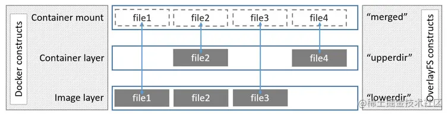
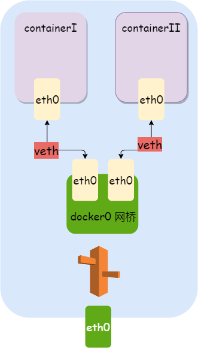

# DOCKER
## 基础原理
* CGROUP(control groups): 处理进程使用宿主资源的数量或者规模的问题
```
 Cgroups allow you to allocate resources — such as CPU time, system memory, network bandwidth, or combinations of these resources — among user-defined groups of tasks (processes) running on a system. 
```
* namespace: 为了让进程之间进行隔离
* UnionFS: 用于做分层、镜像复用、COW
```
unionFS可以把文件系统上多个目录(也叫分支)内容联合挂载到同一个目录下，而目录的物理位置是分开的。
```
* container(Linux container, LXC): 容器技术的进一步发展，微服务发展的一种技术演进；与传统的虚拟化相比更加的轻量化，更加迅速，虚拟化是一种OS级别的，容器则是应用级别的
* veth pair 网卡管道，工程化的形象，就像热水水管一样流动数据
```
Linux container 中用到一个叫做veth的东西，这是一种新的设备，专门为 container 所建。veth 从名字上来看是 Virtual ETHernet 的缩写，它的作用很简单，就是要把从一个 network namespace 发出的数据包转发到另一个 namespace。veth 设备是成对的，一个是 container 之中，另一个在 container 之外，即在真实机器上能看到的。
```

### UnionFS
* 
* 目录介绍
  * lowerdir是**只读**的image layer，其实就是rootfs，对比我们上述演示的目录A和B，我们知道image layer可以分很多层，所以对应的lowerdir是可以有多个目录。
  * upperdir则是在lowerdir之上的一层，这层是**读写层**，在启动一个容器时候会进行创建，所有的对容器数据更改都发生在这里层
  * merged目录是容器的挂载点，也就是给用户暴露的统一视角
* 所谓容器，就是在镜像外面又加了一层
* 怎么理解层的概念呢？ lowerdir和updir，本身就有了层的含义
* diff_id中存放的是chainId列表
  * 从上到下依次表示镜像层的最低层到最顶层
  * chainId的计算
    ```

    在 layer 的所有属性中，diffID 采用 SHA256 算法，基于镜像层文件包的内容计算得到。而 chainID 是基于内容存储的索引，它是根据当前层与所有祖先镜像层 diffID 计算出来的，具体算如下：
    1. 如果该镜像层是最底层(没有父镜像层)，该层的 diffID 便是 chainID。
    2. 该镜像层的 chainID 计算公式为 chainID(n)=SHA256(chain(n-1) diffID(n))，也就是根据父镜像层的 chainID 加上一个空格和当前层的 diffID，再计算 SHA256 校验码。
    举例子：echo -n 'sha256:8a70d251b65364698f195f5a0b424e0d67de81307b79afbe662abd797068a069 sha256:2dadbc36c170719f910a91a5417bf49deabd05bc39ccff3819a391462675ecd0' | sha256sum  ，注意中间的空格
    ```
* layerId
  * pull下来的是压缩的数据，layerID是压缩数据的sha256的值(Layer ID指Distribution根据**layer compressed data**计算的)，
  * inspect rootfs中的值是解压后，对解压的内容进行sha256的值他们是diffID，是在本地由Docker根据**layer uncompressed data**计算的

* 
### namespace
* 一个容器用一个namespace
* 实践
```
NS_NAME=ue-testing
ip netns add $NS_NAME
ip netns exec $NS_NAME ifconfig
ip netns exec $NS_NAME bash 可以进入另一个命名空间执行命令
ip netns list 查看命名空间
ip netns delete $NS_NAME
ethtool -k br-01612ab26dea | grep netns        
netns-local: on [fixed] (表示不能转移)
```
#### veth 设备对
* 增加设备对 ip link add veth0 type veth peer name veth1
* 将veth1迁移到另外的命名空间
```
ip netns add ns-ue-veth-testing 
ip link set veth1 netns ns-ue-veth-testing
ip netns exec ns-ue-veth-testing ip link show，可以看到veth1已经移动到了ns-ue-veth-testing
    ```
    1: lo: <LOOPBACK> mtu 65536 qdisc noop state DOWN mode DEFAULT group default qlen 1000
        link/loopback 00:00:00:00:00:00 brd 00:00:00:00:00:00
    71774: veth1@if71775: <BROADCAST,MULTICAST> mtu 1500 qdisc noop state DOWN mode DEFAULT group default qlen 1000
        link/ether e6:05:1f:08:10:0c brd ff:ff:ff:ff:ff:ff link-netnsid 0
    ```
```
* 现在在veth对就连接了宿主机和ns-ue-veth-testing两个命名空间
* 绑定ip地址并且启动
```
ip netns exec ns-ue-veth-testing  ip addr add 10.10.1.1/24 dev veth1
ip addr add 10.10.1.2/24 dev veth0 
ip netns exec ue-veth-testing ip link set dev eth1 up 
ip link set dev veth0 up
ping 10.10.1.1                        
    PING 10.10.1.1 (10.10.1.1) 56(84) bytes of data.
    64 bytes from 10.10.1.1: icmp_seq=1 ttl=64 time=0.038 ms
    64 bytes from 10.10.1.1: icmp_seq=2 ttl=64 time=0.034 ms
```
* 查看类型
```
> ethtool -i veth0                               
driver: veth
version: 1.0
firmware-version: 
expansion-rom-version: 
bus-info: 
supports-statistics: yes
supports-test: no
supports-eeprom-access: no
supports-register-dump: no
supports-priv-flags: no
```
* 查看设备索引
```
ethtool -S  veth0
NIC statistics:
     peer_ifindex: 71774 (在不同的命名空间下，该值一致，也可以通过ip link查看)
```
* 删除命名空间的时候，会自动删除绑定的veth设备
* 结构图



### 网络心得
* 通过bridge、 route、 iptables、veth等将容器、主机连接起来，形成一个网络

## 测试&开发环境中安装
* curl -fsSL get.docker.com -o get-docker.sh
* sudo sh get-docker.sh --mirror Aliyun

## 启动
* sudo systemctl enable docker
* sudo systemctl start docker
* 关于创建用户组&用户
```
默认情况下， docker 命令会使用 Unix socket 与 Docker 引擎通讯。而只有 root 用户和docker 组的用户才可以访问 Docker 引擎的 Unix socket。出于安全考虑，一般 Linux 系统上不会直接使用 root 用户。因此，更好地做法是将需要使用 docker 的用户加入 docker用户组。
```
* sudo groupadd docker
* sudo usermod -aG docker $USER(**将当前用户加入到用户组**)
* 测试是否安装正常, docker run hello-world
* 简单nginx服务器
```
docker run -d -p 80:80 --name webserver nginx
http://localhost
docker stop webserver
docker rm webserver
```

## 镜像管理
* centos 镜像加速, /etc/docker/daemon.json(没有则创建)
```
{
    "registry-mirrors": [
        "https://registry.docker-cn.com"
    ]
}
重启服务
sudo systemctl daemon-reload
sudo systemctl restart docker
```
* git hub vs docker hub， 通过URI来定位具体资源的位置
* 获取镜像的命令格式 docker pull [选项] [Docker Registry 地址[:端口号]/]仓库名[:标签] , 默认地址是docker hub， 默认仓库为library
* docker pull ubuntu:16.04;   docker run -it --rm ubuntu:16.04 bash
* docker inspect imageId 查看镜像的信息

### list 
* docker image ls(只显示顶层镜像), 镜像 ID 则是镜像的唯一标识，一个镜像可以对应多个标签
```
REPOSITORY    TAG       IMAGE ID       CREATED        SIZE
nginx         latest    d1a364dc548d   3 weeks ago    133MB
ubuntu        16.04     9ff95a467e45   4 weeks ago    135MB
hello-world   latest    d1165f221234   3 months ago   13.3kB
```
* options
```
 docker image ls -f dangling=true，显示虚悬镜像； docker image prune删除虚悬镜像
 docker image ls -a 显示所有镜像，包括中间层镜像
 docker image ls ubuntu, docker image ls ubuntu:16.04
 docker image ls -f since=mongo:3.2, docker image ls -f before=mongo:3.2
 docker image ls --format "table {{.ID}}\t{{.Repository}}\t{{.Tag}}"
 docker image ls --format "{{.ID}}: {{.Repository}}"
```

### rm
* docker image rm [选项] <镜像1> [<镜像2> ...], 其中， <镜像> 可以是 镜像短 ID 、 镜像长 ID 、 镜像名 或者 镜像摘要
* docker image rm 501(使用短id)
* docker image rm centos(使用镜像名)
* 不会触发真正删除的情况： (1) 有使用该镜像的容器在运行(2)有其他镜像依赖(3)有其他标签指向该镜像
* 删除行为分为两种：Untagged, Deleted；在执行删除镜像命令的时候，实际上是删除某个标签的镜像，如果没有标签执行该镜像，才会触发delete行为
* 配合ls
```
docker image rm $(docker image ls -q redis)
docker image rm $(docker image ls -q -f before=mongo:3.2)
```
* docker image rm name:version; 删除tag
* 删除镜像和删除tag是不同的

### commit 
* 从容器中创建一个镜像
* docker run --name webserver -d -p 80:80 nginx
* docker exec -it webserver bash
    * echo '\<h1>Hello, Docker!</h1>' > /usr/share/nginx/html/index.html
    * exit
* docker commit --author "Bin Wang<bin.wang@capstones.cn>" --message "change nginx default page" webserver nginx:v-capstone
* docker image ls 
```
REPOSITORY    TAG          IMAGE ID       CREATED              SIZE
nginx         v-capstone   a89b5d375ace   About a minute ago   133MB
nginx         latest       d1a364dc548d   3 weeks ago          133MB
ubuntu        16.04        9ff95a467e45   4 weeks ago          135MB
hello-world   latest       d1165f221234   3 months ago         13.3kB
```
* docker history nginx:v-capstone 

### run 
* 所有的参数都在镜像id的前面
```
docker run -it -v /data/cuser00/var/log/redis:/logs -v /data/cuser00/var/redis:/data -v `pwd`/redis/redis.conf:/usr/local/etc/redis/redis.conf   redis:6.2.3  /bin/bash

挂载文件，提供外部动态执行能力
docker run -it --rm  -v /data/cuser00/sand/docker/jekins/static/run.sh:/static/run.sh  php-static:1.0.0  sh /static/run.sh hotfix_wb_docker_apply 
```
* 镜像名字在所有的参数的后面(除了command)

### network
* docker network ls >>
```
  NETWORK ID     NAME                     DRIVER    SCOPE
  a5b7e87542bc   baseballshadow_default   bridge    local
  13322fa7605c   bridge                   bridge    local
  c810ecaa73e4   host                     host      local
  23d7dc2c31b0   none                     null      local
```
* ip a >> 
```
docker exec -it 51de13118e13 /bin/bash
bash-5.0# ip a 
1: lo: <LOOPBACK,UP,LOWER_UP> mtu 65536 qdisc noqueue state UNKNOWN group default qlen 1000
    link/loopback 00:00:00:00:00:00 brd 00:00:00:00:00:00
    inet 127.0.0.1/8 scope host lo
       valid_lft forever preferred_lft forever
454: eth0@if455: <BROADCAST,MULTICAST,UP,LOWER_UP> mtu 1500 qdisc noqueue state UP group default 
    link/ether 02:42:ac:12:00:03 brd ff:ff:ff:ff:ff:ff link-netnsid 0
    inet 172.18.0.3/16 brd 172.18.255.255 scope global eth0
       valid_lft forever preferred_lft forever
```
* 从上述看，docker的每个容器都有两个ip，lo和实际虚拟ip
*  docker inspect 51de13118e13  >> 
```
"NetworkSettings": {
            "Bridge": "",
            "SandboxID": "fb73ce692deb81f2db567511a6a9b64ef31b69bc8cecda7872999bca3ad6ef1b",
            "HairpinMode": false,
            "LinkLocalIPv6Address": "",
            "LinkLocalIPv6PrefixLen": 0,
            "Ports": {},
            "SandboxKey": "/var/run/docker/netns/fb73ce692deb",
            "SecondaryIPAddresses": null,
            "SecondaryIPv6Addresses": null,
            "EndpointID": "",
            "Gateway": "",
            "GlobalIPv6Address": "",
            "GlobalIPv6PrefixLen": 0,
            "IPAddress": "",
            "IPPrefixLen": 0,
            "IPv6Gateway": "",
            "MacAddress": "",
            "Networks": {
                "baseballshadow_default": {
                    "IPAMConfig": null,
                    "Links": null,
                    "Aliases": [
                        "51de13118e13",
                        "observer"
                    ],
                    "NetworkID": "a5b7e87542bcf259df303f117d128b17f4c505ef660ecc4f32cbc272b363e6fa",
                    "EndpointID": "b9a0e23c875e0d53b0316c2f2bb7f7fb959e4fd1ee3841f17cc51d1706e885d2",
                    "Gateway": "172.18.0.1",
                    "IPAddress": "172.18.0.3",
                    "IPPrefixLen": 16,
                    "IPv6Gateway": "",
                    "GlobalIPv6Address": "",
                    "GlobalIPv6PrefixLen": 0,
                    "MacAddress": "02:42:ac:12:00:03",
                    "DriverOpts": null
                }
            }
        }
```
* 每个compose中的容器，都被分配到一个默认的网络上,`也可以自己生成网络进行指定`，同时也可以`指定某个容器连接到某个容器的网络中`

### inspect 
* docker inpsect containerId

## Dockerfile
* Dockerfile 中每一个指令都会建立一层
### docker build 
* Docker 在运行时分为 Docker 引擎（也就是服务端守护进程）和客户端工具。Docker 的引擎提供了一组 REST API，被称为 DockerRemote API，而如 docker命令这样的客户端工具，则是通过这组 API 与 Docker 引擎交互，从而完成各种功能。因此，虽然表面上我们好像是在本机执行各种 docker功能，但实际上，一切都是使用的远程调用形式在服务端（Docker引擎）完成。也为这种 C/S 设计，让我们操作远程服务器的 Docker 引擎变得轻而易举。
* 如果目录下有些东西确实不希望构建时传给 Docker 引擎，那么可以用 .gitignore 一样的语法写一个 .dockerignore，该文件是用于剔除不需要作为上下文传递给 Docker 引擎的。
* 镜像构建上下文，在build的时候，尽量是一个空目录，因为build的时候需要将指定的上下文目录发送到docker引擎
* 例子, Dockerfile
```
FROM nginx
RUN echo '<h1>Hello, Docker!</h1>' > /usr/share/nginx/html/index.html 
```
docker build -t nginx:v-cap-2(指定镜像名:标签) .(指定上下文目录)
* 从标准输入中构建
cat Dockerfile | docker build -
docker build - < Dockerfile
docker image ls ，因为没有指定镜像名:标签，生成<none>的镜像
```
REPOSITORY    TAG          IMAGE ID       CREATED          SIZE
<none>        <none>       828aa87f4921   5 seconds ago    133MB
nginx         latest       d1a364dc548d   3 weeks ago      133MB
ubuntu        16.04        9ff95a467e45   4 weeks ago      135MB
hello-world   latest       d1165f221234   3 months ago     13.3kB
```
### directive
* FROM 
* RUN 
* COPY指令将从构建**上下文目录**中 <源路径的文件/目录复制到**新的一层的镜像内的<目标路径>** 位置
* ADD,高级的COPY，仅在需要解压缩的时候使用ADD，其他都用COPY
* CMD
    * shell格式: CMD <命令>，比如 ```CMD echo $HOME```
    * exec格式: CMD ["可执行文件", "参数1", "参数2"...],比如```CMD [ "sh", "-c", "echo $HOME" ]```
* ENTRYPOINT 赋予了一种动态将外部参数传入到内部能力，相当于dockerfile的main函数，而main函数是可以接收参数的
* ENV 设置环境变量，即dockerfile运行期可以使用的变量
* ARG 参数
* VOLUME 定义匿名卷， 指定外部挂载的目录，保证容器存储层的无状态化 docker run -d -v mydata:/data xxxx,可以通过参数覆盖原来的VOLUME设置
* EXPOSE 声明网络端口
* WORKDIR 指定工作目录
* USER 指定当前用户,如果以 root 执行的脚本，在执行期间希望改变身份，比如希望以某个已经建立好的用户来运行某个服务进程，不要使用 su 或者 sudo ，这些都需要比较麻烦的配置，而且在 TTY 缺失的环境下经常出错。建议使用 gosu。
```
# 建立 redis 用户，并使用 gosu 换另一个用户执行命令
RUN groupadd -r redis && useradd -r -g redis redis
# 下载 gosu
```
RUN wget -O /usr/local/bin/gosu "https://github.com/tianon/gosu/releases/download/1.7/
gosu-amd64" \
&& chmod +x /usr/local/bin/gosu \
&& gosu nobody true
```
# 设置 CMD，并以另外的用户执行
CMD [ "exec", "gosu", "redis", "redis-server" ]
```
* HEALTHCHECK健康检查
* ONBUILD, 一个特殊的指令，它后面跟的是其它指令，比如 RUN , COPY 等，而这些指令，在当前镜像构建时并不会被执行。只有当以当前镜像为基础镜像，去构建下一级镜像的时候才会被执行。
* 多阶段构建

## Docker容器
* Image镜像和容器Container的关系，就像面向对象的类和实例的关系。镜像是静态的，容器则是镜像运行时的实体
* Docker 不是虚拟机，容器中的应用都应该以前台执行，而不是像虚拟机、物理机里面那样，用 upstart/systemd 去启动后台服务，容器内没有后台服务的概念。
### list 
* docker container ls
* docker container ls -a
### run 新建并启动
* docker run ubuntu:14.04 /bin/echo 'Hello world'
* docker run -t -i ubuntu:14.04 /bin/bash, -t 分配伪终端, -i 则让容器的标准输入保持打开，过程如下:
```
检查本地是否存在指定的镜像，不存在就从公有仓库下载
利用镜像创建并启动一个容器
分配一个文件系统，并在只读的镜像层外面挂载一层可读写层
从宿主主机配置的网桥接口中桥接一个虚拟接口到容器中去
从地址池配置一个 ip 地址给容器
执行用户指定的应用程序
执行完毕后容器被终止
```
### start 
* 将一个已经终止的容器启动运行
### stop
### restart
### 后台运行
* -d 加上-d参数
* 需要让 Docker 在后台运行而不是直接把执行命令的结果输出在当前宿主机下
* docker run -d ubuntu:17.10 /bin/sh -c "while true; do echo hello world; sleep 1; done"，可以使用docker container logs查看
### sttach 
### exec 
* 推荐使用
### import export 
* 导入 导出容器快照
### rm 
* 删除处于终止状态的容器
* docker container rm f9af5ee2bbc9 -f 强制删除
### prune
* docker container prune ，清理已经终止的所有容器

## Repository
* Registry 是服务器，每个服务器下面可以有多个仓库；而每个仓库下面可以有多个镜像
* docker search centos

## Docker Registry
* 存储、分发镜像的服务

## 数据管理
### 使用数据卷
* docker volume create my-vol
* docker volume ls
```
DRIVER    VOLUME NAME
local     my-vol
```
* docker volume inspect my-vol
```
[
    {
        "CreatedAt": "2021-06-17T17:13:26+08:00",
        "Driver": "local",
        "Labels": {},
        "Mountpoint": "/var/lib/docker/volumes/my-vol/_data",
        "Name": "my-vol",
        "Options": {},
        "Scope": "local"
    }
]
```
* 启动一个挂载数据卷的容器
```
docker run -d -P \
    --name web \
    # -v my-vol:/wepapp \
    --mount source=my-vol,target=/webapp \
    training/webapp \
    python app.py
```
* docker inspect web
```
"Mounts": [
    {
        "Type": "volume",
        "Name": "my-vol",
        "Source": "/var/lib/docker/volumes/my-vol/_data",
        "Destination": "/app",
        "Driver": "local",
        "Mode": "",
        "RW": true,
        "Propagation": ""
    }
],
```
* docker volume rm my-vol
* docker volume prune
* docker system prune 一键清理所有不用的卷、镜像等
### 挂载主机目录
* 镜像使用的是分层存储，容器也是如此。每一个容器运行时，是以镜像为基础层，在其上创建一个当前容器的存储层，我们可以称这个为容器运行时读写而准备的存储层为容器存储层。**容器存储层的生存周期和容器一样，容器消亡时，容器存储层也随之消亡**
* 挂载目录使用的都是root权限，但是执行使用的其他用户
* 命令
```
docker run -d -P \
    --name web \
    # -v /src/webapp:/opt/webapp \
    --mount type=bind,source=/src/webapp,target=/opt/webapp \
    training/webapp \
    python app.py
```
* 格式2
```
docker run -d -P \
    --name web \
    # -v /src/webapp:/opt/webapp:ro \
    --mount type=bind,source=/src/webapp,target=/opt/webapp,readonly \
    training/webapp \
    python app.py

挂载多个目录使用多个-v参数
docker run -it -v /data/cuser00/var/log/redis:/logs -v /data/cuser00/var/redis:/data -v `pwd`/redis/redis.conf:/usr/local/etc/redis/redis.conf   redis:6.2.3  /bin/bash
```
* docker inspect web
* 挂载单个文件
```
docker run --rm -it \
    --mount type=bind,source=$HOME/.bash_history,target=/root/.bash_history \
    ubuntu:17.10 \
    bash
root@2affd44b4667:/# history
1 ls
2 diskutil list
```
* 挂载目录
```
docker run -it -v /data/cuser00/var/nginx/:/data nginx:1.18 /bin/bash
注意: 将所有的配置项写在前部，后面是镜像和命令
```
## 使用网络
* 网络模式
```
host模式	-–net=host	容器和宿主机共享Network namespace
none模式	–net=none	容器有独立的Network namespace，但并没有对其进行任何网络设置，如分配veth pair 和网桥连接，配置IP等
bridge模式	-–net=bridge	默认为该模式
container模式	–net=container:NAME_or_ID	容器和另外一个容器共享Network namespace。 kubernetes中的pod就是多个容器共享一个Network namespace
```
* 使用-P， Docker 会随机映射一个 49000~49900 的端口到内部容器开放的网络端口
* ip:hostPort:containerPort | ip::containerPort | hostPort:containerPort, 例子
```
    docker run -d -p 5000:5000 training/webapp python app.py
    docker run -d -p 127.0.0.1::5000 training/webapp python app.py
    docker run -d -p 127.0.0.1:5000:5000 training/webapp python app.py
    docker run -d -p 127.0.0.1:5000:5000/udp training/webapp python app.py
    docker run -d \
        -p 5000:5000 \
        -p 3000:80 \
        training/webapp \
        python app.py
```
* docker port nostalgic_morse 5000
* docker在安装后会默认生成三种网络，none、bridge及host. 
* 查看网络信息 docker network ls 
```
NETWORK ID     NAME      DRIVER    SCOPE
1d2e9d7c9bff   bridge    bridge    local
349bd72081d1   host      host      local
2f60f451a8cc   none      null      local
```

## compose
* Docker Compose 在不同配置文件的容器默认会用不同的 network，所以目标是让他们容器都绑定到同一个 network 上。
### 安装
```
$ sudo curl -L https://github.com/docker/compose/releases/download/1.17.1/docker-compose-`uname -s`-`uname -m` > /usr/local/bin/docker-compose
$ sudo chmod +x /usr/local/bin/docker-compose
```
```
sudo pip install -U docker-compose
```
### build
* build命令，只构建
* docker-compose build --no-cache

### stop && rm 
* docker-compose stop (停止服务)
* docker-compose rm (删除停止的服务)
* docker-compose rm -f

### run
* docker-compose run --rm redis 
```
--rm 运行结束自动删除容器
```
### up 
* docker-compose up -d(生产建议使用，调试环境中不使用) 
* docker-compose up server.tw(手动某个service)
* docker-compose logs server.tw
* docker-comopse build --no-cache

## 监控&系统
* docker stats
* docker ps = docker container ls 
* docker system prune -a
* docker system df
* docker info

## 应用
* docker pull php:7.2-fpm
* docker build . -f php-docker-file -t php:v-h5-game

## 目录权限问题
* 目录都不必提前创建
* 默认都是root权限,因为docker使用了root启动

## 用户问题
* 使用未预设的用户使用docker
```
使用docker exec -it 69f8942e7621 /bin/bash 进入
I have no name!@69f8942e7621:/data$ id -g 
1003
I have no name!@69f8942e7621:/data$ id -u 
1004
```
* sudo chown -R 1004:1003 redis， docker-compose的user与该用户一直方能有权限

## 用法
```
docker run -it -u 1004:1003 -v /etc/localtime:/etc/localtime:ro -v /data/cuser00/var/log/redis:/logs -v /data/cuser00/var/redis:/data -v `pwd`/redis/redis.conf:/usr/local/etc/redis/redis.conf   redis:6.2.3  redis-server /usr/local/etc/redis/redis.conf  
重启所有compose管理的所有容器（只重启已经启动的部分）
docker-compose  restart
重启redis
docker-compose  restart  redis
docker-compose  stop redis  
docker-compose  start redis
docker-compose up redis  前台启动，看到调试信息
docker-compose up -d  redis 后台启动，与start类似(但是start是针对容器的)
docker-compose run/up -d redis
restart的时候不会重新生成新的容器，即使用新的docker-compose的配置；如果需要更新docker-compose中的配置信息，需要删除容器重新生成

```
* 使用非root用户运行 CURRENT_UID=$(id -u):$(id -g) docker-compose up -d redis 
* docker ps 
```
docker ps -q
    f0be9144d264
    44dc5b9702c4
```
* 停止所有的容器 docker stop \$(docker ps -aq)
* 删除所有的容器 docker rm \$(docker ps -aq) 
* 删除所有的镜像 docker rmi \$(docker images -q)
* 一条命令实现停用并删除容器 docker stop \$(docker ps -q) & docker rm \$(docker ps -aq)
* docker login --username=wang70bin@163.com registry.cn-hangzhou.aliyuncs.com
* docker login pull push 

## 自由发挥command
* 两种格式形式
```
command: php /code/workerman/start.php start
或者分行
command: 
    - php 
    - /code/workerman/start.php 
    - start
```
* 例子 docker run -it -p 9999:9999 -p 9997:9997  -v /data/cuser00/www/h5/Lottery/:/code -v /data/cuser00/var/log/workerman:/logs  php-wm:1.0 php /code/workerman/start.php start
* CURRENT_UID=0:0 docker-compose run --rm -p 9999:9999 -p 9997:9997 workerman (不指定port，端口不会对外起效)
* docker run --name static_builder(指定容器名字) -d  -v /data/cuser00/sand/docker/jekins/static/run.sh:/static/run.sh  php-static:1.0.0 /bin/sh -c "while true; do echo hello world; sleep 1; done" 让某个配置型的容器一直运行
* docker exec -it static_builder /bin/bash /static/run.sh hotfix_wb_docker_apply_v1 容器执行某个命令
* 可以从某一个中间层进入，比如 docker run -it **91060a9c19f0** /bin/bash
```
Step 1/7 : FROM php:7.2-fpm
 ---> 28f52b60203d
Step 2/7 : RUN sed -i s@/deb.debian.org/@/mirrors.aliyun.com/@g /etc/apt/sources.list
 ---> Using cache
 ---> 10813dc262a8
Step 3/7 : RUN apt-get update
 ---> Using cache
 ---> ff4bc648f240
Step 4/7 : RUN apt-get install -y software-properties-common
 ---> Using cache
 ---> de9eb509f656
Step 5/7 : RUN add-apt-repository ppa:deadsnakes/ppa
 ---> Using cache
 ---> 91060a9c19f0
```
## 头大
* Primary script unknown" while reading response header from upstream，原来是旧的php-fpm没有关闭或者又被拉起，导致转到那个端口去了;而docker是不会检测端口的合法性的
* 

## 镜像命令补充
### ps
apt-get install procps -y  
### netstat 
apt-get install net-tools  -y
### ping
apt-get install iputils-ping

## 实践建议
* 容器不应该向其存储层内写入任何数据，容器存储层要保持无状态化。所有的文件写入操作，都应该使用数据卷(volumen)、或者绑定宿主目录，在这些位置的读写会跳过容器存储层，直接对宿主(或者网络存储)发生读写，其性能和稳定性更高。（因为容器存储层会随着容器的消亡而消亡）
* 所以对于 CentOS/RHEL 的用户来说，在没有办法使用 UnionFS的情况下，一定要配置direct-lvm 给 devicemapper，无论是为了性能、稳定性还是空间利用率。
* 使用 docker commit 命令虽然可以比较直观的帮助理解镜像分层存储的概念，但是**实际环境中并不会这样使用**。
* 很多人初学 Docker 制作出了很臃肿的镜像的原因之一，就是忘记了每一层构建的最后一定要清理掉无关文件。
* 容器目录不可以为相对路径
* 宿主机目录如果不存在，则会自动生成
* *******************是不是所有的挂载目录都需要提前设置权限呢?
* port只是做了一层端口转发，需要两面match才能够起效
* docker的两种最顶层状态：需要指定命令，不需要指定命令 直接可以运行
* docker停止态进去，run  -it imageId /bin/bash,运行态进去 exec -it containerId /bin/bash
* **docker里面的执行进程的用户是配置文件决定的**
* 权限： 启动用户(root、dockerGroup), 操作用户(配置文件指定)，生成文件用户(一定使用root权限生成，这时候如果指定某个用户操作目录会产生问题)
* polkitd input问题： docker和host的权限是靠uid:gid来传递的，**当docker里面使用mysql或者数据库的用户名创建文件的时候，host显示的时候可能对应到其他的用户名和组**
* 数据库创建的时候必须提前创建目录并且给予777的权限
* ps aux 可以看到docker中启动的进程
* dockerd --debug 可以看到一些调试信息，比如启动失败等
* docker 是一种装置，将复杂的功能模式化，类似于一个功能脚本
* Docker构建过程是**完全非交互的**
* 除了dockerfile，还可以从/bash/bash中进入到容器中，然后一阵操作后，再将修改后的容器提交到镜像中
* -it 相当于从docker中开启了一个terminal
* docker的官方镜像大多基于debian，因为它是轻量的发行版。目前 Docker 官方已开始推荐使用 Alpine 替代之前的 Ubuntu 做为基础镜像环境
* 部署为可查看环境: apt-get update && apt-get install procps && apt-get install net-tools && apt-get install vim
* 使用阿里云的软件仓库 sed -i s@/deb.debian.org/@/mirrors.aliyun.com/@g /etc/apt/sources.list 
* apt-get install telnet
* vim乱码，编辑~/.vimrc,添加以下内容
```
set nocompatible
filetype off

syntax on
set tabstop=4

set fileencodings=utf-8,ucs-bom,gb18030,gbk,gb2312,cp936
set termencoding=utf-8
set encoding=utf-8
~                  
```