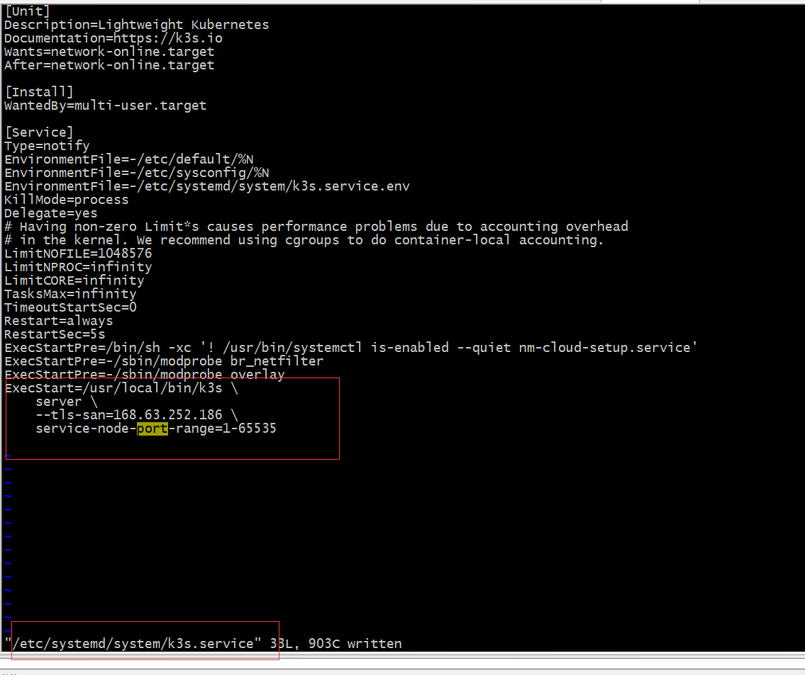

## K3S
### instll 一键安装
* curl -sfL https://get.k3s.io | sh - 速度慢放弃
* 下载镜像
```
wget https://github.com/k3s-io/k3s/releases/download/v1.21.3%2Bk3s1/k3s-airgap-images-amd64.tar.gz 
mkdir -p /var/lib/rancher/k3s/agent/images/
cp ./k3s-airgap-images-amd64.tar.gz /var/lib/rancher/k3s/agent/images/
```
* 参数化
```
curl -sfL https://get.k3s.io | INSTALL_K3S_EXEC="--node-external-ip \
        168.63.252.186 \
        --tls-san \
        168.63.252.186 \
        --default-local-storage-path \
        /data/rancher/k3s/storage \
        --kube-apiserver-arg \
        service-node-port-range=1-65535 \
" sh -
```

### 卸载
* k3s-uninstall.sh 

### 安装注意
* 
* 修改上述配置，执行: systemctl daemon-reload; systemctl restart k3s;

### 关闭
* /usr/local/bin/k3s-killall.sh

### 配置地址
* /etc/systemd/system/k3s.service

### kubeconfig
* /etc/rancher/k3s/k3s.yaml 

### 使用
* alias kubectl='k3s kubectl'
* 查看使用的容器类型(Container Runtime Interface)
```
> crictl version
crictl version
Version:  0.1.0
RuntimeName:  containerd
RuntimeVersion:  v1.4.8-k3s1
RuntimeApiVersion:  v1alpha2
```
## coreDNS
* kubectl get pod,svc -n kube-system 
* kubectl exec -it dig -- nslookup mongodb/redis(service name)
```
Server:         10.43.0.10
Address:        10.43.0.10#53

Name:   mongodb.default.svc.cluster.local
Address: 10.43.68.176 (cluster IP 内部使用的无协议栈ip)
```
* kubectl exec -it dig -- nslookup www.baidu.com
* pod域名生成规则：<svc-name>.<namespace>.svc.cluster.local

### 查看
* journalctl -xn | less
### 错误
* Failed to run kubelet" error="failed to run Kubelet: misconfiguration: kubelet cgroup driver: \"cgroupfs\" is different from docker cgroup driver: \"systemd\""
```
原因是docker和k3s使用的Cgroup的方式不同,docker默认是用systemd，k3s使用cgroupfs
优先修改docker的配置 /usr/lib/systemd/system/docker.service
systemctl daemon-reload 
systemctl restart docker
```