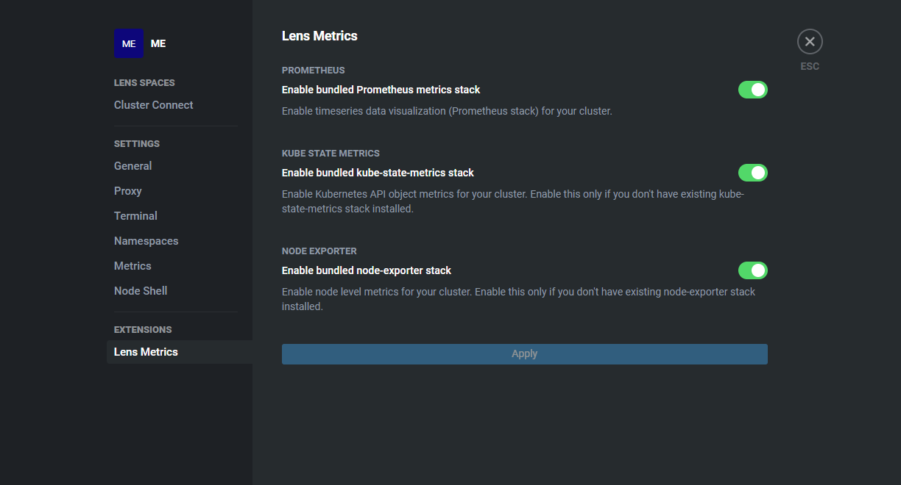
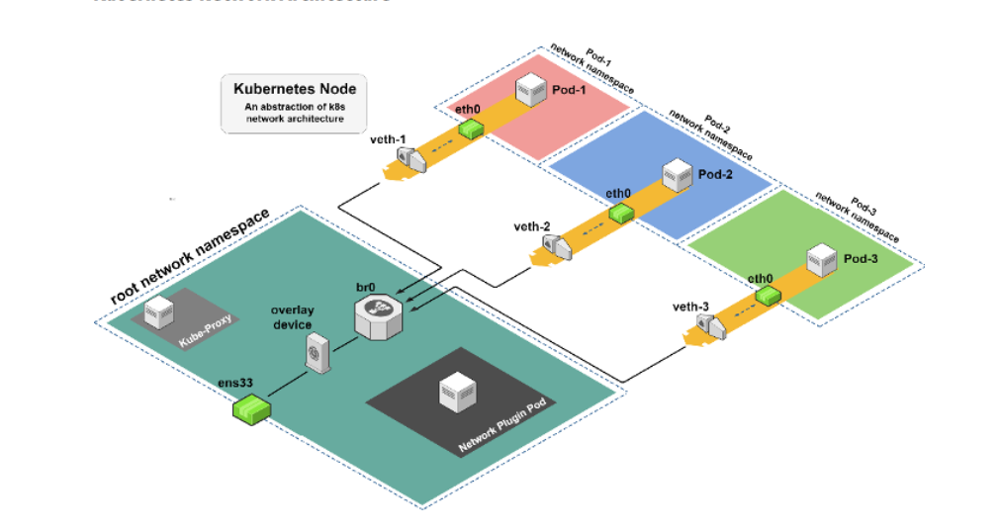
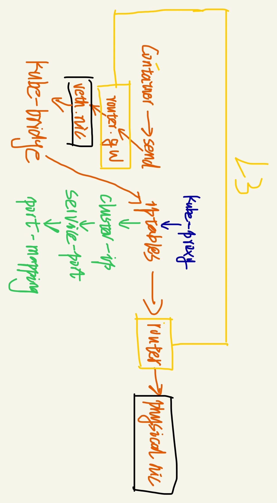
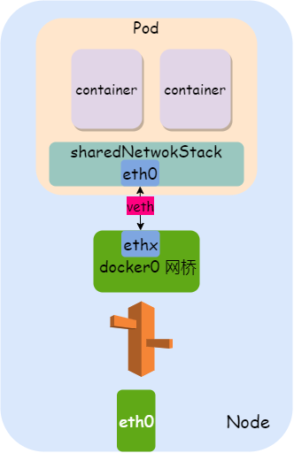
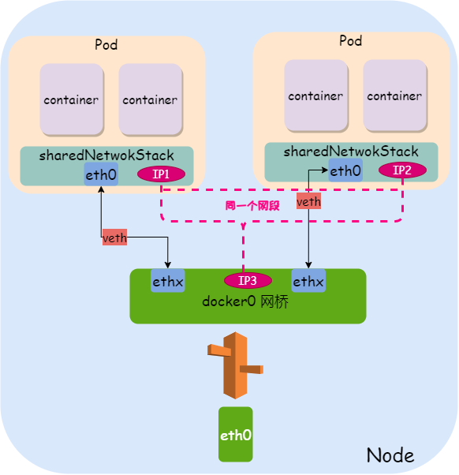
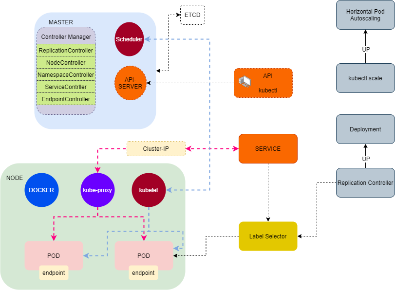

## Kubernets 

### cni 
##### Flannel
* 基于VXLAN
* Flannel是CoreOS团队针对Kubernetes设计的一个网络规划服务，简单来说，它的功能是让集群中的不同节点主机创建的Docker容器都具有全集群唯一的虚拟IP地址。
* ps aux >> `/opt/bin/flanneld --ip-masq --kube-subnet-mgr`
* /var/lib/k0s/bin/kube-controller-manager --allocate-node-cidrs=true --cluster-cidr=10.244.0.0/16 --kubeconfig=/var/lib/k0s/pki/admin.conf 
* kubectl apply -f https://raw.githubusercontent.com/coreos/flannel/master/Documentation/kube-flannel.yml
##### Calico 
* 基于BGP协议
* /etc/cni/net.d/10-calico.conflist
* /etc/cni/net.d/calico-kubeconfig
* 每个worker节点运行一个pod
* 能在lens中看到对应的pod
* k0s配置
```
network:
    calico:
      mode: vxlan
      vxlanPort: 4789
      vxlanVNI: 4096
      mtu: 1450
      wireguard: false
      flexVolumeDriverPath: /usr/libexec/k0s/kubelet-plugins/volume/exec/nodeagent~uds
      withWindowsNodes: false
      overlay: Always
    dualStack: {}
    kubeProxy:
      mode: iptables
    provider: calico
    podCIDR: 10.244.0.0/16
    serviceCIDR: 10.96.0.0/12
```

##### kube-router
* kube-router uses the Linux kernel's LVS/IPVS features to implement its K8s Services Proxy.
* ps aux | grep router >> `/usr/local/bin/kube-router --run-router=true --run-firewall=true --run-service-proxy=false --bgp-graceful-restart=true --metrics-port=8080`
* /etc/cni/net.d/10-kuberouter.conflist
* 每个worker节点运行一个
* k0s配置
```
network:
    calico: null
    dualStack: {}
    kubeProxy:
      mode: iptables
    kuberouter:
      autoMTU: true
      mtu: 0
      peerRouterASNs: ""
      peerRouterIPs: ""
    podCIDR: 10.244.0.0/16
    provider: kuberouter
    serviceCIDR: 10.96.0.0/12
```
### cluster info
* kubectl cluster-info

### dashboard
* kubectl apply -f https://raw.githubusercontent.com/kubernetes/dashboard/v2.5.0/aio/deploy/recommended.yaml
* 将服务ClusterIP改为NodePort
* kubectl -n kubernetes-dashboard describe secret $(kubectl -n kubernetes-dashboard get secret | grep admin-user | awk '{print $1}')，使用该token登陆
* 增加管理员用户
```
apiVersion: v1
kind: ServiceAccount
metadata:
  name: admin-user
  namespace: kubernetes-dashboard
---
apiVersion: rbac.authorization.k8s.io/v1
kind: ClusterRoleBinding
metadata:
  name: admin-user
roleRef:
  apiGroup: rbac.authorization.k8s.io
  kind: ClusterRole
  name: cluster-admin
subjects:
- kind: ServiceAccount
  name: admin-user
  namespace: kubernetes-dashboard

```
* 增加只读用户
```
apiVersion: v1
kind: ServiceAccount
metadata:
  name: read-only-user
  namespace: kubernetes-dashboard
---
apiVersion: rbac.authorization.k8s.io/v1
kind: ClusterRole
metadata:
  annotations:
    rbac.authorization.kubernetes.io/autoupdate: "true"
  labels:
  name: read-only-clusterrole
  namespace: default
rules:
- apiGroups:
  - ""
  resources: ["*"]
  verbs:
  - get
  - list
  - watch
- apiGroups:
  - extensions
  resources: ["*"]
  verbs:
  - get
  - list
  - watch
- apiGroups:
  - apps
  resources: ["*"]
  verbs:
  - get
  - list
  - watch
---
apiVersion: rbac.authorization.k8s.io/v1
kind: ClusterRoleBinding
metadata:
  name: read-only-binding
roleRef:
  kind: ClusterRole
  name: read-only-clusterrole
  apiGroup: rbac.authorization.k8s.io
subjects:
- kind: ServiceAccount
  name: read-only-user
  namespace: kubernetes-dashboard

```

### coredns
* 每个worker节点运行一个
* 查看dns配置
```
 kubectl get svc -n kube-system
NAME             TYPE        CLUSTER-IP      EXTERNAL-IP   PORT(S)                  AGE
kube-dns         ClusterIP   10.96.0.10      <none>        53/UDP,53/TCP,9153/TCP   29d
metrics-server   ClusterIP   10.107.228.19   <none>        443/TCP                  29d
traefik-web-ui   ClusterIP   10.99.151.206   <none>        80/TCP                   24d
```
* 查看pod内的resolv
```
cat /etc/resolv.conf
search storage.svc.cluster.local svc.cluster.local cluster.local(涉及到的查询的基础域名)
nameserver 10.96.0.10 (dns服务器，指向kube-dns)
options ndots:5
```

### kube-proxy
* 每个worker节点运行一个
* ps aux >> `/usr/local/bin/kube-proxy --config=/var/lib/kube-proxy/config.conf --hostname-override=fcos01`

### hello
* kubectl create deployment node-hello --image=gcr.io/google-samples/node-hello:1.0 --port=8080

### konnectivity proxy
* 

### kubelet
* ps aux >> `/var/lib/k0s/bin/kubelet --root-dir=/var/lib/k0s/kubelet --config=/var/lib/k0s/kubelet-config.yaml --v=1 --containerd=/run/k0s/containerd.sock --runtime-cgroups=/system.slice/containerd.service --bootstrap-kubeconfig=/var/lib/k0s/kubelet-bootstrap.conf --kubeconfig=/var/lib/k0s/kubelet.conf --cert-dir=/var/lib/k0s/kubelet/pki --container-runtime=remote --container-runtime-endpoint=unix:///run/k0s/containerd.sock`

### envoy
* 

### kine
* Kine is not etcd
* 使用SqlLite

### flatcard 
* vmware镜像直接安装，自动登陆

### HASHICORP
* Terraform

### kube-proxy
* 每个 Node 运行一个 kube-proxy 进程。 kube-proxy 负责为 Service 实现了一种 VIP（虚拟 IP）的形式，而不是 ExternalName 的形式
* 模式: userspace(1.2之前模式模式)、iptables(1.2后默认模式)、ipvs(1.8之后支持，相对iptables效率更高)

### 网络策略
* (Network Policy)是Kubernetes 提供的一种规范，它描述里一组pod 是如何被允许相互通信的，以及和其他端点是如何通信的。
* requirement:
```
容器之间（包括同一台主机上的容器，和不同主机的容器）可以互相通信，容器和集群中所有的节点也能直接通信。
```

### L2 L3
* L2其实是指七层网络协议中的第二层数据链路层，它的传输是以mac地址为基础
* L3指网络层：是以ip地址为基础

### metalLB
* L2模式和BGP模式
* 在第 2 层模式下，服务 IP 的所有流量都将流向一个节点。从那里，将流量分散到服务的所有 Pod
* L2模式下使用ARP协议响应查询
* values.yaml
```
configInline:
  address-pools:
   - name: default
     protocol: layer2
     addresses:
     - 10.10.52.0/24
```
* install
```
kubectl create namespace metallb
helm install metallb metallb/metallb --kubeconfig=/var/lib/k0s/pki/admin.conf --namespace=metallb -f values.yaml
```

### containerd
* ps axu >> `/var/lib/k0s/bin/containerd --root=/var/lib/k0s/containerd --state=/run/k0s/containerd --address=/run/k0s/containerd.sock --log-level=info --config=/etc/k0s/containerd.toml`

### traefik
* L7 balance
* 边缘路由
* [中文文档](https://www.qikqiak.com/traefik-book/routing/providers/kubernetes-crd/)
* helm安装
* kubectl get svc >>
```
NAME         TYPE           CLUSTER-IP     EXTERNAL-IP   PORT(S)                      AGE
kubernetes   ClusterIP      10.96.0.1      <none>        443/TCP                      5d1h
traefik      LoadBalancer   10.108.93.91   10.10.52.0    80:32513/TCP,443:32448/TCP   3h23m
```
* 增加dashboard的IngressRoute
```
apiVersion: traefik.containo.us/v1alpha1
kind: IngressRoute
metadata:
  name: dashboard
spec:
  entryPoints:
    - web
  routes:
    - match: PathPrefix(`/dashboard`) || PathPrefix(`/api`)
      kind: Rule
      services:
        - name: api@internal
          kind: TraefikService
```
* 访问http://10.10.52.0/dashboard/#/获取dashboard的界面，不能少后面的"/"
* IngressRoute的namespace需要和要指向的service保持一致
* match: Host(`redis.storage.ddd.xyz`) 注意这里使用的符号

### metrics
* kubectl top node
* kubectl top pod
* lens的开启metrics 


### CRD
* Custom Resource Definition

#### envoy

### KubeVirt
* Redhat开源的以容器方式运行虚拟机的项目，以k8s add-on方式，利用k8s CRD为增加资源类型VirtualMachineInstance（VMI）， 使用容器的image registry去创建虚拟机并提供VM生命周期管理

### memberlist 
* memberlist 是一个 Go 库，它使用基于八卦(Gossip)的协议管理集群成员资格和成员故障检测。所有分布式系统都需要成员资格，而 memberlist 是管理集群成员身份和节点故障检测的可重用解决方案。

### gossip
* Gossip 协议又称 epidemic 协议（epidemic protocol），是基于流行病传播方式的节点或者进程之间信息交换的协议，在P2P网络和分布式系统中应用广泛，它的方法论也特别简单：
```
在一个处于有界网络的集群里，如果每个节点都随机与其他节点交换特定信息，经过足够长的时间后，集群各个节点对该份信息的认知终将收敛到一致。
```
* Redis Cluster, memberlist library

### ipvs
* IPVS是LVS集群系统的核心软件，它的主要作用是：安装在Director Server上，同时在Director Server上虚拟出一个IP地址，用户必须通过这个虚拟的IP地址访问服务。这个虚拟IP一般称为LVS的VIP，即Virtual IP。访问的请求首先经过VIP到达负载调度器，然后由负载调度器从Real Server列表中选取一个服务节点响应用户的请求。
* IP Virtual Server
* kubectl edit configmap kube-proxy -n kube-system 
```
   minSyncPeriod: 0s
      scheduler: ""
      syncPeriod: 30s
    kind: KubeProxyConfiguration
    metricsBindAddress: 127.0.0.1:10249
    mode: "ipvs"              # 修改此处
    nodePortAddresses: null
```
* 三种模式: NAT, DR, TUN

### lvs
* linux virtual server
* 基于ipvs

### netfilter && iptables
* 每个进入网络系统的包（接收或发送）在经过协议栈时都会触发这些 hook，程序 可以通过注册 hook 函数的方式在一些关键路径上处理网络流量。iptables 相关的内核模 块在这些 hook 点注册了处理函数，因此可以通过配置 iptables 规则来使得网络流量符合 防火墙规则。
* iptbles提供从外围介入到数据包处理的接口
* 
* 
### network
* docker支持4类网络模式， host、container、none、bridge
* 在kubernetes管理模式下，网络使用bridge模式


### namespace
* 一个Pod内部共享namespace

### ingress
* 

### grafana & loki
* helm repo add grafana https://grafana.github.io/helm-charts
* helm repo update
* kubectl create namespace loki
* helm upgrade --install loki --namespace=loki grafana/loki-distributed --kubeconfig=/var/lib/k0s/pki/admin.conf 
* helm install loki-grafana grafana/grafana --kubeconfig=/var/lib/k0s/pki/admin.conf
* 获取admin的默认密码: kubectl get secret --namespace default loki-grafana -o jsonpath="{.data.admin-password}" | base64 --decode ; echo
* export POD_NAME=$(kubectl get pods --namespace default -l "app.kubernetes.io/name=grafana,app.kubernetes.io/instance=loki-grafana" -o jsonpath="{.items[0].metadata.name}")
* kubectl --namespace default port-forward $POD_NAME --address 0.0.0.0 3000 (转发Pod的端口到本地端口)
* 到grafana的WEBUI添加DataSource，lock地址: http://loki-loki-distributed-gateway.loki.svc.cluster.local
* helm upgrade --install promtail grafana/promtail --set "loki.serviceName=loki" --kubeconfig=/var/lib/k0s/pki/admin.conf 

### api
* kubectl api-resources -o wide，查看开放哪些资源可以提供查询

### helm 
* helm ls --all-namespaces --kubeconfig=/var/lib/k0s/pki/admin.conf
* helm ls -A --kubeconfig=/var/lib/k0s/pki/admin.conf
* helm install metallb metallb/metallb --kubeconfig=/var/lib/k0s/pki/admin.conf --namespace=metallb -f values.yaml
* helm delete metallb --kubeconfig=/var/lib/k0s/pki/admin.conf  --namespace=metallb

### 理解
* 网桥 路由 veth iptables 共同构成了kubenetes的网络
* 同一个node同一个pod的ip <br> 
* 同一个node多个pod的ip<br>
* 架构 
* cluster是一个内部概念
* service是与外界沟通的方式（提供给外部的内容）, 存在多种提供service的方式
* 需要用`重新组织网络`的方式去理解Kubernets的网络部分，将网络知识打碎充足，深入理解switch、router、网卡的概念; 比如所有的服务器并不保证一定可用，但是如果按照规则使用，就应该是可用的。比如使用veth来对接ns，用service来对接pod的开放端口等。
* 一点点的对外:  pod port => ClusterIP => NodePort => LoadBalance
* 内部命名系统: coredns、kube-dns，外部命名：traefic

### 术语
* OCI: Open Container Initiative，开放容器标准
* shim: "垫片"在技术上根据其定义被归类为"结构"设计模式。 计算机的起名有很多来自结构学，比如机械、木作、交通等，这就要求程序员对世界构造有基本的理解。
* CRI（Container Runtime Interface）：容器运行时接口，提供计算资源 [github-cni](https://github.com/containernetworking/cni)
* CNI（Container Network Interface）：容器网络接口，提供网络资源
* CSI（Container Storage Interface）：容器存储接口，提供存储资源
* 服务发现: 就是找到需要提供服务的机器
* provider: 供应商，谁来提供某个功能

### 控制平面
* SDN中的术语，还有数据平面，管理平面

### 生产效率
* shell自动补全
```
source <(kubectl completion bash) # 在 bash 中设置当前 shell 的自动补全，要先安装 bash-completion 包。
echo "source <(kubectl completion bash)" >> ~/.bashrc # 在您的 bash shell 中永久的添加自动补全
```

### service
* cluster ip (VIP)
* Kubernetes的Service就是一个四层负载均衡，Kubernetes对应的还有七层负载均衡Ingress
* NodePort: 原生支持, 如果使用该模式，则所有机器对应的端口都会开启
* ExternalIp: 原生支持
#### loadbalance
* Kubernetes 附带的网络负载均衡器的实现都是调用各种 IaaS 平台（GCP、AWS、Azure 等）的粘合代码。如果您未在受支持的 IaaS 平台（GCP、AWS、Azure 等）上运行，则 LoadBalancers 在创建时将无限期地保持“挂起”状态。

### label selector matchLabels matchExpressions
* 标签只不过是附加到对象的自定义键值对，用于描述和管理不同的 Kubernetes 资源
* 通过标签，Kubernetes 能够在一个资源需要关联或管理另一个资源时将资源粘合在一起
* selector是对label的选择
* matchLabels matchExpressions是selector的查询方式，可能没有
* 任何资源都可以加label
* replicaset、service通过selector查找对应的pod

### annotations
* 注释也是附加到对象的键值对，用于描述 Kubernetes 资源。与标签不同，批注不用于标识和选择资源。

### cmds
* kubectl port-forward redis-master-765d459796-258hz 7000:6379，端口转发,外部端口7000，pod的端口6379，后面就可以使用`redis-cli -p 7000`测试

### rbac 
* Role-based access control, RBAC
* 基于角色的访问控制 (Role-based access control, RBAC) 是一种安全功能，用于控制用户对通常仅限于超级用户的任务的访问。通过对进程和用户应用安全属性，RBAC 可以向多个管理员分派超级用户功能。进程权限管理通过特权实现。用户权限管理通过 RBAC 实现。
* 其他权限系统涉及模型： 从简单到复杂: DAC < MAC < RBAC < ABAC


### PV PVC
* PV: Persistent Volume, 表示由系统动态创建的一个存储卷，可以被理解为Kubernetes集群中某个网络存储对应的一块存储, 它与Volumn类似，但并不是被定义在Pod上的，而是独立于Pod之外的
* PVC: PV Claim，表示应用希望申请的PV规格，比如存储访问模式、使用的StorageClass、存储容量等
* Storage Class: 描述和定义某种存储系统的特征,比如提供商(provisioner)，必要参数(parameters)和回收策略(reclaimPolicy)

### Pause 容器
* Pause 容器，又叫 Infra 容器
* 永远处于 Pause (暂停) 状态

### 三种容器
* Infra 容器
* Container
* Init Container

## in-tree | out-of-tree

## 数据包的处理过程
* iptables的更新由kube-prox负责，铺路人
* 处理流程: iptables => 查找路由表，找到对应的网卡 => 网卡将数据发出
* 容器内部的路由表查询到veth的pod端，然后将数据投递到Node的网桥上，

## iptables
* 
* nat
```
>> iptables -nvL -t nat  | grep Chain
Chain PREROUTING (policy ACCEPT 14524 packets, 1050K bytes)
Chain INPUT (policy ACCEPT 1153 packets, 139K bytes)
Chain OUTPUT (policy ACCEPT 7094 packets, 425K bytes)
Chain POSTROUTING (policy ACCEPT 7114 packets, 426K bytes)
Chain DOCKER (2 references)
Chain KUBE-FW-3CRYVFGPLWYNKULQ (1 references)
Chain KUBE-FW-QWNV66JT3UNCF3AW (1 references)
Chain KUBE-FW-RMTM4CLRUS446SZB (1 references)
Chain KUBE-FW-YY42PKKLES27ENOW (1 references)
Chain KUBE-KUBELET-CANARY (0 references)
Chain KUBE-MARK-DROP (4 references)
Chain KUBE-MARK-MASQ (31 references)
Chain KUBE-NODEPORTS (1 references)
Chain KUBE-POSTROUTING (1 references)
Chain KUBE-PROXY-CANARY (0 references)
Chain KUBE-SEP-222YD7DQOUNKFRLL (1 references)
Chain KUBE-SEP-5BME6LXGYWTVD5D3 (1 references)
Chain KUBE-SEP-5YGBILHIDPL4I2ET (1 references)
Chain KUBE-SERVICES (2 references)
Chain KUBE-SVC-3CRYVFGPLWYNKULQ (3 references)
Chain KUBE-SVC-ERIFXISQEP7F7OF4 (1 references)
Chain KUBE-SVC-HA3K7XMOTLSXFYCL (1 references)
```
* filter
```
>> iptables -nvL -t filter  | grep Chain   
Chain INPUT (policy ACCEPT 2678 packets, 751K bytes)
Chain FORWARD (policy ACCEPT 0 packets, 0 bytes)
Chain OUTPUT (policy ACCEPT 2206 packets, 542K bytes)
Chain DOCKER (1 references)
Chain DOCKER-ISOLATION-STAGE-1 (1 references)
Chain DOCKER-ISOLATION-STAGE-2 (1 references)
Chain DOCKER-USER (1 references)
Chain KUBE-EXTERNAL-SERVICES (2 references)
Chain KUBE-FIREWALL (2 references)
Chain KUBE-FORWARD (1 references)
Chain KUBE-KUBELET-CANARY (0 references)
Chain KUBE-NODEPORTS (1 references)
Chain KUBE-NWPLCY-DEFAULT (12 references)
Chain KUBE-POD-FW-4NQZ5MN5URT3RHBX (7 references)
Chain KUBE-POD-FW-7SOAXMNZYN732PLX (7 references)
Chain KUBE-POD-FW-GIZGBCD6RCRXQGE7 (7 references)
Chain KUBE-POD-FW-IRHM5ZG52FWSFYLE (7 references)
Chain KUBE-POD-FW-MFE5KK43LYKVSD33 (7 references)
Chain KUBE-POD-FW-N6W33AYLWYIZ7ENE (7 references)
Chain KUBE-PROXY-CANARY (0 references)
Chain KUBE-ROUTER-FORWARD (1 references)
Chain KUBE-ROUTER-INPUT (1 references)
Chain KUBE-ROUTER-OUTPUT (1 references)
Chain KUBE-SERVICES (2 references)
```
* 查看调用链的关系, -A `KUBE-FW-YY42PKKLES27ENOW` -m comment --comment "storage/svc-php-my-admin:svc-php-my-admin loadbalancer IP" -j `KUBE-SVC-YY42PKKLES27ENOW`
```
>> grep "KUBE-SVC-YY42PKKLES27ENO" ./iptables.list 

:KUBE-SVC-YY42PKKLES27ENOW - [0:0]
-A KUBE-FW-YY42PKKLES27ENOW -m comment --comment "storage/svc-php-my-admin:svc-php-my-admin loadbalancer IP" -j KUBE-SVC-YY42PKKLES27ENOW
-A KUBE-NODEPORTS -p tcp -m comment --comment "storage/svc-php-my-admin:svc-php-my-admin" -m tcp --dport 30964 -j KUBE-SVC-YY42PKKLES27ENOW
-A KUBE-SERVICES -d 10.105.142.223/32 -p tcp -m comment --comment "storage/svc-php-my-admin:svc-php-my-admin cluster IP" -m tcp --dport 13306 -j KUBE-SVC-YY42PKKLES27ENOW
-A KUBE-SVC-YY42PKKLES27ENOW ! -s 10.244.0.0/16 -d 10.105.142.223/32 -p tcp -m comment --comment "storage/svc-php-my-admin:svc-php-my-admin cluster IP" -m tcp --dport 13306 -j KUBE-MARK-MASQ
-A KUBE-SVC-YY42PKKLES27ENOW -p tcp -m comment --comment "storage/svc-php-my-admin:svc-php-my-admin" -m tcp --dport 30964 -j KUBE-MARK-MASQ
-A KUBE-SVC-YY42PKKLES27ENOW -m comment --comment "storage/svc-php-my-admin:svc-php-my-admin" -j KUBE-SEP-BCMEGGUGAM6ZEAPN
```
* KUBE-SEP表示的是KUBE-SVC对应的endpoint

* netstat -rn 
```
Kernel IP routing table
Destination     Gateway         Genmask         Flags   MSS Window  irtt Iface
0.0.0.0         10.10.50.1      0.0.0.0         UG        0 0          0 ens192
10.10.50.0      0.0.0.0         255.255.255.0   U         0 0          0 ens192
10.244.0.0      10.10.50.116    255.255.255.0   UG        0 0          0 ens192
10.244.1.0      0.0.0.0         255.255.255.0   U         0 0          0 kube-bridge
172.17.0.0      0.0.0.0         255.255.0.0     U         0 0          0 docker0
```
* ip route list
```
default via 10.10.50.1 dev ens192 proto dhcp metric 100 
10.10.50.0/24 dev ens192 proto kernel scope link src 10.10.50.120 metric 100 
10.244.0.0/24 via 10.10.50.116 dev ens192 proto 17 
10.244.1.0/24 dev kube-bridge proto kernel scope link src 10.244.1.1 
172.17.0.0/16 dev docker0 proto kernel scope link src 172.17.0.1 linkdown 
```
* arp -an 
```
arp -an
? (10.10.50.155) at b4:2e:99:73:02:fd [ether] on ens192
? (10.244.1.2) at a6:8a:b1:ea:ed:76 [ether] on kube-bridge
? (10.10.50.78) at 18:c0:4d:1c:5a:e6 [ether] on ens192
? (10.244.1.12) at 96:28:f5:d7:62:e2 [ether] on kube-bridge
? (10.10.50.42) at 7c:10:c9:9e:ef:ae [ether] on ens192
? (10.244.1.7) at a6:d9:42:ea:9d:66 [ether] on kube-bridge
? (10.244.1.10) at de:72:f8:55:ed:cf [ether] on kube-bridge
? (10.10.50.46) at 18:c0:4d:1f:1a:1e [ether] on ens192
? (10.244.1.8) at 5a:e0:b9:9a:05:cc [ether] on kube-bridge
? (172.17.0.0) at <incomplete> on docker0
? (10.244.1.3) at f2:3a:3a:8c:10:95 [ether] on kube-bridge
? (10.10.50.21) at 18:c0:4d:af:94:e4 [ether] on ens192
? (10.10.50.144) at e0:d5:5e:63:8c:27 [ether] on ens192
```
* 网桥: 网络地址不是必须的，但是下面情况下需要
```
1. 网桥用作一组容器或虚拟机的默认网关(因为路由发生在IP层)(K8S中网桥的方式)
2. 主网卡是网桥的一个成员. 此时网桥是用户与外界的连接, 此时无需将IP分配给主网卡eth0, 而是分配给桥接设备(Hyper-V，将物理网卡作为虚拟设备的一个成员)
```