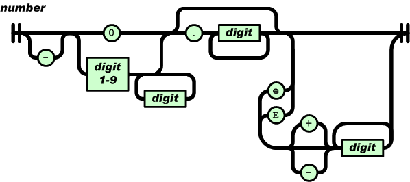
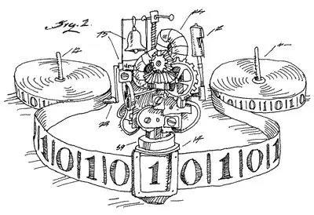
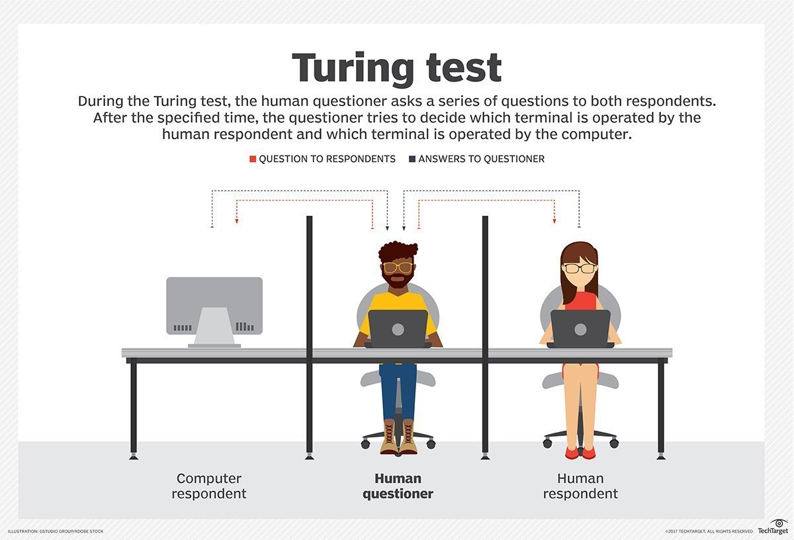

# 形式语言
## 基础
* Formal language用精确的数学或机器可处理的公式定义的语言。
* 语言定义在某一个特定的字母表上，字母表（经常记作 Σ ）可以为任意有限集合。例如集合{a,b,c...,z}就表示所有小写字母构成的字母表。
## 形式系统
* 形式系统（英语：Formal system）是由两个部分组成的，一个形式语言加上一个推理规则或转换规则的集合。
## 形式化
* 即所有的内存对象都有一个符号进行对应

## 形式文法
* 枚举也是文法的一种
* 是形式语言中字符串的一套产生式规则。这些规则描述了如何用语言的字母表生成符合语法的有效的字符串。
* 乔姆斯基(Chomsky于1956年建立形式语言的描述以来，形式语言的理论发展很快。他将文法分成四种类型，即0型、1型、2型和3型，0型即自然语言文法，1型称为上下文相关文法，2型称为上下文无关文法(context-free grammar，CFG)，3型称为正则文法。看到哲学家对计算机科学的贡献，也是计算机和哲学的交叉部分。

## 范式 (Normal Form)
* 范式就是惯例，只不过为了将这个行为给特化出来的新设计的词语，就如同大革命，大萧条都有其特指一样。本质上讲和设计模式是同一种性质的概念。
* 范式是将一种非理性的思维方式引入到数学领域，处于理性科学与感性科学的边缘。
### BNF 巴科斯范式
* BNF(Backus-Naur Form)是描述编程语言的文法。巴科斯范式是一种用于表示上下文无关文法的语言，上下文无关文法描述了一类形式语言。
* 语法
```
< >     : 内包含的为必选项。
[ ]     : 内包含的为可选项。
{ }     : 内包含的为可重复0至无数次的项。
|       : 表示在其左右两边任选一项，相当于"OR"的意思。
::=     : 是“被定义为”的意思
"..."   : 术语符号
[...]   : 选项，最多出现一次
{...}   : 重复项，任意次数，包括 0 次
(...)   : 分组
|       : 并列选项，只能选一个
```
```
Java 的for循环的BNF范式表达：

FOR_STATEMENT ::=
    "for" "(" ( variable_declaration |
    ( expression ";" ) | ";" )
    [ expression ] ";"
    [ expression ]
    ")" statement
```
* Json的BNF范式


## Syntax diagrams | railroad diagrams
* Syntax diagrams (or railroad diagrams) are a way to represent a context-free grammar.
* 
```
<expression> ::= <term> | <term> "+" <expression>
<term>       ::= <factor> | <factor> "*" <term>
<factor>     ::= <constant> | <variable> | "(" <expression> ")"
<variable>   ::= "x" | "y" | "z" 
<constant>   ::= <digit> | <digit> <constant>
<digit>      ::= "0" | "1" | "2" | "3" | "4" | "5" | "6" | "7" | "8" | "9"
```


### 数据库范式 (六个)
* 第一范式（1NF）
* 第二范式（2NF）
* 第三范式（3NF）
* 巴斯-科德范式（BCNF）
* 第四范式(4NF）
* 第五范式（5NF，又称完美范式）

## 计算机中的体现
* AST(Abstract Syntax Tree)，抽象语法树

## 正则表达式
* 正则表达式是一种特殊形式的语法，用于解析字符串和其他文本信息，这些信息在形式语言理论中被称为“规则语言”。
#### 正则语言
* 形式语言与自动机理论中讨论的最基本的语言系。通过它可以架起有穷自动机和正则表达式之间的一座桥梁。
* 编程语言通常定义为[Turing Complete](#图灵机)的语言。这样的语言必须能够处理任何可计算的功能。正则表达式不适用于此类别。
#### 理解
* 正则是一种描述方式，只不过不是图灵完备的描述方式，因为不具备图灵完备性
* 所有根据具体的需求可以生产某种"形式语言"来解决具体的问题
* 不要眼中只有代码

## 计算理论的发展
* 有限状态机 => 上下文无关语法 => 图灵机 => 现代计算机
* 逐步发展为可以计算世界上可计算之事

## 图灵机
* 
* 

#### 图灵完备
* 图灵试图寻找一种世界上所有计算问题的解决方案，一篮子解决世界上所有的计算问题。
* 如果一个计算机语言具有图灵完备性（Turing Completeness），那么这个语言就是图灵完备语言（Turing-complete language）。
* 如果一门编程语言、一个指令集可实现图灵机模型里面全部的功能，或者说能够满足任意数据按照一定顺序计算出结果，我们就可称其具有图灵完备性。
* 常见的编程语言都是图灵完备语言, 而SQL也是图灵完备语言
* 而JSON、HTML都不是图灵完备语言
* 图灵机的所有可能状态的数目是有限的，并且有一个特殊的状态，称为停机状态。
* 如果一个语言是图灵完备性语言，则意味着一种语言能解决的问题，在另外一种语言中也可以计算出来。证明两个计算模型{\displaystyle A}A和{\displaystyle B}B的计算能力等价的基本思想是：用{\displaystyle A}A和{\displaystyle B}B相互模拟，若{\displaystyle A}A可模拟{\displaystyle B}B且{\displaystyle B}B可模拟{\displaystyle A}A，显然他们的计算能力等价。

#### 图灵测试
* 

## 有限状态机
* 有限状态机, FSM:finite-state machine， FSA:finite-state automaton
* 为什么说是machine？ 
* 一种计算的数学模型
* 组成： 状态列表、初始状态、每个转换的条件
* 类型： 确定性有限状态机(DFA)和非确定性有限状态机(NFA)
* 在计算机科学中，有限状态机广泛应用于应用行为建模、硬件数字系统设计、软件工程、编译器、网络协议以及计算和语言研究。
#### 弱点
* 每一种有限状态机均功能唯一，即设计好之后无法完成其他原理不同的工作
* 因为其状态有限，当所要描述的系统的状态太多时，可能确定的有限状态机无能为力
* 有一些任务是有限状态机无法完成的，比如它可以判断输入的0、1数列中0或1的个数是否为奇数或偶数，但是无法判断0是否比1多或者相反
#### 功能限制
* 有限状态机不但状态有限，功能也有限
* 根据计算理论，这是因为它只能接受正则语言，而正则语言是最低级的语言，所以能够解决的问题是有限的
#### 确定性有限自动机
* 给定当前状态和输入，下一个状态是唯一且确定的。
#### 与图灵机的不同
* 图灵机可以根据状态转移规则把1001翻转成0110或者其他不同的二进制串，而这是DFA或者FSM做不到的，它们只可以做匹配和简单的映射。
#### 理解
* 状态机更侧重于几种状态间的有限切换
* 图灵机则可以做更复杂的计算
#### 正则表达式与有限自动机及正则文法的关系
* 三者功能是等价的。DFA与NFA之间可以相互转换，而正则表达式可以方便地构造，自动机，及正则文法（一般的编译原理或形式语言教材上都有例子）
* A regular expressions and FSM’s are equivalent concepts. Regular expression is a pattern that can berecognized by a FSM. Regex is an example of how good theory leadsto good programs
#### 正则文法与上下文无关文法的区别
* 正则文法对应有限自动机，上下文无关文法对应下推自动机（有限自动机的扩展）。有限自动机只对终结符做状态转移，而下推机，可以对非终结符做状态转移。


## Lex && Yacc

## reference
* [regular express & fsm](http://www.cs.cmu.edu/~ab/15-123S10/AnnotatedNotes/Lecture19-12PM.pdf)