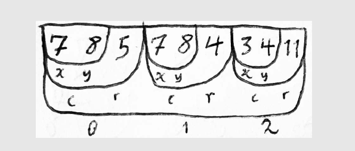
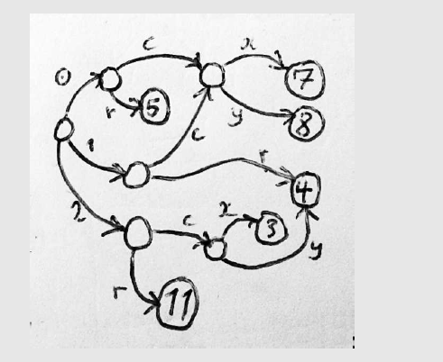
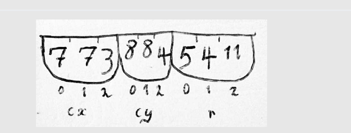

### Idempotence，幂等性
* Methods can also have the property of "idempotence" in that (aside from error or expiration issues) the side-effects of N > 0 identical requests is the same as for a single request.


## struct array pipe
* 聚合数据结构意味着抽象能力的变强，对底层数据的操控能力变强，就像宗教的出现，将人的各种禁忌给集合了起来，形成了一个上层的概念
* 不同的类型是为了解决具体的问题而出现的，比如典型的cobol侧重于struct结构化的能力，lisp使用大量指针来串联起来所有的数据, fortran的使用侧重使用数组 ，磁带内存模型则使用pipe
* pipe提供的是一种单向性，对某些算法来说就足够了，比如迭代器、channel
* 不同的语言侧重使用不同的结构去解决具体的问题
* 而通用语言则尝试将所有场景都结合进来，形成通用的编程语言


## 什么是编程语言
* 将人的想法使用它所采用的的数据结构和编程范式表达出来，然后交给计算机
* 不同的编程语言，提供的锅碗瓢盆是不一样的，做出来的饭是不同的，但是都可以吃，都可以入口(喂入CPU中)

## 解释型 vs 编译型
* 解释性语言是指需要一个解释器把代码解释给CPU
* 编译型：直接交给CPU可执行的机器代码


## 命令式语言(Imperative) vs 声明式语言(Declarative)
* 命令式编程（Imperative）：详细的命令机器怎么（How）去处理一件事情以达到你想要的结果（What），比如常见的C、C#、Java等语言
* 声明式编程（ Declarative）：只告诉你想要的结果（What），机器自己摸索过程（How），比如**SQL**

## 编程范式(Programming paradigm)
* 编程范型提供了（同时决定了）程序员对程序执行的看法。编程范型和编程语言之间的关系可能十分复杂，由于一个编程语言可以支持多种范型。C++设计时，支持过程化编程、面向对象编程以及泛型编程。
* 函数式编程(泛函编程), 函数编程语言最重要的基础是λ演算（lambda calculus）
* 过程式编程
* 面向对象编程
* 指令式编程
* 声明式编程
* 结构化编程（Structured programming）,它采用子程序、块结构、for循环以及while循环等结构

## 语法【调料】
### 语法糖
* 语法糖（英语：Syntactic sugar）是由英国计算机科学家彼得·兰丁发明的一个术语，指计算机语言中添加的某种语法，这种语法对语言的功能没有影响，但是更方便程序员使用。语法糖让程序更加简洁，有更高的可读性。
* 所以我觉得λ表达式就是语法糖
* 糖： 增加程序猿与语言的粘性，小朋友，叔叔给你糖跟我走吧

### 语法盐
* 语法盐（英语：syntactic salt）是指在计算机语言中为了降低程序员撰写出不良代码的设计，但其中仍会有潜藏错误存在的可能。
* C语言或C++语言中Switch指令的case中若不加break编译器并不会产生错误消息，部分程序员认为宣告变量类型也是语法盐的一种。

## 形式语言的互通
* 我们学习的各种语言，也许C、Java的数学表达方式更适合正常的思维方式
* lambda演算的语法将一些表达式定义为有效的lambda演算式，而某一些表达式无效，就像C编程语言中有些字符串有效，有些则不是。有效的lambda演算式称为“lambda项”
* 也许lambda演算式的表达方式更适合西方人的思维习惯，感受一下，有种肉眼语法树的赶脚，所以现代语言的发展，编译器功不可没
```
(define (cons x y)
  (lambda (m) (m x y)))

(define (car z)
  (z (lambda (p q) p)))

(define (cdr z)
  (z (lambda (p q) q)))

(define-syntax let
  (syntax-rules ()
    ((let ((var expr) ...) body ...)
      ((lambda (var ...) body ...) expr ...))))
```

## 语言 & 协议
* 语言是一个系统，是为了解决某个问题而产生的一套规则。比如html是界面定义语言，包括word文档内部，也有一套规则和描述方式。 
* 协议可以看做是数据的沟通方式，也就是协议。