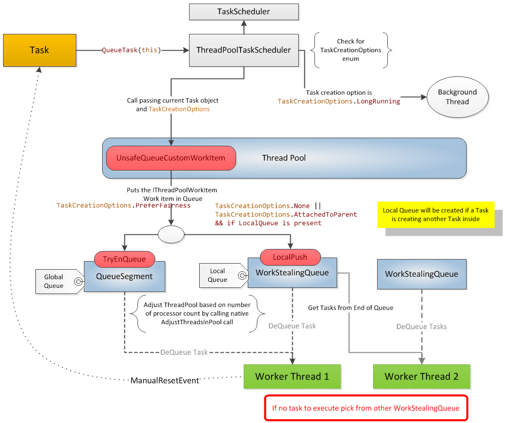

# c# 学习
### framework
* C# ===编译器===> CIL(IL) ====JIT===>机器码(native code)
*  <br>

### 关键字
* TAP(Task-based Asynchronous Pattern), Task, await,async
* async: **修饰符**可用于将方法、lamda表达式或者匿名方法指定为异步
* await **运算符** 暂停对其所属的 async 方法的求值，直到其操作数表示的异步操作完成。 异步操作完成后，await 运算符将返回操作的结果（如果有）。 当 await 运算符应用到表示已完成操作的操作数时，它将立即返回操作的结果，而不会暂停其所属的方法。 await 运算符不会阻止计算异步方法的线程。 当 await 运算符暂停其所属的异步方法时，控件将返回到方法的调用方。
```
1. 如果async修饰的方法不包含await，则同步执行
2. 
```
* Task
```
public class Task<TResult> : System.Threading.Tasks.Task
using System;
using System.Threading;
using System.Threading.Tasks;

class Example
{
    static void Main()
    {
        Action<object> action = (object obj) =>
                                {
                                   Console.WriteLine("Task={0}, obj={1}, Thread={2}",
                                   Task.CurrentId, obj,
                                   Thread.CurrentThread.ManagedThreadId);
                                };

        // Create a task but do not start it.
        Task t1 = new Task(action, "alpha");

        // Construct a started task
        Task t2 = Task.Factory.StartNew(action, "beta");
        // Block the main thread to demonstrate that t2 is executing
        t2.Wait();

        // Launch t1 
        t1.Start();
        Console.WriteLine("t1 has been launched. (Main Thread={0})",
                          Thread.CurrentThread.ManagedThreadId);
        // Wait for the task to finish.
        t1.Wait();

        // Construct a started task using Task.Run.
        String taskData = "delta";
        Task t3 = Task.Run( () => {Console.WriteLine("Task={0}, obj={1}, Thread={2}",
                                                     Task.CurrentId, taskData,
                                                      Thread.CurrentThread.ManagedThreadId);
                                   });
        // Wait for the task to finish.
        t3.Wait();

        // Construct an unstarted task
        Task t4 = new Task(action, "gamma");
        // Run it synchronously
        t4.RunSynchronously();
        // Although the task was run synchronously, it is a good practice
        // to wait for it in the event exceptions were thrown by the task.
        t4.Wait();
    }
}
// The example displays output like the following:
//       Task=1, obj=beta, Thread=3
//       t1 has been launched. (Main Thread=1)
//       Task=2, obj=alpha, Thread=4
//       Task=3, obj=delta, Thread=3
//       Task=4, obj=gamma, Thread=1
```
* sealed: 密封类，不能被继承，一般不能是抽象类
* class中的where，表示限制条件,new()表示需要有无参数构造函数
```
public sealed class ExpiredObject<TObj> where TObj : new()
```
* nameof typeof GetType
```
GetType()方法继承自Object，所以C#中任何对象都具有GetType()方法，它的作用和typeof()相同，返回Type类型的当前对象的类型。 
typeof(x)中的x，必须是具体的类名、类型名称等，不可以是变量名称。

nemeof运算符获取变量、类型或成员的名称作为字符串常量。
Console.WriteLine(nameof(System.Collections.Generic));  // output: Generic
Console.WriteLine(nameof(List<int>));  // output: List
Console.WriteLine(nameof(List<int>.Count));  // output: Count
Console.WriteLine(nameof(List<int>.Add));  // output: Add
 
var numbers = new List<int> { 1, 2, 3 };
Console.WriteLine(nameof(numbers));  // output: numbers
Console.WriteLine(nameof(numbers.Count));  // output: Count
Console.WriteLine(nameof(numbers.Add));  // output: Add
```
* $ 
```
string.format()的简化
int m_a = 1;
int m_b = 2;
Console.WriteLine(string.format("this is a:{0},this is b:{1}"),m_a,m_b));
Console.WriteLine($"this is a:{m_a} ,this is b:{m_b}");
```
* lamda，匿名函数，委托
```
C#中有两种匿名函数：Lambda 表达式 和 匿名方法。

lamda的形式：
1. (input-parameters) => { statement; }，
2. 如果只有一个输入参数，没有返回值的时候，变为 input-parameters => { statement; }
3. Action a = () => Console.Write("a");

访问修饰符    修饰符    返回值类型    方法名(参数列表) => 表达式;
public static int Add(int a, int b) => a + b;

=>(读作goes to) lamda运算符，两侧为参数与运行逻辑

内置委托：Action(Action是无返回值的泛型委托)，Func(Func是有返回值的泛型委托，<>中，最后一个类型为返回值类型),参数的顺序与lamda表达式的顺序一样

委托
public class HistoryDelegate
{
    private delegate void Delegate1(string str_);
    private void OnDelegate1(string str1_)
    {
        Console.WriteLine($"OnDelegate1: {str1_}");
    }

    public void OnTest()
    {
        //C# 1.0
        Delegate1 d1 = new Delegate1(OnDelegate1);
        d1("d1");
        //C# 2.0
        Delegate1 d2 = delegate (string str) { Console.WriteLine($"{str}"); };
        d2("d2");
        //C# 3.0
        Delegate1 d3 = (x) => { Console.WriteLine($"{x}"); };
        d3("d3");
    }
}


```
* default
```
public TObj Obj(IClock clock)
            => this.IsExpired(clock)
            ? default
            : this.RawObj;
Console.WriteLine(default(int));  // output: 0
Console.WriteLine(default(object) is null);  // output: True

```
* is 运算符
```

```
* int? 表示可空类型，就是一种特殊的值类型，它的值可以为null
* ??运算符与PHP中类似,如果左操作数的值不为 null，则 null 合并运算符 ?? 返回该值；否则，它会计算右操作数并返回其结果。 如果左操作数的计算结果为非 null，则 ?? 运算符不会计算其右操作数。
* out关键字，就是需要引用改变的变量
* 逆变 协变: 
* partial: 定义的类可以在多个地方被定义，最后编译的时候会被当作一个类来处理
* FromBody FromForm: fromBody:在cation方法传入参数后添加[frombody]属性，参数将以一个整体的josn对象的形式传递; fromform:在cation方法传入参数后添加[frombody]属性，参数将以表单的形式提交。

### 模式匹配
* 声明匹配
```
if (input is int count)
    sum += count;

这种可以避免sum与input直接加和，因为可能类型不匹配
```
* 位置匹配
```
public static RGBColor FromRainbow(Rainbow colorBand) =>
    colorBand switch
    {
        Rainbow.Red    => new RGBColor(0xFF, 0x00, 0x00),
        Rainbow.Orange => new RGBColor(0xFF, 0x7F, 0x00),
        Rainbow.Yellow => new RGBColor(0xFF, 0xFF, 0x00),
        Rainbow.Green  => new RGBColor(0x00, 0xFF, 0x00),
        Rainbow.Blue   => new RGBColor(0x00, 0x00, 0xFF),
        Rainbow.Indigo => new RGBColor(0x4B, 0x00, 0x82),
        Rainbow.Violet => new RGBColor(0x94, 0x00, 0xD3),
        _              => throw new ArgumentException(message: "invalid enum value", paramName: nameof(colorBand)),
    };
    变量位于 switch 关键字之前
    将 case 和 : 元素替换为 =>。 它更简洁，更直观。
    将 default 事例替换为 _ 弃元。
    正文是表达式，不是语句。也就是只有一个函数的表达式

    又比如：
    public readonly struct Point
    {
        public Point(int x, int y) => (X, Y) = (x, y);
        
        public int X { get; }
        public int Y { get; }
    }

    static Point Transform(Point point) => point switch
    {
        { X: 0, Y: 0 }                    => new Point(0, 0),
        { X: var x, Y: var y } when x < y => new Point(x + y, y),
        { X: var x, Y: var y } when x > y => new Point(x - y, y),
        { X: var x, Y: var y }            => new Point(2 * x, 2 * y),
    };

    又比如：
    static decimal GetGroupTicketPriceDiscount(int groupSize, DateTime visitDate)
    => (groupSize, visitDate.DayOfWeek) switch
    {
        (<= 0, _) => throw new ArgumentException("Group size must be positive."),
        (_, DayOfWeek.Saturday or DayOfWeek.Sunday) => 0.0m,
        (>= 5 and < 10, DayOfWeek.Monday) => 20.0m,
        (>= 10, DayOfWeek.Monday) => 30.0m,
        (>= 5 and < 10, _) => 12.0m,
        (>= 10, _) => 15.0m,
        _ => 0.0m,
    };
```
* 可使用 var 模式来匹配任何表达式（包括 null），并将其结果分配给新的局部变量
```
static bool IsAcceptable(int id, int absLimit) =>
    SimulateDataFetch(id) is var results 
    && results.Min() >= -absLimit 
    && results.Max() <= absLimit;

static int[] SimulateDataFetch(int id)
{
    var rand = new Random();
    return Enumerable
               .Range(start: 0, count: 5)
               .Select(s => rand.Next(minValue: -10, maxValue: 11))
               .ToArray();
}
```
* 属性模式
```
static bool IsConferenceDay(DateTime date) => date is { Year: 2020, Month: 5, Day: 19 or 20 or 21 };
```
### 迭代语句
* await foreach
```
await foreach (var item in GenerateSequenceAsync())
{
    Console.WriteLine(item);
}
```
* foreach
```
foreach (var item in collection) { }
```
### 值类型
* 元组类型
```
(double, int) t1 = (4.5, 3);
Console.WriteLine($"Tuple with elements {t1.Item1} and {t1.Item2}.");
// Output:
// Tuple with elements 4.5 and 3.

(double Sum, int Count) t2 = (4.5, 3);
Console.WriteLine($"Sum of {t2.Count} elements is {t2.Sum}.");
// Output:
// Sum of 3 elements is 4.5.
```

### 属性
* get set 
```
public long ExpireTime { get; private set; }, get为public，set为私有的，表示外部不可更改其值
public int X {get;set;}，对外暴露get与set接口
public int X { get; },只有get函数
public string FirstName { get; set; } = string.Empty;
public string FirstName
{
    get { return firstName; }
    set { firstName = value; }
}

```
* 访问器
* 属性语法
* Expression Bodied
```
    public static string GetTime() =>   "Current Time - " + DateTime.Now.ToString("hh:mm:ss");
```
* 自动属性 

### 表达式树
* Lambda 表达式创建表达式树
```
Expression<Action<int>> actionExpression = n => Console.WriteLine(n);
Expression<Func<int, bool>> funcExpression1 = (n) => n < 0;
Expression<Func<int, int, bool>> funcExpression2 = (n, m) => n - m == 0;
```
* API 创建表达式树
```
 ParameterExpression pExpression = Expression.Parameter(typeof(int));
 ConstantExpression cExpression = Expression.Constant(0);
 BinaryExpression bExpression = Expression.MakeBinary(ExpressionType.Equal, pExpression, cExpression);
 Expression<Func<int, bool>> lambda = Expression.Lambda<Func<int, bool>>(bExpression, pExpression);
```
* 执行
```
const int n = 1;
 const int m = 2;
 BinaryExpression bExpression = Expression.Add(Expression.Constant(n), Expression.Constant(m));
 Expression<Func<int>> funcExpression = Expression.Lambda<Func<int>>(bExpression);
 Func<int> func = funcExpression.Compile();
 Console.WriteLine($"{n} + {m} = {func()}");
```

### 命令实践
* dotnet.exe new webapp -o aspnetcoreapp 新建一个工程
* dotnet.exe watch run
* dotnet tool install --global dotnet-ef 安装ef命令行

### Entity Framework Core
* DbSet: 一种[Repository pattern](https://martinfowler.com/eaaCatalog/repository.html)的实现方式

### 注解
* 是一种提示，而不是一种约束

### Task
* 

### 观察StateMachine
* goto [SharpLib](https://sharplab.io/)
```
using System;
using System.Threading.Tasks;

public class HelloTask {
    public Task MyTaskAsync()
    {
        Task.Run(() => {});
        return Task.Delay(2000);
    }
    
    public async void RunTask()
    {
        Console.WriteLine("RunTask");
        await this.MyTaskAsync();
        await this.MyTaskAsync();
    }
    public async void RunTask2()
    {
        Console.WriteLine("RunTask2");
        await this.MyTaskAsync();
        await this.MyTaskAsync();
    }
}
```

### SynchronizationContext 
* It is basically an abstraction of how the application should behave after the asynchronous operation is completed. 

### 引用
* [Exploring the async/await State Machine](https://vkontech.com/exploring-the-async-await-state-machine-conceptual-implementation/)
* [There Is No Thread](https://blog.stephencleary.com/2013/11/there-is-no-thread.html)
* [sharplab.io](https://sharplab.io/)
* [C# blog - StephenCleary ](https://blog.stephencleary.com/)
* [C# blog - vkontech](https://vkontech.com/exploring-the-async-await-state-machine-synchronization-context/)