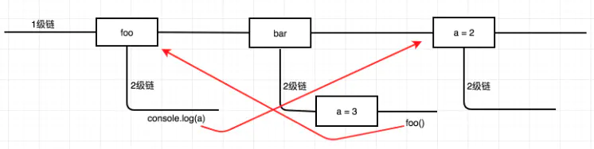

# 闭包
* 定义： 在计算机科学中，闭包（英语：Closure），又称词法闭包（Lexical Closure）或函数闭包（function closures），是在支持[头等函数](##头等函数)的编程语言中实现词法绑定的一种技术。（来自wiki）
* 函数和对其周围状态（lexical environment，词法环境）的引用捆绑在一起构成闭包（closure）。也就是说，闭包可以让你从内部函数访问外部函数作用域。
## 使用方式，以js代码为例子
* 一般理解，作为一个普通函数变量使用，并且在内部作用域使用
```
function init() {
    var name = "Mozilla"; // name 是一个被 init 创建的局部变量
    function displayName() { // displayName() 是内部函数，一个闭包
        alert(name); // 使用了父函数中声明的变量
    }
    displayName();
}
init();
```
* 进阶理解，跳出函数的局部作用域
```
function makeFunc() {
    var name = "Mozilla";
    function displayName() {
        alert(name);
    }
    return displayName;
}

var myFunc = makeFunc();
myFunc();
```
* 函数工厂
```
function makeAdder(x) {
  return function(y) {
    return x + y;
  };
}

var add5 = makeAdder(5);
var add10 = makeAdder(10);

console.log(add5(2));  // 7
console.log(add10(2)); // 12
```
* 模拟私有方法
```
var Counter = (function() {
  var privateCounter = 0;
  function changeBy(val) {
    privateCounter += val;
  }
  return {
    increment: function() {
      changeBy(1);
    },
    decrement: function() {
      changeBy(-1);
    },
    value: function() {
      return privateCounter;
    }
  }   
})();

console.log(Counter.value()); /* logs 0 */
Counter.increment();
Counter.increment();
console.log(Counter.value()); /* logs 2 */
Counter.decrement();
console.log(Counter.value()); /* logs 1 */
```
## 理解
* 直接作用：因为变量的作用域有局部和全局之分，闭包的直接作用就是能在函数外部操作函数内部的局部变量。
* 普通的理解，闭包是一个匿名函数,但是如果只是函数的话，就与C语言的动态绑定技术-函数指针区别不大了
* 闭包其实是通过语法树绑定了词法环境，即可以绑定它所处的作用域可以查找的符号，这个是需要依赖不同语言的词法绑定规则
* 编程语言本身应该提供开发者足够的灵活性，但是足够的灵活性又容易形成不易管理的代码。C语言提供了函数指针算作一种语言级别的灵活性，而闭包的设计者肯定觉得，仅有函数的引用还不够，还需要辅助的变量。

## 注意事项
* 如果不是某些特定任务需要使用闭包，在其它函数中创建函数是不明智的，因为闭包在处理速度和内存消耗方面对脚本性能具有负面影响。
```
过度使用的闭包
function MyObject(name, message) {
  this.name = name.toString();
  this.message = message.toString();
  this.getName = function() {
    return this.name;
  };

  this.getMessage = function() {
    return this.message;
  };
}

改为定义原型:
function MyObject(name, message) {
  this.name = name.toString();
  this.message = message.toString();
}
MyObject.prototype.getName = function() {
  return this.name;
};
MyObject.prototype.getMessage = function() {
  return this.message;
};

```

## 闭包的起源
### λ表达式
* 

## 作用域
* 作用域是指程序源代码中定义变量的区域。作用域规定了如何查找变量，也就是确定当前执行代码对变量的访问权限。
* 大多数现在程序设计语言都是采用静态作用域规则，而只有为数不多的几种语言采用动态作用域规则，包括APL、Snobol和Lisp的早期方言。动态作用域根据函数的调用栈进行追溯。
### 静态作用域规则
* 词法作用域(lexical scope)等同于静态作用域(static scope)。
* 所谓的词法作用域其实是指作用域在词法解析阶段既确定了，不会改变。
* 只有函数才能制造作用域结构，那么只要是代码，至少有一个作用域，即全局作用域。凡是代码中有函数，那么这个函数就构成另一个作用域。如果函数中还有函数，那么在这个作用域中就又可以诞生一个作用域，那么将这样的所有作用域列出来，可以有一个结构：函数内指向函数外的链式结构。
```
function foo() {
  console.log(a); // 2
}
function bar() {
  var a = 3;
  foo();
}
var a = 2;
bar();
```
上述代码对应的作用于分析如下，沿着语法树逆向追溯直到找到同名变量为止，否则会报错

### 不同语言的处理方式
* PHP 不允许函数访问非本作用域的变量
* JS、C语言允许访问函数作用域之外的变量

## 头等函数
* 头等函数（first-class function）是指在程序设计语言中，函数被当作头等公民。这意味着，函数可以作为别的函数的参数、函数的返回值，赋值给变量或存储在数据结构中。
* 比如某些面向函数编程

## name binding
* 

## 匿名函数 具名函数
