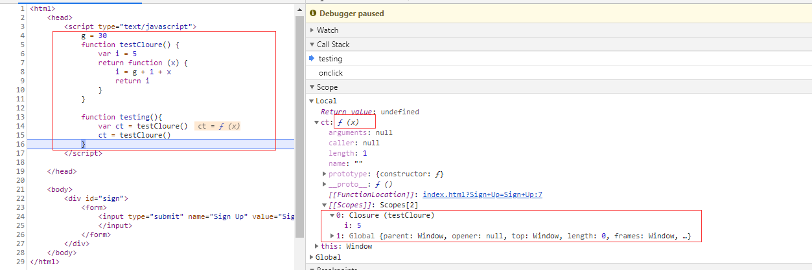
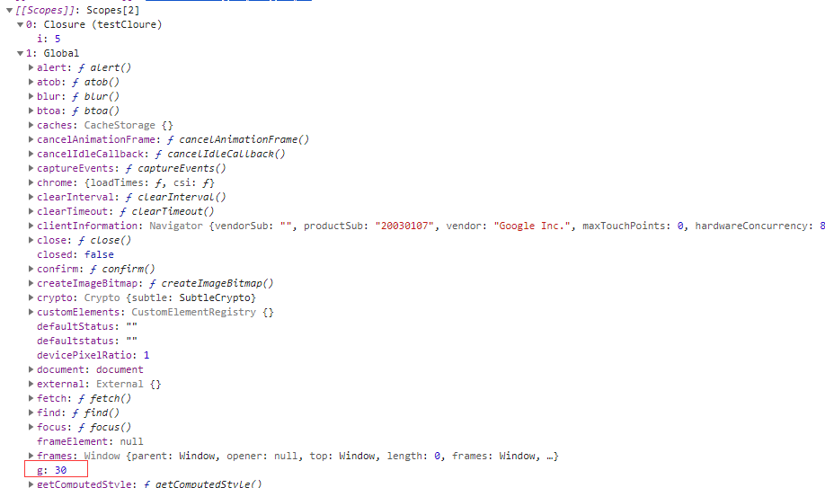

# 闭包
* 定义： 在计算机科学中，闭包（英语：Closure），又称词法闭包（Lexical Closure）或函数闭包（function closures），是在支持[头等函数](#头等函数)的编程语言中实现词法绑定的一种技术。（来自wiki）
* 函数和对其周围状态（lexical environment，词法环境）的引用捆绑在一起构成闭包（closure）。也就是说，闭包可以让你从内部函数访问外部函数作用域。
## 使用方式，以js代码为例子
* 一般理解，作为一个普通函数变量使用，并且在内部作用域使用
```
function init() {
    var name = "Mozilla"; // name 是一个被 init 创建的局部变量
    function displayName() { // displayName() 是内部函数，一个闭包
        alert(name); // 使用了父函数中声明的变量
    }
    displayName();
}
init();
```
* 进阶理解，跳出函数的局部作用域
```
function makeFunc() {
    var name = "Mozilla";
    function displayName() {
        alert(name);
    }
    return displayName;
}

var myFunc = makeFunc();
myFunc();
```
* 函数工厂
```
function makeAdder(x) {
  return function(y) {
    return x + y;
  };
}

var add5 = makeAdder(5);
var add10 = makeAdder(10);

console.log(add5(2));  // 7
console.log(add10(2)); // 12
```
* 模拟私有方法
```
var Counter = (function() {
  var privateCounter = 0;
  function changeBy(val) {
    privateCounter += val;
  }
  return {
    increment: function() {
      changeBy(1);
    },
    decrement: function() {
      changeBy(-1);
    },
    value: function() {
      return privateCounter;
    }
  }   
})();

console.log(Counter.value()); /* logs 0 */
Counter.increment();
Counter.increment();
console.log(Counter.value()); /* logs 2 */
Counter.decrement();
console.log(Counter.value()); /* logs 1 */
```
* js调试示例



## 理解
* 直接作用：因为变量的作用域有局部和全局之分，闭包的直接作用就是能在函数外部操作函数内部的局部变量。
* 普通的理解，闭包是一个匿名函数,但是如果只是函数的话，就与C语言的动态绑定技术-函数指针区别不大了
* 闭包其实是通过语法树绑定了词法环境，即可以绑定它所处的作用域可以查找的符号，这个是需要依赖不同语言的词法绑定规则
* 编程语言本身应该提供开发者足够的灵活性，但是足够的灵活性又容易形成不易管理的代码。C语言提供了函数指针算作一种语言级别的灵活性，而闭包的设计者肯定觉得，仅有函数的引用还不够，还需要辅助的变量。

## 注意事项
* 如果不是某些特定任务需要使用闭包，在其它函数中创建函数是不明智的，因为闭包在处理速度和内存消耗方面对脚本性能具有负面影响。
```
过度使用的闭包
function MyObject(name, message) {
  this.name = name.toString();
  this.message = message.toString();
  this.getName = function() {
    return this.name;
  };

  this.getMessage = function() {
    return this.message;
  };
}

改为定义原型:
function MyObject(name, message) {
  this.name = name.toString();
  this.message = message.toString();
}
MyObject.prototype.getName = function() {
  return this.name;
};
MyObject.prototype.getMessage = function() {
  return this.message;
};

```

## 作用域
* 作用域是指程序源代码中定义变量的区域。作用域规定了如何查找变量，也就是确定当前执行代码对变量的访问权限。
* 大多数现在程序设计语言都是采用静态作用域规则，而只有为数不多的几种语言采用动态作用域规则，包括APL、Snobol和Lisp的早期方言。动态作用域根据函数的调用栈进行追溯。
### 静态作用域规则
* 词法作用域(lexical scope)等同于静态作用域(static scope)。
* 所谓的词法作用域其实是指作用域在词法解析阶段既确定了，不会改变。
* 只有函数才能制造作用域结构，那么只要是代码，至少有一个作用域，即全局作用域。凡是代码中有函数，那么这个函数就构成另一个作用域。如果函数中还有函数，那么在这个作用域中就又可以诞生一个作用域，那么将这样的所有作用域列出来，可以有一个结构：函数内指向函数外的链式结构。
```
function foo() {
  console.log(a); // 2
}
function bar() {
  var a = 3;
  foo();
}
var a = 2;
bar();
```
上述代码对应的作用于分析如下，沿着语法树逆向追溯直到找到同名变量为止，否则会报错

### 不同语言的处理方式
* PHP 不允许函数访问非本作用域的变量
* JS、C语言允许访问函数作用域之外的变量

## 头等函数
* 头等函数（first-class function）是指在程序设计语言中，函数被当作头等公民。这意味着，函数可以作为别的函数的参数、函数的返回值，赋值给变量或存储在数据结构中。
* 比如某些面向函数编程

## name binding
* 将name(identify)与code或者data进行绑定
* 体现到形式语言的关键一步，通过各种name来访问变量

## closure & named funtion & anonymous function & λ表达式
* A closure may be a named or anonymous function, but is known as such when it "closes over" variables in the scope where the function is defined, i.e., the closure will still refer to the environment with any outer variables that are used in the closure itself. 闭包就像在作用域中闭合为一个整体，将变量和函数一块包裹。
* 闭包侧重的是闭合的概念
* λ表达式常常与闭包一起出现，因为很多情况下，没必要为一个函数形式化，所以λ表达式是闭包的实现手段
* In computer programming, an anonymous function (function literal, lambda abstraction, or lambda expression) is **a function definition that is not bound to an identifier**.
* 在计算机的上下文中，匿名函数就是λ表达式，λ表达式就是没有命名的函数
* And since lambdas and closures come from Lambda Calculus invented by Alonzo Church back in the '30s before first electronic computers even existed。Lambda Calculus is the simplest programming language in the world. lambda演算可比拟是最根本的编程语言，它包括了一条变换规则（变量替换）和一条将函数抽象化定义的方式。λ演算是图灵完备的，也就是说，这是一个可以用于模拟任何图灵机的通用模型。
* 我们从学习C、C++、Java而获取的先入经验是，通过函数或者方法将变量在他们之间进行传递，进而得到结果。而闭包提供了将函数和变量直接打包的技术，而λ表达式则直接抛弃了逻辑代码的命名
* λ的起源
```
By the way, why did Church choose the notation “λ”? In [an unpublished 1964 letter to Harald Dickson] he stated clearly that it came from the notation “{\displaystyle {\hat {x}}}{\hat {x}}” used for class-abstraction by Whitehead and Russell, by first modifying “{\displaystyle {\hat {x}}}{\hat {x}}” to “∧{\displaystyle x}x” to distinguish function-abstraction from class-abstraction, and then changing “∧” to “λ” for ease of printing.

This origin was also reported in [Rosser, 1984, p.338]. On the other hand, in his later years Church told two enquirers that the choice was more accidental: a symbol was needed and λ just happened to be chosen.
```


## closure & actor model
*  I always loved lambda and closures and I see actor like closures specially handled to power concurrency. 
* The actor model adopts the philosophy that everything is an actor. This is similar to the everything is an object philosophy used by some object-oriented programming languages.
* The actor model in computer science is a mathematical model of concurrent computation that treats actor as the universal primitive of concurrent computation. The actor model originated in 1973(可以看到演员模型是和lamda表达式一个年代的). It has been used both as a framework for a theoretical understanding of computation and as the theoretical basis for several practical implementations of concurrent systems. 
* 闭包和演员模型很相似，都是将数据和算法打包成一个执行单元的技术