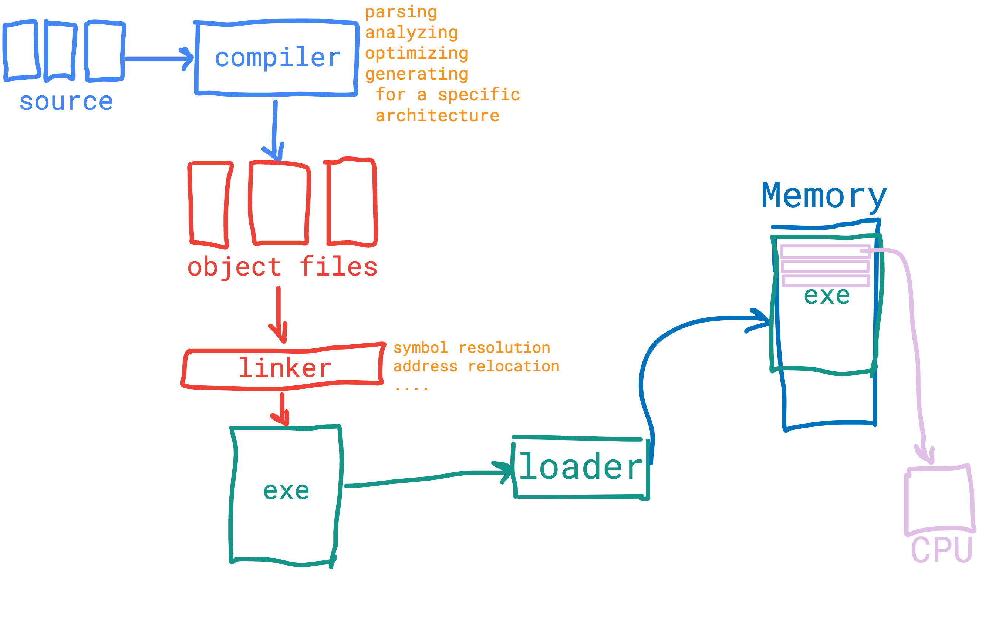
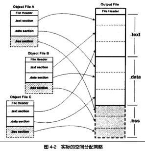
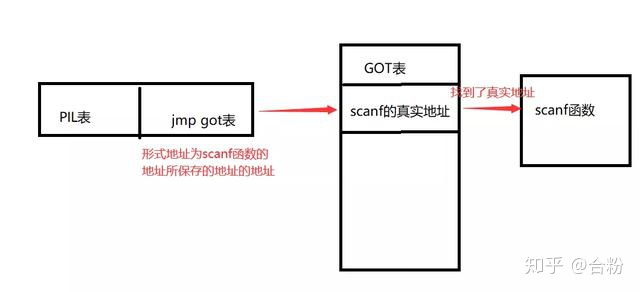
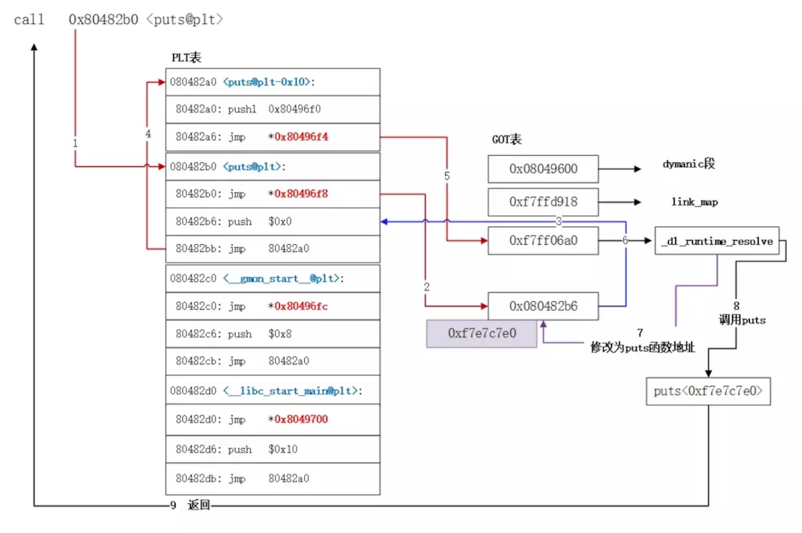

# 编译&链接
* 
* 例子代码
```
#define MAX_NUMBER 100

int
main() {
printf("hello world");
return 0;
}
```
## 预编译
* 处理过程
    > 删除 #define 并展开宏定义

    > 处理所有的条件预编译指令，如 "#if"，"#ifdef"，"#endif"等

    > 插入头文件到 "#include" 处，可以递归方式进行处理

    > 删除所有的注释

    > 添加行号和文件名标识，以便编译时编译器产生调试用的行号信息

    > 保留所有 #pragma 编译指令（编译器需要用）
* 查看
```
> gcc -E main.c -o main.i
> vim main.i 

# 1 "main.c"
# 1 "<built-in>"
# 1 "<command-line>"
# 1 "/usr/include/stdc-predef.h" 1 3 4
# 1 "<command-line>" 2
# 1 "main.c"


int
main() {
printf("hello world%d", 100);
return 0;
}
```
## 编译
* 编译过程就是将预处理后得到的预处理文件（如hello.i）进行词法分析、语法分析、语义分析、优化后，生成汇编代码文件。
* 查看
```
gcc -S main.c -o main.s
vim main.s   
 .file   "main.c"
    .section    .rodata
.LC0:
    .string "hello world%d"
    .text
    .globl  main
    .type   main, @function
main:
.LFB0:
    .cfi_startproc
    pushq   %rbp
    .cfi_def_cfa_offset 16
    .cfi_offset 6, -16
    movq    %rsp, %rbp
    .cfi_def_cfa_register 6
    movl    $100, %esi
    movl    $.LC0, %edi
    movl    $0, %eax
    call    printf
    movl    $0, %eax
    popq    %rbp
    .cfi_def_cfa 7, 8
    ret
    .cfi_endproc
.LFE0:
    .size   main, .-main
    .ident  "GCC: (GNU) 4.8.5 20150623 (Red Hat 4.8.5-36)"
    .section    .note.GNU-stack,"",@progbits
~                                             
```

## 静态链接
* 三个步骤：空间与地址分配，符号解析，重定位
### 空间与地址分配&目标文件合并
* 两种合并方式，按序叠加，相似段叠加
* 
* 
* 目前都采用相似叠加策略
### symbol resolution 符号解析
* 使用符号表实现
* 链接的时候.text部分不会对齐，直接合并
* 过程
      
      (1)创建三个集合 E、U、D
      E：合并在一起的所有目标文件（还未重定位）
      U：没有解析的符号（定义符号和引用符号还没有被建立联系）
      D：定义符号的集合
      (2)对每一个输入文件来说，首先判断是不是库文件。如果不是库文件，就是目标文件f。就能把目标文件放入E中，根据f中未解析符号和定义符号判断后分别放入U、D中。比如说，f 中有一个未解析符号 k，如果 D 中存在对它的定义，那么就可以建立联系。如果没有就放入U中。如果是库文件，会试图把所有U中的符号与库文件中的符号匹配，匹配上了就从U放入D中。并把匹配上的模块放入E中。一直重复直到U D不再变化。库文件剩下的内容直接就不管了。如果往D中放入了一个已经存在的符号或者扫描完所有文件后U还是非空，则链接器会停止并报错。否则执行重定位。
* 示例
```
> gcc -c main.c -o main.o
> gcc  -o c_produre main.o simple_print.o
> ld main.o simple_print.o -e main -o c_produre
> ld main.o simple_print.o -e main -o c_produre
--------------------------------------------------------------------
#define MAX_NUMBER 100

int
main() {
print(MAX_NUMBER);
return 0;
}
--------------------------------------------------------------------
#include <stdio.h>
int print(int x) {
}
---------------------------------------------------------------------
objdump -t c_produre 

c_produre:     file format elf64-x86-64

SYMBOL TABLE:
00000000004000b0 l    d  .text  0000000000000000 .text
00000000004000d8 l    d  .eh_frame      0000000000000000 .eh_frame
0000000000000000 l    d  .comment       0000000000000000 .comment
0000000000000000 l    df *ABS*  0000000000000000 main.c
0000000000000000 l    df *ABS*  0000000000000000 simple_print.c
00000000004000ca g     F .text  0000000000000009 print
0000000000601000 g       .eh_frame      0000000000000000 __bss_start
00000000004000b0 g     F .text  000000000000001a main
0000000000601000 g       .eh_frame      0000000000000000 _edata
0000000000601000 g       .eh_frame      0000000000000000 _end
----------------------------------------------------------------------------
> objdump -d c_produre 

c_produre:     file format elf64-x86-64


Disassembly of section .text:

00000000004000b0 <main>:
  4000b0:       55                      push   %rbp
  4000b1:       48 89 e5                mov    %rsp,%rbp
  4000b4:       bf 64 00 00 00          mov    $0x64,%edi
  4000b9:       b8 00 00 00 00          mov    $0x0,%eax
  4000be:       e8 07 00 00 00          callq  4000ca <print>
  4000c3:       b8 00 00 00 00          mov    $0x0,%eax
  4000c8:       5d                      pop    %rbp
  4000c9:       c3                      retq   

00000000004000ca <print>:
  4000ca:       55                      push   %rbp
  4000cb:       48 89 e5                mov    %rsp,%rbp
  4000ce:       89 7d fc                mov    %edi,-0x4(%rbp)
  4000d1:       5d                      pop    %rbp
  4000d2:       c3                      retq   
====================================================================================
strip c_produre
> objdump -d c_produre 

c_produre:     file format elf64-x86-64


Disassembly of section .text:

00000000004000b0 <.text>:
  4000b0:       55                      push   %rbp
  4000b1:       48 89 e5                mov    %rsp,%rbp
  4000b4:       bf 64 00 00 00          mov    $0x64,%edi
  4000b9:       b8 00 00 00 00          mov    $0x0,%eax
  4000be:       e8 07 00 00 00          callq  0x4000ca
  4000c3:       b8 00 00 00 00          mov    $0x0,%eax
  4000c8:       5d                      pop    %rbp
  4000c9:       c3                      retq   
  4000ca:       55                      push   %rbp
  4000cb:       48 89 e5                mov    %rsp,%rbp
  4000ce:       89 7d fc                mov    %edi,-0x4(%rbp)
  4000d1:       5d                      pop    %rbp
  4000d2:       c3                      retq   

```
### relocation 重定位
* 重定位表: 链接器通过重定位表才能知道哪些指令需要被调整，重定位表往往是一个或多个段。ELF必须包含重定位表来重新定位符号。比如代码段.text有符号需要重定位，则就会有一个的段保存了代码段重定位的信息，如果.data段中有重定位段保存了数据端的重定位表。可以使用objdump的的地方，就会有一个对应的.
* 在同一个目标文件出现和使用的变量和函数是不需要重定位的
* 示例
```
#include <stdio.h>
int g_i;
extern int extern_var;
int print(int x) {
    extern_var = 40;
}
------------------------------------------------------------------------------------------------------------
> objdump -r simple_print.o 

simple_print.o:     file format elf64-x86-64

RELOCATION RECORDS FOR [.text]:
OFFSET           TYPE              VALUE 
0000000000000009 R_X86_64_PC32     extern_var-0x0000000000000008


RELOCATION RECORDS FOR [.eh_frame]:
OFFSET           TYPE              VALUE 
0000000000000020 R_X86_64_PC32     .text

```
### 查看最终的地址
* 通过objdump -h查看
```
objdump -h c_produre        

c_produre:     file format elf64-x86-64

Sections:
Idx Name          Size      VMA               LMA               File off  Algn
  0 .text         0000002d  00000000004000e8  00000000004000e8  000000e8  2**0
                  CONTENTS, ALLOC, LOAD, READONLY, CODE
  1 .eh_frame     00000058  0000000000400118  0000000000400118  00000118  2**3
                  CONTENTS, ALLOC, LOAD, READONLY, DATA
  2 .data         00000004  0000000000601000  0000000000601000  00001000  2**2
                  CONTENTS, ALLOC, LOAD, DATA
  3 .bss          00000004  0000000000601004  0000000000601004  00001004  2**2
                  ALLOC
  4 .comment      0000002d  0000000000000000  0000000000000000  00001004  2**0
                  CONTENTS, READONLY
```
* 通过VMA和LMA可以看到在空间上的最终布局地址

## 动态链接
* 两大主角
* 存放函数地址的数据表, 全局偏移表 GOT(Global Offset Table)
* 额外代码段表, 程序链接表（PLT，Procedure Link Table）
* 示意图
```
#include <stdio.h>

void print_banner()
{
    printf("Welcome to World of PLT and GOT\n");
}

int main(void)
{
    print_banner();

    return 0;
}
-------------------------------------------------------------------------------------
> objdump -d main
...
Disassembly of section .plt:

00000000004003f0 <.plt>:
  4003f0:       ff 35 12 0c 20 00       pushq  0x200c12(%rip)        # 601008 <_GLOBAL_OFFSET_TABLE_+0x8>
  4003f6:       ff 25 14 0c 20 00       jmpq   *0x200c14(%rip)        # 601010 <_GLOBAL_OFFSET_TABLE_+0x10>
  4003fc:       0f 1f 40 00             nopl   0x0(%rax)

0000000000400400 <puts@plt>:
  400400:       ff 25 12 0c 20 00       jmpq   *0x200c12(%rip)        # 601018 <puts@GLIBC_2.2.5>
  400406:       68 00 00 00 00          pushq  $0x0
  40040b:       e9 e0 ff ff ff          jmpq   4003f0 <.plt>

0000000000400410 <__libc_start_main@plt>:
  400410:       ff 25 0a 0c 20 00       jmpq   *0x200c0a(%rip)        # 601020 <__libc_start_main@GLIBC_2.2.5>
  400416:       68 01 00 00 00          pushq  $0x1
  40041b:       e9 d0 ff ff ff          jmpq   4003f0 <.plt>
...
000000000040051d <print_banner>:
  40051d:       55                      push   %rbp
  40051e:       48 89 e5                mov    %rsp,%rbp
  400521:       bf e0 05 40 00          mov    $0x4005e0,%edi
  400526:       e8 d5 fe ff ff          callq  400400 <puts@plt>
  40052b:       5d                      pop    %rbp
  40052c:       c3                      retq   

000000000040052d <main>:
  40052d:       55                      push   %rbp
  40052e:       48 89 e5                mov    %rsp,%rbp
  400531:       b8 00 00 00 00          mov    $0x0,%eax
  400536:       e8 e2 ff ff ff          callq  40051d <print_banner>
  40053b:       b8 00 00 00 00          mov    $0x0,%eax
  400540:       5d                      pop    %rbp
  400541:       c3                      retq   
  400542:       66 2e 0f 1f 84 00 00    nopw   %cs:0x0(%rax,%rax,1)
  400549:       00 00 00 
  40054c:       0f 1f 40 00             nopl   0x0(%rax)
  ...
-------------------------------------------------------------------------------------
  readelf  -x .plt main

Hex dump of section '.plt':
  0x004003f0 ff35120c 2000ff25 140c2000 0f1f4000 .5.. ..%.. ...@.
  0x00400400 ff25120c 20006800 000000e9 e0ffffff .%.. .h.........
  0x00400410 ff250a0c 20006801 000000e9 d0ffffff .%.. .h.........

从callq  400400 <puts@plt>可以看到引用了.plt代码中0x00400400地址的信息,而0x00400400对应了上面反汇编的内容；其实就是填充了一部分代码
```
* 查看GOT表
```
> objdump -R main

main:     file format elf64-x86-64

DYNAMIC RELOCATION RECORDS
OFFSET           TYPE              VALUE 
0000000000600ff8 R_X86_64_GLOB_DAT  __gmon_start__
0000000000601018 R_X86_64_JUMP_SLOT  puts@GLIBC_2.2.5
0000000000601020 R_X86_64_JUMP_SLOT  __libc_start_main@GLIBC_2.2.5
```
* 动态连接器并不会把动态库函数在编译的时候就包含到 ELF 文件中,仅仅是在这个 ELF 被加载的时候,才会把那些动态函库数代码加载进来,之前系统只会在 ELF 文件中的 GOT 中保留一个调用地址。当 main() 函数开始，会请求 plt 中这个函数的对应 GOT 地址，如果第一次调用那么 GOT 会重定位到 plt，并向栈中压入一个偏移，程序的执行回到 _init() 函数，rtld得以调用就可以定位 printf 的符号地址，第二次运行程序再次调用这个函数时程序跳入 plt，对应的 GOT 入口点就是真实的函数入口地址。
* 所以GOT的值需要在运行时进行填充
，走了一个循环，妙

## 演员们
* COMPILER, ASSEMBLER, LINKER AND LOADER
* 链接脚本

## 理解
* 所有的符号在没有进入链接阶段之前，都只有相对地址（相对于段的地址），没有绝对地址；而链接后因为段有了绝对地址，相应的符号也有了绝对地址
* 链接的过程就像将预制板放到了指定的位置上，于是预制板获取了在房间的地址空间上的唯一地址；或者是将局部坐标系定位在另一个坐标系中；
* 因为目标文件的文件结构是基于段的，所以其实就是保存了很多的向量信息，可以进行重定位
* 需要将.txt .data .bss section整体重定位， 还需要将机器语言中涉及到的符号重新寻找地址
* 符号被strip后，所有的strip都变为了地址，符号信息的消息为逆向增加了很大的难度
* 链接最终的结果是：**所有的符号都在VMA上有固定的地址，甚至符号可以全部用地址替换**
* 符号表、重定位表是符号解析和重定位依赖的数据结构，相当于数据库索引