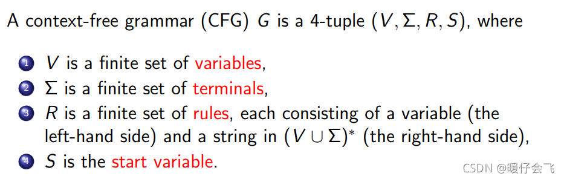

## compile && syntax

### ANTLR (ANother Tool for Language Recognition)
* ANTLR is a powerful parser generator for reading, processing, executing, or translating structured text or binary files. It's widely used to build languages, tools, and frameworks. From a grammar, ANTLR generates a parser that can build and walk parse trees.
* [lab](http://lab.antlr.org/)
* [C# Antlr](https://learn.microsoft.com/en-us/dotnet/csharp/language-reference/language-specification/grammar)

### Roslyn 
* Roslyn is the open-source implementation of both the C# and Visual Basic compilers with an API surface for building code analysis tools.
* [antlr.lab](http://lab.antlr.org/)

## Lex (lexical analyzar) && 
*  词法分析工具
*  通过正则表达式匹配文本，将文本分解为一系列 Token

## Yacc (Yet Another Compiler Compiler)
* 与Altr的差异
```
ANTLR在功能和灵活性上更加强大，支持更广泛的语法定义和多种编程语言，而Yacc更专注于生成C语言的语法分析器，并提供了基于LR分析的功能。
```
* 

## JSON(JavaScript Object Notation)
* a lightweight **data-interchange** format


## javacc

## Roslyn

## AST的生成工具
* YACC Antlr JavaCC，javascript-ast可视化语法树

## CommonLisp
* [MainPage](https://lisp-lang.org/)
* Part of what makes Lisp distinctive is that it is designed to evolve. Like DNA, such a language does not go out of style.
* S-expression 

### AOT (ahead of **time**)
* 它是一种编译技术，用于在应用程序运行之前将Java字节码编译成本地机器码。与传统的Java虚拟机（JVM）的即时编译（JIT）不同，AOT编译在应用程序部署时进行，而不是在运行时。
* AOT编译通常会在特定的平台上进行，因此生成的本地机器码可能会限制应用程序的可移植性。

## CFG (context free grammar)
* 在计算机科学中，若一个形式文法G = (N, Σ, P, S) 的产生式规则都取如下的形式：V->w，则谓之。其中 V∈N ，w∈(N∪Σ)* 。上下文无关文法取名为“上下文无关”的原因就是因为字符 V 总可以被字串 w 自由替换，而无需考虑字符 V 出现的上下文。
*  <br>
* 对应的是上下文有关语法(context sesitive gramman) 
* [练习](https://web.stanford.edu/class/archive/cs/cs103/cs103.1156/tools/cfg/)，自测的例子 
```
S → E
E → N | E O E
N → 0 | 1 | 2 | 3
O → + | -
```
* [DAG-CFG]https://kg86.github.io/visds/dist/vis_dag.html?input_text=1+%3D+b%0A2+%3D+a%0A3+%3D+2%2C+1%0A4+%3D+3%2C+2%0A5+%3D+4%2C+3%0A6+%3D+5%2C+4%0A7+%3D+6%2C+5%0A

### 形式语言

## 巴斯克范式(BNF)
* 可以理解为是专门用来描述（定义）语言的元语言（意思是说它就是最底层的描述）
* BNF是描述编程语言的文法。
* 它是由约翰·巴科斯（John Backus）和彼得·诺尔（Peter Naur）首先引入的用来描述计算机语言语法的符号集。
* 然语言存在不同程度的二义性。这种模糊、不确定的方式无法精确定义一门程序设计语言。必须设计一种准确无误地描述程序设计语言的语法结构，这种严谨、简洁、易读的形式规则描述的语言结构模型称为文法。

## 如何定义一个语言
* 定义出优先的符号
* 定义出符号之间的关系
* 具有动态扩展的能力
* 从0到∞的能力

### 形式语言
* 形式语言是一种用于描述语言结构的数学工具。它可以用来形式化描述自然语言、编程语言、通信协议等各种语言的语法和语义。
* 类型
  * 形式文法
    * 上下文无关文法
    * 正则文法
  * 自动机
* 形式语言的基本思想是通过形式规则来描述语言的结构，这些规则可以用形式文法的形式来表示。形式文法由一组产生式（规则）组成，每个产生式定义了如何将一个符号串替换为另一个符号串。通过应用这些产生式，可以逐步生成出属于该形式语言的合法句子。
* 可以任务形式语言是检查语言是否合法的**标准**，所以用在语法分析中，用来生成AST

## 正则表达式
* 使用的是**正则语言**，是一种模式匹配的描述语言

## reference
* [homepage](https://www.antlr.org/)

## understanding
* 你的衣服被他重载了
* 你的衣服被他重新实现了一遍
* 正则表达式是对字符处理的终极抽象
* 形式语法 ==> 形式语言  ===> 编程语言，需要使用少量的符号来表达出全量的世界
* 上下文无关文法 ==> 巴斯克范式 => C C# .etc
* 正则语言 => 正则表达式
* 形式语言是描述语言的语言


### onecompiler，可以在线编译多种语言
* 