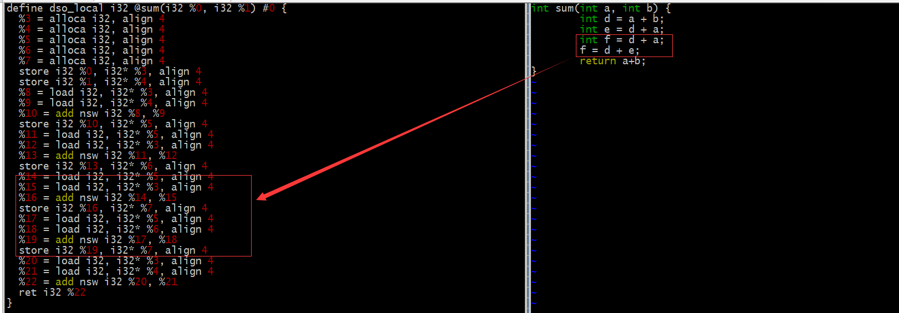

## Language Theory

### 公共子表达式消除

### Value Numbering（值编号）
* 各个变量和表达式进行编号，同时放入一个map中，后面有新的表达式，会优先在map中查找，如果有，则替换掉。没有，则插进去。
#### (LVN)Local value numbering 
```
a1 = b1 + c1
b2 = c1 + d1
e1 = a1 + b2
f1 = c1 + d1
```
```
a1 = b1 + c1
b2 = c1 + d1
e1 = a1 + b2
f1 = b2
```
#### (GVN)Global value numbering

### SSA(static single assignment)
* 一种中间表示形式，用于在编译器中表示程序的计算过程。它是一种静态的形式，其中每个变量在程序中只被赋值一次，并且在整个作用域内保持不变。这种特性使得SSA形式更容易进行数据流分析和优化。
* 去除了在高级语言中的命名体系

### 复制传播(copy propagation)
* 变化前后
```
y = x
z = 3 + x
```
```
y = x
z = 3 + y
```

### 常量传播(Constant Propagation)
* 常量传播是指在编译器优化过程中，将常量值替换到程序中使用这些常量的地方。当编译器发现一个变量**只被赋值**一次，并且该值在后续的代码中不再发生改变时，可以将这个变量替换为其常量值。
```
int foo() {
    int x = 10;
    int y = x + 5;
    return y;
}
```
优化后变为
```
int foo() {
    int y = 10 + 5;
    return y;
}
```
### 常量折叠（Constant Folding）
* 常量折叠是指在编译器优化过程中，将表达式中的常量计算为一个单一的常量值。当编译器在编译时可以确定表达式的值时，会直接将表达式替换为计算得到的常量值。
```
int foo() {
    int y = 10 + 5;
    return y;
}
```
优化后变为
```
int foo() {
    return 15;
}
```
### llvm opt命令 优化选项
```
adce：入侵式无用代码消除。
bb-vectorize：基本块向量化。
constprop：简单常量传播。
dce：无用代码消除。
deadargelim：无用参数消除。
globaldce：无用全局变量消除。
globalopt：全局变量优化。
gvn：全局变量编号。
inline：函数内联。
instcombine：冗余指令合并。
licm：循环常量代码外提。
loop-unswitch：循环外提。
loweratomic：原子内建函数 lowering。
lowerinvoke：invode 指令 lowering，以支持不稳定的代码生成器。
lowerswitch：switch 指令 lowering。
mem2reg：内存访问优化。
memcpyopt： MemCpy 优化。
simplifycfg：简化 CFG。
sink：代码提升。
tailcallelim：尾调用消除
```

### 死代码删除(Dead code elimination)
* 移除对程序运行结果没有任何影响的代码

###  死代码删除、控制流优化，以及高级优化如循环优化、函数内联和全局优化等

### JIT (just in time)
* 为了理解什么是 JIT 编译器，让我们回顾原始的术语。这个术语来自 Just-in-Time 制造，一种商业策略，即工厂**按需制造或者购买物资**，而**不引入库存**。在编译过程中，这个比喻很合适，因为 JIT 编译器不会将二进制程序存储到磁盘（库存），而是在你需要它们的时候开始编译程序部分。