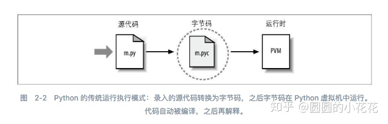

"# 语言虚拟机
## JVM
* java vm
* 屏蔽了与具体平台相关的信息，使Java语言编译程序只需要生成在JVM上运行的目标字节码（.class）,就可以在多种平台上不加修改地运行。Java 虚拟机在执行字节码时，把字节码解释成具体平台上的机器指令执行。因此实现java平台无关性。

## PVM 
* python vm 
* 将源码编译成运行在虚拟机上执行的opcode(pyc文件)，pyc文件是在python虚拟机上执行的一种跨平台字节码。
* 
* Actually, all the things that VM do is simulating what the OS do to excute a program.
* In Python, there is a class to describe the envrionment at running time – PyFrameObject. It’s a simulation of stack frame in x86 platform. Bytecode is not designed to be executed by the processor directly, but rather by another program. It is most commonly used by a software based interpreter like Java or CLR. They convert each generalized machine instruction into a specific machine instruction or instructions so that the computer's processor will understand. 
*

## PHP VM
* Zend(PHP公司) 虚拟机
* _zend_vm_stack
```
<?php
$i = 1;
$j = 2;
echo $i + $j;

echo "hello world!";
----------------------------------------------------------------------------------
--需要安装vld扩展
php -dvld.active=1 t.php                
Finding entry points
Branch analysis from position: 0
1 jumps found. (Code = 62) Position 1 = -2
filename:       /home/sandstone/t.php
function name:  (null)
number of ops:  10
compiled vars:  !0 = $i, !1 = $j
line     #* E I O op                           fetch          ext  return  operands
-------------------------------------------------------------------------------------
   2     0  E >   EXT_STMT                                                 
         1        ASSIGN                                                   !0, 1
   3     2        EXT_STMT                                                 
         3        ASSIGN                                                   !1, 2
   4     4        EXT_STMT                                                 
         5        ADD                                              ~4      !0, !1
         6        ECHO                                                     ~4
   6     7        EXT_STMT                                                 
         8        ECHO                                                     'hello+world%21'
   7     9      > RETURN                                                   1

branch: #  0; line:     2-    7; sop:     0; eop:     9; out0:  -2
path #1: 0, 
```

## OpCode vs ByteCode
* ByteCode: the name bytecode comes from instruction sets that have one-byte opcodes followed by optional parameters.
* OpCode: operation code; As its name suggests, the opcode is a type of code that tells the machine what to do, i.e. what operation to perform. 
* 大概理解是这样的：ByteCode是java 虚拟机使用的中间代码层；而Opcode可以指汇编的代码，也用来指脚本语言python、php等的中间代码，具有两重含义。