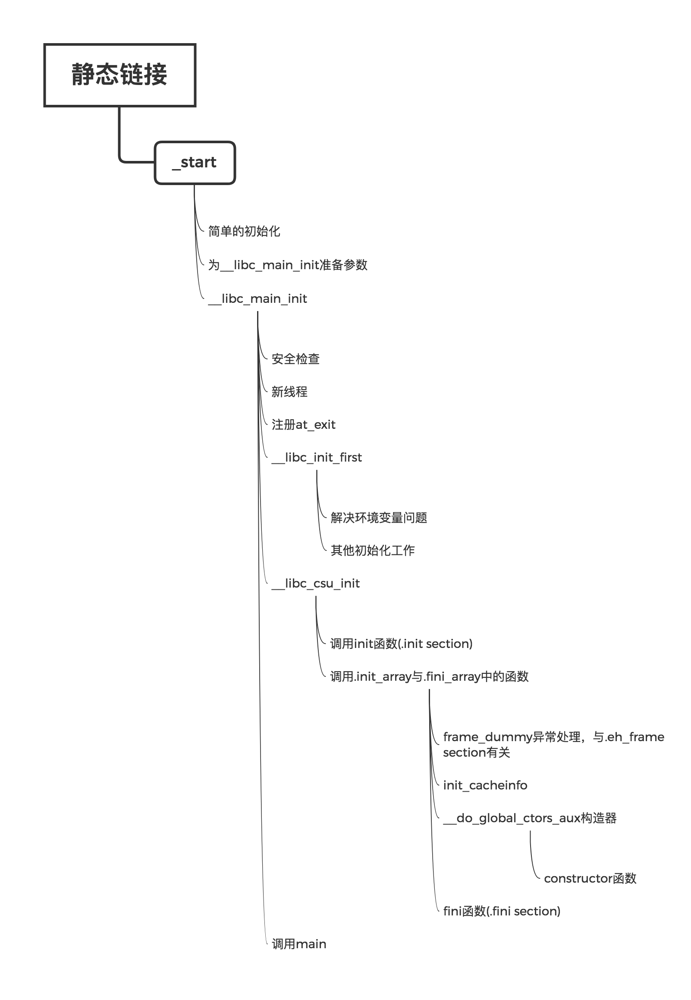
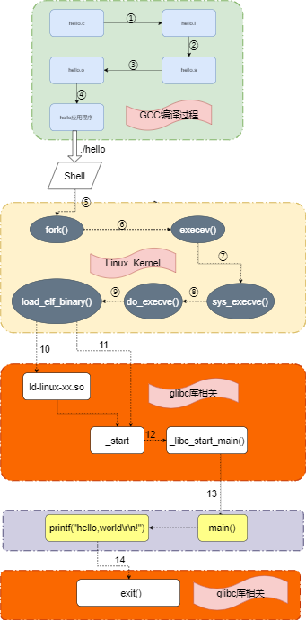

# 执行

## 查看
```
objdump -d exe
00000000004003c8 <_init>:
  4003c8:       48 83 ec 08             sub    $0x8,%rsp
  4003cc:       48 8b 05 25 0c 20 00    mov    0x200c25(%rip),%rax        # 600ff8 <__gmon_start__>
  4003d3:       48 85 c0                test   %rax,%rax
  4003d6:       74 05                   je     4003dd <_init+0x15>
  4003d8:       e8 43 00 00 00          callq  400420 <.plt.got>
  4003dd:       48 83 c4 08             add    $0x8,%rsp
  4003e1:       c3                      retq  

00000000004005c4 <_fini>:
  4005c4:       48 83 ec 08             sub    $0x8,%rsp
  4005c8:       48 83 c4 08             add    $0x8,%rsp
  4005cc:       c3                      retq   
```
## load
* fork & execve，见(os/process)条目中的介绍
* 涉及到执行权的切换
* 
* 

## Process setup includes:
* Allocates primary memory for the program's execution.
*  Copies address space from secondary to primary memory.
* Copies the .text and .data sections from the executable into primary memory.
* Copies program arguments (e.g., command line arguments) onto the stack.
* Initializes registers: sets the esp (stack pointer) to point to top of stack, clears the rest.
* Jumps to start routine, which: copies main()'s arguments off of the stack, and jumps tomain().

## 理解
* 内部执行的时候是一个指令可以随意跳转的世界，程序员视角的main函数，其实是os给的执行入口而已，有点像**楚门的世界**和使用springboot编程