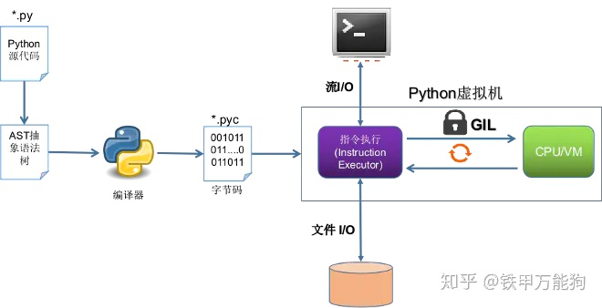
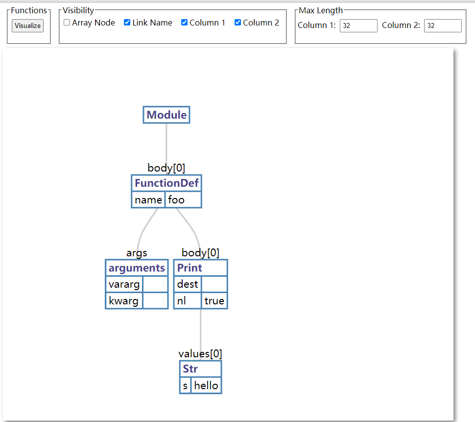

# Python
## types
* C 语言编写实现的 Python，又称为 CPython。平时我们所讨论的 Python，指的其实就是 CPython
* 用 Java 语言实现的 Python 称为 JPython
* 用 .net 实现的 Python 称为 IronPython
* 其他语言写的python的原因
```
在嵌入式系统中运行 Python 代码。
与运行框架（如 Java 或 .NET）或其他语言做代码集成。
在 Web 浏览器中运行 Python 代码。
```
* PyPy 可能是最令人兴奋的 Python 实现，因为其目标就是将 Python 重写为 Python。在 PyPy 中，Python 解释器本身是用 Python 编写的。
* 执行过程 
* Python虚拟机（VM）是一个单独的程序，在CPython编译器生成字节码后才会出现。 它实际上是对物理CPU的模拟-它具有软件定义的栈，指令指针(EIP)和其他功能。 虽然，其他虚拟机可能还有很多其他组件，例如寄存器等，但是CPython VM完全基于栈数据结构，这就是为什么它通常被称为“基于栈”的虚拟机的原因。
* Python解释器可以直接且对最终用户透明地运行编译的C代码。必须将C代码编译到称为扩展模块的特定类型的动态库中。这些模块是成熟的Python模块，但是其中的代码已由标准C编译器预编译为机器代码。
* Python的加载so动态链接库就是C的dlopen
## disassemble
* test code 
```
#!/usr/bin/env python3
# encoding: utf-8

def f(a, b):
	return a + b

if __name__ == '__main__':
    import dis
    #dis.show_code(f)
    dis.dis(f)
-------------------------------------
  5           0 LOAD_FAST                0 (a)
              2 LOAD_FAST                1 (b)
              4 BINARY_ADD
              6 RETURN_VALUE
```

## ast
* visualize: https://vpyast.appspot.com/ 
* 例子
```
st='def foo():\n    print("hello")'
import ast
print(ast.dump(ast.parse(st)))
-------------------------------------------------
 > python ./test.py 
Module(body=[FunctionDef(name='foo', args=arguments(args=[], vararg=None, kwarg=None, defaults=[]), body=[Print(dest=None, values=[Str(s='hello')], nl=True)], decorator_list=[])])
```
