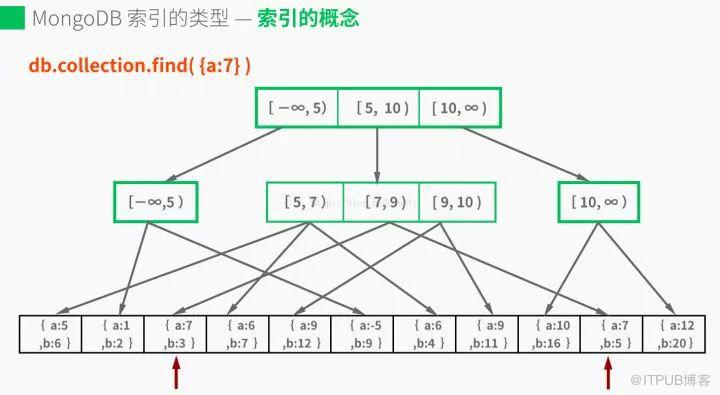
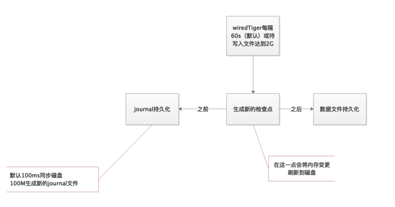
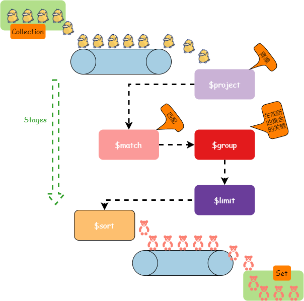
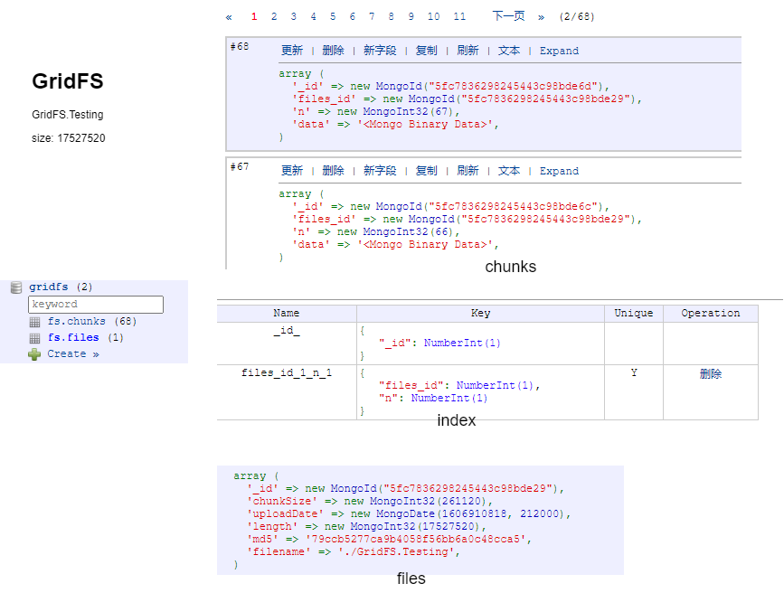
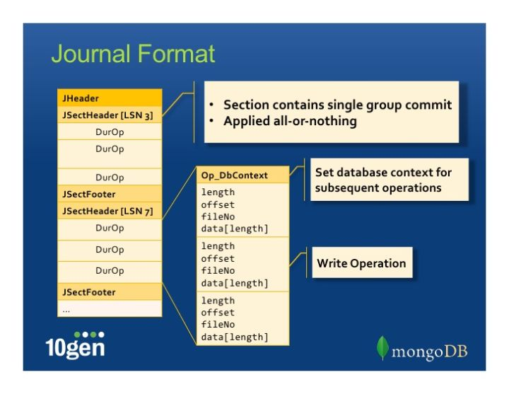
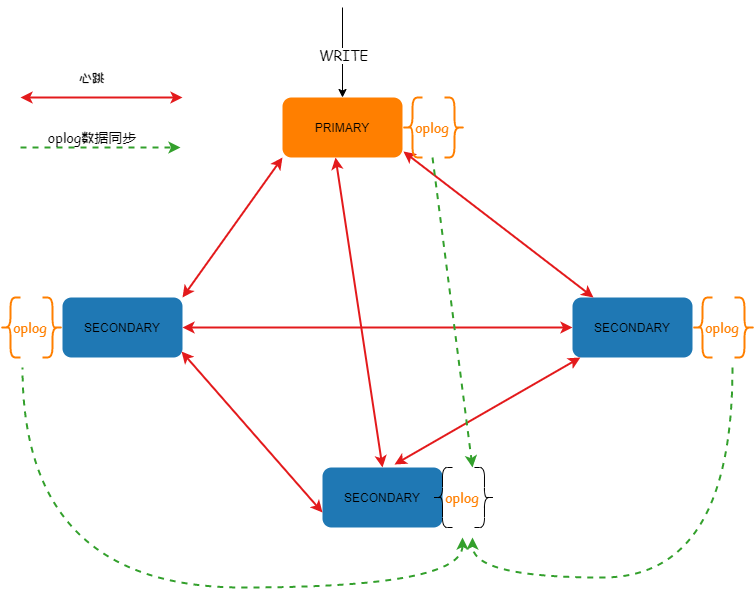
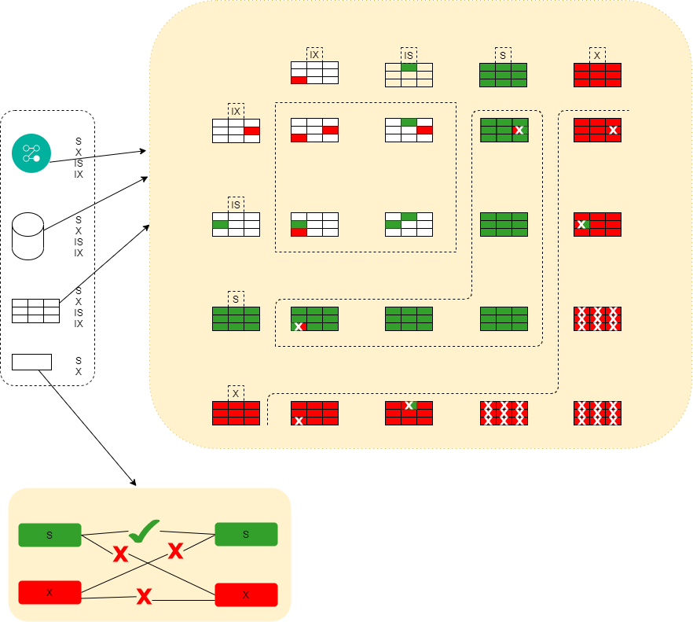

# mongo
* MongoDB 的名称取自“humongous” (巨大的) 的中间部分，像googol一词代表的是一个天文数字（1的100次幂），安德森注册域名拼写错误变成了google

## feature 
* Document-Oriented Storage
* JSON-style document
* schemaless
* distributed
* Open Source

## 数据模型(Data Model)
* BSON -> Document(Record) -> Collection(Table) -> Database -> Server
* 关于ObjectId: 除非你使用的是一个非常老的版本，或者很小众的某个驱动，应该都不需要为重复的ObjectId担心。
```
ObjectId = epoch时间(4字节) + 机器标识(3字节) + 进程号PID(2字节) + 计数器(3字节)
---------------------------------------------------------------------------------------------------
计数器的实现细节会影响到objectId是否冲突；另外3个字节也可能会影响，但是实际上基本不可能
```
* 使用embed来替换关系数据库的join

## index
* 基本模式<br/>

* 每个索引需要8KB的空间
* 索引是数据库层的概念，存储引擎对待索引就和对象普通的数据是一样的
* 关键的连接数据是RecordId的概念，是存储引擎内部保存的对记录的唯一ID，不是'_id'，查看方式如下:
```
shell中的使用方式
db.collection.find( { a: 1 } ).showRecordId()
db.collection.find( { a: 1 }, { $recordId: 1 } ).showRecordId()
```

## wiredTiger
* 

## operations 
* update： 更新同样的内容, bulkwrite: 更新不同的内容
* find[One|More]
* aggregation pipeline, 流水线操作，把数据库该做的都做了<br/>

* mapreduce: 使用js引擎执行数据的操作，因为js本身就有mapreduce函数，具有很大的灵活性，可以对数据进行很多的操作。但是由于需要JS解释执行,所以相比aggregation性能较差。
```
 var mapFunction2 = function() {
    for (var idx = 0; idx < this.items.length; idx++) {
       var key = this.items[idx].sku;
       var value = { count: 1, qty: this.items[idx].qty };

       emit(key, value);
    }
};

var reduceFunction2 = function(keySKU, countObjVals) {
   reducedVal = { count: 0, qty: 0 };

   for (var idx = 0; idx < countObjVals.length; idx++) {
       reducedVal.count += countObjVals[idx].count;
       reducedVal.qty += countObjVals[idx].qty;
   }

   return reducedVal;
};


var finalizeFunction2 = function (key, reducedVal) {
  reducedVal.avg = reducedVal.qty/reducedVal.count;
  return reducedVal;
};

db.orders.mapReduce(
   mapFunction2,
   reduceFunction2,
   {
     out: { merge: "map_reduce_example2" },
     query: { ord_date: { $gte: new Date("2020-03-01") } },
     finalize: finalizeFunction2
   }
 );

```
* 注意: 4.4版本增加了$accumulator 和 $function两个聚合操作，使用$function可以自定义函数来实现mongodb不支持的行为，所以讲道理，4.4版本之后，所有的mapreduce就可以退出历史舞台了。 虽然$function的body部分还是需要js引擎来执行，但是由于是在聚合上下文中，所有效率要提升不少。但是，还是需要注意，尽量使用官方提供的操作符，减少js的使用
* ps: 上述的所有操作都是在**同一个collection**中发生的
* Write convern
```
{ w: <value>, j: <boolean>, wtimeout: <number> }
w: [0-n] | majority  write的个数或者多数
j: true  | false           journal 
```

* save的问题： （1）可能覆盖别人的修改 （2）增大oplog，增加replica 的负担
## 游标 
### 游标的关闭
* 游标超时： 即一个游标在服务端超过10分钟无人访问，则会被回收掉
* 访问完毕
### 游标隔离
* 
### 访问数据的方式
* 批次访问
* find()和aggregate()首次返回101个文档，后面没有具体的数量限制(但是一般驱动自己会配置限制)，但是不能超过16M
```
1. 驱动中会保存batchSize条已经保存在本地的记录，可以使用next()方法获取，但是如果本地缓存访问完毕后，需要驱动程序getmore再次获取batchSize条数据
2. toArray函数是遍历游标后返回的一个数组，所以除非你确定返回数据量有限，否则不要随便toArray(); 在可能的情况下，还是尽可能使用hasNext()/next()来得更好。
3. 2次getmore之间间隔了超过10分钟，即一个游标在服务端超过10分钟无人访问，则会被回收掉。这时候如果你再针对这个游标进行getmore，就会得到游标不存在的错误（是的，超时的游标在数据库中是不存在的，你得到的错误不会是超时，而是游标不存在。为了便于理解，我们下面还是称之为“游标超时”）。
4. 我们已经知道游标是存在于一台服务器上的，如果你的负载均衡毫无原则地将请求转发到任意服务器上，getmore同时会因为找不到游标而出现“游标不存在”的错误。
5. toArray是将当前游标位置之后的元素整理为数组，如果需要从头整理，需要rewind
6. toArray发生在驱动中，也是要将所有的数据fetch到驱动这边进行整理
7. 对于多个数据的访问，需要有游标或者指针类似的机制进行访问
8. 每个游标都有一个唯一id
```


## oncurrency control
* 使用多粒度锁，包括global(instance), database or collection level，并且允许存储引擎实现在collection之下的锁，比如WiredTiger实现了document-level锁

## work mode 
* master - slave: 从3.2版本之后，就不建议使用这种模式了，这种模式并不能保证高可用，出故障时候比较难处理；因为这种模式仅同步数据，不能保证多节点写入
* replica set 
* cluseter 

### GridFS
* GridFS is a specification for storing and retrieving files that exceed the BSON-document size limit of **16 MB**.
* 测试:
```
filename: GridFS.Testing 
size: 17527520 
mongofiles -u "testing" -p "testing" --host  192.168.1.1 --port 40000 -d gridfs put ./GridFS.Testing  --authenticationDatabase  admin
```
* 测试结果<br/>

* 就是将大文件切成大小相同的块，没有使用级联的方式
* 没有使用系统级的文件，好处有：(1)屏蔽操作系统差异(2)当访问部分数据的时候，可以直接找到sectoin(chunk)
### Journal
* In journaling, all the records or journals written in consecutive tracks (similar as an arrays data structure)so that seek time will be very less as compared to random access. this is the main benefit of journalling.
* 顺序存储，便于磁盘IO
* 一个mongodb实例中所有的databases共享journal文件，这点与wiredTiger的checkpoint不同

## WiredTiger
* WiredTiger provides a **document-level concurrency model**, checkpointing, and compression, among other features.
* 来自于**sleepyCat**，多么形象的两个名字，瞌睡猫，焦虑虎
* 大多数的读和写，使用乐观锁，如果冲突则重试
### durability 
* journal record format
<br/>每个JsectHeader之间的Durop是属于一个事务范围，一起提交，一起成功，一起失败，即all-or-nothing

## oplog 
* oplog是local库下的一个固定集合，示例<br/>
```
array (
  'ts' => new MongoTimestamp(1602850503, 70),
  'h' => new MongoInt32(0),
  'v' => new MongoInt32(2),
  'op' => 'u',
  'ns' => 'Goal_ht.PlayerIds',
  'o2' => 
  array (
    '_id' => new MongoId("5d62127598245451a265edf2"),
  ),
  'o' => 
  array (
    '$set' => 
    array (
      'mailId' => new MongoInt32(439),
    ),
  ),
)
ts：8字节的时间戳，由4字节unix timestamp + 4字节自增计数表示。
这个值很重要，在选举(如master宕机时)新primary时，会选择ts最大的那个secondary作为新primary。
op：1字节的操作类型，例如i表示insert，d表示delete。
ns：操作所在的namespace。
o：操作所对应的document,即当前操作的内容（比如更新操作时要更新的的字段和值）
o2: 在执行更新操作时的条件，仅限于update时才有该属性。
其中op，可以是如下几种情形之一：
"i"： insert
"u"： update
"d"： delete
"c"： db cmd
"db"：声明当前数据库 (其中ns 被设置成为=>数据库名称+ '.')
"n": no op,即空操作，其会定期执行以确保时效性 。
```
* Oplog 是用于存储 MongoDB 数据库所有数据的操作记录的
* oplog 中每个操作都是**幂等性**的，也就是说，无论是对目标数据库应用一次还是多次，oplog操作都会产生相同的结果。这样就保证了数据的一致性。
* Oplog 可以说是Mongodb Replication的纽带
* mongodb相关操作
```
查看 Oplog 的状态
rs.printReplicationInfo()
configured oplog size:   2048MB
log length start to end: 4393911secs (1220.53hrs)
oplog first event time:  Fri Oct 16 2020 20:15:03 GMT+0800 (CST)
oplog last event time:   Sun Dec 06 2020 16:46:54 GMT+0800 (CST)
now:                     Sun Dec 06 2020 16:46:54 GMT+0800 (CST)
-----------------------------------------------------------------------------------------------------------------------------------------------------------
db.getReplicationInfo()
{
        "logSizeMB" : 2048,
        "usedMB" : 2097.49,
        "timeDiff" : 4393891,
        "timeDiffHours" : 1220.53,
        "tFirst" : "Fri Oct 16 2020 20:15:03 GMT+0800 (CST)",
        "tLast" : "Sun Dec 06 2020 16:46:34 GMT+0800 (CST)",
        "now" : "Sun Dec 06 2020 16:46:38 GMT+0800 (CST)"
}
-----------------------------------------------------------------------------------------------------------------------------------------------------------
查看表的状态
use local;
db.collectionName.stats();
```
* 使用方式: 从同步源复制oplog并在异步进程中进行应用，并在本地的local中进行保存

### Capped Collections
* 一种固定大小的集合，支持高吞吐量的操作；工作模式类似于一个循环缓冲区，按照存数据的顺序取数据
* 使用场景，oplog


## 复制集
* 维护同样一份数据集的一组mongod实例
* **The replica set cannot process write operations until the election completes successfully**. Your application connection logic should include tolerance for automatic failovers and the subsequent elections. 也就是在mongod的驱动中，需要兼容和处理故障转移和选举
* 一组复制集最大有50个成员，但是只能有7个选举成员
* 复制状态机 Replicated State Machine
```
相同的初始状态 + 相同的更新日志 = 相同的最终状态
```
* 基本结构<br/>


### 同步数据
* 初始同步：从其中一个成员拷贝所有的数据； 适用情况（1）新加节点（2）严重过期的节点(即oplog已经被覆盖)；这种同步期间遇到网络错误，老版本则会重新进行同步，4.4版本后则会24小时之内继续同步
* mongodump --oplog可以包括dump期间的oplog，然后 mongorestore -oplogReplay可以对oplog进行重播。
* 同步整体来讲是，首次initial sync -> oplog
### 什么时候回滚
* primary本地的oplog还没有发送到从服务器priamry就挂掉了，之后primary连回来，这时该数据库已经是从库了，它的数据就会与其他数据库的数据不一致，这时候需要回滚那部分数据才行。
### 节点类型
* primary, leader, coordination
* secondary
* arbiter: 仅仅用于投票并不能成为primary的节点
### 选举算法之bully
* MongoDB 3.2.0以前选举协议是基于Bully算法, 从r3.2.0开始默认使用基于Raft算法的选举策略，即v0和v1
* 触发条件
```
1. 初始化一个副本集时
2. 副本集和主节点断开连接，可能是网络问题
3. 主节点挂掉
```
* 前提条件: 参与选举的节点数量必须大于副本集总节点数量的一半，如果已经小于一半了所有节点保持只读状态。
* 特点
```
1. 每个mongodb都有oplog机制会记录本机的操作，方便和主服务器进行对比数据是否同步还可以用于错误恢复。
2. 如果集群中大部分服务器down机了，保留活着的节点都为 secondary状态并停止，不选举了。
3. 如果集群中选举出来的主节点或者所有从节点最后一次同步时间看起来很旧了，停止选举等待人来操作。
4. 如果上面都没有问题就选择最后操作时间戳最新（保证数据是最新的）的服务器节点作为主节点。
```
* 算法细节，在mongodb的场景中，bully算法中的id对应的是priority
```
Bully算法是一种协调者（主节点）竞选算法，主要思想是集群的每个成员都可以声明它是主节点并通知其他节点。别的节点可以选择接受这个声称或是拒绝并进入主节点竞争。被其他所有节点接受的节点才能成为主节点。节点按照一些属性来判断谁应该胜出。这个属性可以是一个静态ID，也可以是更新的度量像最近一次事务ID（最新的节点会胜出）。
```
### 选举算法之raft
* 
### 选举算法之数学模型
* 如何理顺一些复杂情形？?
* 这些归属于一些分布式的问题，需要稍后再看了

### 部署
* 标准方案为3节点

## 同步方案


## 并发机制

### 意向锁
* 用于「多粒度锁(多层锁)」的场景
* 多粒度锁是为了实现更好的并发
* 用于上层使用的锁(table(collection), database, instance)
#### 类型
* 意向共享锁（intention shared lock, IS）
* 意向排他锁（intention exclusive lock, IX）
* 
### 用法
* 当使用「X」或者「S」时候，上层的所有粒度使用相应的IX、IS


## 数据库领域中的问题解决方案

## 安全性
* 由于使用到了js，但是mongodb没有浏览器的沙箱机制，所以如果使用$function,则需要在配置中启用security.javascriptEnabled

## 问题
* 存储引擎灵活配置？？
* 外部的操作机制，driver如何编写
* 跨collection的操作?
* oplog
* transaction
* 线程机制？
```
 ps -T -p 24877(mongod进程id)
```
* 存储引擎与语义解析器
* 实际的查询流程，索引的使用
* mvcc 
* 语句的分析
* explain?

## 技术点
* mmap： os会自动同步脏页到硬盘上; mmap使用匿名映射,可以用来分配大块内存(malloc分配小块内存)


## usage
```
mongorestore -h 127.0.0.1 --port 40002 -u 'user' -p 'password' --drop HC_all
mongorestore -h 127.0.0.1 --port 40003 -u 'user' -p 'password' --drop MIN_all
#--drop的意思是，先删除所有的记录，然后恢复。

mongo --quiet 127.0.0.1:40002/09-20_history -u 'user' -p 'password'   ./plus/mongo-09-20_history-20200921-171054.js    --authenticationDatabase  admin 
mongo --quiet 127.0.0.1:40002/2020-04-02_Log -u 'user' -p 'password'   ./plus/mongo-2020-04-02_Log-20200921-171557.js    --authenticationDatabase  admin 
mongo --quiet 127.0.0.1:40002/2020-04-03_Log -u 'user' -p 'password'   ./plus/mongo-2020-04-03_Log-20200921-171618.js    --authenticationDatabase  admin 
mongo --quiet 127.0.0.1:40002/2020-04-04_Log -u 'user' -p 'password'   ./plus/mongo-2020-04-04_Log-20200921-171632.js    --authenticationDatabase  admin 

mongo --quiet 127.0.0.1:40003/09-20_history -u 'user' -p 'password'   ./plus/mongo-09-20_history-20200921-171054.js    --authenticationDatabase  admin 
mongo --quiet 127.0.0.1:40003/2020-04-02_Log -u 'user' -p 'password'   ./plus/mongo-2020-04-02_Log-20200921-171557.js    --authenticationDatabase  admin 
mongo --quiet 127.0.0.1:40003/2020-04-03_Log -u 'user' -p 'password'   ./plus/mongo-2020-04-03_Log-20200921-171618.js    --authenticationDatabase  admin 
mongo --quiet 127.0.0.1:40003/2020-04-04_Log -u 'user' -p 'password'   ./plus/mongo-2020-04-04_Log-20200921-171632.js    --authenticationDatabase  admin 

```

(备用：  详细图解MongoDB 存储引擎 WiredTiger 原理解析： https://zhuanlan.zhihu.com/p/31664488 )

## reference
* [mongodb github](https://github.com/mongodb/mongo)
* [WiredTiger Github](https://github.com/wiredtiger)
* [java lock type](https://tech.meituan.com/2018/11/15/java-lock.html)
* [journal explain](http://jerwinroy.blogspot.com/2015/02/mongodb-journal-concepts.html)
* [journal explain formal](https://www.mongodb.com/blog/post/how-mongodbs-journaling-works)
* [journal explan 3](https://mongodb-documentation.readthedocs.io/en/latest/administration/journaling.html#gsc.tab=0)
* [bully algorithm](https://www.cs.colostate.edu/~cs551/CourseNotes/Synchronization/BullyExample.html)
* [关于ObjectId](https://mongoing.com/all-about-objectid)
* [复制技术内幕](https://mongoing.com/archives/72571)
* [WiredTiger存储引擎系列](https://mongoing.com/archives/category/wiredtiger%e5%ad%98%e5%82%a8%e5%bc%95%e6%93%8e%e7%b3%bb%e5%88%97)
* [存储引擎介绍pdf](http://bos.itdks.com/95f295b3d69d4316989fb1e9ec289c61.pdf)
* [wiredTiger 不错的中文文档](https://www.sypopo.com/post/9krO2mNqQq/)
* [how index works](https://medium.com/swlh/mongodb-indexes-deep-dive-understanding-indexes-9bcec6ed7aa6)