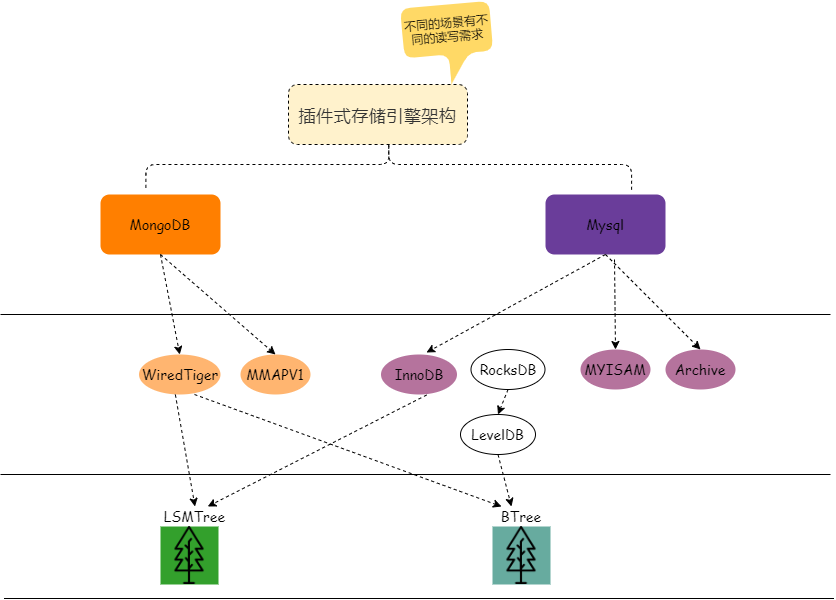
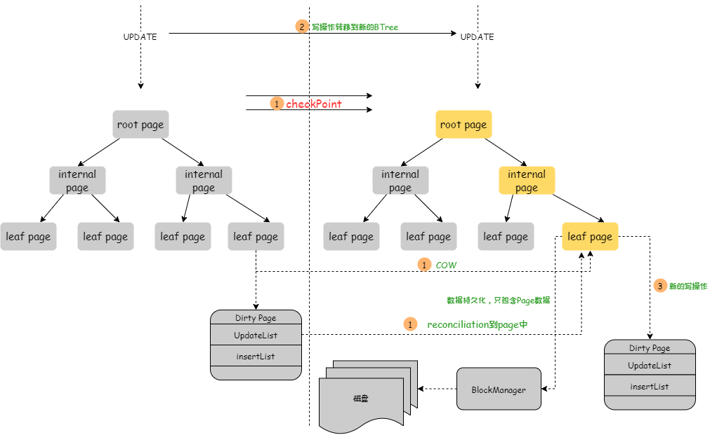
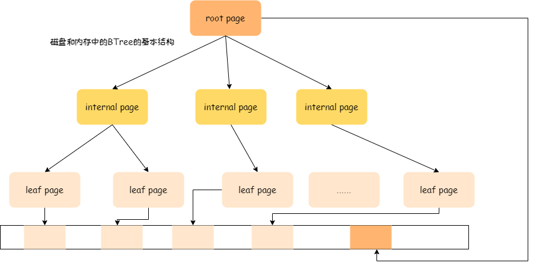
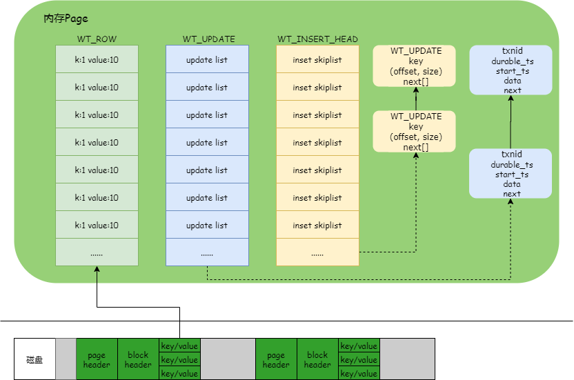
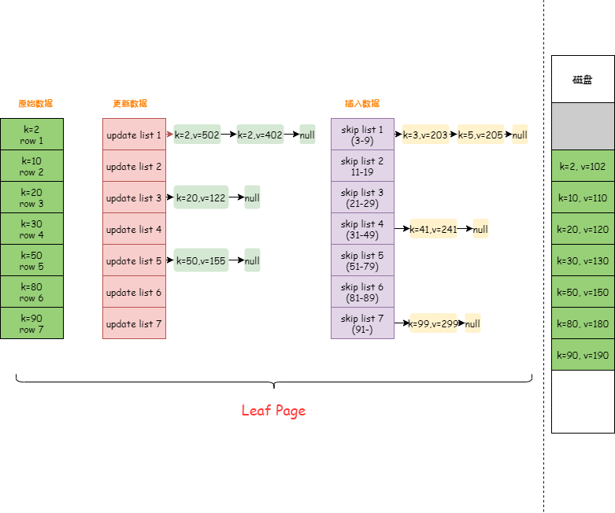
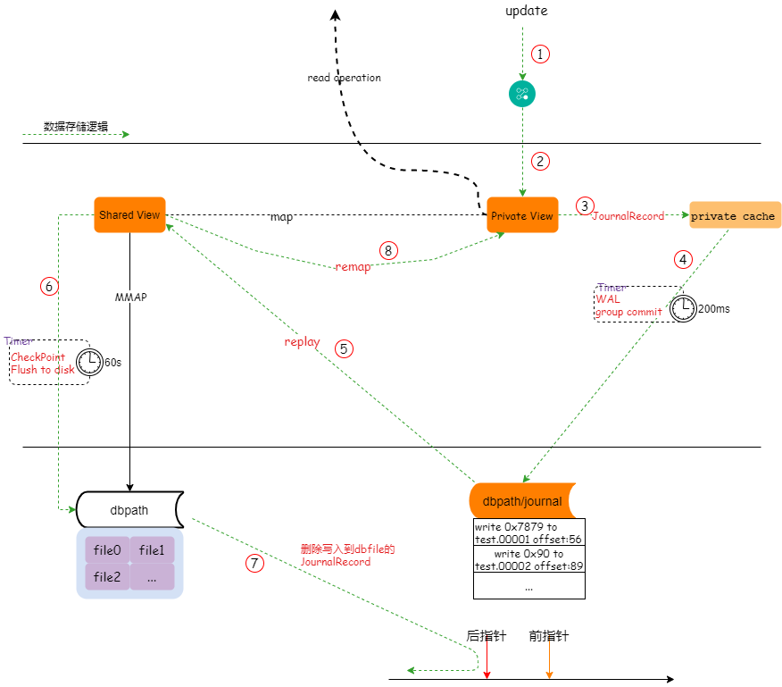

# 存储引擎
## 为什么需要存储引擎
* 当只存储一个文件的时候，我们就使用Ctl+S就行了；可是当有几十上百个文件需要同时存储的时候，我们应该怎么办呢？ 就需要一个存储调度的软件，来提升并发和吞吐量
* 比如对于wiredTiger而言，它就将所有文件直接映射到虚拟空间中，在这个虚拟空间中进行统一管理和调度
* 


## WiredTiger
* 每个collection在硬盘上对应一个物理文件和一个index文件；在内存中对应一个BTree和一个checkpoint
* 当60s进行整体checkpoint的时候，每个collection都会生成checkpoint，然后汇集到WiredTiger.wt, WiredTiger.wt再进行checkpoint到WiredTiger.turtle
* 
* 修改被写入磁盘：reconciliation，时刻：cache full、on a checkpoint、after X operations
* 释放内存: evction thread
* 校验机制：checksum， 避免磁盘有坏点等问题
* 压缩机制：snappy/zlib，在block management完成，利用目前比较快的CPU计算速度，来平衡硬盘的写入延迟
* 所有的普通write请求是基于document锁，而事务的隔离级别是snapshot
* 一对相反操作：page inmem 与 page on-disk
* 底层使用kv存储，默认是行存储 row-store，支持列存储；行存储下，key和value都是可变字符串，长度4GB - 512B
* 使用URI的方式统一定为管理的所有文件

### checkpoint
* checkpoint的生成流程<br/>
 
* **checkpoint是使用snapshot获得的**，snapshot的内容写入到磁盘就是checkpoint了，而checkpoint本质上相当于一个日志, 记录了上次Checkpoint后相关数据文件的变化
* checkpoint是面向磁盘page的变化的，也就是它快照了上次的变化数据
* snapshot 和checkpoint都是Session提供的接口
```
// checkpoint
int WT_SESSION::checkpoint	(	WT_SESSION * 	session,
const char * 	config 
)	
Write a transactionally consistent snapshot of a database.
All data files in the database are updated with snapshots that reflect the transactions committed before the checkpoint starts.

// snapshot
int WT_SESSION::sync	(	WT_SESSION * 	session,
const char * 	name,
const char * 	config 
)	
Snapshot a table or file.
Flush dirty pages from a table or file to stable storage, creating a snapshot 
```
* session create，可以看出session是基于一个collection的
```
int WT_SESSION::create	(	WT_SESSION * 	session,
const char * 	name,
const char * 	config 
)
session	the session handle
name	the URI of the object to create, such as "table:stock"
config	Configuration string, see Configuration Strings. Permitted values:
```
### cache & page & extend
* 硬盘上的B树(具体说应该是B+)映射到内存中的B树，内存中增加了对数据的操作；中间节点只存储keys，而叶子节点存储数据和keys <br/>
* 内存和磁盘上的page数据格式, 在磁盘上的page被称为extent，它由page header、block header和kv列表三部分组成，其中page header存储了extent经过解压和解密后在内存中的大小。block header存储了extent在磁盘中的大小和checksum值。kv列表中的key和value都是由cell和data两部分组成，cell存储了data的数据格式和长度，data就是具体的k/v值。具体描述如下<br/><br/>
```
Page页内检索时，通过row_array/insert_array/update_array 数组一一对应的查找。即查找的时候，需要遍历三个数组中的所有信息
``` 
* 使用例子
假如一个 page 存储了一个 [0，100] 的 key 范围，磁盘上原来存储的行 key=2， 10 ，20， 30 ， 50， 80， 90，他们的值分别是value = 102， 110， 120， 130， 150， 180， 190。在 page 数据从磁盘读到内存后，分别对 key=2 的 value 进行了两次修改，两次修改的值是分别 402，502。对 key = 20 ，50 的 value 做了一次修改，修改后的 value = 122， 155，后有分配 insert 了新的 key = 3，5， 41， 99，value = 203，205，241，299。<br/>

* cache的数据BTree的查找是以RecordId为key值的
* 如果page的size增长到配置的最大值，则会被拆分
* 
### block manager
* 将page切分为更小的block进行存储
* 压缩和解压

## disk space relaim
* The WiredTiger storage engine maintains lists of empty records in data files as it deletes documents. This space can be reused by WiredTiger, but will not be returned to the operating system unless under very specific circumstances.

### mvcc (多版本并发控制)
* 事务的实现，注意：**事务的snapshot和进行checkpoint的snapshot不同**，一个是扫描所有的事务，一个扫描BTree的修改信息
```
transaction的ACID
        ├── MVCC 
        ├── 事务snapshot
```
* 不同的连接用户看到的是不同的数据
* 基于snapshot实现了checkpoint、transaction
* MVCC利用的是对事务的状态跟踪和"一往无前"的特性
* 就好像在一个混乱的菜市场中，商贩的售卖过程也是一个有时序的流(通过称来控制)

### 理解
* 可以将wiredTiger理解为一个高并发的KV系统，接口示例：
```
        //insert
        const char *key = "some key", *value = "some value";
        error_check(session->open_cursor(session, "table:mytable", NULL, NULL, &cursor));
        cursor->set_key(cursor, key);
        cursor->set_value(cursor, value);
        error_check(cursor->insert(cursor));

        //modify
        WT_MODIFY entries[3];
        const char *key = "some key";
        /* Position the cursor. */
        cursor->set_key(cursor, key);
        error_check(cursor->search(cursor));
        /* Replace 20 bytes starting at byte offset 5. */
        entries[0].data.data = "some data";
        entries[0].data.size = strlen(entries[0].data.data);
        entries[0].offset = 5;
        entries[0].size = 20;
        /* Insert data at byte offset 40. */
        entries[1].data.data = "and more data";
        entries[1].data.size = strlen(entries[1].data.data);
        entries[1].offset = 40;
        entries[1].size = 0;
        /* Replace 2 bytes starting at byte offset 10. */
        entries[2].data.data = "and more data";
        entries[2].data.size = strlen(entries[2].data.data);
        entries[2].offset = 10;
        entries[2].size = 2;
        error_check(cursor->modify(cursor, entries, 3));

        //delete
        const char *key = "some key";
        error_check(session->open_cursor(session, "table:mytable", NULL, NULL, &cursor));
        cursor->set_key(cursor, key);
        error_check(cursor->remove(cursor));
```


### 暂时写在这里
* When an application does an insert or an update of a key/value pair, the associated key is used to refer to an in-memory page.  
* extent的理解，有点像虚拟内存分配的意思，在两个很大的空间上尽量的挥洒汗水

## MMAPV1
### journaling 
* journaling procedure<br/> 
* 从journaling的设计可以看出，我们无法百分百保证数据不丢失，能做到是尽量降低数据的丢失粒度，使用日志，我们可以做到数据丢失间隔为从60s缩短到200ms，如果想更加缩短可以使用**writeConcern**
* journal保存的是操作，用于replay，这个操作是底层对数据的某些区域的修改，比如修改file[0:offset], 而不是最上层的update、write函数
* shared view 和private view 以某种mapping相连接(写本文时还不知道使用什么技术)，效果是：相同的内容使用同样的物理内存，而不同内容才会申请新的内存页，这样避免了物理内存的浪费
* private view 向shared view的同步数据有两种方式, (1)直接内存拷贝 (2)record重放，写本文时候还没有弄清楚，个人倾向于重播，主要是mapping技术实现方式没弄清楚
* 对private view的写操作生成了journal record

## In-Memory(Mongodb企业版中可用)


## refence
* [WiredTiger的事务实现详解](https://blog.csdn.net/daaikuaichuan/article/details/97893552)