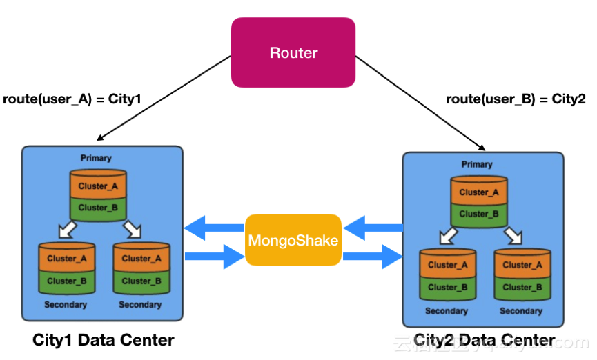
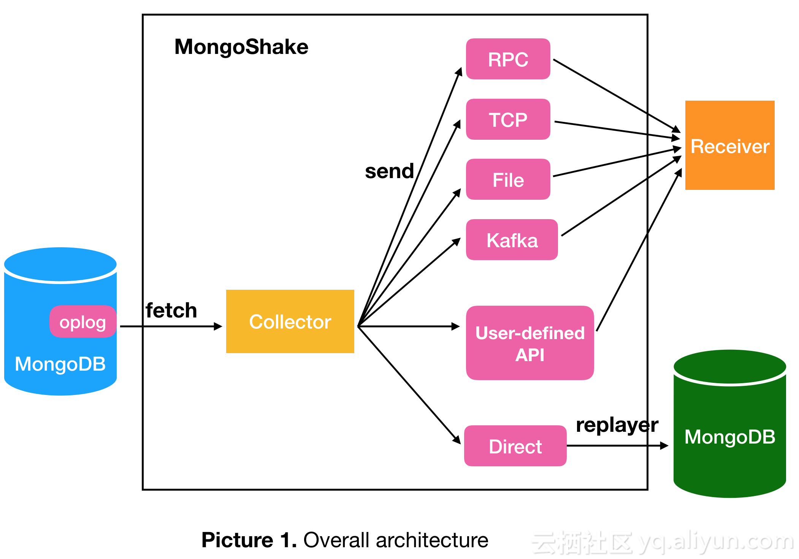
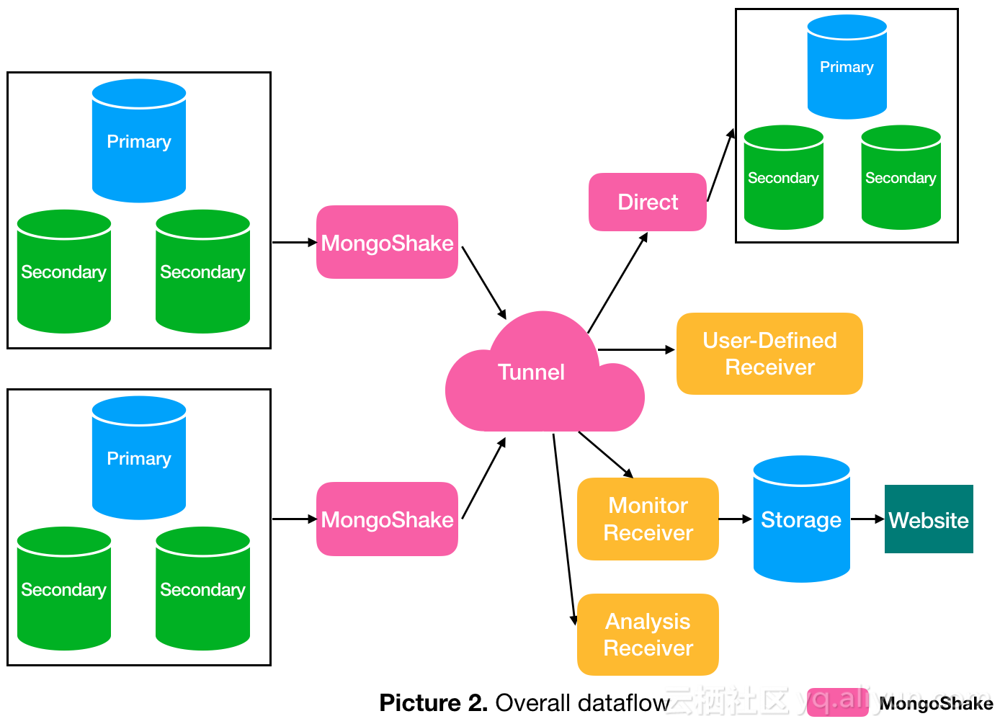

### Issue
* 要想让数据有高可用性，就得写多份数据
* 写多份的问题会导致数据一致性的问题[复制是导致出现数据一致性问题的唯一原因]
* 数据一致性的问题又会引发性能问题

### 一致性模型
* Weak 弱一致性
* Eventually 最终一致性 ---- CRDT(Conflict-Free Replicated Data Type 免冲突的可复制的数据类型)
* Strong 强一致性
* 读写一致性
* 单调读
* 因果一致性------向量时钟(vector clock)
### Replication
* Master-Slave
* Master-Master(Multi-master)
### NWR模型
### 一致性算法
* 2PC
* Paxos
* Raft

### 一致性Hash
* 热点

### 组件
* MongoShake，解决Replication同步的单向性问题

* RedisShake