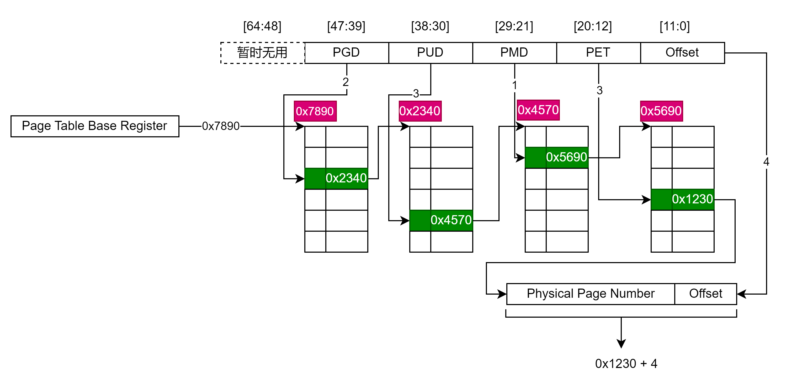
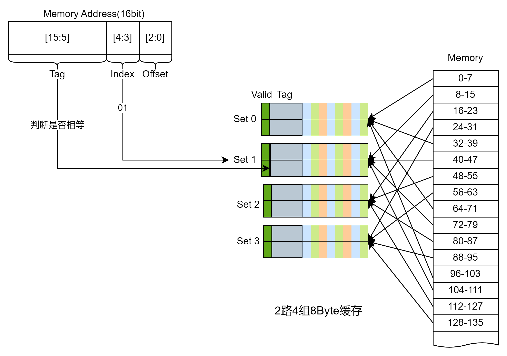
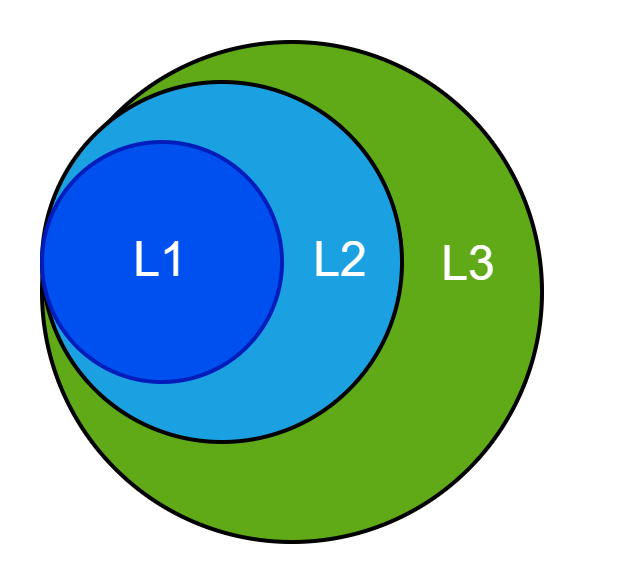
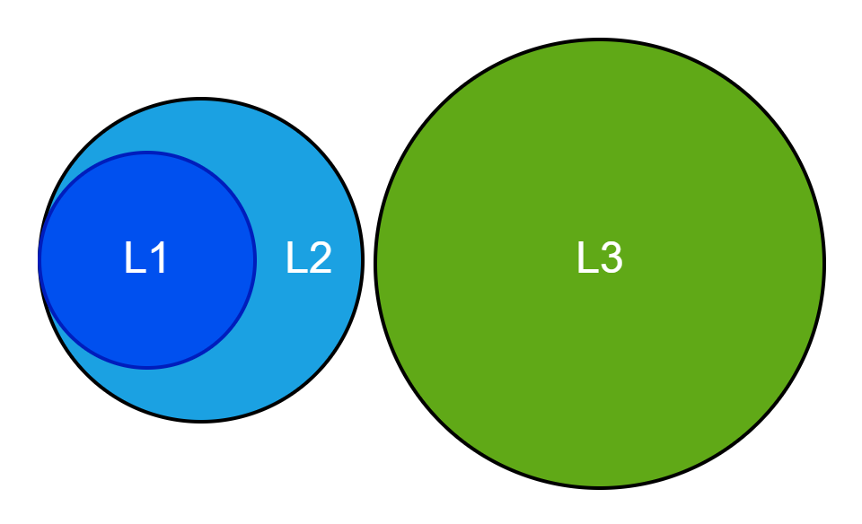

尝试去梳理一个字节从硬盘传输到寄存器的过程

引出问题
mov rax, [0x12345678]
这句话的意思，相比很多人都知道，就是将地址为0x12345678地址对应的值加载到rax寄存器中，这句话的背后究竟发生了什么呢？

## 从虚拟地址(VA,Virtual Address)到物理地址(PA,Physical Address)
### 为什么会有虚拟内存
* 多个应用程序共同使用计算机的时候，如果都直接使用物理内存，使用管理比较困难
* 物理内存的大小可能远远小于CPU的寻址范围

### 基本管理单位
* 物理内存以页帧(Frame)为单位进行管理
* 虚拟内存以页(Page)为单位，linux下查看PageSize, `getconf PAGE_SIZE`，一般为4K，占用12bit
* Page和Frame的长度一致
* 也就是物理地址和虚拟地址都按照Page或者Frame的大小进行分割管理

#### 转换信息存放处：页表
* 因为VA和PA之间无法使用某个计算来得到，是一种动态的管理
* 页表里面就存储了这种动态关系

### 页表的入口存放地
* CR3寄存器也称为PDBR(Page Directory Base Register)，所指向的地址为某个进程的页表的入口，在CPU当前进程发生改变的时候该寄存器中的值会改变

### CPU中的执行机构: MMU(Memory Management Unit)地址管理单元
* 核心作用就是将VA转为PA
* VA和PA都是线性地址空间，MMU的作用就是将两个空间进行映射
* 基本包含两个大模块
  * TLB(Translation Lookaside Buffer)地址转换后援缓冲器，页表在内存中，为了加速地址转换，将一部分可能用到的表项放入到缓存，其实就是**页表的缓存**
  * TWU(Table Walk Unit)，当TLB未命中的时候，就会启用该模块对页表进行查询

### 执行流程
##### 基本概念
* 虚拟页号 VPN(Virtual Page Number)
* 物理页号 PPN(Physical Page Number) 与 PFN(Page Frame Number)是一个意思
* 页表条目PTE(Page Table Entry)
* 页全局目录 PGD(Page Global Directory)
* 页上级目录 PUD(Page Upper Directory)
* 页中间目录 PMD(Page Middle Directory)
#### 页表的查询过程
* 我们先从只有一层页表来看，过程如下图所示

* 多级页表原来是一样的，只不过层级多了一些，下图是按照x86_64所用到的四级页表描述的

#### 

### 理解
* OS存储的页表的结构需要被CPU所理解

## 使用物理地址从内存将数据加载到CPU Cache

| 名称   | 延迟  | 对比                                                         |
| ------ | ----- | ------------------------------------------------------------ |
| 寄存器 | 1滴答 | 如果是2GHz主频的CPU，则时间为1/2G=0.5ns                      |
| L1缓存 | 1ns   |                                                              |
| L2缓存 | 4ns   | 与L1缓存相比，差不多是声速(1224km/h)和高铁(300km/h)的差异， 4倍 |
| Memory | 100ns | 与L2缓存相比，差不多是高铁(300km/h)和跑步(12km/h)的差别，25倍 |
| SSD    | 150μs | 与内存相比，慢了1500倍，差不多是跑步与蜗牛的区别             |
| HDD    | 10ms  | 与内存相比, 慢了10万倍，差不多是战斗机(2500km/h)和乌龟(20m/h)的区别；与SSD相比，慢了60倍，差不多是高铁与走路的区别 |

可以看出，如果没有L1、L2等缓存的话，CPU绝大多数的时间都在等待内存传送数据，为了提高速度，加了三层缓存，这些缓存又是如何与内存关联在一起的，我们知道物理地址是一个线性空间，
* 最简单的办法就是直接映射，就是内存中某一个地址只能被映射到某一个**特定**缓存行中，这种方式缺点就是可能数据会被提出太快。
* 还有如果使用完全关联缓存，即某一个内存地址可以被映射到**任意**一个缓存行，这种方式做数据替换很麻烦或者不现实。
* 折衷的办法就是使用组相联的方式，这也是目前使用最多的缓存映射方式。我们以Linux举例，Linux下Cache Line的信息在/sys/devices/system/cpu/cpu[0-N]/cache/index[0-3]这个目录下，目录下的信息如下表所示:

| 文件名                | 解释                                 |
| --------------------- | ------------------------------------ |
| coherency_line_size   | 一个Line的大小                       |
| size                  | 缓存总大小                           |
| level                 | 缓存等级                             |
| type                  | 缓存类型(Data、Instruction、Unified) |
| shared_cpu_list       | 哪几个CPU共享该缓存                  |
| number_of_sets        | 缓存的组数                           |
| ways_of_associativity | 每组有多少路                         |

每个CPU对应4个level的cache，一级缓存的指令和数据缓存，二级缓存和三级缓存。如果number_of_sets=64，ways_of_associativity=12，coherency_line_size=64，则size应该等于number_of_sets * ways_of_associativity * coherency_line_size = 64 * 12 * 64 = 48K。

具体应该如何映射，我们将**物理地址**分为Tag | Index | Offset四个部分，下图以16bit的地址为例，内存按照8个字节分组，Offset部分占用3bit，cache line一共4组，Index占用2bit，剩下的部分为Tag，头部追加valid字段，这样只要很少的空间(Tag+Valid)使用就能缓存8B的数据。
。

通常情况下，L1、L2、L3使用的是Inclusive方式，但是有的架构设计采用的是Non-Inclusive方式，即两层之间互相不包含数据，比如Intel Skylake的L3 Cache就不包含L2 Cache的数据，这里取决于架构设计。
 Inclusive
 L3为Non-Inclusive

目前主流机器的总线位宽是64bit，而内存与CPU的最小传输单元就是cache line size，所以即使需要一个字节，cpu也会加载cache line size(通常为64B)的数据到某个cache line中。此处有几点需要注意：
* CPU一般只会从L1缓存中读取数据，即使遇到了cache miss，数据也需要从更低级缓存加载到L1缓存再访问，当然可以bypass到L2或者更低级缓存，但是这样布线会复杂很多。
* 64B需要使用64bit总线传输8次才能凑够一个Cache line
* DDR内存可以交错处理8次的数据传送
* 不一定需要8次全部完成才能通知CPU可以继续，这个取决于设计

文件系统应该用的是block，然后block如何转为LBA是不是驱动做的呢？

https://colin-scott.github.io/personal_website/research/interactive_latency.html