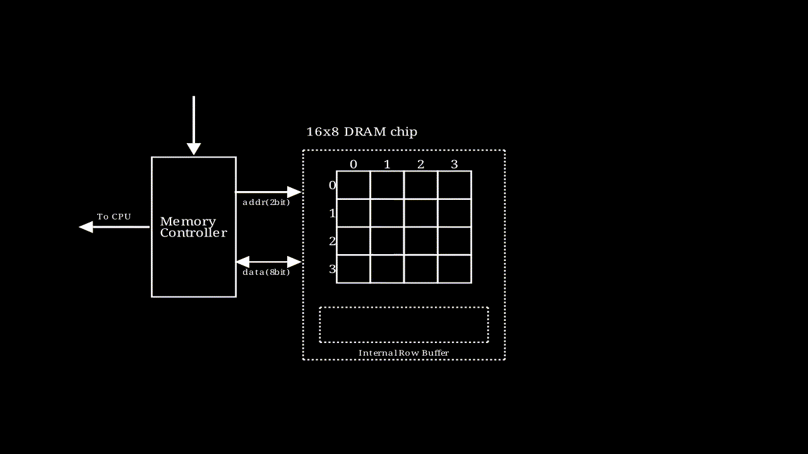
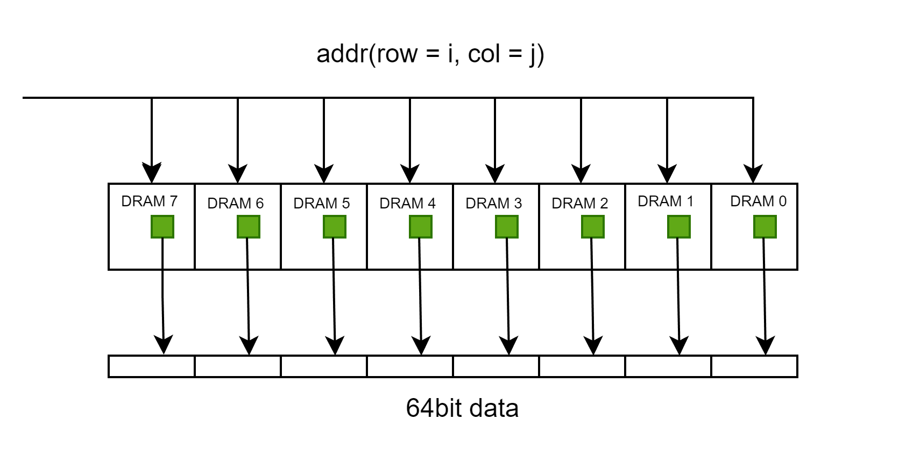
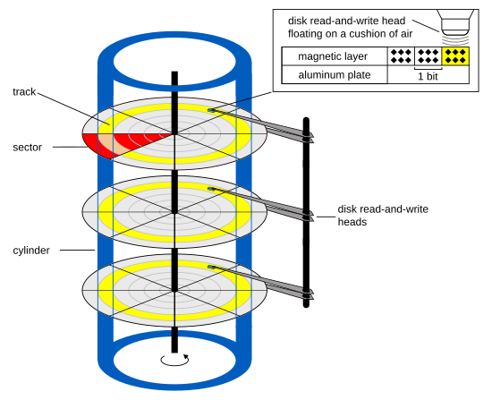
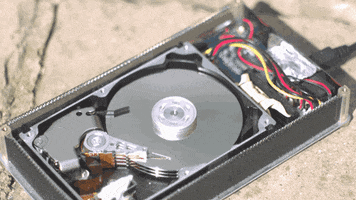

尝试去梳理一个字节从硬盘传输到寄存器的过程

引出问题
mov rax, [0x12345678]
这句话的意思，相比很多人都知道，就是将地址为0x12345678地址对应的值加载到rax寄存器中，这句话的背后究竟发生了什么呢？

数据如何从低存储层级向上流动
不做特殊说明的话，本文涉及到的内容都基于x86体系


## 使用物理地址从内存将数据加载到CPU Cache

| 名称   | 延迟  | 对比                                                         |
| ------ | ----- | ------------------------------------------------------------ |
| 寄存器 | 1滴答 | 如果是2GHz主频的CPU，则时间为1/2G=0.5ns                      |
| L1缓存 | 1ns   |                                                              |
| L2缓存 | 4ns   | 与L1缓存相比，差不多是声速(1224km/h)和高铁(300km/h)的差异， 4倍 |
| Memory | 100ns | 与L2缓存相比，差不多是高铁(300km/h)和跑步(12km/h)的差别，25倍 |
| SSD    | 150μs | 与内存相比，慢了1500倍，差不多是跑步与蜗牛的区别             |
| HDD    | 10ms  | 与内存相比, 慢了10万倍，差不多是战斗机(2500km/h)和乌龟(20m/h)的区别；与SSD相比，慢了60倍，差不多是高铁与走路的区别 |

可以看出，如果没有L1、L2等缓存的话，CPU绝大多数的时间都在等待内存传送数据，为了提高速度，加了三层缓存，这些缓存又是如何与内存关联在一起的，我们知道物理地址是一个线性空间，
* 最简单的办法就是直接映射，就是内存中某一个地址只能被映射到某一个**特定**缓存行中，这种方式缺点就是可能数据会被提出太快。
* 还有如果使用完全关联缓存，即某一个内存地址可以被映射到**任意**一个缓存行，这种方式做数据替换很麻烦或者不现实。
* 折衷的办法就是使用组相联的方式，这也是目前使用最多的缓存映射方式。我们以Linux举例，Linux下Cache Line的信息在/sys/devices/system/cpu/cpu[0-N]/cache/index[0-3]这个目录下，目录下的信息如下表所示:

| 文件名                | 解释                                 |
| --------------------- | ------------------------------------ |
| coherency_line_size   | 一个Line的大小                       |
| size                  | 缓存总大小                           |
| level                 | 缓存等级                             |
| type                  | 缓存类型(Data、Instruction、Unified) |
| shared_cpu_list       | 哪几个CPU共享该缓存                  |
| number_of_sets        | 缓存的组数                           |
| ways_of_associativity | 每组有多少路                         |

每个CPU对应4个level的cache，一级缓存的指令和数据缓存，二级缓存和三级缓存。如果number_of_sets=64，ways_of_associativity=12，coherency_line_size=64，则size应该等于number_of_sets * ways_of_associativity * coherency_line_size = 64 * 12 * 64 = 48K。

具体应该如何映射，我们将**物理地址**分为Tag | Index | Offset四个部分，下图以16bit的地址为例，内存按照8个字节分组，Offset部分占用3bit，cache line一共4组，Index占用2bit，剩下的部分为Tag，头部追加valid字段，这样只要很少的空间(Tag+Valid)使用就能缓存8B的数据。
。

通常情况下，L1、L2、L3使用的是Inclusive方式，但是有的架构设计采用的是Non-Inclusive方式，即两层之间互相不包含数据，比如Intel Skylake的L3 Cache就不包含L2 Cache的数据，这里取决于架构设计。
 Inclusive
 L3为Non-Inclusive

目前主流机器的总线位宽是64bit，而内存与CPU的最小传输单元就是cache line size，所以即使需要一个字节，cpu也会加载cache line size(通常为64B)的数据到某个cache line中。此处有几点需要注意：
* CPU一般只会从L1缓存中读取数据，即使遇到了cache miss，数据也需要从更低级缓存加载到L1缓存再访问，当然可以bypass到L2或者更低级缓存，但是这样布线会复杂很多。
* 64B需要使用64bit总线传输8次才能凑够一个Cache line
* 不一定需要8次全部完成才能通知CPU可以继续，这个取决于设计
* 传输到address bus的地址是一个**Offset部分为0**的地址，具体就是64bit下后6位是0，32bit下后5位为0，参见[Intel® 64 and IA-32 Architectures Software Developer’s Manual](https://cdrdv2.intel.com/v1/dl/getContent/671200)
```
For Intel Core i7 processors and processors based on Intel Core, Intel Atom, and Intel NetBurst microarchitectures,Intel Core Duo, Intel Core Solo and Pentium M processors, the cache lines for the L1 and L2 caches (and L3 caches if supported) are 64 bytes wide. The processor always reads a cache line from system memory beginning on a 64-byte boundary. (A 64-byte aligned cache line begins at an address with its 6 least-significant bits clear.) 
The L1 and L2 cache lines in the P6 family and Pentium processors are 32 bytes wide, with cache line reads from system memory beginning on a 32-byte boundary (5 least-significant bits of a memory address clear.)
```

### 内存对物理地址的理解
* 此处以DDR内存作为说明对象
#### DDR SDRAM: Double Data Rate Synchronous Dynamic Random-Access Memory
* Double Data Rate的意思是可以在时钟周期的上沿和下沿传递两次数据
* Dynamic的意思是因为电容的原因需要不停地充电
* Random-Access就是支持随机访问，如同数组一样可以随机访问，比如树形结构就不支持随机访问
* Synchronous的意思是，内存控制器(目前已嵌入到了CPU中，早期计算机是放在北桥芯片中)和内存条之间使用相同的时钟新号进行数据传输，确保他们在时序上协同工作
#### 名词解释
* DIMM(Dual-Inline-Memory-Modules) 双列直插式存储模块，就是内存条本身，两面都有颗粒
* SIMM(Single-Inline-Memory-Module) 单列直插式内存模块，也是内存条，单面有颗粒
* 通道，就是CPU与内存之间的通路，有单通道、三通道、双通道、四通道等，每个通道都有独立的总线
* Cell: 最小的存储单元，存储一个bit的信息，DRAM的一个cell由一个Transistor和一个Capacitor组成，SRAM则最少需要6个Transistor
* Supercell: 若干个cell组成一个supercell，可能是8bit、16bit等，**注意工业领域并没有看到Cell和Supercell相关的称呼**，此处只是用来指代一组或者一个bit
* Rank: 提供64位数据能力，这就是内存的1R或者2R
* Bank: 一个基本的数据矩阵管理单元，我查看了[金士顿](https://www.kingston.com/cn/memory)的相关产品，服务器使用的内存颗粒使用了多bank，台式机/笔记本上内存大多数是一个bank

#### 地址如何转化为对内存的具体访问
* 当内存控制器接受到物理地址后，会对地址进行映射，即DDR Memory Mapping，确定地址所在的channel、rank、bank、row、column
* 遗憾的是，Intel并没有公开这种映射关系，参见[What's in an Address: Understanding DDR Memory Mapping](https://depletionmode.com/ram-mapping.html)，[How physical addresses map to rows and banks in DRAM](https://lackingrhoticity.blogspot.com/2015/05/how-physical-addresses-map-to-rows-and-banks.html)，只能进行逆向工程
* 物理地址信息里一定包含了channel、rank、bank、row、column这些信息，至于如何组织的，得具体去分析。

#### DRAM内部寻址过程
* ， 该动画描述了一个行地址和列地址都是2bit，输出结果为8bit的存储模块的执行过程，图中每个格子是一个supercell
* 如果要输出64bit的数据，只需要将多个这样的模块串联即可。
* 在实际中，需要看一个Chip提供多少位的数据
* 举例子[金士顿的一款台式机内存条](https://www.kingston.com/datasheets/KVR64A52BD8-64.pdf)，摘录以下片段来看
```
KVR64A52BD8-64 64GB 2Rx8 8G x 64-Bit PC5-6400 CL52 288-Pin CUDIMM
   This document describes ValueRAM's KVR64A52BD8-64 is a 8G x64-bit (64GB) DDR5-6400 CL52 Clocked Unbuffered DIMMs(CUDIMMs), 2Rx8, memory module, based on sixteen 4G x 8-bit
FBGA components and one Clock Driver (CKD). 
```
从该描述中可以看出，2Rx8 该内存条有个2个Rank，即可以提供两组64地址，8代表每个芯片颗粒是8bit，即最小寻址单元为8bit；8G x 64-bit是有8G个64bit的提供数据的能力，即8*64/8=64G；sixteen 4G x 8-bit
FBGA标识有16个内存颗粒，每个颗粒能提供4G*8bit=4GB的数据量，16*4=64GB。另外从2Rx8中也可以算出来16个颗粒，因为有2组，每组需要64/8个颗粒。
* 前面提到了一些概念，他们之间的关系如下，一个内存条可能包含1-n个rank，一个rank中可能有bank或者没有bank，没有bank可以认为一个芯片是一个bank，bank内部是二维矩阵，内存寻址在bank中进行，寻址的最小单位就是supercell或者芯片的位宽。
* **程序员眼中的8B大概率上分布在不同的芯片中，除非有64bit的内存颗粒**

## 从磁盘到内存

### 不得不说的机械磁盘
* 磁性存储技术是一种基于磁场变化来存储和检索数据的技术。它利用磁性材料的性质，通过改变磁场的方向或强度来表示数据的0和1。
*  图片来源wikipedia
* 
* 柱面（Cylinder）、磁头（Header）和扇区（Sector）三者简称CHS，可以使用**坐标系xyz**来理解
* 磁盘的最小寻址单元为sector,即只要磁头运行到扇区的上方就可以把数据读取了，一般为512B或者4KB，[seagate产品参数](https://www.seagate.com/content/dam/seagate/migrated-assets/www-content/datasheets/pdfs/barracuda-2-5-DS1907-3-2005CN-zh_CN.pdf)从这上面可以看到，物理扇区其实是4KB，但是逻辑上保持512，也就是所谓的512e，还有512n，这种就是传统的物理和逻辑上都是512n，目前比较新的是4Kn，逻辑和物理上都是4K
* 磁盘读写数据的不会停下来，而是保持一直旋转的状态，只要磁头到了扇区的上方，数据立刻就被读取或者写入进去了，即使在磁盘高速转动的情况下
* 每个盘面只有一个磁头 所有的磁头都是连在同一个磁臂上的，并且在相同的轨道上，所有磁头只能共进退
* 关于多个盘面之间的写入顺序问题有不同的说法，最常见的是"同一时刻只能有一个磁头在工作，磁头的切换可以通过电路进行控制，而选择柱面则需要机械切换，所以数据的存储是优先按照柱面进行的"

### LBA(Logical Block Address)
* 对于机械磁盘而言, LBA转为CHS，方式如下
```
cylinder：磁盘的柱面
head：磁盘的磁头，每张磁片有两个磁头
sector：磁盘扇区，这里指物理扇区，编号从 1 - 63，每条 track 的最大 sector 数 63
SPT（sector_per_track）：每磁道上的 sector 数
HPC（head_per_cylinder）：每个 cylinder 的 head 数量，这个数量应该是磁片数 * 2

LBA = (cylinder * HPC + head) * SPT + sector - 1

cylinder = LBA / (SPT * HPC)
head = (LBA / SPT) % HPC
sector = LBA % SPT + 1
```
* 对于SSD而言, LBA转为PBA(Physical Block Address)，使用FTL(Flash Translation Layer)进行，这个由SSD自动完成，操作系统不用关心，之所以要如此做，是因为SSD存在erase-before-write，不像机械磁盘一样可以原地保存
  
* 查看磁盘的IO调度策略 
```
cat /sys/block/sr0/queue/scheduler 
noop [deadline] cfq  带有[]是当前使用的
noop： 不做任何调度，将写请求放入FIFO队列
deadline：按照过期时间存储
cfq(Completely Fair Queueing): 防止IO分配的不公平，防止某些进程独占磁盘带宽
```
* 查看磁盘的块大小 blockdev --getbsz /dev/sda
* 存储的时候需要在Page(内存)、Block(文件系统)、Sector(硬件读写)之间进行单位的组织与转换，Block作为中间单元，大小上一般Page >= Block >= Sector

### Ext4文件系统

#### 先从inode开始
* 查看文件inode number
```
> ls -i example.txt 
87664379 example.txt
```
* inode number 其实就是在inode bitmap中的编号
* dumpe2fs中的信息
  * dumpe2fs /dev/vda1 中包含了丰富的信息
  ```
  Blocks per group:         32768 每个组的Block数目
  Inodes per group:         8192  每个组的Inode数目
  Block size:               4096  Block的大小
  Inode size:               256   Inode 字段的大小
  Inodes per group:         8192  每组的Inode的数量
  ```
  * dumpe2fs /dev/vda1  | grep Group查看组的个数
  * dumpe2fs /dev/vda1  | grep superblock
  ```
  Primary superblock at 0, Group descriptors at 1-3
  Backup superblock at 32768, Group descriptors at 32769-32771
  Backup superblock at 98304, Group descriptors at 98305-98307
  超级块为了冗余在多出都有存储，但是Primary的在Block 0上
  ```
  * 针对每个组
  ```
    Block bitmap at 1025 (+1025) 组的Block bitmap 在Block 1025 
    Inode bitmap at 1041 (+1041) 组的Inode bitmap 在Block 1041
    Inode table at 1057-1568 (+1057) Inode Table 在1057-1568 
    使用这个可以算得 (1568-1057 + 1)* 4 * 1024 / 256(Inode Size) = 8192和上面的8192对应
  ```
 * 如果没有现成的ext的磁盘可以使用如下的方式生成并挂载一个
 ```
 dd if=/dev/zero of=./ext4_image.img bs=1M count=64
 mkfs.ext4 ext4_image.img
 mount -o loop ext4_image.img /root/test_ext4
 dumpe2fs ext4_image.img
 ```
### 不得不提起的MBR(Master Boot Record)和GPT(GUID Partition Table)
* 都是用于磁盘分区的标准
* MBR, 1983年开始使用
* GPT，2006年以后的标准
* 之所以必须要说这两个，是因为它们分区的时候使用LBA地址的形式记录了各个分区的起始与结束的LBA编号，**文件系统如果定位block，使用文件系统block的内部编号 和 文件系统本身的LBA偏移 计算可得**

### 参考
* [延迟对比](https://colin-scott.github.io/personal_website/research/interactive_latency.html)
* [香港中文大学-CSCI2510-virtual memory](https://www.cse.cuhk.edu.hk/~mcyang/csci2510/2018F/Lec09%20Virtual%20Memory.pdf)
* [香港中文大学-CSCI2510-memory performance](https://www.cse.cuhk.edu.hk/~mcyang/csci2510/2223T1/Lec08%20Memory%20Performance.pdf)
* [Lecture13_The_Memory_Hierarchy](https://www3.cs.stonybrook.edu/~amione/CSE320_Course/materials/lectures/Lecture13_The_Memory_Hierarchy.pdf)
* [09-memory-hierarchy](https://www.cs.cmu.edu/afs/cs/academic/class/18213-f23/www/lectures/09-memory-hierarchy.pdf)
* [Intel® 64 and IA-32 Architectures Software Developer’s Manual](https://cdrdv2.intel.com/v1/dl/getContent/671200)
* [What every programmer should know about memory](https://lwn.net/Articles/250967/)
* [Linux通用块设备层](https://www.ilinuxkernel.com/files/Linux.Generic.Block.Layer.pdf)