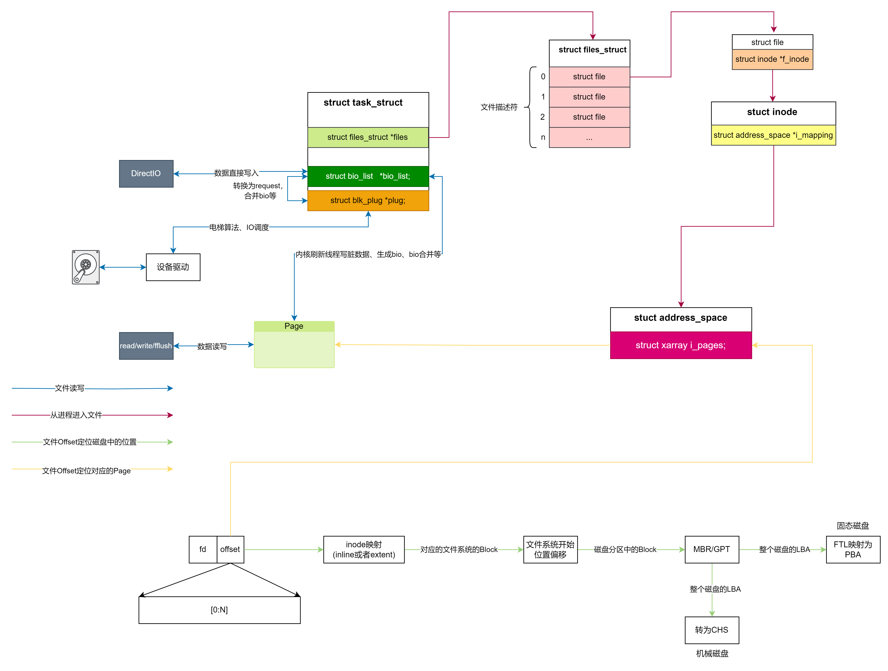

# 磁盘和内存如何聊天

```
不做特殊说明的话，本文涉及到的内容都基于x86体系和Linux6.14内核。
```
## 先说说磁盘
### 机械磁盘
* 大体的运动与工作方式，
* 磁性存储技术是一种基于磁场变化来存储和检索数据的技术。它利用磁性材料的性质，通过改变磁场的方向或强度来表示数据的0和1。
*  图片来源wikipedia，从图中可以看出，磁盘根据柱面（Cylinder）、磁头（Header）和扇区（Sector）分成三个层次，三者简称CHS，可以使用**坐标系xyz**来理解。
* 磁盘的最小寻址单元为sector,即只要磁头运行到扇区的上方就可以把数据读取了，一般为512B或者4KB，[seagate产品参数](https://www.seagate.com/content/dam/seagate/migrated-assets/www-content/datasheets/pdfs/barracuda-2-5-DS1907-3-2005CN-zh_CN.pdf)从这上面可以看到，物理扇区其实是4KB，但是逻辑上保持512，也就是所谓的512e，还有512n，这种就是传统的物理和逻辑上都是512n，目前比较新的是4Kn，逻辑和物理上都是4K
* 磁盘读写数据的不会停下来，而是保持一直旋转的状态，只要磁头到了扇区的上方，即使在磁盘高速转动的情况下数据也会立刻就被读取或者写入进去。
* 每个盘面只有一个磁头 所有的磁头都是连在同一个磁臂上的，并且在相同的轨道上，所有磁头只能**共进退**
* 关于不同盘面之间的写入顺序问题有不同的说法，最常见的是"同一时刻只能有一个磁头在工作，磁头的切换可以通过电路进行控制，而选择柱面则需要机械切换，所以数据的存储是优先按照柱面进行的"

### SSD(Solid-State Disk)
* Flash Memory: 闪(此处的闪应该是相对于机械磁盘那种龟速来说的)存，分为NOR(Not Or)闪存（BIOS中使用）和NAND(Not And与非门)闪存，一般情况NOR Flash容量较小，NAND Flash容量较大，比如U盘和SSD固态硬盘。
* 所有信息都存储在浮栅晶体管，对于不想理解硬件的程序员来说，可以记住它就是电子牢笼，里面有电子就代表0，没有电子代表1（是不是与你想的不一样，所以默认值是1），所以SSD的写其实意思就是将1变0，不会从0变为1，那个操作需要使用**擦除**，后面说到。
* 重要概念
  * **Block**: 最小擦除单位
  * **Page**: 最小读写单位
  * **Plane**: 组，提供并行读写能力
  * **Die**:  晶圆，封装多个Plane
  他们之间的关系如下
  
* **关于电压**：
  * SSD的工作电压大概是3-5v，写电压大概是10-20v，而擦除电压需要比写电压更高，对比一下DRAM的充电电压才1-3v，差了相当多。
  * 也就是高电压才能让电子穿过绝缘层被囚禁起来稳定的保存10年之久，带来的影响是，如果在绝缘层上高电压的次数多了，绝缘层也就失效了，所以SSD的Block都有擦除次数上限。
  * 因为Page的电子状态是由Block的电气特性决定的。如果只擦除某一页面，会导致页面之间的 电压不一致，从而造成无法控制的读写错误。
* **GC**: 对开发人员都不陌生，SSD也有GC，就是将标记为无效的Page进行收集归拢
* **磨损均衡**: 为了防止某一个Block运气不好被反复的擦除直到累死(可擦除次数耗尽)，SSD的控制器为了防止这种情形发生而进行的操作。
* **FTL(Flash Translation Layer)**: 在进行擦除的时候需要进行数据的移动，所以数据的地址关系就发生了变化，为了保证寻址，固态磁盘使用FTL记录数据的映射关系。

## 对磁盘寻址的抽象LBA(Logical Block Address)
为了应对机械磁盘配置参数的多样性以及固态硬盘的存储模式，操作系统中使用了LBA抽象了统一的、线性地址空间，不再关心具体的物理特性。
* 对于机械磁盘而言, LBA转为CHS，方式如下
```
cylinder：磁盘的柱面
head：磁盘的磁头，每张磁片有两个磁头
sector：磁盘扇区，这里指物理扇区，编号从 1 - 63，每条 track 的最大 sector 数 63
SPT（sector_per_track）：每磁道上的 sector 数
HPC（head_per_cylinder）：每个 cylinder 的 head 数量，这个数量应该是磁片数 * 2

LBA = (cylinder * HPC + head) * SPT + sector - 1

cylinder = LBA / (SPT * HPC)
head = (LBA / SPT) % HPC
sector = LBA % SPT + 1
```
* 对于SSD而言, LBA转为PBA(Physical Block Address)，使用FTL进行，这个由SSD自动完成，操作系统不用关心。
* 查看磁盘的IO调度策略 
```
cat /sys/block/sr0/queue/scheduler 
noop [deadline] cfq  带有[]是当前使用的
noop： 不做任何调度，将写请求放入FIFO队列
deadline：按照过期时间存储
cfq(Completely Fair Queueing): 防止IO分配的不公平，防止某些进程独占磁盘带宽
```
* 查看磁盘的块大小 blockdev --getbsz /dev/sda
* 存储的时候需要在Page(内存)、Block(文件系统)、Sector(硬件读写)之间进行单位的组织与转换，Block作为中间单元，大小上一般Page >= Block >= Sector

## 内存和硬盘的桥梁--文件系统
* 文件系统在操作系统中扮演着连接磁盘（持久存储）和内存（临时存储）之间的桥梁作用。它负责管理磁盘上的数据如何存储、如何访问，以及如何通过内存进行缓存和处理。Linux支持多种类型的文件系统，比如ext4，btrfs、xfs、zfs、jfs等。ext4（第四代扩展文件系统）是目前 Linux 系统中最常用的文件系统之一，我们以此为例展开介绍。
### 先感受一下inode
* 查看文件inode number
```
> ls -i example.txt 
87664379 example.txt
```
* inode number 其实就是在inode bitmap中的编号

### 使用dumpe2fs查看一下文件系统的基础信息
* dumpe2fs中的信息
  * dumpe2fs /dev/vda1 中包含了丰富的信息
  ```
  Blocks per group:         32768 每个组的Block数目
  Inodes per group:         8192  每个组的Inode数目
  Block size:               4096  Block的大小
  Inode size:               256   Inode 字段的大小
  Inodes per group:         8192  每组的Inode的数量
  ```
  * dumpe2fs /dev/vda1  | grep Group查看组的个数
  * dumpe2fs /dev/vda1  | grep superblock
  ```
  Primary superblock at 0, Group descriptors at 1-3
  Backup superblock at 32768, Group descriptors at 32769-32771
  Backup superblock at 98304, Group descriptors at 98305-98307
  超级块为了冗余在多个块上都有存储，但是Primary的在Block 0上
  ```
  * 针对每个组
  ```
    Block bitmap at 1025 (+1025) 组的Block bitmap 在Block 1025 
    Inode bitmap at 1041 (+1041) 组的Inode bitmap 在Block 1041
    Inode table at 1057-1568 (+1057) Inode Table 在1057-1568 
    使用这个可以算得 (1568-1057 + 1)* 4 * 1024 / 256(Inode Size) = 8192和上面的8192对应
  ```
 * 如果没有现成的ext的磁盘可以使用如下的方式生成并挂载一个
 ```
 dd if=/dev/zero of=./ext4_image.img bs=1M count=64
 mkfs.ext4 ext4_image.img
 mount -o loop ext4_image.img /root/test_ext4
 dumpe2fs ext4_image.img
 ```
### 组织结构
 
 * ext4将申请到的整个空间分为了多个组
 * 超级块在多个组中都存在
 * inode bitmap 和inode table 一一对应，个数在文件系统生成的时候就已经预制好了
 * 每个文件对应一个inode，所以使用过程中可能会出现磁盘空间还有很多inode使用耗尽无法创建文件的情形。
 * blok bitmap 记录了block的使用情况
 * 数据部分的使用方式在于选择了什么样的文件组织形式，目前有inline和extent两种方式，下面会详细介绍
 * 文件系统可以使用mount挂载到某个目录中，所以文件系统的使用允许嵌套
 ### 单个文件组织形式
不管是哪种模式，入口都是struct ext4_inode的i_block字段，一共4*15=60B。不管是哪种结构，都应该都够`通过在文件中的偏移量转为对应的Block编号`。
```
struct ext4_inode
{
  ...
  __le32	i_block[EXT4_N_BLOCKS];/* Pointers to blocks */
  ...
}
#define	EXT4_NDIR_BLOCKS		12
#define	EXT4_IND_BLOCK			EXT4_NDIR_BLOCKS
#define	EXT4_DIND_BLOCK			(EXT4_IND_BLOCK + 1)
#define	EXT4_TIND_BLOCK			(EXT4_DIND_BLOCK + 1)
#define	EXT4_N_BLOCKS			(EXT4_TIND_BLOCK + 1)
```
#### inline模式
* 
* 这种模式下，入口包括12个直接块和1一个一级索引、一个二级索引、一个三级索引组成。当12个直接块够用的时候，就不会生成一级索引，同样，一级索引够用的时候，也不会生成二级索引。
* 一个块按照4KB计算，一个索引其实就是一个整数使用4B，则一个索引中可以包含4KB/4B=1024个数据。
* 没有索引直接块能存储4KB * 12
* 一级索引数据写满的时候，最大文件为  (12 + 1024) * 4KB 大约为4KB
* 二级索引数据写满的时候，最大文件为  (12 + 1024 + 1024 * 1024) * 4KB 大约为4GB
* 一级索引数据写满的时候，最大文件为  (12 + 1024 + 1024 * 1024 + 1024 * 1024 * 1024) * 4KB 大约4TB
### extent模式
使用B+树的方式组织在一起，只有叶子节点才存储真正的数据，在非叶子节点内部用二分查找迅速定位逻辑块所在的索引，详见内核代码中ext4_ext_binsearch_idx这个函数。使用该树就可以使用**32B的文件块编号**迅速定位**某个48b的物理块号**。

#### ext4_extent_header 数据块头
```
struct ext4_extent_header {
        __le16  eh_magic;       /* probably will support different formats */
        __le16  eh_entries;     /* number of valid entries */
        __le16  eh_max;         /* capacity of store in entries */
        __le16  eh_depth;       /* has tree real underlying blocks? */ 
        __le32  eh_generation;  /* generation of the tree */ 
};
```
#### ext4_extent_idx 索引
extent模式下每个块都有一个ext4_extent_header放在块的头部。
```
struct ext4_extent_idx {
        __le32  ei_block;       /* index covers logical blocks from 'block' */ 
        __le32  ei_leaf_lo;     /* pointer to the physical block of the next *
                                 * level. leaf or next index could be there */
        __le16  ei_leaf_hi;     /* high 16 bits of physical block */
        __u16   ei_unused;
};
```
ei_block 是对应的文件的逻辑块号，比如offset为5987，如果按照4KB块大小的话，它所在的Block Index就是1
ei_leaf_hi和ei_leaf_lo组成了下一个物理块的地址。
#### ext4_extent extent的具体映射信息
```
struct ext4_extent {
        __le32  ee_block;       /* first logical block extent covers */
        __le16  ee_len;         /* number of blocks covered by extent */
        __le16  ee_start_hi;    /* high 16 bits of physical block */ 
        __le32  ee_start_lo;    /* low 32 bits of physical block */
}
```
ee_block是第一个文件逻辑块的开始位置，ee_len表示长度，ee_start_hi和ee_start_lo表示第一块的物理块位置，其实这个就描述了两个区段的对应关系，长度为ee_len * BlockSize。
### 不得不提起的MBR(Master Boot Record)和GPT(GUID Partition Table)
* 都是用于磁盘分区的标准
* MBR, 1983年开始使用，不支持大于2T的磁盘
* GPT，2006年以后的标准

## 说了这么多，到底文件如何在内存和硬盘之间如何传输呢
由于磁盘和内存之间速度差异很大，所以在他们之间加入缓存就成了必选项，操作系统自身就配备了PageCache，在用户态使用的时候，因为系统调用的代价问题，标准库中的io读写又加了一个用户态的缓存，最终成为了下面的样子。

我们把镜头下推看看细节吧，先上一个较为详细的图

### 涉及到的重要的数据结构
##### task_struct
linux下每个进程都会对应一个task_struct，里面包含该进程的重要信息
```
struct task_struct {
  ...
  struct fs_struct		*fs;
  struct files_struct		*files;
  ...
  /* Stacked block device info: */
	struct bio_list			*bio_list;
	/* Stack plugging: */
	struct blk_plug			*plug;
  ...
}
```
##### bio
```
struct bio { //main unit of I/O for the block layer and lower layers 
  ...
  struct block_device	*bi_bdev
  ...
  struct bio_vec		*bi_io_vec;	/* the actual vec list */
  ...
}
```
##### bio_vec
```
struct bio_vec { //a contiguous range of physical memory addresses
	struct page	*bv_page;  //数据所在的页
	unsigned int	bv_len;   //数据的总长度
	unsigned int	bv_offset; //数据在该页的偏移
};
```
##### page
内存的分页
```
struct page {
  //Each physical page in the system has a struct page associated with
 * it to keep track of whatever it is we are using the page for at the
 * moment.
}
```
##### request
```
struct request {
    ...
  	struct bio *bio;
    ...
}
```
从上述代码定义可以看出，request运载bio，bio运载page中的数据段信息。
##### blk_plug
```
 /*blk_plug permits building a queue of related requests by holding the I/O
 * fragments for a short period. This allows merging of sequential requests
 * into single larger request. As the requests are moved from a per-task list to
 * the device's request_queue in a batch, this results in improved scalability
 * as the lock contention for request_queue lock is reduced./
struct blk_plug {
  struct rq_list mq_list; /* blk-mq requests */
  ...
}
struct rq_list {
	struct request *head;
	struct request *tail;
};
```
#### 如何从文件的Offset定位到硬盘上的Block
* 文件的fd和offset，形成了一个类似"射线"的线性空间
* 
#### 信息走向路径
1. 从用户态内存写入到内核的Page缓存中，该Page可以从struct address_space中进行寻址，该结构以前是通过一个基数树(radix tree)进行查找，新版的linux已经使用xarray进行管理了。
2. 从Page缓存生成bio，放入到bio list，bio中包含了要操作的数据区间，具体结构可以看下方的代码。
3. 从bio list到 进程的blk_plug，其实这是一个request队列，request是设备驱动直接操作的结构体，request中包含多个bio，可以认为是bio的载具。那个出名的电梯算法也是在对request进行处理的。
4. 放入到设备驱动的request queue，最终读写硬盘
**总结**: 
* 文件读写的stack大概为: 用户内存<->内核PageCache<->bio<->request，这样一个大体的流程
* page cache对于每个文件(inode)一份
* bio list放在进程的task_struct中
* task_struct中提供了struct blk_plug* plug，对bio进行段时间的缓存和优化合并
* 进入到设备驱动的request也会进一步的合并与优化，根据io调度器进行QoS等。

### 参考
* [Linux通用块设备层](https://www.ilinuxkernel.com/files/Linux.Generic.Block.Layer.pdf)
* [Linux文件读写（BIO）波澜壮阔的一生](https://www.eet-china.com/mp/a263944.html)
* [关于i_block](https://www.kernel.org/doc/html/latest/filesystems/ext4/ifork.html)