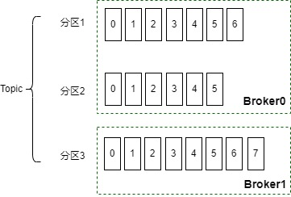
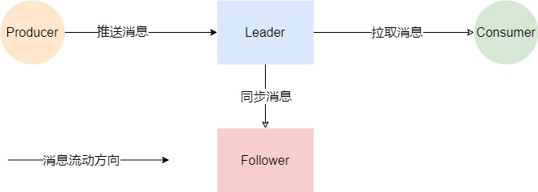
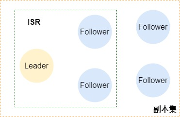
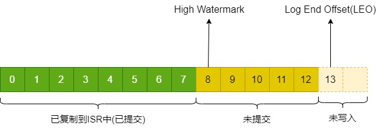
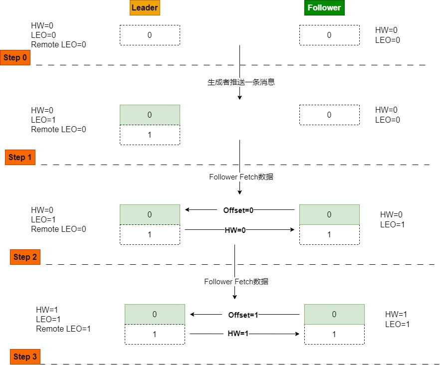
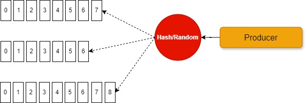
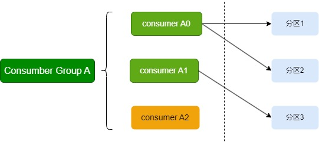
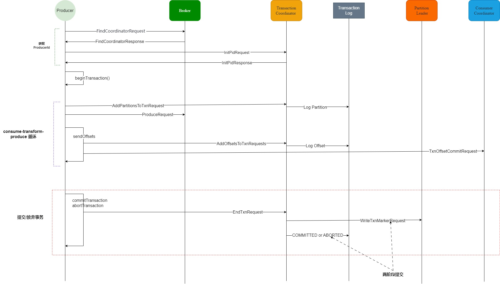

# kafka 一篇入魂
## 引子
想象一个场景，如果A进程在一个瞬间向B进程发送了大量的数据，如果B的算力不够而无法马上处理，可能就会有消息被丢弃，而如果业务要求消息不能丢，这种场景应该怎么办呢？这个需要一个消息队列将消息存起来。本文就将讨论消息队列中的佼佼者--Kafka,这个名字就是来自于小说家卡夫卡。本文的内容是基于KRaft模式的kafka版本。

## 先有请各种角色入场
* Message、Event、消息：就是队列传输的对象
* 生产者(Producer): 就是生产消息的家伙
* 消费者(Consumer): 就是消费消息的家伙
* Broker: 就是承载Kafka服务的家伙，一般结伴出现
* 主题(Topic): 就是消息的目录，写消息入需要指定主题，此处可不能迷路
* 分区(Partition): 同一个主题的消息会被放到不同的分区中，消息在分区中排队，遵循FIFO(先进先出)原则。
演员介绍完毕，下面我们进入正题

## Broker出列，做个简单的自我介绍
* 我是使用Scala编写的，运行在JVM虚拟机上
* 我可以将消息持久化到磁盘，保证断电还有数据
* 我的消息是通过发布订阅(Puslish-And-Subscribe)的模式进行生产与消费的
* 我写数据的时候，不会太麻烦磁盘老哥，我只顺序写入，避免随机写入，提高磁盘写入效率，这样我和磁盘老哥配合的很好，它总能非常快的完成我的任务。
* 我非常懒，不会主动Push消息到消费者，消费者采用拉取（Pull）模式获取数据
* 我还有个提高效率的秘籍，使用`sendfile`可以`**零拷贝**`的方式将数据直接从文件系统发送到网络系统，实现两个不同系统的文件描述符之间的数据直传，感谢OS
* producer或者consumer要想与我通信，需要通过TCP协议

## 老王提问：消息如果只在一台机器上，容量不够怎么办？
那就使用分区，分区可以将数据均匀的分布在多台机器上，你就获得了一个超能力----`无限长的数组`。下面我来仔细介绍一下分区。
* 请先看图 
* 一个Topic可以生成多个分区，这些分区可能被分配到多个broker上
* 每个分区中是一个队列，所以分区中是有序的数据
* 每个消息都有一个`整数编号offset`，该值单调递分区唯一，从0开始为队首，最大值为队尾
* 因为分区内有序，而对于`整个topic而言是无序`的，或者说是偏序的。

## 老王提问：如果消息的机器磁盘坏掉了怎么办？
kafka支持多个副本，增加副本个数就能提高容灾
* 每个分区都会生成一个副本集，有一个leader和follower(数目可能为0)两种角色的分区数据，数据的读写都发生在Leader上，Follower只同步数据

* Leader维护ISR(In-Sync Replicas), 说白了，就是这些副本目前同步了，比如[2,4,5]构成了一个副本集, 2为Leader，ISR可能是[2],[2,4],[2,4,5]等，ISR中一定包含Leader

* 不同的副本一定在不同的broker上，否则就没有意义了，副本的个数在创建topic的时候或者使用默认值，如果broker个数少于该值，则会创建topic失败
### 副本工作机制概述
* 我们先看一下分区上的2个重要的位置
  * High Watermark(HW): 表示该位置以前的数据都拷贝到各个分区中了，消费者可以放心食用了，注意`HW所在的位置是未提交的`
  * Log End Offset(LEO): 表示下一个写入的位置，即`该处还没有数据`

* 我们知道了以下几个知识点
  1. HW是消费者能使用的数据的最大位置
  2. 所有数据都是从Leader副本推送和拉取的
  3. Leader的HW就决定了消费者组能消费的最大Offset，只要Leader的HW向前推进就能持续提供消费者数据
#### OK，下面我们来看一下具体的流程
* 
* Step 0:初始状态，Leader维护了自己的HW与LEO、Follower的remote LEO，所有值都为0，Follower维护了自己的HW，LEO，值为0
* Step 1: 
  * 生产者推送了一条消息
  * Leader的LEO向后偏移为1，HW不变，因为Follower还没有同步
* Step 2: 
  * Follower同步了一次，请求Offset=0开始的数据
  * Leader返回自己的HW=0
  * Follower写盘，LEO后移一位变为1, 因为Leader的HW=0，Follower设置HW=0=Min(Leader.HW, Self.LEO)，Follower的HW不能大于Leader的，也不能大于自己的LEO
* Step 3:
  * Follower再次同步，请求Offset=1开始的数据
  * Leader发现offset=0的地方已经被follower同步了，随即将自己的HW=1=Max(Leader.HW, Min(FollowerA.LEO, FollowerB.LEO ...)) (这个公式可以如此理解：`**当HW较小的时候，HW的更新由Followers的LEO决定，取所有Follower全都同步的部分; 当HW较大的时候则忽略follower的影响，因为是相对滞后的follower在同步数据**`)，表示0可以被消费了，然后将HW=1返回给Follower
  * Follower没有拿到任何数据，但是看到Leader的HW=1了，此时设置自己的HW=1=Min(Leader.HW,Self.LEO)，此时Producer写入的一条数据全部同步完毕。
#### 上述流程中如果发生了Step 3的返回消息丢失
假设Step 3的返回消息Follower没有收到，Follower挂了，然后自动重启后发现自己的HW=0，LEO=1，则Follower会将仅有的一条数据清理(因为这条数据未经确认)，然后再从Leader重新拉取消息，如果这个时候恰好Leader 挂了，Follower荣幸的成为了Leader，消息就丢失了。

如何解决这个问题呢，Kafka引入了Epoch，该值单调递增。每个分区都会保存经历过的<Epoch,Offset>列表，放入到日志文件`leader-epoch-checkpoint`，这里面相当于按阶段保存了数据的起始位置。

让我们重新回到前面的问题，如果Follower 挂掉又启动后，它不会自己将自己截肢，而是想办法找到一个`参考点`，那就去找Leader要它的LEO，发现Epoch和LEO都和自己的一样大，那么Follower理所当然的认为`老子的数据没错啊`，那我就不截肢了，数据保持了同步。其实还有很多种情形可以讨论，这里就不展开了。我看了很多资料后，总结来看有一些几点看法:
* 使用Epoch可以丢弃网络中的旧Leader的数据，还可以丢弃日志中脏数据。举个例子，如果有个Follower启动后发现自己的最大Epoch为2，可是请求Leader后发现Leader为1，它就会删除所有的Epoch为2的数据
* 执行Leader的强一致性，Follower无脑与Leader看齐。如果Follower发现自己和Leader的Epoch一样，但是Offset差很多，就一直拉取消息就行了。如果Epoch小，则也是一直拉取；如果大的话，就该删除数据了。
* Leader和Follower都在努力工作让大家的状态是一致的，这个一致以Leader为标准，执行强一致性。
#### Leader如何正确的切换呢
如果Follower知道如何从Leader同步数据，那么关于数据的正确性就剩下如何保证Leader正确的切换了？首先，什么是正确，对于用户而言，`肯定是我提交的数据都应该还在`，对于系统而言就是应该`找到维护最新提交数据的节点做为Leader`。这里就是那个`2n+1`的场景，要想保证一台机器挂掉不影响，则需要3台机器；2台机器挂掉不影响，则需要5台机器。如果只有1个节点，则是没有任何保证的，比如`min.insync.replicas=1或者acks=1`的时候，即使有epoch也做不到数据的安全性。

分布式系统的状态转换应当始终保证从一个一致的状态切换到另一个一致的状态，S1=F(S0)，如果中间出现问题，那么需要找到上一个正确状态。由Leader维护该正确的状态，如果Leader遇到了模糊的状态，那就应该重置为上一个状态。如果3个节点一个节点挂了，还剩2个节点，因为他们拥有者最新的状态，他们就能投票找到新的leader，但是这时候有可能存在进行了一半的脏数据，但是原来的Leader已经没有了，新的Leader无法决策原来的数据，则该数据就丢失了。但是因为这个数据在上一任Leader执行失败了，所以业务端应该是返回失败了，用户并不会觉得是数据丢失。

## 生产者如何工作？
* 
* 生产者放入的数据根据key进行hash或者随机后放入对应的分区
* 前文说到topic整体是偏序的，但是可以局部有序，生产者可以使用key进行控制，相同的key放入相同的分区中，这样可以保证某个key的所有数据有序
* 生产者只能将数据放到分区的尾部
* 消费者写入消息后，如何知道写入成功与否呢，Kafka提供ACK机制
### ACK机制
Kafka提供了3种不同级别的ACK确认机制，确认机制是由Producer选择的，在新建Producer的配置中设置，这样不同的producer可以根据自己的场景灵活的进行选择，关键数据可以采用安全级别较高的方式，普通的日志可以采用较快的方式。
* acks=0(None): 接口直接返回，不保证任何写入
* acks=1(Leader): Leader写入成功就返回
* acks=-1(ALL): ISR中所有节点写入成功才返回，当这个配置起效的时候，broker中的配置项`min.insync.replicas=2`也参与约束，ISR中的个数不能小于该值，否则当只有一个副本的时候，`acks=-1`退化为`acks=1`。如果`min.insync.replicas=2`，但是副本个数为5，则写消息Leader和一个副本写成功就会返回。该值配置为1的时候，则与`acks=1`效果一样，但是速度会快，如果配置多一些，则速度回慢一些，但是更安全。
### 做个简单的实验
```
string bootstrapServers = "10.10.30.71:29292";
string topic = "mytest2";

var config = new ProducerConfig
{
    BootstrapServers = bootstrapServers,
    Acks = Acks.Leader,
    LingerMs = 5,
    CompressionType = CompressionType.Snappy
};
using var producer = new ProducerBuilder<string, string>(config).Build();

try
{
    for (int i = 0; i < 5; i++)
    {
        var message = new Message<string, string>
        {
          // Key = $"UniqueKey",
          Value = $"Hello Kafka {i}"
        };

        var deliveryResult = await producer.ProduceAsync(topic, message);
        Console.WriteLine($"sent to partition {deliveryResult.Partition} @ offset {deliveryResult.Offset} {deliveryResult.Status} {deliveryResult.Key} {deliveryResult.Value}");
    }
}
```
* `Acks = Acks.Leader`，且`不指定Key`的时候，输出如下，信息被放入了`不同`的分区
```
sent to partition [9] @ offset 41534 Persisted  Hello Kafka 0
sent to partition [8] @ offset 45434 Persisted  Hello Kafka 1
sent to partition [9] @ offset 41535 Persisted  Hello Kafka 2
sent to partition [9] @ offset 41536 Persisted  Hello Kafka 3
sent to partition [1] @ offset 47045 Persisted  Hello Kafka 4
```
* `Acks = Acks.Leader`，且`指定Key`的时候，输出如下，信息被放入了`相同`的分区，从offset可以看出是依次进入的。
```
sent to partition [10] @ offset 47277 Persisted UniqueKey Hello Kafka 0
sent to partition [10] @ offset 47278 Persisted UniqueKey Hello Kafka 1
sent to partition [10] @ offset 47279 Persisted UniqueKey Hello Kafka 2
sent to partition [10] @ offset 47280 Persisted UniqueKey Hello Kafka 3
sent to partition [10] @ offset 47281 Persisted UniqueKey Hello Kafka 4
```
* `Acks = Acks.None`，输出如下，写入状态为`PossiblyPersisted`，分区固定，但是offset未确定。
```
sent to partition [10] @ offset Unset [-1001] PossiblyPersisted UniqueKey Hello Kafka 0
sent to partition [10] @ offset Unset [-1001] PossiblyPersisted UniqueKey Hello Kafka 1
sent to partition [10] @ offset Unset [-1001] PossiblyPersisted UniqueKey Hello Kafka 2
sent to partition [10] @ offset Unset [-1001] PossiblyPersisted UniqueKey Hello Kafka 3
sent to partition [10] @ offset Unset [-1001] PossiblyPersisted UniqueKey Hello Kafka 4
```

## 消费者如何工作？
* 消费者一定需要指定一个消费主题
* 按照消费者组管理消费者，一个消费者一定属于某个组，如果没有指定组，则自动生成一个，一个消费者组共享一个进度，即一个消息只能被组中的某个消费者消费，不能重复消费。
* 消费者组的进度被放入一个系统主题`__consumer_offsets`中，key为<组ID,主题,分区>,值为`offset、时间戳等相关信息`
* 一个消费者可以同时消费一个或者多个分区, 但是一个分区只能被一个消费者使用，如果有多余的消费者，则处于空闲状态
* 
* 消费的消费记录的确认即消费已经处理过的Offset可以自动提交或者手动提交，这个需要业务场景需要而定，如果需要业务确认才能commit可以使用手动提交。
### 消费的次数保证
消息的消费次数是消费者来感受的，但是次数却是消费链路保证的。
#### 最多一次
* 消息可能丢失也可能被处理，但最多只会被处理一次。
* acks=0，调用写入方法后无论成功与否都不重试，就是最多一次
#### 最少一次
* 消息不会丢失，但可能被处理多次
* acks=1或者acks=-1，调用写入方法成功了结束，中间有任何失败(网络问题)都重试，最少保证成功写入一次
#### 恰好一次
* 消息被处理且只会被处理一次，如何实现呢，我们来看幂等和事务
### 幂等
* 幂等这个词原是数学领域中的概念，指的是某些操作或函数能够被执行多次，但每次得到的结果都是不变的。
* 幂等性最大的优势在于我们可以安全地重试任何幂等性操作，反正它们也不会破坏我们的系统状态。
* 开启幂等性的时候，acks不允许为0或者1，只能是-1
* 对每个消息引入了`producer id`和`sequence number`，`producer id`是一个producer会话的id，即幂等性是在同一个会话的上下文中, `sequence number`是本会话期的消息编号，broker如果遇到<producerid, sequence number>重复的消息会丢弃。
* 非常重要的一点是，幂等性是一种kafka的`自我承诺`，用户无法干预，因为`没法指定消息的sequence number和producerid`，用户如果想要这个功能，只要开启这个功能就可以享受服务了。
* 下面我们来观察一下，进入到配置的`log.dirs`目录下，可以看到格式为`topicname-partion`的目录，里面存放的是某个主题某个分区的日志数据，我们使用`/KAFKA-HOME-BIN/kafka-dump-log.sh --files ./00000000000000000000.log --print-data-log`可以看到，如果没有开启幂等性，Producer写入消息，日志格式如下
```
baseOffset: 39071 lastOffset: 39071 count: 1 baseSequence: -1 lastSequence: -1 producerId: -1 producerEpoch: -1 partitionLeaderEpoch: 10 isTransactional: false isControl: false deleteHorizonMs: OptionalLong.empty position: 703960 CreateTime: 1742267672468 size: 91 magic: 2 compresscodec: none crc: 702011205 isvalid: true
| offset: 39071 CreateTime: 1742267672468 keySize: 10 valueSize: 13 sequence: -1 headerKeys: [] key: UniqueKey2 payload: Hello Kafka 4
```
* 施加了幂等性后(Producer的配置项`EnableIdempotence`设置为true)，Producer写入消息，日志格式如下，最大的区别就是`sequence`和`producerId`都进行了赋值
```
baseOffset: 39076 lastOffset: 39076 count: 1 baseSequence: 4 lastSequence: 4 producerId: 3004 producerEpoch: 0 partitionLeaderEpoch: 10 isTransactional: false isControl: false deleteHorizonMs: OptionalLong.empty position: 704415 CreateTime: 1742268279113 size: 91 magic: 2 compresscodec: none crc: 402787861 isvalid: true
| offset: 39076 CreateTime: 1742268279113 keySize: 10 valueSize: 13 sequence: 4 headerKeys: [] key: UniqueKey2 payload: Hello Kafka 4
```
### 事务
* 事务最初的设计初衷，是为了流处理而设计的，或者说为`read-process-write`模式而设计的
```
We designed transactions in Kafka primarily for applications that exhibit a "read-process-write" pattern where the reads and writes are from and to asynchronous data streams such as Kafka topics. Such applications are more popularly known as stream processing applications.
```
* 事务的引入是因为幂等性仅能保证消息不重复，但无法确保更高级别的一致性,比如金融领域保证`Exactly Once Semantics`，特别是针对`consume, transform, produce`这个模式。
* 事务的执行流程数据存储在内部主题`__transaction_state`中，有50个分区
* 事务引入了`Transaction Corordinator`事务协调器来居中处理事务流程,`Transaction Coordinator`是一个运行在每个Kafka Broker上的模块，不是单独的进程
* `事务Id可以复用`,如果事务id不变，则每次的ProducerId不变，但是producerEpoch会推进
* 即使是`放弃的事务，在topic也会留下数据`，只不过状态是未提交，可以通过Consumer的IsolationLevel或者命令行中的`--isolation-level read_committed`来只读已提交的消息
##### 事务的流程
* 第一阶段： 获取ProducerId，在事务模式下ProducerId是事务协调器生成器(非事务下则是Producer自己生成的)
* 第二阶段： `consume-transform-produce`循环(其实没有consume这一步也行，只有producer也可以使用事务)
  * 在事务期间，如果出现了新的分区，特别是消息的Key不指定的情况下，需要通知事务协调器
  * 正常的写消息
  * 通知事务协调器Offset
  * 通知消费者协调器Offset，消费者协调器将这些Offset持久化到`__consumer_offsets`topic中
* 第三阶段：提交或者放弃事务，如果提交事务则使用两阶段提交来同步事务的最终状态和对主题中的消息的状态修改。

* PS: 更多细节请参考文末引用的官方文档，本节仅作知识点概述。
##### 事务测试
```
var config = new ProducerConfig
{
    BootstrapServers = bootstrapServers,
    Acks = Acks.All,  
    EnableIdempotence = true, 
    MessageTimeoutMs = 5000,  
    TransactionalId = "MyTxnId",
    TransactionTimeoutMs = 5000,
};
using var producer = new ProducerBuilder<string, string>(config).Build();
try
{
    producer.InitTransactions(TimeSpan.FromMicroseconds(30000));
    producer.BeginTransaction();
    for (int i = 0; i < 5; i++)
    {
        var message = new Message<string, string>
        {
            Key = "UniqueKey3",
            Value = $"Hello Kafka {i}"
        };
        var deliveryResult = await producer.ProduceAsync(topic, message);
        Console.WriteLine($"sent to partition {deliveryResult.Partition} @ offset {deliveryResult.Offset} {deliveryResult.Status} {deliveryResult.Key} {deliveryResult.Value}");
    }
    producer.CommitTransaction();
}
```
* 还是使用`/KAFKA-HOME-BIN/kafka-dump-log.sh --files ./00000000000000000000.log --print-data-log`观察日志，可以看到`isTransactional`字段和`isControl`字段为true，并且多了`endTxnMarker: COMMIT coordinatorEpoch: 0`两个字段
```
baseOffset: 39122 lastOffset: 39122 count: 1 baseSequence: -1 lastSequence: -1 producerId: 4000 producerEpoch: 2 partitionLeaderEpoch: 10 isTransactional: true isControl: true deleteHorizonMs: OptionalLong.empty position: 708601 CreateTime: 1742270988178 size: 78 magic: 2 compresscodec: none crc: 4126398979 isvalid: true
| offset: 39122 CreateTime: 1742270988178 keySize: 4 valueSize: 6 sequence: -1 headerKeys: [] endTxnMarker: COMMIT coordinatorEpoch: 0
```
* 查看日志验证`./kafka-console-consumer.sh --bootstrap-server localhost:9092  --topic __transaction_state --from-beginning  --formatter "kafka.coordinator.transaction.TransactionLog\$TransactionLogMessageFormatter"`，如果被正常提交的事务，可以看到一个事务的详细的运行状态，信息太多了，我保留了一条完整的做参照，可以看到分区的信息
```
(transactionalId=MyTxnId, producerId=4000, producerEpoch=8, txnTimeoutMs=5000, state=Empty ...)
(transactionalId=MyTxnId, producerId=4000, producerEpoch=8, txnTimeoutMs=5000, state=Ongoing ...)
MyTxnId2::TransactionMetadata(transactionalId=MyTxnId2, producerId=4000, producerEpoch=8, txnTimeoutMs=5000, state=Ongoing, pendingState=None, topicPartitions=HashSet(mytest3-4, mytest3-5, mytest3-6, mytest3-0, mytest3-1, mytest3-2, mytest3-7, mytest3-8, mytest3-9), txnStartTimestamp=1742374937125, txnLastUpdateTimestamp=1742374937485)
(transactionalId=MyTxnId, producerId=4000, producerEpoch=8, txnTimeoutMs=5000, state=PrepareCommit ...)

(transactionalId=MyTxnId, producerId=4000, producerEpoch=8, txnTimeoutMs=5000, state=CompleteCommit ...)
```
如果是放弃的事务可以看到如下的情况
```
(transactionalId=MyTxnId2, producerId=5000, producerEpoch=1, txnTimeoutMs=5000, state=Empty, ...)
MyTxnId2::TransactionMetadata(transactionalId=MyTxnId2, producerId=5000, producerEpoch=1, txnTimeoutMs=5000, state=Ongoing, ...)
MyTxnId2::TransactionMetadata(transactionalId=MyTxnId2, producerId=5000, producerEpoch=1, txnTimeoutMs=5000, state=PrepareAbort, ...)
MyTxnId2::TransactionMetadata(transactionalId=MyTxnId2, producerId=5000, producerEpoch=1, txnTimeoutMs=5000, state=CompleteAbort, ...)
```
### 小结
* 不管是幂等还是事务，都是将消息准确的放入topic一次，但是在消费端能被消费几次，其实这两个都无法控制，这个其实是业务控制的，如果不自动commit，且不手动commit，则可以一直消费，哈哈。
  

## 下面请老王给我们实战
* 测试环境： 5个节点的KRaft模式的kafka集群，1,2,3为controller和worker，4，5为worker，使用docker-compose在一台机器上启动
### 重要集群配置
* process.roles, broker/controller,broker/controller根据需要进行配置
```
process.roles=broker,controller 
```
* node.id,节点id，多节点每个需要不同
```
node.id=1
```
* controller.quorum.voters 控制节点列表，格式为`节点id@主机名或者ip:Port`
```
1@kafka01:9093,2@kafka02:9093,3@kafka03:9093
```
* listeners，所有监听的端口信息，格式为`listeners = listener_name://host_name:port`
```
PLAINTEXT://:9092,CONTROLLER://:9093,MY_PLAINTEXT://0.0.0.0:19092
```
* inter.broker.listener.name 内部通信listener
```
inter.broker.listener.name=PLAINTEXT
```
* advertised.listeners 广播到客户端的listeners
```
advertised.listeners=PLAINTEXT://kafka01:9092,MY_PLAINTEXT://localhost:19092
```
* controller.listener.names 控制器使用的listener的名字，kraft模式必填
```
controller.listener.names=CONTROLLER
```

### 集群
* 查看集群状态，1,2,3控制着集群的状态投票，当前leader为2，4，5是观察者
```
./kafka-metadata-quorum.sh --bootstrap-server localhost:9092 describe --status
ClusterId:              76BLQI7sT_ql1mBfKsOk9Q
LeaderId:               2
LeaderEpoch:            91
HighWatermark:          9445
MaxFollowerLag:         0
MaxFollowerLagTimeMs:   366
CurrentVoters:          [1,2,3]
CurrentObservers:       [4,5]
```
* 查看集群的复制状态，这里的LogEndOffset是kraft的元日志的偏移量
```
> ./kafka-metadata-quorum.sh --bootstrap-server localhost:9092 describe --replication
NodeId  LogEndOffset    Lag     LastFetchTimestamp      LastCaughtUpTimestamp   Status  
2       9849            0       1742133742976           1742133742976           Leader  
1       9849            0       1742133742861           1742133742861           Follower
3       9849            0       1742133742861           1742133742861           Follower
4       9849            0       1742133742861           1742133742861           Observer
5       9849            0       1742133742861           1742133742861           Observer
```
### Topic
* 查看所有topic
```
./kafka-topics.sh --list --bootstrap-server localhost:9092
```
* 创建topic，复制因子为1，分区数为10
```
./kafka-topics.sh --create --bootstrap-server localhost:9092 --replication-factor 1 --partitions 10 --topic mytest3
```
查看
```
> ./kafka-topics.sh --describe --bootstrap-server localhost:9092 --topic mytest3
Topic: mytest3  TopicId: gu9Q_X87QrqVgUcIu-ZvsA PartitionCount: 10      ReplicationFactor: 1    Configs: min.insync.replicas=2,segment.bytes=1073741824
  Topic: mytest3  Partition: 0    Leader: 3       Replicas: 3     Isr: 3  Elr:    LastKnownElr: 
  Topic: mytest3  Partition: 1    Leader: 4       Replicas: 4     Isr: 4  Elr:    LastKnownElr: 
  Topic: mytest3  Partition: 2    Leader: 5       Replicas: 5     Isr: 5  Elr:    LastKnownElr: 
  Topic: mytest3  Partition: 3    Leader: 1       Replicas: 1     Isr: 1  Elr:    LastKnownElr: 
  Topic: mytest3  Partition: 4    Leader: 2       Replicas: 2     Isr: 2  Elr:    LastKnownElr: 
  Topic: mytest3  Partition: 5    Leader: 5       Replicas: 5     Isr: 5  Elr:    LastKnownElr: 
  Topic: mytest3  Partition: 6    Leader: 1       Replicas: 1     Isr: 1  Elr:    LastKnownElr: 
  Topic: mytest3  Partition: 7    Leader: 2       Replicas: 2     Isr: 2  Elr:    LastKnownElr: 
  Topic: mytest3  Partition: 8    Leader: 4       Replicas: 4     Isr: 4  Elr:    LastKnownElr: 
  Topic: mytest3  Partition: 9    Leader: 3       Replicas: 3     Isr: 3  Elr:    LastKnownElr: 
```
* 创建topic，复制因子为2，分区数为10
```
./kafka-topics.sh --create --bootstrap-server localhost:9092 --replication-factor 2 --partitions 10 --topic mytest4
```
```
> ./kafka-topics.sh --describe --bootstrap-server localhost:9092 --topic mytest4
Topic: mytest4  TopicId: svoLcSv7QbWfyMR4aCy3Cg PartitionCount: 10      ReplicationFactor: 2    Configs: min.insync.replicas=2,segment.bytes=1073741824
  Topic: mytest4  Partition: 0    Leader: 1       Replicas: 1,2   Isr: 1,2        Elr:    LastKnownElr: 
  Topic: mytest4  Partition: 1    Leader: 2       Replicas: 2,3   Isr: 2,3        Elr:    LastKnownElr: 
  Topic: mytest4  Partition: 2    Leader: 3       Replicas: 3,4   Isr: 3,4        Elr:    LastKnownElr: 
  Topic: mytest4  Partition: 3    Leader: 4       Replicas: 4,5   Isr: 4,5        Elr:    LastKnownElr: 
  Topic: mytest4  Partition: 4    Leader: 5       Replicas: 5,1   Isr: 5,1        Elr:    LastKnownElr: 
  Topic: mytest4  Partition: 5    Leader: 4       Replicas: 4,2   Isr: 4,2        Elr:    LastKnownElr: 
  Topic: mytest4  Partition: 6    Leader: 2       Replicas: 2,5   Isr: 2,5        Elr:    LastKnownElr: 
  Topic: mytest4  Partition: 7    Leader: 5       Replicas: 5,1   Isr: 5,1        Elr:    LastKnownElr: 
  Topic: mytest4  Partition: 8    Leader: 1       Replicas: 1,3   Isr: 1,3        Elr:    LastKnownElr: 
  Topic: mytest4  Partition: 9    Leader: 3       Replicas: 3,4   Isr: 3,4        Elr:    LastKnownElr: 
```
* 创建topic，复制因子为3，分区数为10
```
./kafka-topics.sh --create --bootstrap-server localhost:9092 --replication-factor 3 --partitions 10 --topic mytest2
```
```
> ./kafka-topics.sh --describe --bootstrap-server localhost:9092 --topic mytest2 
Topic: mytest2  TopicId: 7j3HHWHdRWeBMnY61E23rg PartitionCount: 10      ReplicationFactor: 3    Configs: min.insync.replicas=2,segment.bytes=1073741824
  Topic: mytest2  Partition: 0    Leader: 1       Replicas: 1,2,3 Isr: 1,2,3      Elr:    LastKnownElr: 
  Topic: mytest2  Partition: 1    Leader: 2       Replicas: 2,3,4 Isr: 2,3,4      Elr:    LastKnownElr: 
  Topic: mytest2  Partition: 2    Leader: 3       Replicas: 3,4,5 Isr: 3,4,5      Elr:    LastKnownElr: 
  Topic: mytest2  Partition: 3    Leader: 4       Replicas: 4,5,1 Isr: 4,5,1      Elr:    LastKnownElr: 
  Topic: mytest2  Partition: 4    Leader: 5       Replicas: 5,1,2 Isr: 5,1,2      Elr:    LastKnownElr: 
  Topic: mytest2  Partition: 5    Leader: 2       Replicas: 2,4,1 Isr: 2,4,1      Elr:    LastKnownElr: 
  Topic: mytest2  Partition: 6    Leader: 4       Replicas: 4,1,3 Isr: 4,1,3      Elr:    LastKnownElr: 
  Topic: mytest2  Partition: 7    Leader: 1       Replicas: 1,3,5 Isr: 1,3,5      Elr:    LastKnownElr: 
  Topic: mytest2  Partition: 8    Leader: 3       Replicas: 3,5,2 Isr: 3,5,2      Elr:    LastKnownElr: 
  Topic: mytest2  Partition: 9    Leader: 5       Replicas: 5,2,4 Isr: 5,2,4      Elr:    LastKnownElr:
```
* 创建topic，复制因子为4，分区数为10
```
./kafka-topics.sh --create --bootstrap-server localhost:9092 --replication-factor 4 --partitions 10 --topic mytest5
```
```
> ./kafka-topics.sh --describe --bootstrap-server localhost:9092 --topic mytest5
Topic: mytest5  TopicId: jQyCQb32RwmWyPoe2X64Eg PartitionCount: 10      ReplicationFactor: 4    Configs: min.insync.replicas=2,segment.bytes=1073741824
  Topic: mytest5  Partition: 0    Leader: 4       Replicas: 4,5,1,2       Isr: 4,5,1,2    Elr:    LastKnownElr: 
  Topic: mytest5  Partition: 1    Leader: 5       Replicas: 5,1,2,3       Isr: 5,1,2,3    Elr:    LastKnownElr: 
  Topic: mytest5  Partition: 2    Leader: 1       Replicas: 1,2,3,4       Isr: 1,2,3,4    Elr:    LastKnownElr: 
  Topic: mytest5  Partition: 3    Leader: 2       Replicas: 2,3,4,5       Isr: 2,3,4,5    Elr:    LastKnownElr: 
  Topic: mytest5  Partition: 4    Leader: 3       Replicas: 3,4,5,1       Isr: 3,4,5,1    Elr:    LastKnownElr: 
  Topic: mytest5  Partition: 5    Leader: 1       Replicas: 1,5,4,2       Isr: 1,5,4,2    Elr:    LastKnownElr: 
  Topic: mytest5  Partition: 6    Leader: 5       Replicas: 5,4,2,3       Isr: 5,4,2,3    Elr:    LastKnownElr: 
  Topic: mytest5  Partition: 7    Leader: 4       Replicas: 4,2,3,1       Isr: 4,2,3,1    Elr:    LastKnownElr: 
  Topic: mytest5  Partition: 8    Leader: 2       Replicas: 2,3,1,5       Isr: 2,3,1,5    Elr:    LastKnownElr: 
  Topic: mytest5  Partition: 9    Leader: 3       Replicas: 3,1,5,4       Isr: 3,1,5,4    Elr:    LastKnownElr:
```
* 创建topic，复制因子为5，分区数为10
```
./kafka-topics.sh --create --bootstrap-server localhost:9092 --replication-factor 5 --partitions 10 --topic mytest
```
```
> ./kafka-topics.sh --describe --bootstrap-server localhost:9092 --topic mytest
Topic: mytest   TopicId: 7cGDkw4qT3C_tSK1KBDiOQ PartitionCount: 10      ReplicationFactor: 5    Configs: min.insync.replicas=2,segment.bytes=1073741824
  Topic: mytest   Partition: 0    Leader: 1       Replicas: 1,2,3,4,5     Isr: 1,2,3,4,5  Elr:    LastKnownElr: 
  Topic: mytest   Partition: 1    Leader: 2       Replicas: 2,3,4,5,1     Isr: 2,3,4,5,1  Elr:    LastKnownElr: 
  Topic: mytest   Partition: 2    Leader: 3       Replicas: 3,4,5,1,2     Isr: 3,4,5,1,2  Elr:    LastKnownElr: 
  Topic: mytest   Partition: 3    Leader: 4       Replicas: 4,5,1,2,3     Isr: 4,5,1,2,3  Elr:    LastKnownElr: 
  Topic: mytest   Partition: 4    Leader: 5       Replicas: 5,1,2,3,4     Isr: 5,1,2,3,4  Elr:    LastKnownElr: 
  Topic: mytest   Partition: 5    Leader: 4       Replicas: 4,2,1,3,5     Isr: 4,2,1,3,5  Elr:    LastKnownElr: 
  Topic: mytest   Partition: 6    Leader: 2       Replicas: 2,1,3,5,4     Isr: 2,1,3,5,4  Elr:    LastKnownElr: 
  Topic: mytest   Partition: 7    Leader: 1       Replicas: 1,3,5,4,2     Isr: 1,3,5,4,2  Elr:    LastKnownElr: 
  Topic: mytest   Partition: 8    Leader: 3       Replicas: 3,5,4,2,1     Isr: 3,5,4,2,1  Elr:    LastKnownElr: 
  Topic: mytest   Partition: 9    Leader: 5       Replicas: 5,4,2,1,3     Isr: 5,4,2,1,3  Elr:    LastKnownElr:
```
* 尝试创建复制因子为7的topic
```
> ./kafka-topics.sh --create --bootstrap-server localhost:9092 --replication-factor 7 --partitions 10 --topic mytest8
The target replication factor of 7 cannot be reached because only 5 broker(s) are registered.
```
* 对test2增加topic的分区个数，原有10个
```
./kafka-topics.sh --bootstrap-server localhost:9092 --alter --topic mytest2 --partitions 11
```
* 对test2减少topic的分区个数，现有11个，结果不允许
```
./kafka-topics.sh --bootstrap-server localhost:9092 --alter --topic mytest2 --partitions 9
Error while executing topic command : The topic mytest2 currently has 11 partition(s); 9 would not be an increase.
```
* 删除topic
```
./kafka-topics.sh --bootstrap-server localhost:9092 --topic mytest --delete 
```
* 总结来看 
  1. ReplicationFactor的数目不允许大于节点的个数N，允许范围是[1,N]; 
  2. 分区个数允许增加，不允许较少;
  3. 即使复制因子为1，每个分区也有一个leader.

### 生产者命令
* Console写入数据
```
./kafka-console-producer.sh --broker-list localhost:9092 --topic mytest2
```
* 一口气写入一堆数据
```
./kafka-producer-perf-test.sh  --topic mytest2 --throughput  -1  --record-size 10 --num-records 500000 --producer-props bootstrap.servers=localhost:9092
```
### 消费者命令
* 创建一个消费者，会自动生成组
```
 ./kafka-console-consumer.sh --bootstrap-server localhost:9092  --topic mytest2 --from-beginning
```
* 创建某个组的消费者
```
./kafka-console-consumer.sh --bootstrap-server localhost:9092  --topic mytest2 --from-beginning --group test2-consumer-g
```
* 查看所有消费组
```
> ./kafka-consumer-groups.sh --list --bootstrap-server localhost:9092
console-consumer-9097
console-consumer-91257
```
* 查看消费组的详情，该组消费了test2一部分的数据，但是有大量的数据没有被处理，见LAG的值
```
> ./kafka-consumer-groups.sh --bootstrap-server localhost:9092 --describe --group test2-consumer-g
GROUP            TOPIC           PARTITION  CURRENT-OFFSET  LOG-END-OFFSET  LAG             CONSUMER-ID     HOST            CLIENT-ID
test2-consumer-g mytest2         2          23180           41732           18552           -               -               -
test2-consumer-g mytest2         3          0               43680           43680           -               -               -
test2-consumer-g mytest2         4          50258           50258           0               -               -               -
test2-consumer-g mytest2         5          47027           47027           0               -               -               -
test2-consumer-g mytest2         0          0               39061           39061           -               -               -
test2-consumer-g mytest2         1          47018           47018           0               -               -               -
test2-consumer-g mytest2         10         0               47248           47248           -               -               -
test2-consumer-g mytest2         6          0               53099           53099           -               -               -
test2-consumer-g mytest2         7          0               43952           43952           -               -               -
test2-consumer-g mytest2         8          0               45408           45408           -               -               -
test2-consumer-g mytest2         9          41517           41517           0               -               -               -r
```
如果有消费者活跃的话，输出大体如下，LAG都变为了0，有3个消费者负责10个分区
```
GROUP	            TOPIC	  PARTITION	  CURRENT-OFFSET	LOG-END-OFFSET	  LAG	CONSUMER-ID   	
test2-consumer-g	mytest2	2	          41732	          41732	            0	  console-consumer-36344d57-d0be-4020-aacb-48d594850c46	
test2-consumer-g	mytest2	3	          43680	          43680	            0	  console-consumer-36344d57-d0be-4020-aacb-48d594850c46	
test2-consumer-g	mytest2	0	          39061	          39061	            0	  console-consumer-36344d57-d0be-4020-aacb-48d594850c46	
test2-consumer-g	mytest2	1	          47018	          47018	            0	  console-consumer-36344d57-d0be-4020-aacb-48d594850c46	
test2-consumer-g	mytest2	4	          50258	          50258	            0	  console-consumer-c1f08ee5-8658-4666-9b8f-894d43d118e3	
test2-consumer-g	mytest2	5	          47027	          47027	            0	  console-consumer-c1f08ee5-8658-4666-9b8f-894d43d118e3	
test2-consumer-g	mytest2	6	          53099	          53099	            0	  console-consumer-c1f08ee5-8658-4666-9b8f-894d43d118e3	
test2-consumer-g	mytest2	7	          43952	          43952	            0	  console-consumer-c1f08ee5-8658-4666-9b8f-894d43d118e3	
test2-consumer-g	mytest2	10	        47248	          47248	            0	  console-consumer-cad6c9c0-72d5-407a-9aff-abcba18a2438	
test2-consumer-g	mytest2	8	          45408	          45408	            0	  console-consumer-cad6c9c0-72d5-407a-9aff-abcba18a2438	
test2-consumer-g	mytest2	9	          41517	          41517	            0	  console-consumer-cad6c9c0-72d5-407a-9aff-abcba18a2438	

```
* 查看组成员，最后一列的#PARTITIONS表示该消费者分配到的分区的个数，`但是如果消费者过多的话，可能会被闲置`，测试的时候遇到过。
```
 > ./kafka-consumer-groups.sh --bootstrap-server localhost:9092 --describe --all-groups --members
GROUP            CONSUMER-ID                                           HOST            CLIENT-ID        #PARTITIONS     
test2-consumer-g console-consumer-cad6c9c0-72d5-407a-9aff-abcba18a2438 /192.168.16.2   console-consumer 5               
test2-consumer-g console-consumer-36344d57-d0be-4020-aacb-48d594850c46 /192.168.16.7   console-consumer 6 

增加了一个同组消费者后变为
GROUP            CONSUMER-ID                                           HOST            CLIENT-ID        #PARTITIONS     
test2-consumer-g console-consumer-cad6c9c0-72d5-407a-9aff-abcba18a2438 /192.168.16.2   console-consumer 3               
test2-consumer-g console-consumer-36344d57-d0be-4020-aacb-48d594850c46 /192.168.16.7   console-consumer 4               
test2-consumer-g console-consumer-c1f08ee5-8658-4666-9b8f-894d43d118e3 /192.168.16.3   console-consumer 4 
```
* 查看组的offset的信息
```
> ./kafka-console-consumer.sh --bootstrap-server localhost:9092  --topic __consumer_offsets --from-beginning --group test2-consumer-g --formatter "kafka.coordinator.group.GroupMetadataManager\$OffsetsMessageFormatter"

[test2-consumer-g,mytest2,5]::OffsetAndMetadata(offset=47027, leaderEpoch=Optional[0], metadata=, commitTimestamp=1742142162897, expireTimestamp=None)
[test2-consumer-g,mytest2,6]::OffsetAndMetadata(offset=53099, leaderEpoch=Optional[0], metadata=, commitTimestamp=1742142162897, expireTimestamp=None)
```

## 总结
本文从一个问题出发，引出消息队列kafka，然后针对kafka的角色和功能展开分析，介绍了分区和副本的使用方式，深入探讨了生产者的工作原理、消费者的工作原理，最后通过部署环境来演示相关命令的使用与效果。

```
由于涉及到的内容比较多难免有所疏漏，欢迎大佬补充与评论，如有错误，也望不吝指出，感谢。
微信公众号为“吹风的坚果”，欢迎关注，定期更新优质的计算机文章。
```

## 引用
* [confluent-kafka-transaction](https://www.confluent.io/blog/transactions-apache-kafka/) 
* [Exactly Once Delivery and Transactional](https://docs.google.com/document/d/11Jqy_GjUGtdXJK94XGsEIK7CP1SnQGdp2eF0wSw9ra8/edit?pli=1&tab=t.0)
* [confluent-replication](https://docs.confluent.io/kafka/design/replication.html)
* [confluent-data-replication](https://developer.confluent.io/courses/architecture/data-replication/)
* [consumer-design](https://docs.confluent.io/kafka/design/consumer-design.html)
* [free-kafka-replication-a-lesson-in-operational-simplicity](https://www.confluent.io/blog/hands-free-kafka-replication-a-lesson-in-operational-simplicity/)