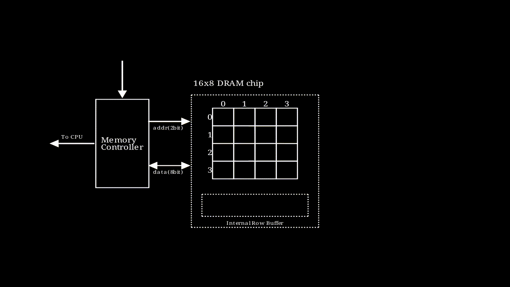

# 内存和缓存的如何聊天
本文将首先介绍缓存的基本概念，然后详细描述内存的结构与工作原理，最后阐述缓存和内存之间的数据通信方式。
```
不做特殊说明的话，本文涉及到的内容都基于x86体系
```

## 说说缓存
#### 为什么需要缓存
从[延迟对比](https://colin-scott.github.io/personal_website/research/interactive_latency.html)中看，2020年的设备延迟对比如下:
| 名称   | 延迟  | 对比                                                         |
| ------ | ----- | ------------------------------------------------------------ |
| 寄存器 | 1滴答 | 如果是2GHz主频的CPU，则时间为1/2G=0.5ns                      |
| L1缓存 | 1ns   |                                                              |
| L2缓存 | 4ns   | 与L1缓存相比，差不多是**声速**(1224km/h)和**高铁**(300km/h)的差异， 4倍 |
| Memory | 100ns | 与L2缓存相比，差不多是**高铁**(300km/h)和**跑步**(12km/h)的差别，25倍 |
| SSD    | 150μs | 与内存相比，慢了1500倍，差不多是**跑步**与**蜗牛**的区别             |
| HDD    | 10ms  | 与内存相比, 慢了10万倍，差不多是**战斗机**(2500km/h)和**乌龟**(20m/h)的区别；与SSD相比，慢了60倍，差不多是**高铁**与**走路**的区别 

可以看出，如果没有L1、L2等缓存的话，CPU的绝大多数时间将耗费在等待内存传输数据上。为了解决这一问题并提高处理速度，各种层次的缓存被引入到系统中，以减少延迟。

#### 直观感受一下Linux的缓存
Linux下Cache Line的信息在/sys/devices/system/cpu/cpu[0-N]/cache/index[0-3]这个目录下，目录下的信息如下表所示:

| 文件名                | 解释                                 |
| --------------------- | ------------------------------------ |
| coherency_line_size   | 每个缓存行的大小                     |
| size                  | 缓存总大小                           |
| level                 | 缓存等级                             |
| type                  | 缓存类型(Data、Instruction、Unified) |
| shared_cpu_list       | 哪几个CPU共享该缓存                  |
| number_of_sets        | 缓存的组数                           |
| ways_of_associativity | 每组有多少路                         |

每个CPU对应4个level的cache，一级缓存的指令和数据缓存，二级缓存和三级缓存。如果number_of_sets=64，ways_of_associativity=12，coherency_line_size=64，则size应该等于number_of_sets * ways_of_associativity * coherency_line_size = 64 * 12 * 64 = 48K。
这里需要特别提出的是，通常情况下，L1、L2、L3使用的是Inclusive方式(如下图所示)，但是有的架构设计采用的是Non-Inclusive方式，即两层之间互相不包含数据，比如Intel Skylake的L3 Cache就不包含L2 Cache的数据，这里取决于架构设计。
 
Inclusive
 
L3为Non-Inclusive

## 说说内存(以DDR内存为例)
#### 名词解释
* DDR SDRAM: Double Data Rate Synchronous Dynamic Random-Access Memory
  * Double Data Rate的意思是可以在时钟周期的上沿和下沿传递两次数据
  * Dynamic的意思是因为电容的原因需要不停地充电
  * Random-Access就是支持随机访问，如同数组一样可以随机访问，比如树形结构就不支持随机访问
  * Synchronous的意思是，内存控制器(目前已嵌入到了CPU中，早期计算机是放在北桥芯片中)和内存条之间使用相同的时钟新号进行数据传输，确保他们在时序上协同工作
* DIMM(Dual-Inline-Memory-Modules) 双列直插式存储模块，就是内存条本身，两面都有颗粒
* SIMM(Single-Inline-Memory-Module) 单列直插式内存模块，也是内存条，单面有颗粒
* 通道，就是CPU与内存之间的通路，有单通道、三通道、双通道、四通道等，每个通道都有独立的总线
* Cell: 最小的存储单元，存储一个bit的信息，DRAM的一个cell由一个Transistor和一个Capacitor组成，SRAM则最少需要6个Transistor
* Supercell: 若干个cell组成一个supercell，可能是8bit、16bit等，**它是内存寻址的最小单元**, **注意工业领域并没有看到Cell和Supercell相关的称呼**，
* Rank: **提供64位数据能力**，这就是内存的1R或者2R
* Bank: **一个基本的数据矩阵管理单元**，我查看了[金士顿](https://www.kingston.com/cn/memory)的相关产品，服务器使用的内存颗粒使用了多bank，台式机/笔记本上内存大多数是一个bank

#### DRAM内部寻址过程
* ， 该动画描述了一个行地址和列地址都是2bit，输出结果为8bit的存储模块的执行过程，图中每个格子是一个supercell
* 如果要输出64bit的数据，只需要将多个这样的模块串联即可。
* 在实际中，需要看一个Chip提供多少位的数据
* 举例子[金士顿的一款台式机内存条](https://www.kingston.com/datasheets/KVR64A52BD8-64.pdf)，摘录以下片段来看
```
KVR64A52BD8-64 64GB 2Rx8 8G x 64-Bit PC5-6400 CL52 288-Pin CUDIMM
   This document describes ValueRAM's KVR64A52BD8-64 is a 8G x64-bit (64GB) DDR5-6400 CL52 Clocked Unbuffered DIMMs(CUDIMMs), 2Rx8, memory module, based on sixteen 4G x 8-bit
FBGA components and one Clock Driver (CKD). 
```
从该描述中可以看出，2Rx8 该内存条有个2个Rank，即可以提供两组64地址，8代表每个芯片颗粒是8bit，即最小寻址单元为8bit；8G x 64-bit是有8G个64bit的提供数据的能力，即8*64/8=64G；sixteen 4G x 8-bit
FBGA标识有16个内存颗粒，每个颗粒能提供4G*8bit=4GB的数据量，16*4=64GB。另外从2Rx8中也可以算出来16个颗粒，因为有2组，每组需要64/8个颗粒。
* 前面提到了一些概念，他们之间的关系如下，一个内存条可能包含1-n个rank，一个rank中可能有bank或者没有bank，没有bank可以认为一个芯片是一个bank，bank内部是二维矩阵，内存寻址在bank中进行，寻址的最小单位就是supercell或者芯片的位宽。
* **程序员眼中的8B(64bit)大概率上分布在不同的芯片中**,除非使用了具有64bit位宽的内存颗粒。

#### 地址如何转化为对内存的具体访问
* 当内存控制器接受到物理地址后，会对地址进行映射，即DDR Memory Mapping，确定地址所在的channel、rank、bank、row、column
* 遗憾的是，Intel并没有公开这种映射关系，参见[What's in an Address: Understanding DDR Memory Mapping](https://depletionmode.com/ram-mapping.html)，[How physical addresses map to rows and banks in DRAM](https://lackingrhoticity.blogspot.com/2015/05/how-physical-addresses-map-to-rows-and-banks.html)，只能进行逆向工程
* 物理地址信息里一定包含了channel、rank、bank、row、column这些信息，至于如何组织的，得具体去分析。

## 它俩如何聊天
有了缓存之后，CPU和内存之间的物理拓扑大体如下：
，内存控制器已经被集成到CPU中，CPU直接通过内存总线或者说内存通道和内存通信。
我们知道物理地址是一个线性空间，而且比缓存要大很多，缓存如何与内存关联在一起呢，就是使用地址映射，具体如何映射呢，主要有以下三种方式。
#### 映射机制
* **直接映射**
  * 一个内存地址只能被映射到**特定**缓存行中，这种方式缺点就是可能数据会被踢出太快，这也是最简单的方式，因为是1对1的
* **完全关联缓存**
  * 某一个内存地址可以被映射到**任意**一个缓存行，这种方式做数据替换很麻烦或者不现实，这个是1对N的
* **组相联的方式**
  * 某一个内存地址可以被映射到**一组缓存**, 这也是目前使用最多的缓存映射方式，具体应该如何映射，我们将物理地址分为Tag | Index | Offset四个部分，下图以16bit的地址为例，内存按照8个字节分组，Offset部分占用3bit，cache line一共4组，Index占用2bit，剩下的部分为Tag，头部追加valid字段，这样只要很少的空间代价(Tag+Valid)就能缓存8B的数据。。
#### 最后但重要
目前，主流机器的总线宽度为64bit，而内存与CPU之间的最小传输单位是cache line（通常为64B）。即使需要访问一个字节的数据，CPU也会加载整个cache line到缓存中。以下几点需要特别注意：
* **L1缓存优先读取**: CPU通常从L1缓存中读取数据。如果发生cache miss，数据会从较低级的缓存（如L2或L3）加载到L1缓存，或者直接绕过L1缓存加载到L2或更低级缓存。不过，绕过L1会增加布线复杂度。
* **缓存行传输**: 64B的数据需要通过64bit总线进行8次传输（每次8bit）。但并非必须等待8次传输完成才能通知CPU，具体取决于硬件设计。
* **地址对齐**: 传输到地址总线的地址通常会对齐到缓存行边界，Offset部分为0。在64bit总线中，地址的后6位必须为0，在32bit总线中，后5位为0。参见[Intel® 64 and IA-32 Architectures Software Developer’s Manual](https://cdrdv2.intel.com/v1/dl/getContent/671200)
```
For Intel Core i7 processors and processors based on Intel Core, Intel Atom, and Intel NetBurst microarchitectures,Intel Core Duo, Intel Core Solo and Pentium M processors, the cache lines for the L1 and L2 caches (and L3 caches if supported) are 64 bytes wide. The processor always reads a cache line from system memory beginning on a 64-byte boundary. (A 64-byte aligned cache line begins at an address with its 6 least-significant bits clear.) 
The L1 and L2 cache lines in the P6 family and Pentium processors are 32 bytes wide, with cache line reads from system memory beginning on a 32-byte boundary (5 least-significant bits of a memory address clear.)
```

### 参考
* [香港中文大学-CSCI2510-memory performance](https://www.cse.cuhk.edu.hk/~mcyang/csci2510/2223T1/Lec08%20Memory%20Performance.pdf)
* [Lecture13_The_Memory_Hierarchy](https://www3.cs.stonybrook.edu/~amione/CSE320_Course/materials/lectures/Lecture13_The_Memory_Hierarchy.pdf)
* [09-memory-hierarchy](https://www.cs.cmu.edu/afs/cs/academic/class/18213-f23/www/lectures/09-memory-hierarchy.pdf)
* [Intel® 64 and IA-32 Architectures Software Developer’s Manual](https://cdrdv2.intel.com/v1/dl/getContent/671200)
* [What every programmer should know about memory](https://lwn.net/Articles/250967/)