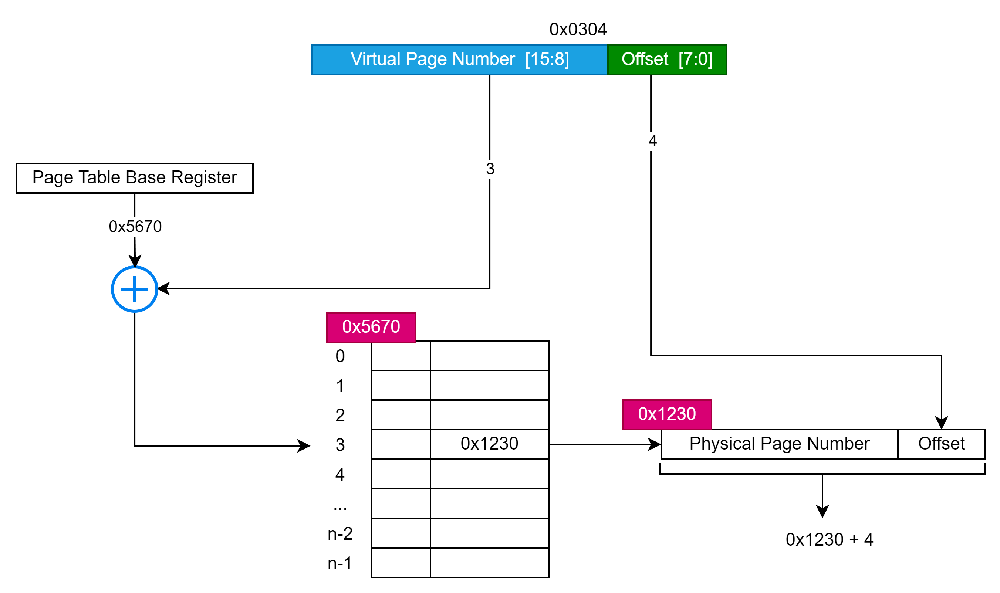
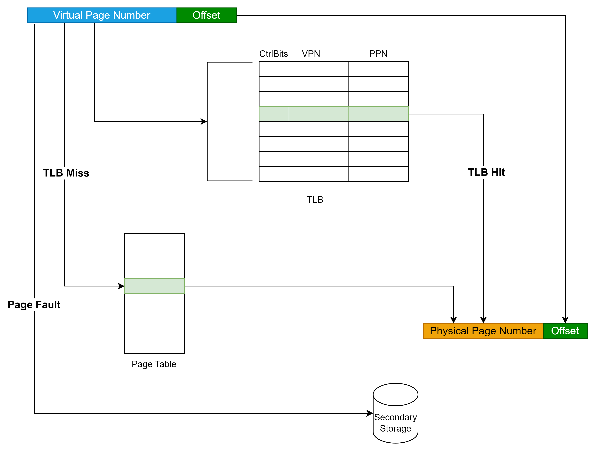

# 用虚拟地址如何找到物理地址

## 从一条指令说起
  mov rax, [0x12345678]，我们都知道这条指令是从地址0x12345678加载数据的到RAX寄存器，那么这个地址是什么地址呢？对是虚拟地址，通过该虚拟地址如何找到内存所对应的位置呢，本文尝试去回答这个问题。

## 什么是虚拟内存
  虚拟内存是操作系统提供的一种内存管理机制，它允许程序拥有连续的虚拟地址空间，而不管物理内存的实际分配情况。虚拟内存的一个重要目的就是通过地址转换机制实现程序和操作系统之间的隔离，并且能够提供更高效的内存管理，确保多进程或多任务环境下的安全和稳定。
  
### Why有虚拟内存
* **地址冲突**：多个程序可能会尝试访问相同的物理地址，从而引发冲突。虚拟内存可以让每个程序都有自己的独立虚拟地址空间。
* **内存隔离**：虚拟内存使得操作系统能够隔离不同程序的内存空间，提高系统的稳定性和安全性。
* **简化内存管理**：程序员不再需要关心物理内存的管理细节，只需要使用虚拟地址，操作系统会负责将其映射到物理内存中。
* **内存保护**：操作系统可以通过虚拟内存机制来控制程序访问的内存区域，防止程序非法访问内存中的其他部分。
 有虚拟内存之后，如何进行管理呢，这就是分段和分页，分段在Linux中作用不明显，先按下不表，我们重点放在分页上。

### Paging
* 虚拟内存以页(Page)为单位，linux下查看PageSize, `getconf PAGE_SIZE`，一般为4K，占用12bit
* 物理内存以页帧(Frame)为单位进行管理
* 虚拟地址空间和物理地址空间都按照相同的粒度进行划分，这意味着每个虚拟页都有一个与之对应的物理页帧。在地址转换时，操作系统通过页表来管理和映射虚拟地址和物理地址之间的关系。

#### 映射关系存放地： 页表
 因为VA和PA之间无法使用某种映射得来，需要进行动态的管理，页表里面就存储了这种动态关系，页表是操作系统维护，放置在内存中。

### 页表入口
* CR3寄存器也称为PDBR(Page Directory Base Register)，所指向的地址为某个进程的页表的入口，在CPU当前进程发生改变的时候该寄存器中的值会改变,确保每个进程都访问到正确的页表。

### 执行机构: MMU(Memory Management Unit)地址管理单元
 MMU是处理虚拟地址到物理地址转换的硬件模块。MMU的基本功能是将虚拟地址（VA）转换为物理地址（PA），从而允许程序访问物理内存。MMU通过页表来完成虚拟地址和物理地址的映射。
* 主要包含两个大模块
  * TLB(Translation Lookaside Buffer)地址转换后援缓冲器，页表在内存中，为了加速地址转换，将一部分可能用到的表项放入到缓存，其实就是**页表的缓存**。当CPU请求虚拟地址的转换时，首先会查询TLB。如果TLB命中，则直接返回物理地址，避免了频繁访问主存中的页表，从而提高了地址转换的效率。
  * TWU(Table Walk Unit)，当TLB未命中的时候，MMU会通过表步进（Table Walk）方式访问内存中的页表，逐级查找虚拟地址对应的物理地址。这个过程会遍历多个页表级别，直到找到对应的物理页帧。

## 执行流程
##### 基本概念
* 虚拟页号 VPN(Virtual Page Number)：虚拟地址空间被分为多个虚拟页，每个虚拟页都有一个唯一的虚拟页号（VPN）。虚拟页号是虚拟地址中的一部分，用于在页表中查找映射的物理页号。
* 物理页号 PPN(Physical Page Number) 与 PFN(Page Frame Number): 物理地址空间被划分为多个物理页帧，每个页帧有一个唯一的物理页号（PPN）或页帧号（PFN），这是物理内存中实际存储数据的位置。
* 页表条目PTE(Page Table Entry): 页表条目是页表中的一项，它包含了虚拟页号和物理页号之间的映射关系。每个页表条目指向一个物理页帧（PPN），以及其他一些控制信息，比如访问权限、是否存在等标志。
* 页全局目录 PGD(Page Global Directory)、页上级目录 PUD(Page Upper Directory)、页中间目录 PMD(Page Middle Directory): 这是多级页表的不同层级。每个级别负责将虚拟地址空间划分为不同的区域，每个目录项指向下一层的目录或页表条目，直到最终映射到物理内存页。

#### 页表的查询过程
* 我们先从只有一层页表来看，过程如下图所示

在只有一层页表的情况下，虚拟地址被分为两部分：虚拟页号（VPN）和页内偏移量，通过VPN查找页表条目（PTE），该条目指向物理页号（PPN）以及页内的偏移，**物理页号（PPN）**和页内偏移量一起构成物理地址，指向物理内存中的数据。
* 在现代操作系统中，虚拟内存使用多级页表来管理更大的虚拟地址空间。 下图是以x86_64 架构为例，

从PGD开始，逐级查找每个目录的条目，直到找到最终的页表条目（PTE）。每一级都将虚拟地址的一部分映射到下一层，直到得到物理页号。过页表条目（PTE）中的物理页号（PPN）和页内偏移量，最终得到物理地址。

#### TLB的使用
* TLB缓存的是虚拟页号（VPN）和物理页号（PPN）的映射关系。它不会缓存虚拟地址中的页内偏移部分，因为页内偏移是固定的，在转换时不需要查找。
* TLB缓存组织方式也是使用组相连或者全相连，如果是组相连，则将VPN再分为Tag和Index部分，这样查找的时候只要使用Index和Tag就能对比是否存在了
* 
  从图中可以看出，虚拟地址的翻译过程是优先寻找TLB，如果没有找到则找页表，再没有找到触发PageFault到外部存储加载
* TLB一级缓存一般分为指令和数据两部分，Intel Core i7上提供了二级统一TLB缓存。

### 总结
 虚拟内存的管理涉及到操作系统和CPU的密切配合。操作系统维护页表并提供虚拟地址到物理地址的映射关系，而CPU通过MMU将虚拟地址转换为物理地址。为了提高效率，CPU使用TLB来加速转换过程，而当TLB未命中时，MMU会通过表步进（Table Walk）查询页表。