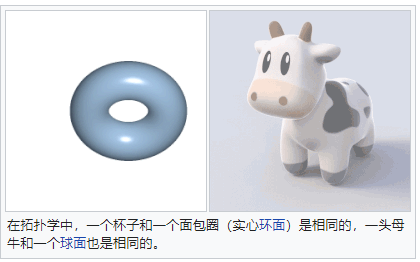

# 网络
## 流量调度
* 算法: 轮询调度、加权轮询调度、最小连接数优先调度。
## 负载均衡
* 

## 中国骨干网(图片是以中国电信电信的网络架构为例的，其他的类似)
* 中国公用计算机互联网，又称ChinaNet、163骨干网、中国公用互联网、中国宽带互联网，也被不正式地称呼为CN 1骨干网。其创建于1994年，于1996年正式开通，是中国最早的民用互联网骨干网，也是当前中国最大的互联网骨干。其主要自治系统（Autonomous system，简称AS）编号为4134。
ChinaNet起初由中国邮电部建设，在邮电业几经改革之后，现归中国电信所有，中国电信绝大多数的网络用户接入的都是ChinaNet。
* Internet Backbone Provider，IBP
* 
* Chinanet骨干网的拓扑结构逻辑上分为两层，即核心层和大区层。
* 核心层： 由北京、上海、广州、沈阳、南京、武汉、成都、西安等八个城市的核心节点组成。核心节点之间形成以北京、上海、广州为中心的三中心结构，其他核心节点分别以两条高速链路与这三个中心相连。
* 大区层： 全国31个省会城市按照行政区划，以上述8个核心节点为中心划分为8个大区网络，这8个大区网共同构成了大区层。大区之间通信必须经过核心层。
* 在北京、上海和广州这三个国际出口分别设立国际出口路由器，与国际Internet运营商相连。
* 
* 
* 
* 数据的路由按照metric进行计算，使用分层网络的实现方式
* 片区内与同一大区内中心的两台核心路由器（五普通核心节点）相连的省网之间的访问通过普通节点核心路由器交换来实现，片区内与不同大区中心核心节点相连的省网节点间访问，通过本片区内的超级核心节点1、2号路由器实现交换。如北京片区连接东北、华北和西北的14各省区，这些省网间的互访通过超级核心节点路由器北京1、北京2来完成。如青海和新疆属于西北（西安）大区，按照图中所示的metric设置，青海省网与新疆省网之间通过西安核心节点交换的metric值为400，而通过北京核心节点交换的metric值为800，因此青海和新疆网通过本大区核心节点交换；青海属于西北大区、吉林属于东北大区，青海和吉林同属于北京片区，青海和吉林省网之间的访问，通过各自的第一出口链路在超级核心节点北京1、2号路由上交换，即在平面一上交换，而不通过第二出口链路在片面二上实现交换，因为平面一上实现交换的metric小于在平面二上实现交换的metric。
* FULL MESH: 网络设备以网状拓扑被组织在一起，每个网络节点都要么有一条物理电路要么有一条虚拟电路与所有其他网络节点相连。全互联提供了大量冗余性，但是，因为它的成本昂贵，所以通常将它用在主干上。
* 整个骨干网是一个自治域(包括核心和汇接)。北京、上海、广州三个节点的国际出口网关（IXG）路由器与**国外Internet节点之间采用BGP-4**；CHINANET与**其客户的互联也必须采用BGP-4**；CHINANET骨干网与**省网的互联也必须采用BGP-4**。域间路由协议BGP-4在CHINANET中起着承载、分配和控制外界路由的作用。CHINANET一直采用IS-IS作为IGP路由协议。
* 可以用于大规模的ISP同时又基于标准的IGP的路由协议有OSPF和IS-IS.

## 海底光缆
* [全球海底光缆分布图](https://live.infrapedia.com/app)
* 中国的入口: 青岛、上海、汕头、香港
* 

## 163的来源
* 中国公用计算机互联网经常地被简称为“163网”。这是因为在中国互联网的早期时代，网民普遍使用电话线路拨号上网。而上网之前需要拨通的电话之一是163。当时通过拨打163接入的互联网即中国公用计算机互联网。
* 163在早期中国网民群体中非常著名，这也导致了1997年成立的中国互联网企业网易使用163.com作为其域名。

## 拓扑(topology)
* 拓扑学（topology）是研究几何图形或空间在连续改变形状后还能有一些性质保持不变的学科，它只考虑物体间的位置关系而不考虑它们的形状和大小。
* 李昂哈德·欧拉于1736年有关柯尼斯堡七桥问题的论文[2]被认为是现代拓扑学的第一份学术著作，且该问题导致了图论的发展
* 如果两个网络的连接结构相同，我们就说它们的网络拓扑相同，尽管它们各自内部的物理接线、节点间距离可能会有不同
* 两个空间同胚，若其中一个空间可不须切开或黏合即可变形成另一个空间。一个古老的笑话为，拓扑学无法分辨咖啡杯与甜甜圈，因为足够柔软的甜甜圈可被凹成一个杯底，中间的洞则可缩成一个手柄。

* 在拓扑学家眼中，物体的几何性质不仅可用寻常的“形状”或是“大小”来区分，也可用“洞”的数量来衡量，这就是物体的拓扑性质。因此，手镯和有手柄的玻璃杯都有一个洞，在拓扑概念里它们是一类的。甜甜圈有一个洞，而马卡龙没有洞，在拓扑概念里它们不是一类。
### 常见问题
* 四色问题
* 欧拉定理
* 七桥问题 Seven Bridges Problem

### 交换机
* 每个交换机的每个口都有一张网卡

### 路由器
* Linux 本身就是一台路由器
* 什么是路由器，能够根据IP来实现数据包转发，所以协议栈这层，路由器硬件也是需要实现的，或者说路由器是需要理解数据包的

### 虚拟化
* veth 只是个虚拟网卡(virtual ethernet device)
* v-switch: 虚拟交换机，hyper和vmware都可能用到，比如[OpenVSwitch](https://www.openvswitch.org/download/)
* v-router: 

## 广播技术
* anycast
* unicast
* broadcast
* multicast

## 网络

### 网络设备
* 各种网络设备层出不穷，其实没有特别明显的界限，只是一种划分方式，大厂可以做通用的设备，只不过会比较贵，还是要区分使用场景进行使用

### 网络中的问题
* 如何识别
* 如何发送
* 如何控制冲突域

### 核心问题
* 如何互通
* 互通的技术有哪些

### 理解
* 如果没有IP地址，只依赖网卡在内网也是可以通信的，叫 透明通信
* 因为IP地址其实是操作系统管理的，不在网卡上，所以网卡会接收所有MAC匹配的数据包，然后再投递到OS做进一步的处理
* 布尔运算是对电路的抽象，MAC是对网卡的抽象，IP是对机器的抽象
* IP 路由、IP NAT、IP 隧道，都是将IP玩来玩去，只要能到地方，怎么都行

### 通信
* 二层连通
* 三层连通