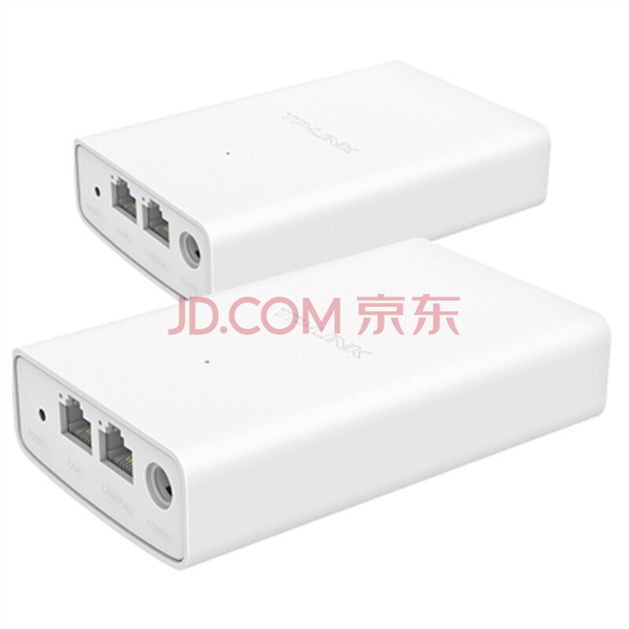

## bridge 


### 网桥设备
* 
* 一般只有两个口，就是两个冲突域
* 二层设备

### 特点
* MAC地址学习：网桥通过监听传入的数据帧，记录下每个数据帧中源设备的MAC地址和到达的端口。这样，网桥就能建立起一个MAC地址表，用于记录不同设备的MAC地址和对应的端口。通过学习MAC地址，网桥能够识别设备所在的端口，从而实现数据帧的转发。
* 数据帧过滤：网桥根据目标MAC地址来决定是否将数据帧转发到相应的端口。如果目标MAC地址在同一侧的局域网上，则不进行转发，只在另一侧的局域网上进行转发。这样可以限制数据帧的传播范围，减少网络流量和冲突。
* 数据帧转发：当网桥接收到数据帧时，它会根据MAC地址表决定将数据帧转发到哪个端口。通过查找目标MAC地址在表中的对应端口，网桥将数据帧只转发到目标设备所在的局域网上，从而实现局域网之间的通信。
* 碰撞域隔离：网桥能够隔离局域网的碰撞域。当使用集线器（Hub）连接多个设备时，数据帧会在所有端口广播，可能导致碰撞和冲突。而网桥可以将每个端口视为一个独立的碰撞域，从而减少碰撞和提高网络性能。


### 理解
* 将原有的HUB的冲突域一分为二


### linux网桥
* Bridge是Linux上工作在内核协议栈二层的虚拟交换机，虽然是软件实现的，但它与普通的二层物理交换机功能一样。可以添加若干个网络设备(em1,eth0,tap,..)到Bridge上(brctl addif)作为其接口，添加到Bridge上的设备被设置为只接受二层数据帧并且转发所有收到的数据包到Bridge中(bridge内核模块)，在Bridge中会进行一个类似物理交换机的查MAC端口映射表，转发，更新MAC端口映射表这样的处理逻辑，从而数据包可以被转发到另一个接口/丢弃/广播/发往上层协议栈，由此Bridge实现了数据转发的功能。如果使用tcpdump在Bridge接口上抓包，是可以抓到桥上所有接口进出的包
* 跟物理交换机不同的是，运行Bridge的是一个Linux主机，Linux主机本身也需要IP地址与其它设备通信。但被添加到Bridge上的网卡是不能配置IP地址的，他们工作在数据链路层，对路由系统不可见。不过Bridge本身可以设置IP地址，可以认为当使用brctl addbr br0新建一个br0网桥时，系统自动创建了一个同名的隐藏br0网络设备。br0一旦设置IP地址，就意味着br0可以作为路由接口设备，参与IP层的路由选择(可以使用route -n查看最后一列Iface)。因此只有当br0设置IP地址时，Bridge才有可能将数据包发往上层协议栈。
* Linux的Bridge在某种程度上具备了**网桥、网卡和网关的功能。**。 可以连通容器、可以配置IP、可以作为容器的网关，**因为它具有了对等网卡的功能，但是还能做网桥**
* 安装brctl yum install bridge-utils
* 查看 brctl show
```
bridge name     bridge id               STP enabled     interfaces
br-01612ab26dea         8000.0242ef8b5c10       no
br-b6a063283195         8000.024235a22119       no
docker0         8000.02425b3f82a3       no
```
* brctl addbr br-ue; ifconfig -a 
* 删除: ifconfig br-ue down; brctl delbr br-ue 
* 观察
```
brctl show > 

bridge name     bridge id               STP enabled     interfaces
cni-podman0             8000.2a5747ae7d21       no
cni0            8000.d223dd36e701       no              veth086d1546
                                                        veth282aa34a
                                                        veth317bd37b
                                                        veth321e1441
                                                        veth38154221
                                                        veth41aa8583
                                                        veth4a6fae95
                                                        veth4c2c699c
                                                        veth8754c0f5
                                                        veth89e4d19d
                                                        vethc60d9772
                                                        vethcdf77378
                                                        vethfdda4ec6
docker0         8000.024267e3e8cf       no
```
* modinfo bridge >> 
```
filename:       /lib/modules/5.10.0-13-amd64/kernel/net/bridge/bridge.ko
alias:          rtnl-link-bridge
version:        2.3
license:        GPL
srcversion:     44819D401807AE2EE816F79
depends:        stp,llc
retpoline:      Y
intree:         Y
name:           bridge
vermagic:       5.10.0-13-amd64 SMP mod_unload modversions 
sig_id:         PKCS#7
signer:         Debian Secure Boot CA
sig_key:        4B:6E:F5:AB:CA:66:98:25:17:8E:05:2C:84:66:7C:CB:C0:53:1F:8C
sig_hashalgo:   sha256
signature:      69:10:91:DE:B3:8B:1B:FE:30:07:DF:64:C4:26:B1:2E:ED:FE:5B:40:
                E6:6B:46:5E:CA:0F:48:53:A1:DF:54:F6:A9:3A:22:E8:58:BF:EC:98:
                61:BB:83:60:20:14:A8:D1:4C:02:2D:8E:F6:BE:AF:A6:E5:19:E4:E3:
                F7:CE:FA:DF:82:45:8B:98:6B:A1:B7:2E:74:4C:B8:81:6E:6F:86:09:
                C3:AD:0B:DC:2B:8B:11:CB:05:23:F5:C1:D4:7E:E5:8F:D5:62:01:06:
                7E:24:77:A6:8D:42:7E:2D:D0:A1:5C:59:3C:AB:00:12:D9:3A:8F:FA:
                DB:07:FD:6A:B0:51:42:47:FD:56:BF:98:40:9E:F9:3B:59:56:41:52:
                B1:07:F4:38:53:CC:E4:88:67:FA:8C:27:BF:42:0D:79:08:64:7A:D9:
                95:FE:7F:F2:BC:51:0A:B3:99:6F:C5:CE:EC:1D:78:0F:D2:6B:6E:3E:
                CB:93:75:09:C3:16:12:3B:11:C5:3A:48:17:9A:2B:DB:C8:33:4C:86:
                2E:0C:8A:7C:FD:B2:74:9C:AD:D9:EC:AE:36:6D:DB:A3:BD:58:C9:C2:
                28:41:C4:11:96:0C:0F:FC:56:3C:29:8F:DE:32:51:02:7A:98:E6:EE:
                9C:A6:14:A3:A5:2B:B7:3E:D4:B7:06:B4:80:D4:42:1D
```
* 实验
```
增加vlan设备
vconfig add ens33 5
ifconfig ens33.5 10.10.53.49 netmask 255.255.255.0 broadcast 10.10.53.255 up
ethtool -i ens33.5 >>
  driver: 802.1Q VLAN Support
  version: 1.8
  firmware-version: N/A
  expansion-rom-version: 
  bus-info: 
  supports-statistics: no
  supports-test: no
  supports-eeprom-access: no
  supports-register-dump: no
  supports-priv-flags: no

brctl addbr br0
brctl addif br0 ens33.5
brctl show >> 
  bridge name     bridge id               STP enabled     interfaces
  br0             8000.5a37b3bb1f7b       no              ens33.5
route -n 
  Kernel IP routing table
  Destination     Gateway         Genmask         Flags Metric Ref    Use Iface
  0.0.0.0         10.10.50.1      0.0.0.0         UG    0      0        0 ens33
  10.10.50.0      0.0.0.0         255.255.255.0   U     0      0        0 ens33
  10.10.53.0      0.0.0.0         255.255.255.0   U     0      0        0 ens33.5
```
 