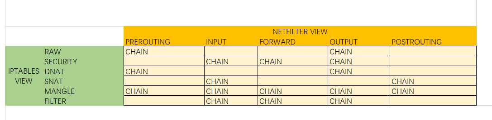

## iptables 
* netfilter的操作界面
* 都在IP层完成，还没有到TCP/UDP层

### framework
* 
* 
  
### 规则
* iptables –t table –A/D/R/I/NX chain match –j action
* action: ACCEPT, DROP, REDIRECT, REJECT, SNAT(Source Network Address Translation，源地址转换，源映射), DNAT(Destination Network Address Translation,目的地址转换， 目的映射), MASQUERADE(IP伪装, 算是snat中的一种特例，可以实现自动化的snat), LOG日志
* 参数
```
-A 向规则链中添加一条规则，默认被添加到末尾
-T指定要操作的表，默认是filter
-D从规则链中删除规则，可以指定序号或者匹配的规则来删除
-R进行规则替换
-I插入一条规则，默认被插入到首部
-F清空所选的链，重启后恢复
-N新建用户自定义的规则链
-X删除用户自定义的规则链
-p用来指定协议可以是tcp，udp，icmp等也可以是数字的协议号，
-s指定源地址
-d指定目的地址
-m匹配, mac, limit, state,
-i进入接口
-o流出接口
-j采取的动作，accept，drop，snat，dnat，masquerade
--sport源端口
--dport目的端口，端口必须和协议一起来配合使用
```

### ops commands example
* iptables -t filter -A INPUT -s 123.11.24.0/24 -j DROP，在filter表的Input链上添加规则，来自123.456.789.0/24（255.255.255.0）的数据包全部丢弃
* iptables -A INPUT -s 192.168.0.3 -p tcp –d port 22 -j ACCEPT，全部接收来自192.168.0.3的tcp数据包到本地22端口的数据包；（限制ssh连接的地址范围）
* iptables -t nat -A PREROUTING -p tcp -d 216.94.87.37 --dport 2121 -j DNAT --to-destination 192.168.1.47:21
* iptables -t nat -A POSTROUTING -p tcp -s 192.168.100.125 --sport 21 -j SNAT --to-source 216.94.87.37:2121
* iptables -t nat -A OUTPUT -d 192.168.1.21 -j DNAT --to 10.221.152.156 将去往192.168.1.21 的数据包修改为去往10.221.152.156 ，其实就是强制修改IP地址。
* iptables -nvL --line-numbers：查看fliter表中规则的顺序
* iptables-save > /etc/sysconfig/iptables 保存防火墙
* iptables-restore < /etc/sysconfig/iptables
* iptables -nvL -t filter | grep Chain
* iptables -nvL -t nat
* iptables -nvL KUBE-SVC-YY42PKKLES27ENOW -t nat
* iptables-save  查看动作
* iptables -t nat -S; -S 参数是用来显示防火墙规则的备份格式
* 快速执行 iptables -L -n，停止名字解析

### firewalld对比
* centos7默认使用了firewalld，放弃了iptables
* firewalld可以认为是iptables的升级版，功能更强大，更易用
* firewalld调用iptables的接口操纵netfilter

### 自定义链
* 方便管理
* **只能被引用**，没法独立放入Hook中
* 使用
  * 添加一个自定义链: iptables -t filter -N TEST_CHAIN
  * 删除一个自定义链: iptables -t filter -X TEST_CHAIN
  * 引用自定义链: iptables -I INPUT -p tcp --dport 80 -j TEST_CHAIN
  * 查看自定义链: 
    ```
    > iptables -L 
      Chain INPUT (policy ACCEPT)
      target     prot opt source               destination         
      TEST_CHAIN  tcp  --  anywhere             anywhere             tcp dpt:http
      Chain FORWARD (policy DROP)
      ...
      Chain OUTPUT (policy ACCEPT)
      ...
      Chain TEST_CHAIN (1 references)
      target     prot opt source               destination 
    ```
