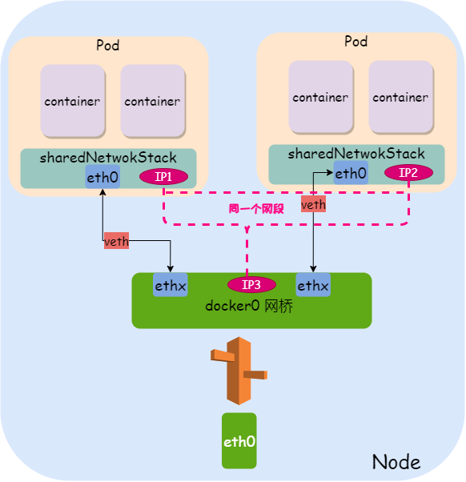

## k8s 
### 安装
* OS：centos7
* 关闭防火墙
```
systemctl disable firewalld
systemctl stop firewalld
```
* 安装软件
```
yum install etcd kubernetes
```
* 修改配置，/etc/sysconfig/docker
```
OPTIONS='--selinux-enabled=false --insecure-registry gcr.io'
```
* 修改配置，/etc/kubernetes/apiserver，去掉ServiceAccount
```
KUBE_ADMISSION_CONTROL="--admission-control=NamespaceLifecycle,NamespaceExists,LimitRanger,SecurityContextDeny,ResourceQuota"
```
* 启动
```
systemctl start etcd
systemctl start docker
systemctl start kube-apiserver
systemctl start kube-controller-manager
systemctl start kube-scheduler
systemctl start kubelet
systemctl start kube-proxy
```

### 搭建样本服务
* kubectl create -f mysql-rc.yaml
* kubectl delete -f mysql-rc.yaml
* kubectl create -f mysql-svc.yaml (此处可写多个文件，可以使用网络文件)
* kubectl apply -f mysql-rc.yaml (更新配置) 
* kubectl replace -f mysql-rc.yaml (替换配置) 
* kubectl describe pod mysql(pod的名字) 获取状态
* kubectl describe all

### 命令使用
* kubectl get rc 
```
NAME      DESIRED   CURRENT   READY     AGE
mysql     1         1         0         57s
```
* kubectl get pods
```
NAME          READY     STATUS              RESTARTS   AGE
mysql-0hxxh   0/1       ContainerCreating   0          1m
```
* kubectl get pods -o wide 显示更丰富的信息
```
NAME                        READY     STATUS    RESTARTS   AGE       IP           NODE
frontend-3737371888-5q3qr   1/1       Running   0          20h       172.17.0.6   127.0.0.1
mysql-jlrf5                 1/1       Running   0          21h       172.17.0.2   127.0.0.1
myweb-g9dk5                 1/1       Running   0          20h       172.17.0.5   127.0.0.1
myweb-k0nr3                 1/1       Running   0          20h       172.17.0.4   127.0.0.1
myweb-ltqdj                 1/1       Running   0          21h       172.17.0.3   127.0.0.1
```
* kubectl get svc
```
NAME         CLUSTER-IP      EXTERNAL-IP   PORT(S)    AGE
kubernetes   10.254.0.1      <none>        443/TCP    2h
mysql        10.254.67.207   <none>        3306/TCP   20s
```
* kubectl get all
* kubectl get pods --show-all
* kubectl get nodes 
* kubectl  describe  node 127.0.0.1 获取对某个node的描述
* kubectl logs -f myweb-ch5cm(pod的名字，在kubectl get pod中查看)
* kubectl scale rc myweb --replicas=3  收缩
* kubectl get endpoints
* 删除所有: kubectl delete svc(pods、nodes) --all
* kubectl edit pod php-server-6f6f8bc8c-9hrfv 直接修改pod的配置
* kubectl get secret 查看密钥
* kubectl exec -it `kubectl get pods | grep mongo | awk '{print $1}'` -- /bin/bash /docker-entrypoint-initdb.d/setup.sh (可以针对某个pod执行命令)
* kubectl logs -f nginx-php-9d64cfb54-xc5tk(pod name ) nginx-game(container name)
* curl localhost:10249/proxyMode (数据包的代理模式)
* busybox是一个包含了nslookup,ping,wget等网络处理命令的Pod容器（不含curl命令），它的体积非常小，适合做一些容器内的网络调试。 kubectl run busybox -it --image=busybox --restart=Never --rm
* kubectl get svc --namespace=kube-system 查看是否启用dns (注意kube-dns)
```
NAME             TYPE           CLUSTER-IP     EXTERNAL-IP   PORT(S)                      AGE
kube-dns         ClusterIP      10.43.0.10     <none>        53/UDP,53/TCP,9153/TCP       10d
metrics-server   ClusterIP      10.43.29.48    <none>        443/TCP                      10d
traefik          LoadBalancer   10.43.211.41   10.70.4.207   80:31227/TCP,443:32709/TCP   10d
```
*  kubectl config view 查看k8s的配置
* kubectl config view --minify --raw
* kubectl config view --raw -o=jsonpath='{.clusters[0].cluster.certificate-authority-data}' | base64 --decode 
* kubectl --kubeconfig /etc/rancher/k3s/k3s.yaml get pods --all-namespaces


### ingress
* kubectl describe svc traefik --namespace kube-system
* kubectl get svc traefik --namespace kube-system -w


### configMap
* kubectl create configmap conf-d-game-conf --from-file ./conf.d/game.conf -o yaml > configmap.yaml
* kubectl get cm
* kubectl delete cm --all


### 安全
* kubectl get secret 查看密钥
* kubectl create secret docker-registry [$Reg_Secret] --docker-server=[$Registry] --docker-username=[$Username] --docker-password=[$Password] --docker-email=[$Email]
* kubectl create secret docker-registry aliyun-secret --docker-server=registry.cn-hangzhou.aliyuncs.com --docker-username=3333333 --docker-password=1111111
```
 kubectl get secret
NAME                  TYPE                                  DATA   AGE
default-token-cl5qm   kubernetes.io/service-account-token   3      2d19h
aliyun-secret         kubernetes.io/dockerconfigjson        1      34s
```
* SA: service accounts
* kubectl get sa
#### 添加私有镜像仓库密钥到k8s中(使用新的sa方式)

* kubectl create secret docker-registry **aliyun-secret** --docker-server=registry.cn-hangzhou.aliyuncs.com --docker-username=3333333 --docker-password=1111111(创建密钥)
* kubectl create sa **aliyun** (创建新的SA)
* kubectl patch serviceaccount **aliyun** -p '{"imagePullSecrets": [{"name": "**aliyun-secret**"}]}' (密钥添加到指定的SA中)
```
apiVersion: apps/v1
kind: Deployment
metadata:
  name: php-server
  labels:
    name: php-server
spec:
  replicas: 1
  selector:
    matchLabels:
      app: php-server
  template:
    metadata:
      labels:
        app: php-server
    spec:
      serviceAccountName: aliyun
      imagePullSecrets:
        - name: aliyun-secret
      containers:
      - name: php-server
        image: registry.cn-hangzhou.aliyuncs.com/sandstone/php:v-game-1.0.0
        imagePullPolicy: Always
        #imagePullPolicy: IfNotPresent
        volumeMounts:
        - mountPath: /var/www/html/
          name: nginx-data
        ports:
        - containerPort: 9000
      volumes:
      - name: nginx-data
        hostPath:
         path: /root/k8s/html
```
#### 添加私有镜像仓库密钥到k8s中(添加到dafault中)
* kubectl create secret docker-registry **aliyun-secret** --docker-server=registry.cn-hangzhou.aliyuncs.com --docker-username=3333333 --docker-password=1111111
* kubectl patch serviceaccount default -p '{"imagePullSecrets": [{"name": "**aliyun-secret**"}]}' 
```
apiVersion: apps/v1
kind: Deployment
metadata:
  name: php-server
  labels:
    name: php-server
spec:
  replicas: 1
  selector:
    matchLabels:
      app: php-server
  template:
    metadata:
      labels:
        app: php-server
    spec:
      imagePullSecrets:
        - name: aliyun-secret
      containers:
      - name: php-server
        image: registry.cn-hangzhou.aliyuncs.com/sandstone/php:v-game-1.0.0
        imagePullPolicy: Always
        #imagePullPolicy: IfNotPresent
        volumeMounts:
        - mountPath: /var/www/html/
          name: nginx-data
        ports:
        - containerPort: 9000
      volumes:
      - name: nginx-data
        hostPath:
         path: /root/k8s/html
```


### 生产效率
* shell自动补全
```
source <(kubectl completion bash) # 在 bash 中设置当前 shell 的自动补全，要先安装 bash-completion 包。
echo "source <(kubectl completion bash)" >> ~/.bashrc # 在您的 bash shell 中永久的添加自动补全
```

### stack
#### Flannel
* Flannel是CoreOS团队针对Kubernetes设计的一个网络规划服务，简单来说，它的功能是让集群中的不同节点主机创建的Docker容器都具有全集群唯一的虚拟IP地址。
#### network
* docker支持4类网络模式， host、container、none、bridge
* 在kubernetes管理模式下，网络使用bridge模式
#### 理解
* 网桥 路由 veth iptables 共同构成了kubenetes的网络
* 同一个node同一个pod的ip <br> 
* 同一个node多个pod的ip<br>
* 架构 


### 问题
* 错误：docker-ce conflicts with 2:docker-1.13.1-74.git6e3bb8e.el7.centos.x86_64
Error: docker-ce-cli conflicts with 2:docker-1.13.1-208.git7d71120.el7_9.x86_64
```
 yum remove -y docker-ce.x86_64
 yum remove -y docker-ce-cli.x86_64
```
* open /etc/docker/certs.d/registry.access.redhat.com/redhat-ca.crt: no such file or directory
```
yum install *rhsm* -y
```
```
wget http://mirror.centos.org/centos/7/os/x86_64/Packages/python-rhsm-certificates-1.19.10-1.el7_4.x86_64.rpm rpm2cpio python-rhsm-certificates-1.19.10-1.el7_4.x86_64.rpm | cpio -iv --to-stdout ./etc/rhsm/ca/redhat-uep.pem | tee /etc/rhsm/ca/redhat-uep.pem
docker pull registry.access.redhat.com/rhel7/pod-infrastructure:latest
```
* The range of valid ports is 30000-32767
* 在同一个pod内启动的container，端口不能冲突
* 如果看不到错误日志，可能是进程被放到后台运行了，没有任何报错出来，啊啊啊啊啊啊啊，教训啊
* 如果没有办法来查看错误，则使用其他命令进入到容器中，然后手动执行进程的启动，观察错误\
* ..2021_08_17_05_00_25.674450089 类似这样的目录，ls -la可以看到
* configMap的动态更新需要一定的时间