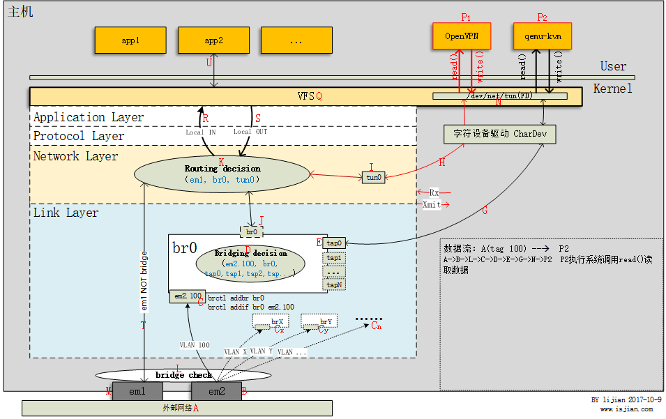

## TUN TAP 
* tun是**网络层**的虚拟网络设备，可以收发第三层数据报文包，如IP封包，因此常用于一些点对点IP隧道，例如OpenVPN，IPSec, 使用TUN设备在C/S间建立VPN隧道
* tap是**链路层**的虚拟网络设备，等同于一个以太网设备，它可以收发第二层数据报文包，如以太网数据帧。Tap最常见的用途就是做为虚拟机的网卡，因为它和普通的物理网卡更加相近，也经常用作普通机器的虚拟网卡。
* 为了使用tun/tap设备，用户层程序需要通过系统调用打开/dev/net/tun获得一个读写该设备的文件描述符(FD)，并且调用ioctl()向内核注册一个TUN或TAP类型的虚拟网卡(实例化一个tun/tap设备)，其名称可能是tap7b7ee9a9-c1/vnetXX/tunXX/tap0等。此后，用户程序可以通过该虚拟网卡与主机内核协议栈交互。当用户层程序关闭后，其注册的TUN或TAP虚拟网卡以及路由表相关条目(使用tun可能会产生路由表条目，比如openvpn)都会被内核释放。可以把用户层程序看做是网络上另一台主机，他们通过tap虚拟网卡相连。
### cmds
* 使用
```
ip tuntap add dev tun0 mode tun 
ip tuntap add dev tap0 mode tap
========================================================================================================================
ip a >>
  1: lo: <LOOPBACK,UP,LOWER_UP> mtu 65536 qdisc noqueue state UNKNOWN group default qlen 1000
      link/loopback 00:00:00:00:00:00 brd 00:00:00:00:00:00
      inet 127.0.0.1/8 scope host lo
        valid_lft forever preferred_lft forever
      inet6 ::1/128 scope host 
        valid_lft forever preferred_lft forever
  2: ens33: <BROADCAST,MULTICAST,UP,LOWER_UP> mtu 1500 qdisc pfifo_fast state UP group default qlen 1000
      link/ether 00:0c:29:d7:24:7a brd ff:ff:ff:ff:ff:ff
      altname enp2s1
      inet 10.10.50.118/24 brd 10.10.50.255 scope global ens33
        valid_lft forever preferred_lft forever
      inet6 fe80::20c:29ff:fed7:247a/64 scope link 
        valid_lft forever preferred_lft forever
  3: tap0: <BROADCAST,MULTICAST> mtu 1500 qdisc noop state DOWN group default qlen 1000
      link/ether 66:01:f5:d1:98:8e brd ff:ff:ff:ff:ff:ff
  4: tun0: <POINTOPOINT,MULTICAST,NOARP> mtu 1500 qdisc noop state DOWN group default qlen 500
      link/none 
========================================================================================================================
ifconfig tap0 10.10.53.2 netmask 255.255.255.0
ifconfig tun0 10.10.53.1 netmask 255.255.255.0
ip a >> 
  1: lo: <LOOPBACK,UP,LOWER_UP> mtu 65536 qdisc noqueue state UNKNOWN group default qlen 1000
      link/loopback 00:00:00:00:00:00 brd 00:00:00:00:00:00
      inet 127.0.0.1/8 scope host lo
        valid_lft forever preferred_lft forever
      inet6 ::1/128 scope host 
        valid_lft forever preferred_lft forever
  2: ens33: <BROADCAST,MULTICAST,UP,LOWER_UP> mtu 1500 qdisc pfifo_fast state UP group default qlen 1000
      link/ether 00:0c:29:d7:24:7a brd ff:ff:ff:ff:ff:ff
      altname enp2s1
      inet 10.10.50.118/24 brd 10.10.50.255 scope global ens33
        valid_lft forever preferred_lft forever
      inet6 fe80::20c:29ff:fed7:247a/64 scope link 
        valid_lft forever preferred_lft forever
  3: tap0: <NO-CARRIER,BROADCAST,MULTICAST,UP> mtu 1500 qdisc pfifo_fast state DOWN group default qlen 1000
      link/ether 66:01:f5:d1:98:8e brd ff:ff:ff:ff:ff:ff
      inet 10.10.53.2/24 brd 10.10.53.255 scope global tap0
        valid_lft forever preferred_lft forever
  4: tun0: <NO-CARRIER,POINTOPOINT,MULTICAST,NOARP,UP> mtu 1500 qdisc pfifo_fast state DOWN group default qlen 500
      link/none 
      inet 10.10.53.1/24 scope global tun0
        valid_lft forever preferred_lft forever
========================================================================================================================
route >>
  Kernel IP routing table
  Destination     Gateway         Genmask         Flags Metric Ref    Use Iface
  default         bogon           0.0.0.0         UG    0      0        0 ens33
  10.10.50.0      0.0.0.0         255.255.255.0   U     0      0        0 ens33
  10.10.53.0      0.0.0.0         255.255.255.0   U     0      0        0 tun0
  10.10.53.0      0.0.0.0         255.255.255.0   U     0      0        0 tap0
========================================================================================================================
ip tuntap delete dev tun0 mode tun
ip tuntap delete dev tap0 mode tap
```
*  modinfo tun >> 
```
filename:       /lib/modules/5.10.0-13-amd64/kernel/drivers/net/tun.ko
alias:          devname:net/tun
alias:          char-major-10-200
license:        GPL
author:         (C) 1999-2004 Max Krasnyansky <maxk@qualcomm.com>
description:    Universal TUN/TAP device driver
depends:        
retpoline:      Y
intree:         Y
name:           tun
vermagic:       5.10.0-13-amd64 SMP mod_unload modversions 
sig_id:         PKCS#7
signer:         Debian Secure Boot CA
sig_key:        4B:6E:F5:AB:CA:66:98:25:17:8E:05:2C:84:66:7C:CB:C0:53:1F:8C
sig_hashalgo:   sha256
signature:      19:93:81:59:0A:15:E2:75:F8:EA:1A:85:43:42:62:65:52:51:97:89:
                75:0A:A2:1D:F8:7E:C1:F7:BA:C6:78:C2:BA:53:5C:BF:0B:37:D1:4F:
                14:AB:33:96:9E:64:90:26:47:29:E8:8A:AD:DE:E7:C4:9B:A5:6B:6E:
                4A:BF:19:2A:B9:E9:5B:AD:75:95:F7:74:13:C1:64:27:DC:B6:FF:3D:
                AC:8D:9C:47:2B:36:B1:C1:63:FD:14:4D:05:35:EB:A0:19:9E:A7:1F:
                DA:44:20:20:38:11:3A:E6:AC:16:FC:C2:87:0C:89:78:1C:4A:5D:4C:
                65:B1:9C:D6:28:F9:79:E6:77:85:08:F6:59:B8:E4:9E:B5:94:B4:3B:
                B9:A1:6F:43:2C:04:CF:39:70:0E:FA:FF:63:31:1F:F9:90:EE:B6:00:
                5A:3D:9A:8E:2C:50:BE:A6:85:D8:C7:11:B4:87:18:89:7D:B7:5D:B6:
                63:DA:FC:94:5E:88:9A:81:C8:A3:EA:6B:46:9E:BD:1E:B9:D0:DB:1A:
                E6:16:FD:92:FC:0C:DF:70:AC:65:36:66:B4:3A:12:EE:28:3A:D2:CB:
                D9:A2:DA:7B:CB:22:82:B0:6C:11:D3:58:CF:E4:EF:1A:3D:C0:5B:E5:
                53:5F:86:6B:8A:73:A5:61:B0:5B:8A:35:AF:87:62:DC
```
*  <br>
* 从文件系统中介入到网络系统中
* tap： 水龙头
* tun: 隧道