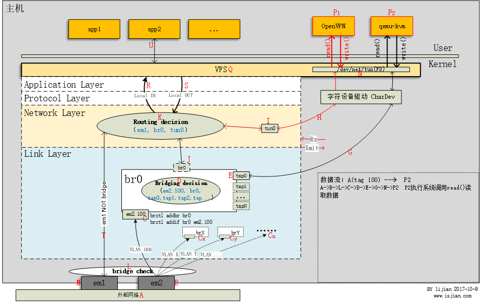

## Tunnel 技术

### TUN/TAP
* tun是**网络层**的虚拟网络设备，可以收发第三层数据报文包，如IP封包，因此常用于一些点对点IP隧道，例如OpenVPN，IPSec, 使用TUN设备在C/S间建立VPN隧道
* tap是**链路层**的虚拟网络设备，等同于一个以太网设备，它可以收发第二层数据报文包，如以太网数据帧。Tap最常见的用途就是做为虚拟机的网卡，因为它和普通的物理网卡更加相近，也经常用作普通机器的虚拟网卡。
* 为了使用tun/tap设备，用户层程序需要通过系统调用打开/dev/net/tun获得一个读写该设备的文件描述符(FD)，并且调用ioctl()向内核注册一个TUN或TAP类型的虚拟网卡(实例化一个tun/tap设备)，其名称可能是tap7b7ee9a9-c1/vnetXX/tunXX/tap0等。此后，用户程序可以通过该虚拟网卡与主机内核协议栈交互。当用户层程序关闭后，其注册的TUN或TAP虚拟网卡以及路由表相关条目(使用tun可能会产生路由表条目，比如openvpn)都会被内核释放。可以把用户层程序看做是网络上另一台主机，他们通过tap虚拟网卡相连。
#### cmds
* 使用
  ```
  ip tuntap add dev tun0 mode tun 
  ip tuntap add dev tap0 mode tap
  ip link set tun0 up
  ip link set tap0 up
  ========================================================================================================================
  ip a >>
    ...
    3: tap0: <BROADCAST,MULTICAST> mtu 1500 qdisc noop state DOWN group default qlen 1000
        link/ether 66:01:f5:d1:98:8e brd ff:ff:ff:ff:ff:ff
    4: tun0: <POINTOPOINT,MULTICAST,NOARP> mtu 1500 qdisc noop state DOWN group default qlen 500
        link/none 
  ========================================================================================================================
  ifconfig tap0 10.10.53.2 netmask 255.255.255.0
  ifconfig tun0 10.10.53.1 netmask 255.255.255.0
  ip a >> 
    ...
    3: tap0: <NO-CARRIER,BROADCAST,MULTICAST,UP> mtu 1500 qdisc pfifo_fast state DOWN group default qlen 1000
        link/ether 66:01:f5:d1:98:8e brd ff:ff:ff:ff:ff:ff
        inet 10.10.53.2/24 brd 10.10.53.255 scope global tap0
          valid_lft forever preferred_lft forever
    4: tun0: <NO-CARRIER,POINTOPOINT,MULTICAST,NOARP,UP> mtu 1500 qdisc pfifo_fast state DOWN group default qlen 500
        link/none 
        inet 10.10.53.1/24 scope global tun0
          valid_lft forever preferred_lft forever
  ========================================================================================================================
  route >>
    Kernel IP routing table
    Destination     Gateway         Genmask         Flags Metric Ref    Use Iface
    default         bogon           0.0.0.0         UG    0      0        0 ens33
    10.10.50.0      0.0.0.0         255.255.255.0   U     0      0        0 ens33
    10.10.53.0      0.0.0.0         255.255.255.0   U     0      0        0 tun0
    10.10.53.0      0.0.0.0         255.255.255.0   U     0      0        0 tap0
  ========================================================================================================================
  ip tuntap delete dev tun0 mode tun 或者 ip link delete tun0
  ip tuntap delete dev tap0 mode tap 或者 ip link delete tap0
  ```
*  modinfo tun >> 
  ```
  filename:       /lib/modules/5.10.0-13-amd64/kernel/drivers/net/tun.ko
  alias:          devname:net/tun
  alias:          char-major-10-200
  license:        GPL
  author:         (C) 1999-2004 Max Krasnyansky <maxk@qualcomm.com>
  description:    Universal TUN/TAP device driver
  depends:        
  retpoline:      Y
  intree:         Y
  name:           tun
  vermagic:       5.10.0-13-amd64 SMP mod_unload modversions 
  sig_id:         PKCS#7
  signer:         Debian Secure Boot CA
  sig_key:        4B:6E:F5:AB:CA:66:98:25:17:8E:05:2C:84:66:7C:CB:C0:53:1F:8C
  sig_hashalgo:   sha256
  signature:      19:93:81:59:0A:15:E2:75:F8:EA:1A:85:43:42:62:65:52:51:97:89...
  ```
*  <br>
* 从文件系统中介入到网络系统中
* tap： 水龙头
* tun: 隧道
* 直接打通网卡和应用层


### IPIP
* 协议：
  * IPPROTO_IPIP = 4
  * IPPROTO_TCP = 6
  * IPPROTO_IP  = 0
  * IPPROTO_ICMP = 1
  * IPPROTO_EGP = 8
  * IPPROTO_UDP = 17
  * IPPROTO_RAW = 255
* 实验
  * 环境：NodeA: 10.10.50.71 NodeB: 10.10.50.186，连通
  * NodeA: 
    * ip tunnel add tun1 mode ipip remote 10.10.50.186 local 10.10.50.71   ; 设置两个Endpoint
    * ip link set tun1 up
    * ip a add 192.168.1.1 peer 192.168.1.2 dev tun1                        ; 设备添加IP
  * NodeB:
    * ip tunnel add tun1 mode ipip remote 10.10.50.71 local 10.10.50.186
    * ip link set tun1 up 
    * ip a add 192.168.1.2 peer 192.168.1.1 dev tun1