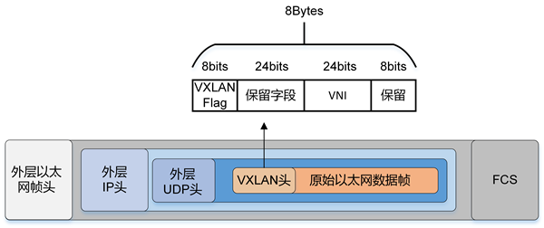

## VXLAN (Virtual eXtensible Local Area Network)
* 虚拟可扩展局域网 （VXLAN） 是由互联网工程任务组 （IETF） 定义的第 3 层网络虚拟化 （NVO3） 技术之一，是虚拟局域网 （VLAN） 的扩展。VXLAN 将第 2 层以太网帧封装到 UDP 数据包中，并通过第 3 层网络传输该数据包。
* VXLAN本质上是一种隧道技术，当源和目的之间有通信需求时，便在数据中心IP网络之上创建一条虚拟的隧道，透明转发用户数据。而数据中心内相互通信的需求众多，这种隧道的建立方式几乎是全互联形态才能满足通信需求。
* VXLAN可以提供一套方法论，在数据中心IP网络基础上，**构建一张全互联的二层隧道虚拟网络**，保证任意两点之间都能通过VXLAN隧道来通信，并忽略底层网络的结构和细节。从服务器的角度看，VXLAN为它们将整个数据中心基础网络虚拟成了一台巨大的“二层交换机”，所有服务器都连接在这台虚拟二层交换机上。而基础网络之内如何转发都是这台“巨大交换机”内部的事情，服务器完全无需关心。
* 解决VLAN的ID不足的问题，只有4096个，12bit
* 使用UDP协议传输
* 
* 从格式上可以看出，vtep将**整个以太网帧**进行了封装，然后传输到别的vtep

### VNI(VXLAN Network ID)
* 

### VTEP(VXLAN Tunnel Endpoints)
* VXLAN隧道端点

### Underlay(底层网络)  和 OverLay(覆盖网络)
* Underlay是物理网络基础设施，它是指底层的物理网络拓扑，包括物理交换机、路由器和链路等。Underlay提供实际的数据传输和转发功能，用于承载虚拟网络的数据流
* Overlay网络是一个建立在已有网络上的虚拟网络，由逻辑节点和逻辑链路构成。