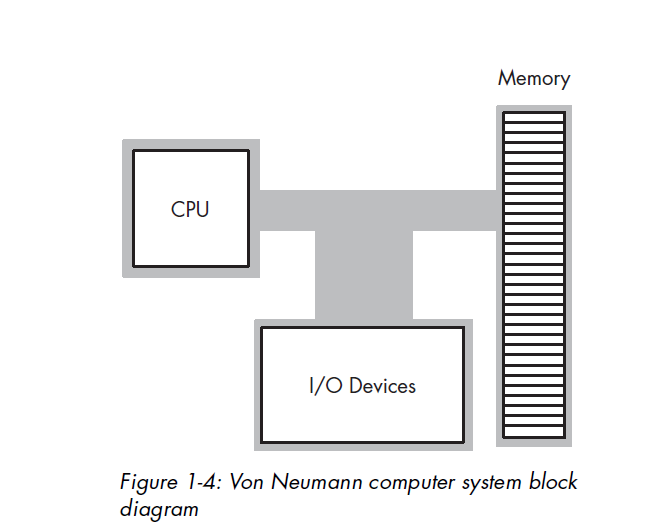

## bootstrap

### bios 
* Basic Input Output System，即基本输入/输出系统
* 本质是一个固化在主板 Flash/CMOS 上的软件
* PC 计算机硬件与上层软件程序之间的一个"桥梁"，负责访问和控制硬件。

### Legacy 启动模式
##### MBR 
* Master Boot Record(MBR),主引导记录,通常位于磁盘的第一个扇区

### UEFI(Unified Extensible Firmware Interface)(统一可扩展固件接口) 启动模式
* 公开的规范，定义了操作系统和平台固件之间的软件接口
* UEFI 是传统 PC BIOS 的继承者，旨在解决其技术限制。
* 它将引导数据存储在 .efi 文件中，而不是固件中

### real mode
* 在实模式下，x86处理器使用16位地址总线，最大可寻址64KB的物理内存空间
* BIOS通常被加载到低端内存地址（例如0xFFFF0）处，因此可以通过物理地址直接访问。

### CPU通电之后的硬件初始化
* CPU硬件初始化完成后，CPU被设置为实地址模式，地址无分页。所有寄存器被初始化为特定的值， Cache、TLB（Translation Lookup Table）、BLB（Branch Target Buffer）这三个部件的内容被清空（Invalidate）。**此时CS的值为0xF000,base为0xFFFF0000,EIP的值为0xFFF0,此时对应的指令地址为0xFFFF0000+0xFFF0 = 0xFFFFFFF0**。

### bios内容的复制
* 复制BIOS代码到内存的过程由主板上的Memory Controller Hub（MCH）或者说是Memory Controller或者北桥芯片来完成的。MCH或Northbridge会根据预定义的规则和配置，将BIOS代码从固件存储器（如闪存或EEPROM）复制到预留的内存空间中。
* 这个过程被称为BIOS Shadowing，因为在ROM中执行速度没有RAM中快
* 在BIOS Shadowing过程中，BIOS代码通常会被复制到系统内存的特定地址范围，例如0xFFFF0000 到 0xFFFFFFFF，以确保代码在实模式下的正确执行。一旦BIOS代码被复制到内存中，CPU就可以通过设置CS:IP寄存器指向BIOS代码的起始地址，开始执行BIOS初始化过程。

### BIOS的入口
* 0xFFFFFFF0指向的地方，重置向量的位置
```
;
; For IA32, the reset vector must be at 0xFFFFFFF0, i.e., 4G-16 byte
; Execution starts here upon power-on/platform-reset.
;
ResetHandler:
    nop
    nop
ApStartup:
    ;
    ; Jmp Rel16 instruction
    ; Use machine code directly in case of the assembler optimization
    ; SEC entry point relative address will be fixed up by some build tool.
    ;
    ; Typically, SEC entry point is the function _ModuleEntryPoint() defined in
    ; SecEntry.asm
    ;
    DB      0e9h
    DW      -3
```

### 冯诺依曼模型
* 
