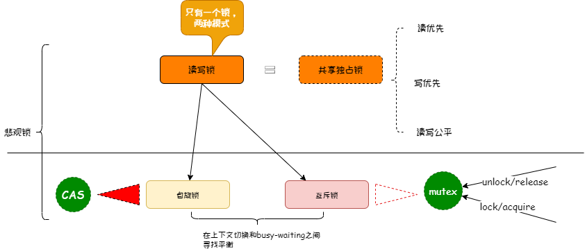

# 并发问题

## 锁
## 乐观锁 & 悲观锁
```
* 乐观锁适用于读操作多的场景，这样可以提高程序的吞吐量。
* 乐观锁不会刻意使用数据库本身的锁机制，而是依据数据本身来保证数据的正确性
* 乐观锁实现方式：CAS(Compare And Swap)，即比较并交换； 版本号
------------------------------------------------------------------------------------------------------
* 悲观锁的实现，往往依靠数据库提供的锁机制
* 悲观锁适用于写多的场景，保证数据的可靠性
------------------------------------------------------------------------------------------------------
* 不管是乐观锁，还是悲观锁，都是一种思想，不是实现技术
```
### 自旋锁
* 原地打转，不停的查看,「**busy-waiting**」
### 互斥锁
* 线程进入睡眠态，不像自旋锁一样不停的spin

### 锁之间的关系


### 锁的脑洞
* 排队就是锁