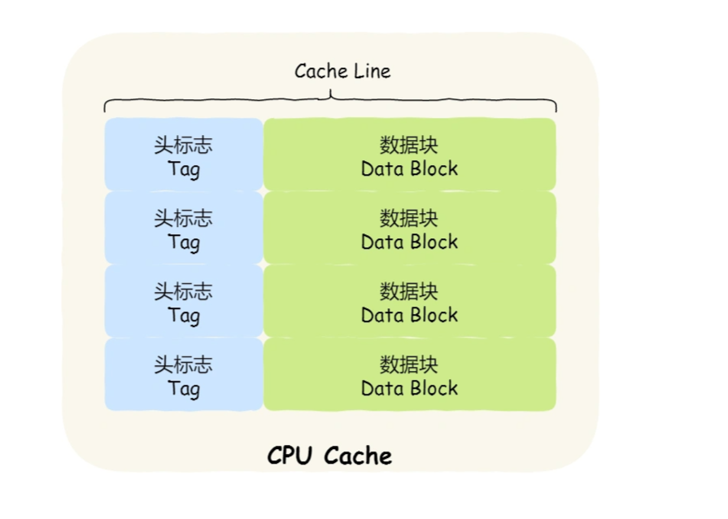
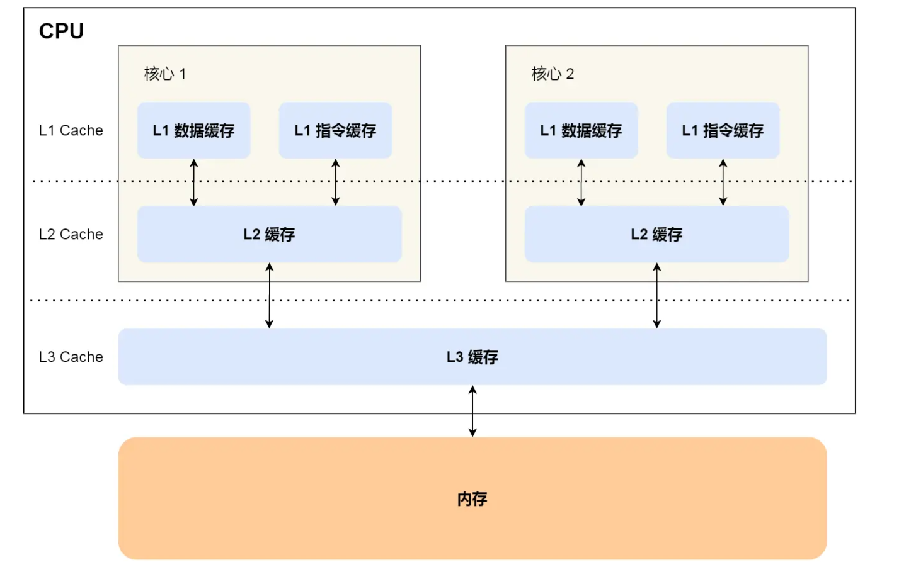
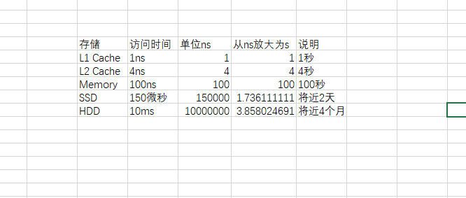
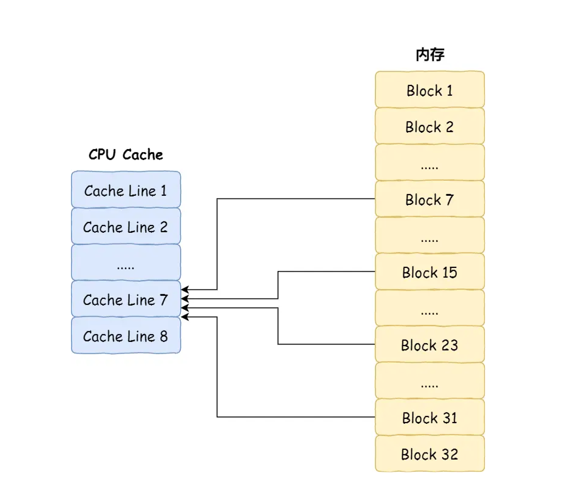
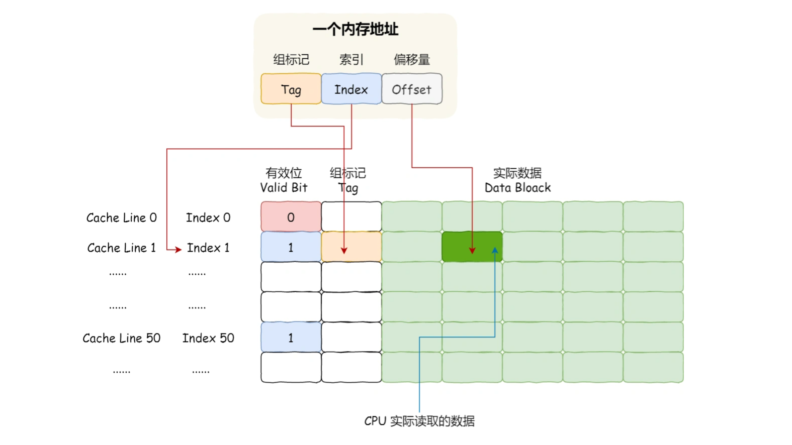

## CPU


### 构成
* CPU的根本任务就是执行指令，即“0”和“1”组成的序列
* 运算器、控制器、cache与寄存器组，这三部分由CPU内部总线连接起来

### 缓存协议
* 计算机CPU的各级缓存（如L1缓存、L2缓存、L3缓存等）通过使用缓存一致性协议来解决失效问题。缓存一致性协议是一种协调多级缓存之间数据一致性的机制，确保在多个缓存中存储的数据保持一致。常见的缓存一致性协议包括MESI（Modified, Exclusive, Shared, Invalid）和MOESI（Modified, Owned, Exclusive, Shared, Invalid）等。
* 可以认为缓存中的数据在用的时候一定是与内存保持一致的


### Cache
* L1 Data Cache Size: /sys/devices/system/cpu/cpu0/cache/index0/size   48K ，cpu独享
* L1 Instruction Cache Size: /sys/devices/system/cpu/cpu0/cache/index1/size 32K，cpu独享
* L2 Cache Size: /sys/devices/system/cpu/cpu0/cache/index2/size 512K，cpu独享
* L3 Cache Size: /sys/devices/system/cpu/cpu0/cache/index3/size 16384K cpu共享
* Cache Line Size(L1 Cache 一次载入数据的大小): /sys/devices/system/cpu/cpu0/cache/index[0,1,2,3]/coherency_line_size 64，而64位的机器的word是64bit，所以一次load 8个word进入cache line
* cpu每次从cache中取数据的时候取一个word
* 
* 
* 
* CPU Cache 用的是一种叫 **SRAM**（Static Random-Access Memory，静态随机存储器） 的芯片。之所以叫「静态」存储器，是因为只要有电，数据就可以保持存在，而一旦断电，数据就会丢失了。在 SRAM 里面，一个 bit 的数据，通常需要 6 个晶体管，所以 SRAM 的存储密度不高，同样的物理空间下，能存储的数据是有限的，不过也因为 SRAM 的电路简单，所以访问速度非常快。
* 内存用的芯片和 CPU Cache 有所不同，它使用的是一种叫作 **DRAM** （Dynamic Random Access Memory，动态随机存取存储器） 的芯片。DRAM 存储一个 bit 数据，只需要一个晶体管和一个电容就能存储，但是因为数据会被存储在电容里，电容会不断漏电，所以需要「定时刷新」电容，才能保证数据不会被丢失，这就是 DRAM 之所以被称为「动态」存储器的原因，只有不断刷新，数据才能被存储起来。
* cache的写策略：write-through: Write is done synchronously - both to the cache and to the backing store.
* cache的写策略：write-back: Writing is done only to the cache. A modified cache block is written back to the store, just before it is replaced.
* 在286时代是没有cache的，是随着cpu与主存的速度差距变大后出现的
* 比喻
```
Caches also abound in everyday life. Imagine how life would differ without, say, food storage—if every time you felt hungry you had to walk to a farm and eat a carrot you pulled out of the dirt. Your whole day would be occupied with finding and eating food! Instead, your refrigerator (or your dorm’s refrigerator) acts as a cache for your neighborhood grocery store, and that grocery store acts as a cache for all the food producers worldwide. Caching food is an important aspect of complex animals’ biology too. Your stomach and intestines and fat cells act as caches for the energy stored in the food you eat, allowing you to spend time doing things other than eating. And your colon and bladder act as caches for the waste products you produce, allowing you to travel far from any toilet.
```

### 直接映射 Cache（Direct Mapped Cache）
* 
* 

### cache的例子
```
对于地址0x00CA，假设缓存行大小为64字节（例如Intel x86架构），根据缓存行对齐的规则，CPU会从0x00C0的地址开始加载数据到缓存中。

具体解释如下：

缓存行大小为64字节，表示一个缓存行从0x00C0到0x00FF的范围。
地址0x00CA处于该范围内，但不是缓存行的起始地址。
因此，CPU会加载从0x00C0开始的64字节数据到缓存中，覆盖0x00CA到0x00FF的范围。
这意味着，CPU会将0x00C0到0x00FF的64字节数据加载到缓存中，以备将来的访问。当程序需要访问地址0x00CA处的数据时，CPU会直接从缓存中获取，而不需要再次访问内存。
```

### Die
* Die或者CPU Die指的是处理器在生产过程中，从晶圆（Silicon Wafer）上切割下来的一个个小方块（这也是为啥消费者看到的CPU芯片为什么都是方的的原因），在切割下来之前，每个小方块（Die）都需要经过各种加工，将电路逻辑刻到该Die上面。

### Package,Socket
* 他们会将1个或者N个CPU Die封装起来形成一个CPU Package，有时候也叫作CPU Socket

### Cache Usage
* CPU 读取数据的时候，无论数据是否存放到 Cache 中，CPU 都是先访问 Cache，只有当 Cache 中找不到数据时，才会去访问内存，并把内存中的数据读入到 Cache 中，CPU 再从 CPU Cache 读取数据。

### 时钟周期

### 指令周期
* Fetch
* Decode
* Execution
* Store

### base clock (BCLK)，外频
* 来自于南桥的ICC（Integrated Clock Control），100MHz
* 决定了主板整体的工作速度
* 晶振可比喻为各板卡的“心跳”发生器，如果主卡的“心跳”出现问题，必定会使其他各电路出现故障。通过一定的外接电路来，可以生成频率和峰值稳定的正弦波。

### 晶振
* 它最早是用在计时，石英表，石英表里面有一个石英晶体，它的频率非常的稳定，所以它一个最基本的作用就是用来计时，因为时间它本身就是一个频率，晶振它本质上就是一个提供基本频率的元件，这是它一个本质的作用
* 石英晶体振荡器，是一种高精度和高稳定度的振荡器
* 晶振利用一种能把电能和机械能相互转化的晶体，在共振的状态下工作可以提供稳定、精确的单频振荡。
* 一般一个主板上都会有2-3个晶振(时钟晶振,实时晶振,声卡晶振,网卡晶振)
* 晶振可以安置在芯片内部，也可以在芯片的外部
* 几乎所有有源的芯片你只要涉及到数据处理、运算，它都需要一个晶振的信号，需要一个频率的信号

### 晶体管
* CPU中使用的MOS管(MOSFET(Metal Oxide Semiconductor Field Effect Transistor)，即金属氧化物半导体型场效应管，属于场效应管中的绝缘栅型)
* 所谓多少nm，基本上可以认为是里面晶体管的大小
* 晶体管是一种固体半导体器件（包括二极管、三极管、场效应管、晶闸管等，有时特指双极型器件）(贝尔实验室发明看，可以使用电信号进行控制)
* 半导体，它是指一种导电性可受控制，范围可从绝缘体至导体之间的材料，如二极管就是采用半导体制作的器件。常见的半导体材料有硅、锗、砷化镓等，硅是各种半导体材料应用中最具有影响力的一种。

### 芯片
* IC 集成电路
* 对于CPU而言，功耗和散热是遏制其规模的一大因素

### 优化技术
* 多级缓存
* 流水线
* 指令重排

### 理解
* 一个cpu同时只能执行一条指令，但是可以通过流水线技术提高指令的并行度
* 在fetch阶段，如果出现了cache miss，则使用Halt On Pause 或者 Stop and Wait来暂停正在执行的指令，直到所需的数据可用。HOP 技术可以用于处理缓存未命中、分支预测错误、数据相关性等情况，以确保指令的正确执行。**整个流水线会在等待期间暂停，直到所需数据准备好后，流水线才会继续执行。**当某个指令暂停时，处理器可以利用这段时间进行其他操作，例如执行其他线程的指令或进行其他处理器任务。
* CPU上下文切换无非就是更换了CPU 寄存器的值，也就是换一个施工现场
* 执行上下文切换的是操作系统，也就是它来重新布置寄存器的值，或者说是一个寄存器布置程序在重新布置寄存器的值
* 什么是进程呢，说到底，进程是申请使用计算机资源的抽象和代表，进程使用cpu的资源需要靠OS将其指令序列安排到cpu的现场中。
* 硬件的意思是说，固定下来之后就很难改变，从软件到硬件是一个慢慢抽象的过程，所以硬件能执行基础的指令保证上层的多样性。但是硬件同样也可以做很多事情，或者根据时代的变化来调整自己的设计。
* CPU执行争取的时间资源

### 线程
* 线程切换并没有固定的时间，也就是说不是完全按照时间进行调度的
* 线程也就是逻辑的执行上下文，上下文构成了执行的意义

### 进程上下文
* 包括 虚拟地址空间、硬件上下文
* 另一种划分
```
上文：已经执行的指令和数据，及在寄存器堆栈中的内容。
正文：正在执行的。
下文：待执行的。
```
* 包括
```
A virtual address space (pointed to by %cr3)
The next instruction to execute (pointed to by %rip)
A stack (pointed to by %rsp)
Other register state (e.g., %rax, %rbx, %r8)
```

### 上下文切换
* 进程上下文切换: 进程是由内核来管理和调度的，进程的切换只能发生在内核态。所以，进程的上下文不仅包括了 虚拟内存、栈、全局变量等用户空间的资源 ，还包括了 内核堆栈、寄存器等内核空间的状态.
* 线程上下文切换
* 中断上下文切换
* 系统调用上下文切换: 两次 CPU 上下文切换

### 微处理器
* A microprocessor is a processor built on a **single** chip. Until the 1970’s, processors were too complicated to fit on one chip, so ainframe processors were built from boards containing many chips. Intel introduced the first 4-bit microprocessor, called the 4004, in  1971.


### 制程
* 制程节点越小意味着晶体管越小、速度越快、能耗表现越好
* 2023年最高工艺3nm，台积电


### 台积电 vs 苹果
* 台积电是生产芯片电路的公司 
* 苹果是设计芯片电路的公司
* 任何东西需要量产都需要一个放大的过程，台积电就是那个放大的过程