# 文件系统
* file: A computer file is a computer resource for recording data discretely in a computer storage device. Just as words can be written to paper, so can information be written to a computer file. 
* fs: In computing, a file system or filesystem (often abbreviated to fs) controls how data is stored and retrieved. Without a file system, data placed in a storage medium would be one large body of data with no way to tell where one piece of data stops and the next begins. By separating the data into pieces and giving each piece a name, the data is easily isolated and identified. Taking its name from the way **paper-based** data management system is named, each group of data is called a "file." **The structure and logic rules** used to manage the groups of data and their names is called a "file system."
* linux 查看文件系统
```
df -T -h 
Filesystem     Type      Size  Used Avail Use% Mounted on
/dev/vda1      ext4       40G   12G   26G  32% /
...
--------------------------------------------------------------------------------------------------------------------------------------------------------
df -T -h
Filesystem     Type      Size  Used Avail Use% Mounted on
/dev/sda3      xfs       126G   26G  100G  21% /
...
```
* ext3(Third extended filesystem)、ext4(Fourth extended filesystem)、xfs(由Silicon Graphics为他们的IRIX操作系统而开发)都是linux下的**日志文件系统(JFS)**。
* centos7.0开始默认文件系统是xfs，centos6是ext4，centos5是ext3
* JFS的三个级别

    * data=writeback, 不执行任何形式的数据日志记录
    * data=ordered, 记录元数据
    * data=journal, 完整数据和元数据日志记录
```
 dmesg | grep -B 1 "mounted filesystem"  
[    2.199792] random: fast init done
[    2.255141] EXT4-fs (vda1): mounted filesystem with ordered data mode. Opts: (null)
--
[   93.604809]  vdb: vdb1
[   99.004345] EXT4-fs (vdb1): mounted filesystem with ordered data mode. Opts: (null)
``` 

## 硬盘
* 总体结构如下图
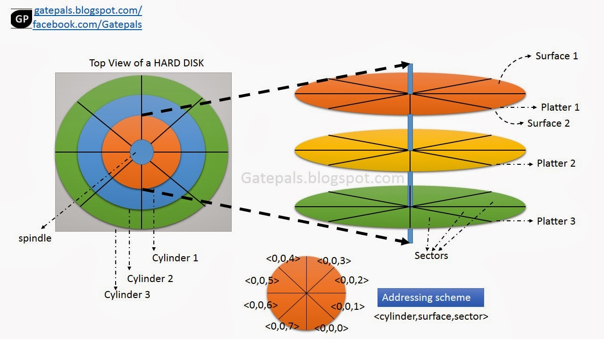
* 磁盘 => 盘片(N) => 盘面(2)&磁头(2) =>  track堆叠形成cylinder, 「cylinder, surface, sector」定位一个扇面 (这个是磁盘坐标系统中的x,y,z, 只不过是定位一个sector, 一般为512Byte)，查看sector的size,
```
fdisk -l
...
Units = sectors of 1 * 512 = 512 bytes
Sector size (logical/physical): 512 bytes / 512 bytes
...
```
* Latency: 

    寻道时间(对应track)

    旋转延迟(sector)

    数据传输时间
* IOPS = 1000ms/(Tseek, Trotation + Ttransfer)
* 吞吐量: 单位时间内可以成功传输的数据数量
* 命名规则: sd[a-z]x, sd是磁盘的主设备号，比如fd表示软盘, a-z表示真实的物理磁盘, x表示磁盘分区. 比如sda1，表示第一块磁盘的第一个分区
*  查看block的size, stat /boot/，**硬盘最小的存储单位是sector，而操作系统存取的最小单元是block**, 连续八个sector组成一个block
    ```
    A cluster is a group of sectors (block) on a hard disk drive that is addressed as one logical unit by the operating system. A cluster is defined at the file system level and a blocks is defined at the physical disk. 
    ```

## inode(index node)
* 一种inode与block存储的模型 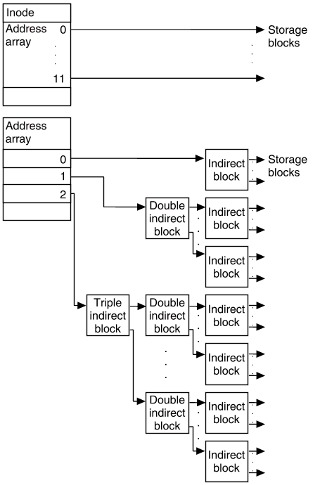,这种结构给了文件大小足够的可伸缩空间，这也是“通用文件系统”
    ```
    * The first array contains 12 direct addresses, that is, addresses that point directly to the first 12 logical storage blocks of the contents of the file (addresses 0-11). If the file is larger than 12 logical blocks, the first address of the second array (address 0) points to an indirect block, which contains direct addresses instead of file contents.
    * The second address (1) points to a double indirect block, which contains addresses of indirect blocks.
    * The third address (2) points to a triple indirect block, which contains addresses of double indirect blocks.
    ```
* inode date impl 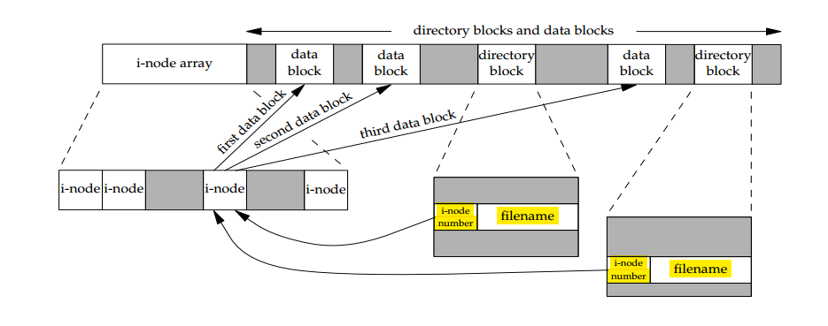
*  block的大小和 unix file system中最大文件的关系

| Logical Block Size   | Direct Blocks   | Single Indirect Blocks	 | Double Indirect Blocks |
|----------------------|-----------------|-------------------------|------------------------|
| 2048 bytes           | 24KB            | 1MB	                    | 512MB                  |
| 4096 bytes           | 48KB            | 4MB                     | 4GB                    |
| 8192 bytes           | 96KB            | 16MB                    | 32GB                   |
|                      |                 |                         |                        |
* ls -li 查看文件的索引值, df -i 查看系统inode的使用情况

## 文件系统 
* 一个inode对应一个文件，文件名是inode对应的名称(类似于ip有对应的dns一样，inode有对应的名字)，软连接就是小名(引用计数)。
* 使用bitmap记录使用信息，大规模数据的标记问题
* layout: 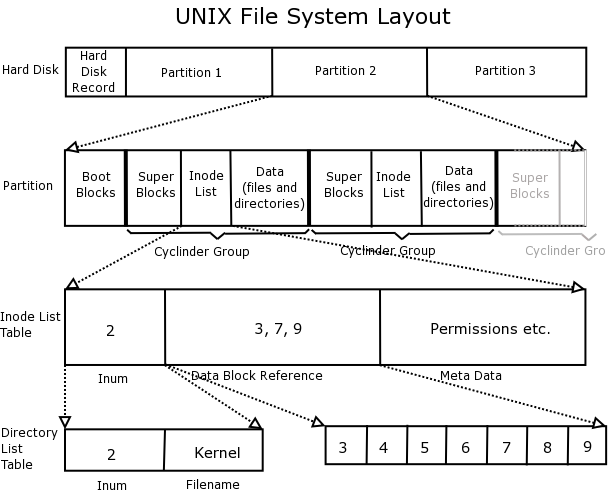, 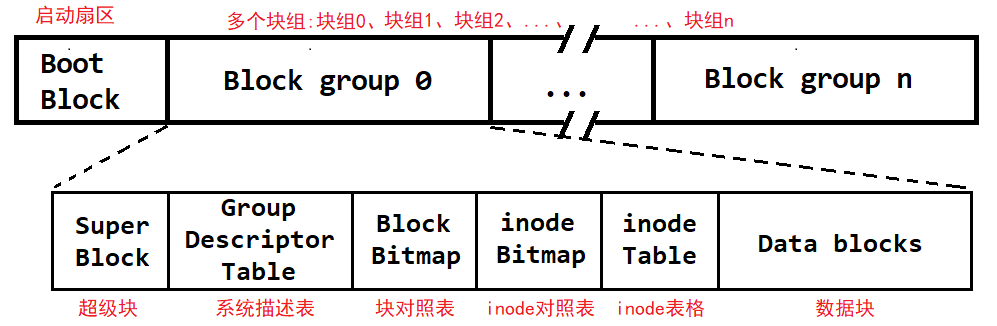, 
* linux fs layers: 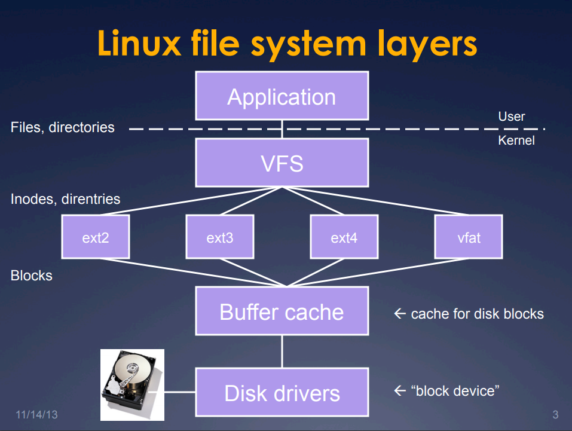

## 文件的访问
* 
* 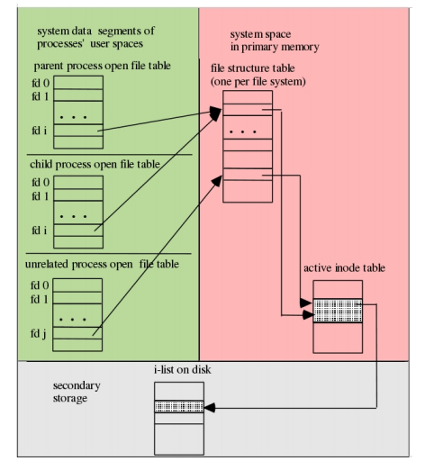
* 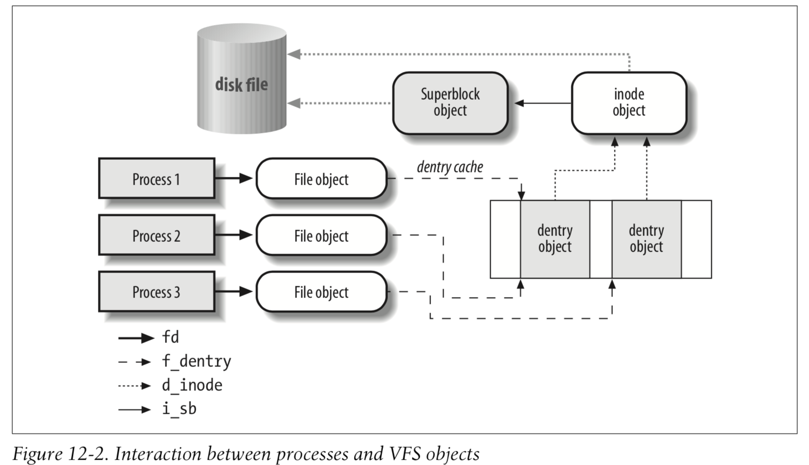
* 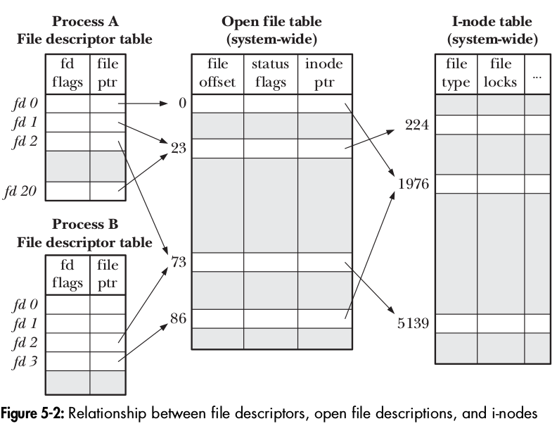
* 
* 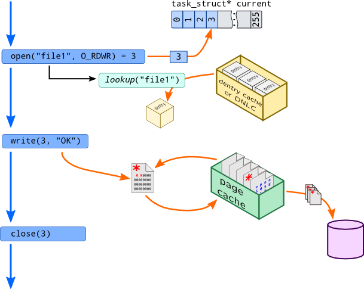
* 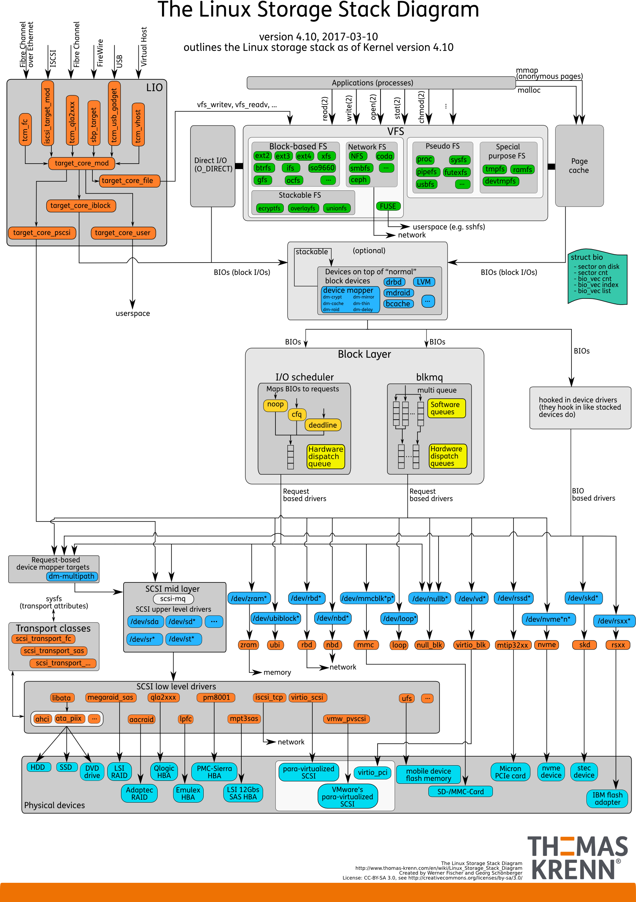
* 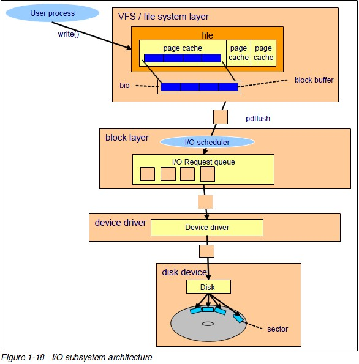
* 可以看出，dentry是应用层和vfs之间的中间层，实现目录名和inode的映射
* 文件描述符是进程可用的数据，内核级别是共享打开的文件表(这里是多个进程共享的数据)，所以多个进程读写同一个文件的时候，可能会出现不同步的问题

## vfs 文件系统虚拟化，
* VFS是物理文件系统与服务之间的一个接口层，它对Linux的每个文件系统的所有细节进行抽象，使得不同的文件系统在Linux核心以及系统中运行的进程看来都是相同的。
* VFS在系统启动时建立，在系统关闭时消亡。
* VFS并不是一种实际的文件系统。它只存在于内存中，不存在于任何外存空间。管理VFS数据结构的组成部分主要包括超级块和inode,只需要通过超级结点挂载就可以了,VFS只存在于内存中
* VFS使Linux同时安装、支持许多不同类型的文件系统成为可能。
* VFS拥有关于各种特殊文件系统的公共界面，当某个进程发布了一个面向文件的系统调用时，内核将调用VFS中对应的函数，这个函数处理一些与物理结构无关的操作，并且把它重定向为真实文件系统中相应的函数调用，后者用来处理那些与物理结构相关的操作。

## dentry(directory entry)，目录结构体的内存化
* 在读取一个文件时，总是从根目录开始读取，每一个目录或者文件，在VFS中，都是一个文件对象，每一个文件对象都有唯一的一个inode与之对应
* 根目录的inode号为0，在superblock里，可以很快根据inode号索引到具体的inode，因此读取到的第一个inode就是根目录的,读取到了该目录后，内核对象会为该文件对象建立一个dentry，并将其缓存起来，方便下一次读取时直接从内存中取。
* 目录本身也是一个文件，目录文件的内容即是该目录下的文件的名字与inode号，目录文件的内容就像一张表，记录的文件名与其inode number之间的映射关系
* 根据路径即可找到当前需要读取的下一级文件的名字和inode，同时继续为该文件建立dentry，dentry结构是一种含有指向父节点和子节点指针的双向结构，多个这样的双向结构构成一个内存里面的树状结构，也就是文件系统的目录结构在内存中的缓存了。有了这个缓存，我们在访问文件系统时，通常都非常快捷。

## Resouce Usage
* 页面缓存，闲着也是闲着，不如让出来做文件缓存
* 网络资源，闲着也是闲着，不如让tcp多用点，但是一旦拥堵，则立刻好人模式

## stdin stdout stderr
* stdout到底是什么，是不是就是打开的一个文件