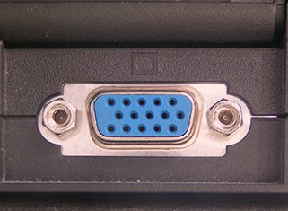
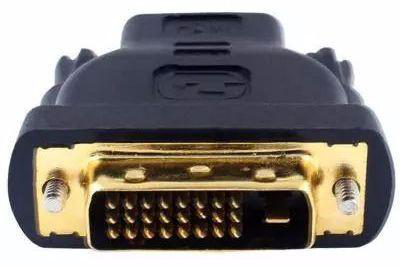
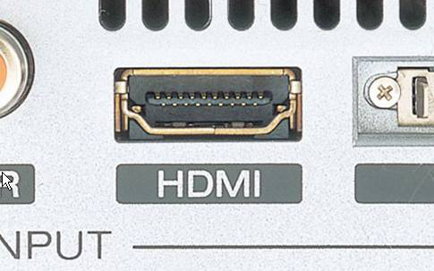
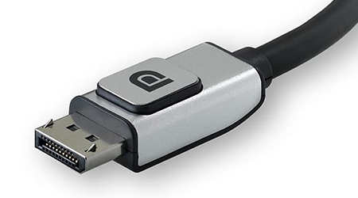

## GPU 

### VGA (Video Graphics Array)
* VGA接口最大支持2048x1536分辨率 
* 

### DVI 
* DVI接口支持1920x1200分辨率、60Hz刷新率，其衍生系列接口DVI-I、DVI-D支持的最大分辨率可达到2560x1600。
* 
* 只传输画面图形信号，不传输声音

### HDMI
* 高清多媒体接口
* HDMI 2.1标准已经能够支持4K及8K的超高分辨率。
* 

### DP (Display Port)
* 
* 相对HDMI，DP抗干扰能力更强，传输带宽更大，分辨率要比HDMI高的多，刷新频率也更高，可以轻松实现4K分辨率的需求。
* 支持多屏拼接技术，展示更多画质内容
