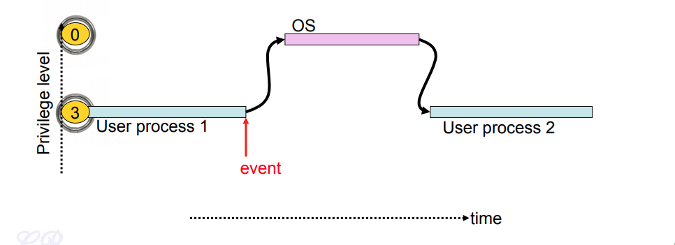
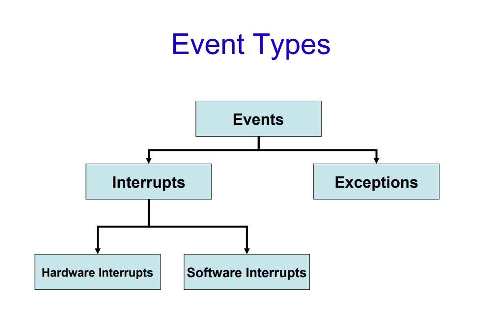
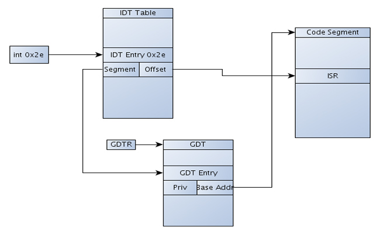
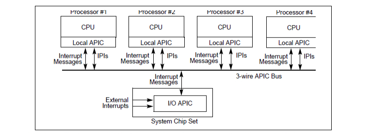
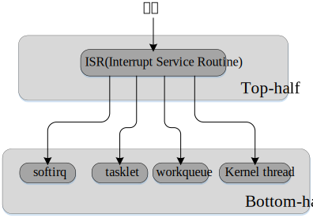
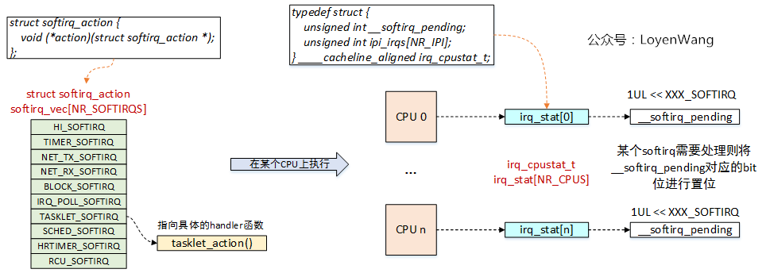
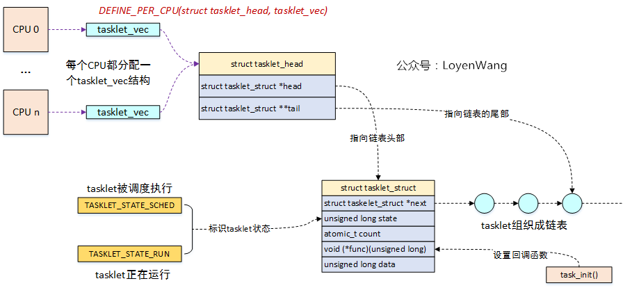
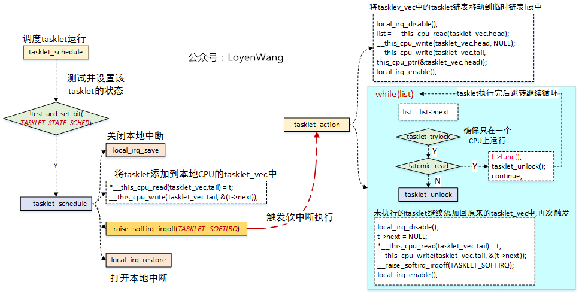

# 中断

## theory 
* 基于event和time的cpu处理模型，time driven & event driven

  
  ***
  
* signal event interrupt 三种说法

## 分类
* 同步（synchronous）中断和异步（asynchronous）中断

    同步中断是当指令执行时由 CPU 控制单元产生，之所以称为同步，是因为只有在一条指令执行完毕后 CPU 才会发出中断，而不是发生在代码指令执行期间，比如系统调用。

    异步中断是指由其他硬件设备依照 CPU 时钟信号随机产生，即意味着中断能够在指令之间发生，例如键盘中断。

* 根据Intel 官方资料, 同步中断称为异常（exception），异步中断被称为中断（interrupt）
* 中断可分为可屏蔽中断（Maskable interrupt）和非屏蔽中断（Nomaskable interrupt）
* 异常可分为故障（fault）、陷阱（trap）、终止（abort）三类

## ISR(Interrupt Service Routine)实现
* An interrupt service routine (ISR) is a software routine that hardware invokes in response to an interrupt.
#### IRQ (interrupt request )
* an interrupt request (or IRQ) is a **hardware signal** sent to the processor that temporarily stops a running program and allows a special program, an interrupt handler, to run instead. 
#### IDT (Interrupt Descriptor Table)
* 一个系统表，它与每一个中断或异常向量相联系，每一个向量在表中存放的是相应的中断或异常处理程序的入口地址。内核在允许中断发生前，也就是在系统初始化时，必须把 IDT 表的初始化地址装载到 idtr 寄存器中，初始化表中的每一项。

   
  ***
  
* gdt是查看到segment对应的虚拟地址的起始地址
* idtr在gdb下无法查看，因为其只有在ring0级别(内核态)才可以看到，而gdb工作在ring3级别(用户态)(intel设计了4层的ring)
####  关联的硬件
* PIC(Programmable Interrupt Controller) & APIC(Advanced Programmable Interrupt Controller)
  
* local apic，local的参照物为cpu

#### 分为两个阶段
* top half 和 [bottom half](#deferred work )
```
上半部(top halves)：不得不做的工作放在上半部，也即中断处理程序中，例如告知外设接收到中断、将数据从外设中拷贝到内存
下半部(bottom halves)：不紧急的工作延后完成，如处理上半部中从外设拷贝来的数据
```



## 上下文(context)
#### 中断上下文
* 每个中断对应一个中断处理函数，当中断处理函数被调用时，内核处于中断上下文(interrupt context)。
* 不同于进程上下文(process context)，中断处理过程中不能发生阻塞、休眠，即不进行进程调度，因为要快速处理中断的消息以让外设继续工作，另外一个设计上的原因是中断没有独立的堆栈切换机制
* 中断上下文不执行不属于任何的进程，也可以解释为什么不参与调度
#### 进程上下文
* 分为用户态(ring3)和内核态(ring0)，两个堆栈可以切换

## deferred work 
* 三种延迟处理机制，softirq、tasklet、workqueue, tasklets基于softirq
* 因为硬中断是不可打断的，但是针对网络数据包这种处理阶段比较长的情况，需要只让cpu处理最紧要的事情，其他的事情稍后处理，这就是soft interrup产生的原因
* 软中断是软件触发的中断，使用raise_softirq接口进行触发，常见的两个触发场景，中断处理后和Bottom-half Enable后

* softirq vs tasklet, tasklet提供一种动态的能力

| 比对的特点       | softirq                                                         | tasklet                                                   |
|-------------|-----------------------------------------------------------------|-----------------------------------------------------------|
| 并行能力        | 同一个softirq处理函数能够同时运行在多个CPU上，因此同步是必要的                            | 同一个tasklet处理函数不能同时运行在多个CPU上，因此同步是不必要的                     |
| 中断处理函数的注册方法 | 只能在编译链接时静态注册                                                    | 不仅能静态注册而且还能动态注册                                           |
| 优先级         | 每个softirq都具有一个执行优先级 ，如果在同一时刻有多个待处理的softirq，那么最高优先级的softirq会被先处理 | tasklet只有两种优先级：高优先级「high priority」和正常优先级「normal priority」 |
| 使用场景        | 仅在执行非常频繁且需要并行处理的场景下才使用                                          | 在softirq不能胜任和需要串行化处理的情况下使用，同时在设备驱动中也是可以使用的                |

* softirq类型

| 0 | HI\_SOFTIRQ        | 最高优先级，用于处理TASKLET\_HI               |
|---|--------------------|-------------------------------------|
| 1 | TIMER\_SOFTIRQ     | 用于处理每个CPU的计时器中断「timer interrupt」    |
| 2 | NET\_TX\_SOFTIRQ   | 用于处理网络设备的报文发送中断                     |
| 3 | NET\_RX\_SOFTIRQ   | 用于处理网络设备的报文接收中断                     |
| 4 | BLOCK\_SOFTIRQ     | 用于处理块设备「block device」的中断            |
| 5 | IRQ\_POLL\_SOFTIRQ | 用于执行IOPOLL的回调函数「handler」            |
| 6 | TASKLET\_SOFTIRQ   | 用于处理tasklet                         |
| 7 | SCHED\_SOFTIRQ     | 用于处理调度「schedule」相关的IPI和执行CFS的负载均衡例程 |
| 8 | HRTIMER\_SOFTIRQ   | 目前没有使用，还保留也只是为了占用一个数字               |
| 9 | RCU\_SOFTIRQ       | 用于处理RCU中断，最低优先级，因此每次都在最后处理          |

```
查看处理数据
> cat /proc/softirqs 
                    CPU0       CPU1       CPU2       CPU3       CPU4       CPU5       CPU6       CPU7       
          HI:          1          1          0          0          2          0          0          0
       TIMER:  241846312 1671934570  273007834 1726792651  201341114 1644008532  182342249 1644896462
      NET_TX:        138         45        131         71        218         65        122         61
      NET_RX: 3947735107 3149190903 4033712025 3195028836 3890319448 3119133143 4103968256 3402515225
       BLOCK:          0          0          0          0          0          0          0          0
BLOCK_IOPOLL:          0          0          0          0          0          0          0          0
     TASKLET:        201         29        251         35        188         30        242         35
       SCHED: 2180338424 3965089846 2186628968 3875527819 2064144853 3883505174 2055440282 3857640088
     HRTIMER:          0          0          0          0          0          0          0          0
         RCU: 1458914748 1905483384 1524745564 1923565274 1462350009 1903291217 1446345827 1896192088

查看执行进程
> ps aux |grep ksoftirqd
root          3  0.0  0.0      0     0 ?        S    Sep01   0:22 [ksoftirqd/0]
root         14  0.0  0.0      0     0 ?        S    Sep01   2:13 [ksoftirqd/1]
sandsto+ 111348  0.0  0.0 112816   972 pts/6    S+   21:57   0:00 grep --color=auto ksoftirqd
```

* softirq implement 
```
/* 支持的软中断类型，可以认为是软中断号， 其中从上到下优先级递减 */
enum
{
	HI_SOFTIRQ=0,       /* 最高优先级软中断 */
	TIMER_SOFTIRQ,      /* Timer定时器软中断 */
	NET_TX_SOFTIRQ,     /* 发送网络数据包软中断 */
	NET_RX_SOFTIRQ,     /* 接收网络数据包软中断 */
	BLOCK_SOFTIRQ,      /* 块设备软中断 */
	IRQ_POLL_SOFTIRQ,   /* 块设备软中断 */
	TASKLET_SOFTIRQ,    /* tasklet软中断 */
	SCHED_SOFTIRQ,      /* 进程调度及负载均衡的软中断 */
	HRTIMER_SOFTIRQ, /* Unused, but kept as tools rely on thenumbering. Sigh! */
	RCU_SOFTIRQ,    /* Preferable RCU should always be the last softirq， RCU相关的软中断 */

	NR_SOFTIRQS
};

/* 软件中断描述符，只包含一个handler函数指针 */
struct softirq_action {
	void	(*action)(struct softirq_action *);
};
/* 软中断描述符表，实际上就是一个全局的数组 */
static struct softirq_action softirq_vec[NR_SOFTIRQS] __cacheline_aligned_in_smp;

/* CPU软中断状态描述，当某个软中断触发时，__softirq_pending会置位对应的bit */
typedef struct {
	unsigned int __softirq_pending;
	unsigned int ipi_irqs[NR_IPI];
} ____cacheline_aligned irq_cpustat_t;
/* 每个CPU都会维护一个状态信息结构 */
irq_cpustat_t irq_stat[NR_CPUS] ____cacheline_aligned;

/* 内核为每个CPU都创建了一个软中断处理内核线程 */
DEFINE_PER_CPU(struct task_struct *, ksoftirqd);
```
***


* tasklet的实现图解


***

注意tasklet_action是和softirq的关联点

## 查看中断在cpu上的执行情况
```
 cat /proc/interrupts 
            CPU0       CPU1       
   0:         90          0   IO-APIC-edge      timer
   1:         12          0   IO-APIC-edge      i8042
   6:         17          0   IO-APIC-edge      floppy
   8:          1          0   IO-APIC-edge      rtc0
   9:          0          0   IO-APIC-fasteoi   acpi
  12:         58          0   IO-APIC-edge      i8042
  14:          0          0   IO-APIC-edge      ata_piix
  15:    2502351          0   IO-APIC-edge      ata_piix
  16:          2          0   IO-APIC-fasteoi   vmwgfx, snd_ens1371
  17:    2997408          0   IO-APIC-fasteoi   ehci_hcd:usb1, ioc0
  18:         71          0   IO-APIC-fasteoi   uhci_hcd:usb2
  19:        145  111310754   IO-APIC-fasteoi   ens33
  24:          0          0   PCI-MSI-edge      PCIe PME, pciehp
  25:          0          0   PCI-MSI-edge      PCIe PME, pciehp
  26:          0          0   PCI-MSI-edge      PCIe PME, pciehp
  ...
```

## signal
* 就是计算机内部通信的基本机制，不管是进程间还是硬件与cpu之间

## 参考
[Linux 系统调用权威指南](http://arthurchiao.art/blog/system-call-definitive-guide-zh/)