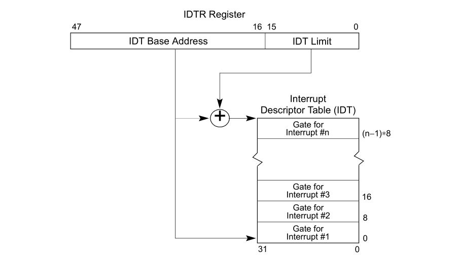

# 中断

## theory 
* 
* 

## 分类
* 同步（synchronous）中断和异步（asynchronous）中断

    同步中断是当指令执行时由 CPU 控制单元产生，之所以称为同步，是因为只有在一条指令执行完毕后 CPU 才会发出中断，而不是发生在代码指令执行期间，比如系统调用。

    异步中断是指由其他硬件设备依照 CPU 时钟信号随机产生，即意味着中断能够在指令之间发生，例如键盘中断。

* 根据Intel 官方资料, 同步中断称为异常（exception），异步中断被称为中断（interrupt）
* 中断可分为可屏蔽中断（Maskable interrupt）和非屏蔽中断（Nomaskable interrupt）
* 异常可分为故障（fault）、陷阱（trap）、终止（abort）三类

## IRQ
* interrupt request 
* an interrupt request (or IRQ) is a **hardware signal** sent to the processor that temporarily stops a running program and allows a special program, an interrupt handler, to run instead. 

## IDT (Interrupt Descriptor Table)
* 一个系统表，它与每一个中断或异常向量相联系，每一个向量在表中存放的是相应的中断或异常处理程序的入口地址。内核在允许中断发生前，也就是在系统初始化时，必须把 IDT 表的初始化地址装载到 idtr 寄存器中，初始化表中的每一项。
*  
* 
## 中断上下文
* 每个中断对应一个中断处理函数，当中断处理函数被调用时，内核处于中断上下文(interrupt context)。不同于进程上下文(process context)，中断处理过程中不能发生阻塞、休眠，即不进行进程调度，其基于以下原因：

## 硬件关联
* PIC(Programmable Interrupt Controller) & APIC(Advanced Programmable Interrupt Controller)
* 


##  softirq、tasklet、workqueue 

## 查看
* cat /proc/interrupts
```
 cat /proc/interrupts 
            CPU0       CPU1       
   0:         90          0   IO-APIC-edge      timer
   1:         12          0   IO-APIC-edge      i8042
   6:         17          0   IO-APIC-edge      floppy
   8:          1          0   IO-APIC-edge      rtc0
   9:          0          0   IO-APIC-fasteoi   acpi
  12:         58          0   IO-APIC-edge      i8042
  14:          0          0   IO-APIC-edge      ata_piix
  15:    2502351          0   IO-APIC-edge      ata_piix
  16:          2          0   IO-APIC-fasteoi   vmwgfx, snd_ens1371
  17:    2997408          0   IO-APIC-fasteoi   ehci_hcd:usb1, ioc0
  18:         71          0   IO-APIC-fasteoi   uhci_hcd:usb2
  19:        145  111310754   IO-APIC-fasteoi   ens33
  24:          0          0   PCI-MSI-edge      PCIe PME, pciehp
  25:          0          0   PCI-MSI-edge      PCIe PME, pciehp
  26:          0          0   PCI-MSI-edge      PCIe PME, pciehp
  ...
```

## signal
* 就是计算机内部通信的基本机制，不管是进程间还是硬件与cpu之间