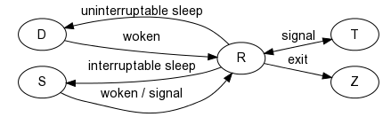

# LINUX 
## Terminal
* TTY: 一词源于Teletypes，或者teletypewriters，原来指的是电传打字机，是通过串行线用打印机键盘通过阅读和发送信息的东西，后来这东西被键盘与显示器取代
* PTY pseudo-tty
* PTS: pseudo-terminal slave 是PTY的实现方法, PTS需要ptmx(pseudo-terminal master)的支持
```
 使用secureCRT或者XShell远程连接主机
 > who am i / who
name pts/0        2020-08-30 00:45 (10.10.50.126)
```
```
/dev/tty*     终端
/dev/ttyS*    串口终端
/dev/ttyUSB*  USB转串口终端
/dev/ptmx     pty主设备
/dev/pts/*    pty从设备
```
* 
* Terminal, or TTY devices are a special class of character devices. A terminal device is any device that could act as a controlling terminal for a session; this includes virtual consoles, serial ports, and pseudo terminals.
* 控制台和终端都是历史上遗留下的硬件概念，不过随着硬件的被替换或者淘汰而成为了借用的概念。不过成了虚拟控制台和虚拟终端。
* 在linux下有形的是tty和pts，console就只剩下了一个概念

## free/top命令中看到的内存信息
* cache: displays the memory used by the page cache and slabs(Cached and Slab available in /proc/meminfo)。
* buff:  Memory used by kernel buffers (Buffers in /proc/meminfo). 在内存管理中，buffer指的是：buffer cache。buffer cache是块设备的读写缓冲区,relatively temporary storage for raw disk blocks. This shouldn't get very large. 
* shared: Memory used (mostly) by tmpfs, Memory specifically allocated for use by multiple processes，谜底就在谜面上，多进程间使用的共享内存,
* used: Used memory (calculated as ** total - free - buffers - cache ** )
* /proc/meminfo 能看到所有的内存消耗
*
```
> free -w -h -m 
            total        used        free      shared     buffers       cache   available
Mem:           2.8G        497M        909M         22M          0B        1.4G        2.0G
Swap:          2.0G         74M        1.9G

KiB Mem :  2895444 total,   930988 free,   510388 used[仅仅是进程占用],  1454068 buff/cache,   buff/cache + used + free = total

dmesg | grep Memory
[    0.000000] Memory: 2025532k/3145728k available (7664k kernel code, 524k absent, 271316k reserved, 6055k data, 1876k init)
```
* 重点需要关注的是available部分，buff/cache是可以根据进行需要而释放的，文件系统不会和进程争用内存，宁可自己降低服务，也要保证客户的利益，多好。
* echo 3 > /proc/sys/vm/drop_caches 清空cache，只能清空不能禁用，这是os给的福利
* cache是文件系统向内存借的兵，而swap则是内存向硬盘借的兵
* 判断意义： available 很小或者 swap占用量比较大或者swap频繁抖动的时候，可能内存出现了问题
* ![比较详细介绍buffer和cache的文章]http://linuxperf.com/?p=32
* 比较可信的结论:
```
free 命令所显示的 “buffers” 表示块设备(block device)所占用的缓存页，包括直接读写块设备、以及文件系统元数据(metadata)如SuperBlock所使用的缓存页；

 “cached” 表示普通文件所占用的缓存页。

 如果mapping对应的是块设备，那么相应的统计信息会反映在 “buffers” 中；如果mapping对应的是文件inode，影响的就是 “cached”。我们下面看看kernel中哪些地方会把块设备的mapping传递进来。

 Swap Cache: 
 用户进程的内存页分为两种：file-backed pages（与文件对应的内存页）和anonymous pages（匿名页）。匿名页(anonymous pages)是没有关联任何文件的，比如用户进程通过malloc()申请的内存页，如果发生swapping换页，它们没有关联的文件进行回写，所以只能写入到交换区里。
交换区可以包括一个或多个交换区设备（裸盘、逻辑卷、文件都可以充当交换区设备），每一个交换区设备在内存里都有对应的swap cache，可以把swap cache理解为交换区设备的”page cache”：page cache对应的是一个个文件，swap cache对应的是一个个交换区设备，kernel管理swap cache与管理page cache一样，用的都是radix-tree，唯一的区别是：page cache与文件的对应关系在打开文件时就确定了，而一个匿名页只有在即将被swap-out的时候才决定它会被放到哪一个交换区设备，即匿名页与swap cache的对应关系在即将被swap-out时才确立。
```
* 最终关于buffer和cache的理解：是按照文件类型来处理的，如果是inode则计入cache(SLAB也计入cache)，其他的除了swap cache都计入到buffer中；但是不管是swap cache、buffer、cache都是在page cache的范围内
* 实验证明: dd if=/dev/sda1 of=/dev/null count=200000 使用该命令能看到明显的buffer的增加, 编辑大文件的时候能看到cache的变化

## Top命令
* Process status: [R,S,D,T,Z]

```

Runnable (R): A process in this state is either executing on the CPU, or it is present on the run queue, ready to be executed.

Interruptible sleep (S): Processes in this state are waiting for an event to complete.

Uninterruptible sleep (D): In this case, a process is waiting for an I/O operation to complete.比如进程在对某些硬件进行操作时(比如进程调用read系统调用对某个设备进行读操作，而read系统调用最终执行到对应设备驱动的代码，并与对应的物理设备进行IO交互，这些物理设备包括磁盘IO，网络IO及其他外设IO)，可能需要使用TASK_UNINTERRUPTIBLE对进程进行保护，以避免进程与设备交互的过程被打断，造成设备陷入不可控状态。一般这种TASK_UNINTERRUPTIBLE状态很短暂，通过ps命令基本上捕捉不到。

Stopped (T): These processes have been stopped by a job control signal (such as by pressing Ctrl+Z) or because they are being traced.

Zombie (Z): The kernel maintains various data structures in memory to keep track of processes. A process may create a number of child processes, and they may exit 
while the parent is still around. However, these data structures must be kept around until the parent obtains the status of the child processes. Such terminated processes whose data structures are still around are called zombies.
```
另外:
	<    高优先级
    N    低优先级
    L    有些页被锁进内存
    s    包含子进程
    +    位于后台的进程组；
    l    多线程，克隆线程
* CPU status(表示用在某个方面上的百分比):
```
us: user space process time per
sy: kernelspace processes time per 
id: idle
st: steal time(Steal time is the percentage of time a virtual CPU waits for a real CPU while the hypervisor is servicing another virtual processor.)
hi:  hardware interrupt
si: softwar interrupt
ni: nice time(类似于进程的nice，对别的进程友好的时间，需要手动设置某个CPU为nice标记)
wa: waite io time
```

* CPU Percentage的计算方法：使用idle task进程，即PID==0的进程，每个CPU核心上会有一个idle进程，在ps命令是看不到的。利用idle进程两次被调用的时间差和采样周期算出来cpu的占用比例(反正就是cpu percentage是基于采样的统计，并不是CPU本身的某种状态，是os完成的，idle进程会给cpu发送HLT指令指示cpu进入saving mode)
* CPU Percentage vs CPU Load: 一个是计算cpu的忙碌状态，一个是计算cpu有多少个客人需要伺候(因为有可能一个客人就让CPU忙碌到100%)
* CPU Load: 1-minute, 5-minute and 15-minute 是一种时间的aging，表示过去一段时间内的客流量大小。统计方式：统计cpu的任务队列状态为R和D的任务的数目。指数移动平均（英语：exponential moving average，EMA或EXMA）是以指数式递减加权的移动平均。使用该算法来处理数据集的显示和更新。

## fs
* tmpfs是寄居在/dev/shm上的文件系统，是linux内核文件系统的一种，其他还有proc、devfs、sysfs. 大小一般为内存的一半
```
> df -h 
Filesystem      Size  Used Avail Use% Mounted on
/dev/sda3       126G   27G  100G  22% /
devtmpfs        1.4G     0  1.4G   0% /dev
tmpfs           1.4G     0  1.4G   0% /dev/shm
tmpfs           1.4G   26M  1.4G   2% /run
tmpfs           1.4G     0  1.4G   0% /sys/fs/cgroup
/dev/sda1       297M  157M  141M  53% /boot
tmpfs           283M     0  283M   0% /run/user/1000

free -w -m  -h
              total        used        free      shared     buffers       cache   available
Mem:           2.8G        404M        2.2G         22M          0B        148M        2.2G
Swap:          2.0G         74M        1.9G
```
## 想法
* 关于CPU的状态的S和D的理解: S是等待event的状态，这是不占用cpu的资源的，其实我们可以理解所有的进程都是需要event来触发器活动的，如果在运行中，说明输入的数据还没有消化完。就像人一样，处于吃饭和消化饭的周期中。
