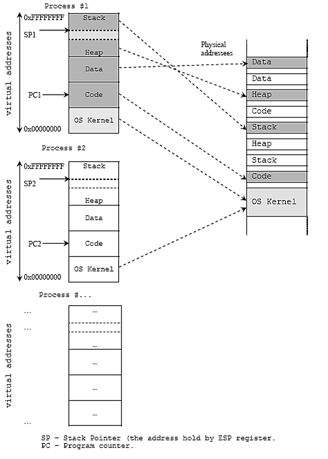
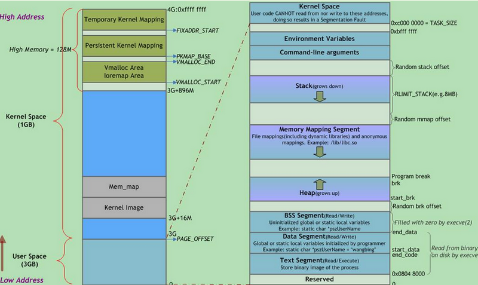
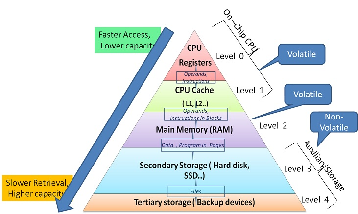

# 内存管理



### memory hierarchy
* 
* CPU可以直接访问内存数据，但缓存的存在可以提供更快速的数据访问

### (MMU)memory management unit
* **其实是CPU中的一部分**
* CPU <---> MMU (TLB,Translation Lookaside Buffer，如果hit只要一个clock cycle) <---> Front-Sied Bus(前端总线) <---> Memory controller <---> memory rows and columns 
* 只能指定一个地址，而不能指定长度，长度取决于cache line的长度
* PTE(page table entry)，
* page fault
* PP: Physical Page, VP: Virtual Page
* 地址管理不可能精确到每个地址，一定是一块一块的进行管理，否则管理成本太高
* TLB(Translation Lookaside Buffer):  MMU中的一个缓冲区，其中每一行都保存着一个由单个PTE组成的块。
* 一个n位的虚拟地址包含两个部分，一个p位的虚拟页面偏移量（Virtual Page Offset, VPO）和一个（n - p）位的虚拟页号（Virtual Page Number, VPN）, VPN又被分为VPN[1-n],对应多级页表
* 页表
  * 向前映射页表,分层分页
  * 哈希页表,64bit系统，分层表也过于庞当，使用哈希页表，也可以使用多级页表
* CR3(Control Register 3) 用来存放页表的基地址（这里是实际的物理地址）
* Page Global Directory(PGD index)
* Page Table Entry (PTE index)

### DDR 
* Double Data Rate Synchronous Dynamic Random-Access Memory (DDR SDRAM) 
* 不同的DDR之间不兼容，比如ddr3的主板槽想要升级ddr4，需要更换主板

## 内核栈
* 一个用户态进程/线程在内核中都是用一个task_struct的实例描述的，这个有点类似设计模式里面的桥接模式(handle-body), 用户态看到的进程PID，线程TID都是handle, task_struct是body
* C语言书里面讲的堆、栈大部分都是用户态的概念，用户态的堆、栈对应用户进程虚拟地址空间里的一个区域，栈向下增长，堆用malloc分配，向上增长。用户空间的堆栈，在task_struct->mm->vm_area里面描述，都是属于进程虚拟地址空间的一个区域。
* 内核态的栈在tsak_struct->stack里面描述，其底部是thread_info对象，thread_info可以用来快速获取task_struct对象。所以一个进程的内核栈，也是进程私有的，只是在task_struct->stack里面获取。
* 内核态没有堆的概念，用kmalloc()分配内存，实际上是Linux内核统一管理的，一般用slab分配器，也就是一个内存缓存池，管理所有可以kmalloc()分配的内存。所以从原理上看，在Linux内核态，kmalloc分配的所有的内存，都是可以被所有运行在Linux内核态的task访问到的。
* code
```
struct task_struct {
 volatile long state; /* -1 unrunnable, 0 runnable, >0 stopped */
 void *stack;
 atomic_t usage;
 unsigned int flags; /* per process flags, defined below */
 unsigned int ptrace;
 int lock_depth; /* BKL lock depth */ 
 /* ...... */ 
};
```
* 每个进程被创建的时候，在生成进程描述符task_struct的同时，会生成两个栈，一个是用户栈，位于用户地址空间；一个是内核栈，位于内核空间。当进程在用户地址空间中执行的时候，使用的是用户栈，CPU堆栈指针寄存器中存的是用户栈的地址；同理，当进程在内核空间执行时，CPU堆栈指针寄存器中放的是内核栈的地址。
* 当位于用户空间的进程进行系统调用时，它会陷入内核，让内核代其执行。此时，进程用户栈的地址会被存进内核栈中，CPU堆栈指针寄存器中的内容也会变为内核栈的地址。当系统调用执行完毕，进程从内核栈找到用户栈的地址，继续在用户空间中执行，此时CPU堆栈指针寄存器就变为了用户栈的地址。

## real mode & protected mode
* real mode 就是直接访问物理内存
* 保护模式是利用虚拟地址访问物理内存

## 几个地址概念
* 线性地址(linear address是intel手册中使用的概念) == 虚拟地址(内核中使用的概念)
* 逻辑地址 == 相对地址: selector:offset
* 物理地址: 内存的直接地址
* 转换： 汇编指令中使用的是相对地址，需要使用"段式内存管理"转为线性地址，然后利用"页式内存管理"转为物理地址
* 段式内存管理: 利用selector:offset，对应的CS:IP两个寄存器中的值，使用GDT(Global Descriptor Table，对应的内核的段)和LDT(Local Descriptor Table，对应用户的代码段)找到段对应的起始地址

## intel定义的三大表子
* IDT(Interrupt Descriptor Table)
* LDT ( Local Descriptor Table)
* GDT ( Global Descriptor Table )
* 不知道为什么，总是喜欢使用Descriptor这个词

## TSS(Task State Segment)
* 进程的任务状态段信息结构。在任务从执行中被切换出时tss_struct结构保存了当前处理器的所有寄存器值。当任务又被CPU重新执行时，CPU就会利用这些值恢复到任务被切换出时的状态，并开始执行。

## 理解
* 在内核栈上可以操作一切用户态的数据的
* 一定要时刻谨记用户态还是内核态
* 不管是内核态还是用户态执行，都是同一个进程在运行
* 在内核态，堆、栈、向下增长等概念都消失不见了

## mmap
* 实现文件地址空间与虚拟地址空间的映射
* 间接效果，通过文件做为关联实现两个进程间共享内存
* 比较swap，也是内存与硬盘的勾兑

## swap 
```
> free -m 
              total        used        free      shared  buff/cache   available
Mem:           2827         465        1201          14        1160        2092
Swap:          2048         135        1913
> swapon -s
Filename                                Type            Size    Used    Priority
/dev/sda2                               partition       2098172 139008  -2
```